# Flink 总结

> 什么时Flink ？ 为什么是Flink ?
>
> **流计算相比批处理需要切分为窗口才能进行分组聚合处理**
>
> 同时需要解决如下两个问题
>
> 1. 正确性/完整性 exactly-once
> 2. 处理无序、延迟数据的能力

**Flink对流计算提供的支持**

> 1. 同时支持高吞吐、低延迟、高性能(spark支持高吞吐和高性能，strom支持低延迟高性能)
> 2. 支持事件时间概念
> 3. 支持有状态的计算
> 4. 支持高度灵活的窗口
> 5. 基于轻量级分布式快照实现容错
> 6. 基于JVM实现独立的内存管理
> 7. save point（保存点）

**Fnlik**

## 1、Time与Window

### 1.1、Time 种类

**Flink中的时间与现实世界中的时间是不一致的，在flink中被划分为事件时间，摄入时间，处理时间三种。**

* 如果以EventTime为基准来定义时间窗口将形成EventTimeWindow,要求消息本身就应该携带EventTime

* 如果以IngesingtTime为基准来定义时间窗口将形成IngestingTimeWindow,以source的systemTime为准。

* 如果以ProcessingTime基准来定义时间窗口将形成ProcessingTimeWindow，以operator的systemTime为准。

### 1.2、Window概念

#### 1、google dataflow，流计算被抽象成四个问题，what，where，when，how？

##### 1.1、window解决的是where，也就是将无界数据划分成有界数据

##### 1.2、window的数据何时被计算   when  ?

**解决这个问题用的方式是watermark和trigger，watermark用来标记窗口的完整性，trigger用来设计窗口数据触发条件。一般的trigger实现是当watermark处于某种时间条件下或者窗口数据达到一定条件，窗口的数据开始计算。**

##### 1.3 how 就是 function


> https://www.bilibili.com/video/BV1n54y1976u

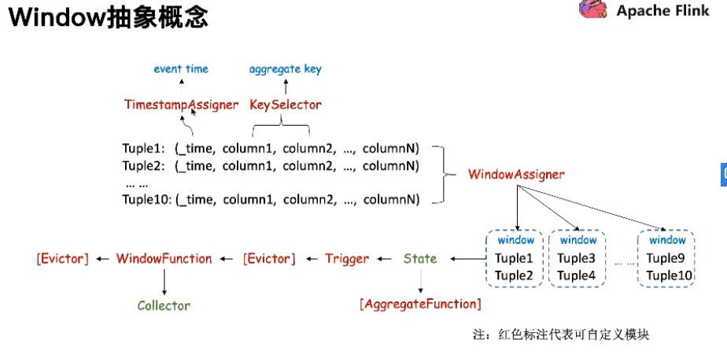

```scala
stream
       .keyBy(...)               <-  keyed versus non-keyed windows
       .window(...)              <-  required: "assigner"
      [.trigger(...)]            <-  optional: "trigger" (else default trigger)
      [.evictor(...)]            <-  optional: "evictor" (else no evictor)
      [.allowedLateness(...)]    <-  optional: "lateness" (else zero)
      [.sideOutputLateData(...)] <-  optional: "output tag" (else no side output for late data)
       .reduce/aggregate/fold/apply()      <-  required: "function"
      [.getSideOutput(...)]      <-  optional: "output tag"
```

#### 2.0、Window Assigner

> 用来决定某个元素被分配到哪个/哪些窗口中去。

GlobalWindows TumblingEventTimeWindows SlidingEventTimeWindows   实现了WindowAssigner

#### 2.1、Trigger  窗口计算触发器

> 决定了一个窗口何时能够被计算或清除，每个窗口都会拥有一个自己的Trigger。

* EventTimeTrigger        一次触发  watermark 大于窗口结束时间
* ContinuousEventTimeTrigger  多次触发  基于event time的固定时间间隔
* CountTrigger    多次触发 基于条数
* DeltaTrigger      **多次触发  当前元素与上次trigger元素做计算，超过threshold触发**
* PurgingTrigger      **多次触发   清理当前窗口的状态  **

**案例： 车辆每分钟上报当前位置与车速，没行进10公里，计算区间内最高车速**

**GlobalWindows + Trigger  =  Custom WIndow Assigner        ===>  countWindow 的实现原理**

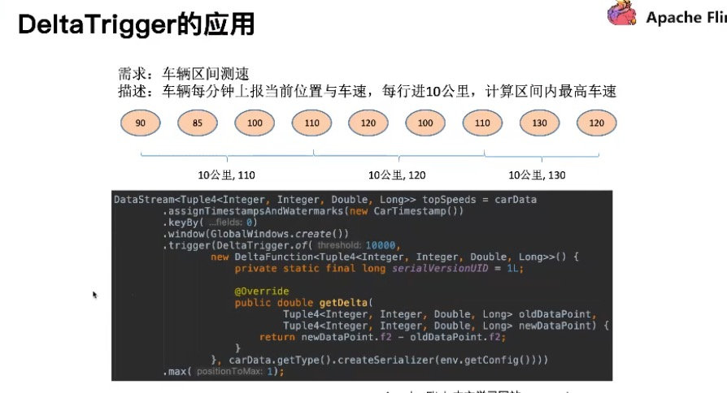

#### 2.2、Evictor  窗口状态驱逐器

> 可以译为“驱逐者”。在Trigger触发之后，在窗口被处理之前，Evictor（如果有Evictor的话）会用来剔除窗口中不需要的元素，相当于一个filter。

* CountEvictor    窗口计算时，只保留最近N条

* TimeEvictor      窗口计算时，只保留最近N段时间内

* DeltaEvictor     窗口计算时，最新的一条元素与其他元素做计算，只保留在threshold内的原色

  

#### 2.3、Window操作函数种类

> 1. ReduceFunction  
>
> 使用 reduce 函数，让两个元素结合起来，产生一个相同类型的元素，它是增量的
>
> 2. AggregateFunction
>
> AggregateFunction 比 ReduceFunction 更加的通用，它有三个参数，一个输入类型（IN），一个累加器（ACC），一个输出类型（OUT）。
>
> 输入类型，就是输入流的类型。接口中有一个方法，可以把输入的元素和累加器累加。并且可以初始化一个累加器，然后把两个累加器合并成一个累加器，获得输出结果。 
>
> 3. ProcessWindowFunction
>
> ProcessWindowFunction 有一个 Iterable 迭代器，用来获得窗口中所有的元素。有一个上下文对象用来获得时间和状态信息，比其他的窗口函数有更大的灵活性,效率较低
>
> 
>
> 前面两个会执行的更加有效率，因为在元素到来时，Flink 可以增量的把元素聚合到每个窗口上。
> ProcessWindowFunction 提供了一个 Iterable 迭代器，可以获得一个窗口的所有元素以及元素的元数据信息。
> ProcessWindowFunction 执行效率不是很好，因为 Flink 内部需要缓存窗口所有元素。
> 可以结合 ReduceFunction 、 AggregateFunction、FoldFunction ，来增量的获取部分结果，结合 ProcessWindowFunction 提供的元数据信息做综合处理。

```java
env.addSource(consumer)
    .map(f => {
        println(f)
            User(f.split(",")(0), f.split(",")(1).toInt, f.split(",")(2).toLong)
        })
    .assignTimestampsAndWatermarks(new AscendingTimestampExtractor[User] {
        override def extractAscendingTimestamp(element: User): Long = element.timestamp
        })
    .keyBy(_.userId)
    .window(TumblingEventTimeWindows.of(Time.seconds(10)))
    // 使用 reduce 和 processWindowFunction
    .reduce(new MyReduceFunction, new MyProcessFunction)
    .print()
  
class MyReduceFunction extends ReduceFunction[User] {
    override def reduce(value1: User, value2: User): User = {
      if (value1.count > value2.count) value2
      else value1
    }
  }

class MyProcessFunction extends ProcessWindowFunction[User, (Long, User), String, TimeWindow] {
    override def process(key: String, context: Context, elements: Iterable[User], out: Collector[(Long, User)]): Unit = {
      val min = elements.iterator.next
      out.collect((context.window.getStart, min))
    }
  }
```

#### 2.4、!!!  Window 底层是如何实现的

**张俊大佬的学习方法真的很好，从 应用文档 ->  使用工作 中， 发现提出   API屏蔽的细节核心因素，想找出他是如何解决这些问题的， 然后从工作流程 到设计模式， 到 数据结构与算法中深挖，明白工作原理， 反哺到使用中， 更加深入理解， 可以深入源码中去    `从实现的角度可以反哺到应用上来，通常在应用当中，刚接触某个概念的时候会有一些疑惑。当我们对实现有一些了解之后，应用中的这些疑惑就会迎刃而解。`  **

#### `！！！WindowOperator 的核心步骤`

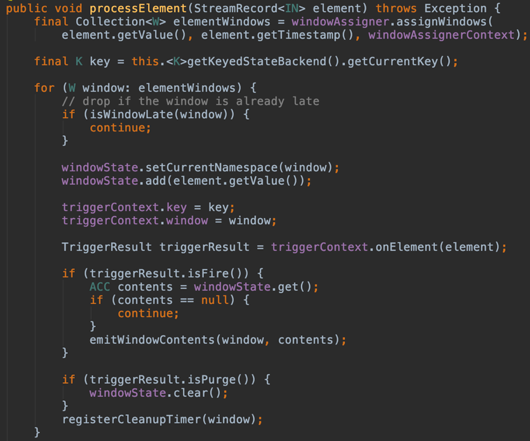

* 根据当前element找到归属的Windows ， final elementWindows
* 获取element对应的key， final key
* 遍历elementWindows 中 如果是late data 跳过
* 将element存入window state中0 ， 触发State逻辑
* 获取element对应的Trigger， 如果是isFire() 状态， 把WindowState 与window 注入 emitWindowContents，进行窗口计算。 如果是isPurge()状态， 清除windowState
* 最后注册一个timer, 在窗口结束清理window

##### **增量聚合与全量聚合的State不一样**

* 全量聚合中，所有元素会添加到ListState 中， 当触发窗口计算，再把listState 所有元素传递给窗口
* 增量聚会，每条元素触发聚合函数，结果存储最终的累加值， 比较轻量级

##### **Window Function 计算流程**

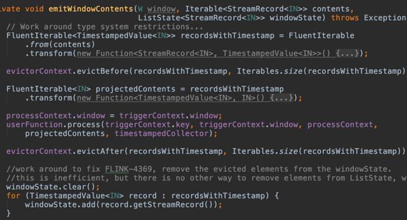

**在触发窗口计算时会将窗口中的状态传递给 emitWindowContents 方法。这里会调用我们定义的窗口函数中的 process 方法，将当前的 Key、Window、上下文 Context、窗口的内容作为参数传给它。**

**在此之前和之后会分别调用 evictBefore 和evictAfter 方法把一些元素过滤掉。最终会调用 windowState 的 clear 方法，再把过滤之后的记录存到 windowState 中去。 ------->  从而达到 evictor 过滤元素的效果。**

##### Window Trigger 触发窗口逻辑

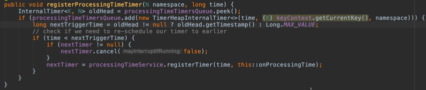

> 最后看下 Trigger 的实现原理。当我们有大量的 Key，同时每个 Key 又属于多个窗口时，我们如何有效的触发窗口的计算呢？
>
> **Flink 利用定时器来保证窗口的触发，通过优先级队列来存储定时器。队列头的定时器表示离当前时间最近的一个，如果当前定时器比队列头的定时器时间还要早，则取消掉队列头的定时器，把当前的时间注册进去。**
>
> **当这次定时器触发之后，再从优先级队列中取下一个 Timer，去调用 trigger 处理的函数，再把下一个 Timer 的时间注册为定时器。这样就可以循环迭代下去。**


## 2、Watermark

**!!!  什么是Watermark**

> https://blog.csdn.net/hongzhen91/article/details/90949618
>
> 流处理从事件产生，到流经source，再到operator，中间是有一个过程和时间的。虽然大部分情况下，流到operator的数据都是按照事件产生的时间顺序来的，但是也不排除由于网络延迟等原因，导致乱序的产生，特别是使用kafka的话，多个分区的数据无法保证有序。**所以在进行window计算的时候，**我们又不能无限期的等下去，**必须要有个机制来保证一个特定的时间后，必须触发window去进行计算了。这个特别的机制，就是watermark，watermark是用于处理乱序事件的。**

With Periodic Watermarks

    周期性的触发watermark的生成和发送，默认是100ms
    每隔N秒自动向流里注入一个WATERMARK 时间间隔由ExecutionConfig.setAutoWatermarkInterval 决定. 每次调用getCurrentWatermark 方法, 如果得到的WATERMARK 不为空并且比之前的大就注入流中
    可以定义一个最大允许乱序的时间，这种比较常用
    实现AssignerWithPeriodicWatermarks接口

With Punctuated Watermarks

    基于某些事件触发watermark的生成和发送
    基于事件向流里注入一个WATERMARK，每一个元素都有机会判断是否生成一个WATERMARK. 如果得到的WATERMARK 不为空并且比之前的大就注入流中
    实现AssignerWithPunctuatedWatermarks接口
**WaterMark 触发条件**

1. watermark 时间  >=  window.end_time
2. [   window.start_time , window.end_time    )  中有数据， 左闭右开

**对延迟数据的处理**

> 望对迟到的数据再提供一个宽容的时间。也就是说，水位线 watermark 提供了一个允许数据最大乱序时间，如果在这个时间内，乱序数据还没有能够到达的话，可以再提供一个时间，如果这个时间内数据到了也是可以的。Flink 提供了allowedLateness 方法可以实现对迟到的数据设置一个延迟时间，在指定延迟时间内到达的数据还是可以触发window 执行

```java
OutputTag<Tuple2<String, Long>> outputTag = new OutputTag<Tuple2<String, Long>>("late-data"){};
window.window(TumblingEventTimeWindows.of(Time.seconds(3)))
	     .sideOutputLateData(outputTag)

DataStream<Tuple2<String, Long>> sideOutput = window.getSideOutput(outputTag);
```

**多并行度下使用watermark 每个并行度都有各自的watermark    ！！！ watermark 对齐会取所有channel中最小的watermark   ！！！！  根据它为全局watermark才会触发窗口计算**


## 3、状态管理 与 CK 

#### 什么是有状态的计算？

|                      | 无状态 | 有状态               |
| -------------------- | ------ | -------------------- |
| 消息是否包含全量消息 | 是     | 不是                 |
| 相同输入结果是否相同 | 相同   | 不同（结果需要累积） |


### 1、状态管理

> https://juejin.im/post/5e2f967df265da3dfa49bbd1#heading-3
>
> https://ververica.cn/developers/advanced-tutorial-2-checkpoint-application-practice/
>
> https://www.cnblogs.com/felixzh/p/13167665.html
>
> **状态从本质上来说，是Flink算子子任务的一种本地数据，为了保证数据可恢复性，使用Checkpoint机制来将状态数据持久化输出到存储空间上。状态相关的主要逻辑有两项：一、将算子子任务本地内存数据在Checkpoint时snapshot写入存储；二、初始化或重启应用时，以一定的逻辑从存储中读出并变为算子子任务的本地内存数据。**

* 状态操作流程

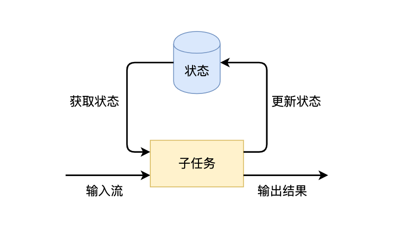

**Flink有两种基本类型的状态：托管状态（Managed State）和原生状态（Raw State）**

|              | 托管状态Managed State                            | 原生状态  Raw State  |
| ------------ | ------------------------------------------------ | -------------------- |
| 状态管理方式 | Flink Runtime托管，自动存储、自动恢复、自动伸缩  | **用户自己管理**     |
| 状态数据结构 | Flink提供的常用数据结构，如ListState、MapState等 | **字节数组：byte[]** |
| 使用场景     | 绝大多数Flink算子                                | **用户自定义算子**   |

**从具体使用场景来说，绝大多数的算子都可以通过继承Rich函数类或其他提供好的接口类，在里面使用Managed State。Raw State是在已有算子和Managed State不够用时，用户自定义算子时使用。**

* **Managed State 细分为 Keyed State Operator State**

> https://blog.csdn.net/qq_37142346/article/details/90667283

|                | Operator State                                     | Keyd State                                    |
| -------------- | -------------------------------------------------- | --------------------------------------------- |
| 适合算子类型   | 所有算子                                           | 只适用于KeyedStream                           |
| 状态分配       | 一个算子子任务solt对应一个状态                     | 每个key对应一个状态                           |
| 创建和访问方式 | 实现CheckpointedFunction接口                       | 重写RichFunction，通过RuntimeContext访问      |
| 并行度扩展     | **均匀分配**  **所有合并分发给每个solt**  **广播** | 状态随着key自动在算子任务中迁移               |
| 支持的数据结构 | ListState  **BroadcastState**                      | ValueState  MapState AppendingState ListState |
| 存储对象位置   | **堆内存中**                                       | 堆 与 非堆 HDFS RockDB                        |
| 声明与恢复策略 | 手动实现snapshot 与 restore方法                    | flink自行实现，用户透明                       |
| 过期           | clear  和 彻底clear                                | **可以设置过期**                              |

* **Managed State 中State 存储位置 与 JM交互逻辑**

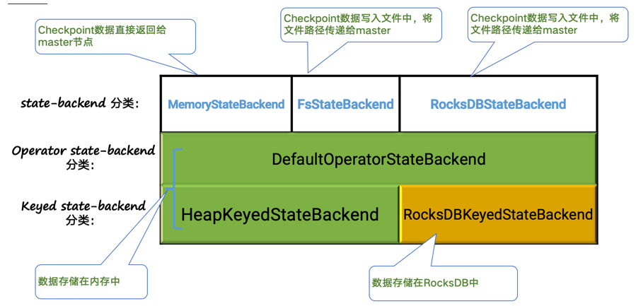

#### 一 ：Operator State

> Operator State可以用在所有算子上，每个算子子任务或者说每个算子实例共享一个状态，流入这个算子子任务的数据可以访问和更新这个状态。

**======使用注意**

* **Operator State 的存储在堆内存中，执行完 checkpoint 会将数据返回给 job master 注意内存占用，防止JM OOM**

* ####  **ListState UnionListState **均匀分配 所有合并分发给每个solt 需要切记恢复的 task 只取其中的一部分进行处理和用于下一次 snapshot，否则有可能随着作业不断的重启而导致 state 规模不断增长 

**======重新分区**

* ListState 在重新分区之后 ，会将所有的元素平均分配给每一个state。
* ListUnionState 当重新分区后会将之前的所有的state的元素分配给每一个分区后的state。
* Broadcast State 每一个并行度中的state都一样，重新分区之后增加或者减少相应的state即可

##### OperatorState demo

```scala
// BufferingSink需要继承SinkFunction以实现其Sink功能，同时也要继承CheckpointedFunction接口类
class BufferingSink(threshold: Int = 0)  extends SinkFunction[(String, Int)]   with CheckpointedFunction {

  // Operator List State句柄
  @transient
  private var checkpointedState: ListState[(String, Int)] = _

  // 本地缓存
  private val bufferedElements = ListBuffer[(String, Int)]()

  // Sink的核心处理逻辑，将上游数据value输出到外部系统
  override def invoke(value: (String, Int), context: Context): Unit = {
    // 先将上游数据缓存到本地的缓存
    bufferedElements += value
    // 当本地缓存大小到达阈值时，将本地缓存输出到外部系统
    if (bufferedElements.size == threshold) {
      for (element <- bufferedElements) {
        // send it to the sink
      }
      // 清空本地缓存
      bufferedElements.clear()
    }
  }

  // 重写CheckpointedFunction中的snapshotState
  // 将本地缓存snapshot保存到存储上
  override def snapshotState(context: FunctionSnapshotContext): Unit = {
    // 将之前的Checkpoint清理
    checkpointedState.clear()
    // 将最新的数据写到状态中
    for (element <- bufferedElements) {
      checkpointedState.add(element)
    }
  }

  // 重写CheckpointedFunction中的initializeState
  // 初始化状态
  override def initializeState(context: FunctionInitializationContext): Unit = {
    // 注册ListStateDescriptor
    val descriptor = new ListStateDescriptor[(String, Int)](
      "buffered-elements",
      TypeInformation.of(new TypeHint[(String, Int)]() {})
    )

    // 从FunctionInitializationContext中获取OperatorStateStore，进而获取ListState
    /*当并行度改变后，getListState 恢复策略是均匀分配，
 * 将 ListState 中保存的所有元素均匀地分配到所有并行度中，每个 subtask 获取到其中一部分状态信息。
 * getUnionListState 策略是将所有的状态信息合并后，每个 subtask 都获取到全量的状态信息 */
    checkpointedState = context.getOperatorStateStore.getListState(descriptor)

    // 如果是作业重启，读取存储中的状态数据并填充到本地缓存中
    if(context.isRestored) {
      for(element <- checkpointedState.get()) {
        bufferedElements += element
      }
    }
  }
}

// Java 方法
/**
 * Operator State Demo
 * <p>
 * 1 2 3 4 7 5 1 5 4 6 1 7 8 9 1
 * <p>
 * 输出如下：
 * (5,2 3 4 7 5)
 * (3,5 4 6)
 * (3,7 8 9)
 */
public class Test3 {

    public static void main(String[] args) throws Exception {
        final StreamExecutionEnvironment env = StreamExecutionEnvironment.getExecutionEnvironment();
        env.setStreamTimeCharacteristic(TimeCharacteristic.EventTime);

        DataStream<Long> input = env.fromElements(1L, 2L, 3L, 4L, 7L, 5L, 1L, 5L, 4L, 6L, 1L, 7L, 8L, 9L, 1L);

        input.flatMap(new OperatorStateMap()).setParallelism(1).print();

        System.out.println(env.getExecutionPlan());

        env.execute();
    }


    public static class OperatorStateMap extends RichFlatMapFunction<Long, Tuple2<Integer, String>> implements CheckpointedFunction {

        //托管状态
        private ListState<Long> listState;
        //原始状态
        private List<Long> listElements;

        @Override
        public void flatMap(Long value, Collector collector) throws Exception {
            if (value == 1) {
                if (listElements.size() > 0) {
                    StringBuffer buffer = new StringBuffer();
                    for (Long ele : listElements) {
                        buffer.append(ele + " ");
                    }
                    int sum = listElements.size();
                    collector.collect(new Tuple2<Integer, String>(sum, buffer.toString()));
                    listElements.clear();
                }
            } else {
                listElements.add(value);
            }
        }

        /**
         * 进行checkpoint进行快照
         *
         * @param context
         * @throws Exception
         */
        @Override
        public void snapshotState(FunctionSnapshotContext context) throws Exception {
            listState.clear();
            for (Long ele : listElements) {
                listState.add(ele);
            }
        }

        /**
         * state的初始状态，包括从故障恢复过来
         *
         * @param context
         * @throws Exception
         */
        @Override
        public void initializeState(FunctionInitializationContext context) throws Exception {
            ListStateDescriptor listStateDescriptor = new ListStateDescriptor("checkPointedList",
                    TypeInformation.of(new TypeHint<Long>() {
                    }));
            listState = context.getOperatorStateStore().getListState(listStateDescriptor);
            //如果是故障恢复
            if (context.isRestored()) {
                //从托管状态将数据到移动到原始状态
                for (Long ele : listState.get()) {
                    listElements.add(ele);
                }
                listState.clear();
            }
        }
      
        @Override
        public void open(Configuration parameters) throws Exception {
            super.open(parameters);
            listElements = new ArrayList<Long>();
        }
    }
}
```

#### 二 ：Keyed State

> Keyed State是`KeyedStream`上的状态。假如输入流按照id为Key进行了`keyBy`分组，形成一个`KeyedStream`，数据流中所有id为1的数据共享一个状态，可以访问和更新这个状态，以此类推，每个Key对应一个自己的状态。

**使用注意**

* **注意清空当前的state , 也可以进行 TTL 过期**
* RocksDB 单个value最大 2^31 bytes 即2GB  ， 可以考虑MapState  **RocksDB 的 map state 并不是将整个 map 作为 value 进行存储，而是将 map 中的一个条目作为键值对进行存储。**

**TTL过期时间**

对于每一个keyed State，还可以设置TTL过期时间，它会将过期的state删除掉，通过下面的方式来设置TTL：

```java
StateTtlConfig retainOneDay = StateTtlConfig  
    .newBuilder(Time.days(1)) // ①
    .setUpdateType(StateTtlConfig.UpdateType.OnCreateAndWrite) // ②
    .setStateVisibility(StateTtlConfig.StateVisibility.NeverReturnExpired) // ③
    .build();

① TTL 时长；

② 定义更新 TTL 状态最后访问时间的更新类型：
创建和读（StateTtlConfig.UpdateType.OnCreateAndWrite）、
读和写（StateTtlConfig.UpdateType.OnReadAndWrite）；

③ 定义状态的可见性，是否返回过期状态。

启用 TTL：

stateDescriptor.enableTimeToLive(retainOneDay);
```

##### KeyedState demo

```scala
/**
  * 用户行为
  * categoryId为商品类目ID
  * behavior包括点击（pv）、购买（buy）、加购物车（cart）、喜欢（fav）
  * */
case class UserBehavior(userId: Long,
                          itemId: Long,
                          categoryId: Int,
                          behavior: String,
                          timestamp: Long)

class MapStateFunction extends RichFlatMapFunction[UserBehavior, (Long, String, Int)] {

  // 指向MapState的句柄
  private var behaviorMapState: MapState[String, Int] = _

  override def open(parameters: Configuration): Unit = {
    // 创建StateDescriptor
    val behaviorMapStateDescriptor = new MapStateDescriptor[String, Int]("behaviorMap", classOf[String], classOf[Int])
    // 通过StateDescriptor获取运行时上下文中的状态
    behaviorMapState = getRuntimeContext.getMapState(behaviorMapStateDescriptor)
  }

  override def flatMap(input: UserBehavior, collector: Collector[(Long, String, Int)]): Unit = {
    var behaviorCnt = 1
    // behavior有可能为pv、cart、fav、buy等
    // 判断状态中是否有该behavior
    if (behaviorMapState.contains(input.behavior)) {
      behaviorCnt = behaviorMapState.get(input.behavior) + 1
    }
    // 更新状态
    behaviorMapState.put(input.behavior, behaviorCnt)
    collector.collect((input.userId, input.behavior, behaviorCnt))
  }
}

def main(args: Array[String]): Unit = {

  val env: StreamExecutionEnvironment = StreamExecutionEnvironment.getExecutionEnvironment
  env.setStreamTimeCharacteristic(TimeCharacteristic.EventTime)
  env.setParallelism(8)

  // 获取数据源
  val sourceStream: DataStream[UserBehavior] = env
  .addSource(new UserBehaviorSource("state/UserBehavior-50.csv")).assignTimestampsAndWatermarks(new AscendingTimestampExtractor[UserBehavior]() {
    override def extractAscendingTimestamp(userBehavior: UserBehavior): Long = {
      // 原始数据单位为秒，乘以1000转换成毫秒
      userBehavior.timestamp * 1000
    }
  }                                                                                            )

  // 生成一个KeyedStream
  val keyedStream =  sourceStream.keyBy(user => user.userId)

  // 在KeyedStream上进行flatMap
  val behaviorCountStream = keyedStream.flatMap(new MapStateFunction)

  behaviorCountStream.print()

  env.execute("state example")
}

class UserBehaviorSource(path: String) extends RichSourceFunction[UserBehavior] {

  var isRunning: Boolean = true
  // 输入源
  var streamSource: InputStream = _

  override def run(sourceContext: SourceContext[UserBehavior]): Unit = {
    // 从项目的resources目录获取输入
    streamSource = MapStateExample.getClass.getClassLoader.getResourceAsStream(path)
    val lines: Iterator[String] = scala.io.Source.fromInputStream(streamSource).getLines
    while (isRunning && lines.hasNext) {
      val line = lines.next()
      val itemStrArr = line.split(",")
      val userBehavior = UserBehavior(itemStrArr(0).toLong, itemStrArr(1).toLong, itemStrArr(2).toInt, itemStrArr(3), itemStrArr(4).toLong)
      sourceContext.collect(userBehavior)
    }
  }

  override def cancel(): Unit = {
    streamSource.close()
    isRunning = false
  }
}

// Java 方法  TTL 
/**
 * KeyedState Demo
 * 计算不同key的平均每三个之间的平均值
 */
public class KeyedStateDemo {


    public static void main(String[] args) throws Exception {
        final StreamExecutionEnvironment  env=StreamExecutionEnvironment.getExecutionEnvironment();
        env.setStreamTimeCharacteristic(TimeCharacteristic.EventTime);

        DataStream<Tuple2<Long,Long>> input=env.fromElements(
                Tuple2.of(1L,4L),
                Tuple2.of(1L,2L),
                Tuple2.of(1L,6L),
                Tuple2.of(2L,4L),
                Tuple2.of(2L,4L),
                Tuple2.of(3L,5L),
                Tuple2.of(2L,3L),
                Tuple2.of(1L,4L)
        );

        input.keyBy(0)
                .flatMap(new KeyedStateAgvFlatMap())
                .setParallelism(10)
                .print();

        env.execute();
    }


    public static class KeyedStateAgvFlatMap extends RichFlatMapFunction<Tuple2<Long,Long>,Tuple2<Long,Long>>{

        private ValueState<Tuple2<Long,Long>> valueState;

        @Override
        public void flatMap(Tuple2<Long, Long> value, Collector<Tuple2<Long, Long>> collector) throws Exception {
            Tuple2<Long,Long> currentValue=valueState.value();
            if(currentValue==null){
                currentValue=Tuple2.of(0L,0L);
            }
            currentValue.f0+=1;
            currentValue.f1+=value.f1;
            valueState.update(currentValue);
            //大于三个
            if(currentValue.f0>=3){
                collector.collect(Tuple2.of(value.f0,currentValue.f1/currentValue.f0));
                valueState.clear();
            }
        }

        @Override
        public void open(Configuration parameters) throws Exception {
            super.open(parameters);

            //keyedState可以设置TTL过期时间
            StateTtlConfig config=StateTtlConfig
                    .newBuilder(Time.seconds(30))
                    .setStateVisibility(StateTtlConfig.StateVisibility.NeverReturnExpired)
                    .setUpdateType(StateTtlConfig.UpdateType.OnCreateAndWrite)
                    .build();

            ValueStateDescriptor valueStateDescriptor=new ValueStateDescriptor("agvKeyedState",
                    TypeInformation.of(new TypeHint<Tuple2<Long,Long>>() {}));

            //设置支持TTL配置
            valueStateDescriptor.enableTimeToLive(config);

            valueState=getRuntimeContext().getState(valueStateDescriptor);
        }
    }
}
```

##### TTL配置

> https://www.jianshu.com/p/7ee464c40b04

#### 三： Broadcast State

> Broadcast State是Flink 1.5之后提出的一种新的state，一般情况下使用在两个流需要进行连接操作的场景中。它分为Keyed以及Non-Keyed State，它一般保存在内存当中，而不是RocksDB等State Backend中，使用它们需要分别实现下面两个抽象类：KeyedBroadcastProcessFunction    BroadcastProcessFunction

```java
public abstract class BroadcastProcessFunction<IN1, IN2, OUT> extends BaseBroadcastProcessFunction {
	//ReadOnlyContext 对Broadcast State有只读权限
    public abstract void processElement(IN1 value, ReadOnlyContext ctx, Collector<OUT> out) throws Exception;
	//Context 有读写权限
    public abstract void processBroadcastElement(IN2 value, Context ctx, Collector<OUT> out) throws Exception;
}

public abstract class KeyedBroadcastProcessFunction<KS, IN1, IN2, OUT> {

    public abstract void processElement(IN1 value, ReadOnlyContext ctx, Collector<OUT> out) throws Exception;

    public abstract void processBroadcastElement(IN2 value, Context ctx, Collector<OUT> out) throws Exception;
	//可以设置定时器来触发计算    Timer 只能在 KeyedStream 中使用
    public void onTimer(long timestamp, OnTimerContext ctx, Collector<OUT> out) throws Exception;
}
```

> processElement方法用来处理普通流，processBroadcastElement用来处理Broadcast DataStream，如下代码中我们使用MapStateDescriptor去创建了一个BroadcastState，然后我们应用在广播流中，两个流进行connect操作，在后面的process方法中传入具体的操作逻辑：

```java
// key the shapes by color
KeyedStream<Item, Color> colorPartitionedStream = shapeStream
                        .keyBy(new KeySelector<Shape, Color>(){...});
                        
// a map descriptor to store the name of the rule (string) and the rule itself.
MapStateDescriptor<String, Rule> ruleStateDescriptor = new MapStateDescriptor<>(
			"RulesBroadcastState",
			BasicTypeInfo.STRING_TYPE_INFO,
			TypeInformation.of(new TypeHint<Rule>() {}));
		
// broadcast the rules and create the broadcast state
BroadcastStream<Rule> ruleBroadcastStream = ruleStream
                        .broadcast(ruleStateDescriptor);
                        
DataStream<Match> output = colorPartitionedStream
                 .connect(ruleBroadcastStream)
                 .process(
                     
                     // type arguments in our KeyedBroadcastProcessFunction represent: 
                     //   1. the key of the keyed stream
                     //   2. the type of elements in the non-broadcast side
                     //   3. the type of elements in the broadcast side
                     //   4. the type of the result, here a string
                     
                     new KeyedBroadcastProcessFunction<Color, Item, Rule, String>() {
                         // my matching logic
                     }
                 )
```

```java
StreamExecutionEnvironment environment = StreamExecutionEnvironment.getExecutionEnvironment();
        environment.setStreamTimeCharacteristic(TimeCharacteristic.IngestionTime);
        environment.enableCheckpointing(1000 * 180);
        FlinkKafkaConsumer010<String> location = KafkaUtil.getConsumer("event_stream", "test_1", "test");
        FlinkKafkaConsumer010<String> object = KafkaUtil.getConsumer("bro_stream", "test_2", "test");
        // 把事件流按key进行分流，这样相同的key会发到同一个节点
        KeyedStream<People, String> driverDatastream = environment.addSource(location).map(new MapFunction<String, Driver>() {

            @Override
            public People map(String s) throws Exception {
                return parse(s);
            }
        }).keyBy((KeySelector<People, String>) people -> people.id);
    
        // 描述这个map ,key value都为string 
        MapStateDescriptor<String, String> mapStateDescriptor = new MapStateDescriptor<String, String>("register", Types.STRING, Types.STRING);
        BroadcastStream<String> broadcast = environment.addSource(object).broadcast(mapStateDescriptor);
        driverDatastream.connect(broadcast).process(new PatternEvaluator()).print();
        try {
            environment.execute("register collect");
        } catch (Exception e) {
            e.printStackTrace();
        }

public class PatternEvaluator extends KeyedBroadcastProcessFunction<String, People, String, People> {

    MapStateDescriptor<String, String> mapStateDescriptor;

    @Override
    public void open(Configuration parameters) throws Exception {
        super.open(parameters);
        // 这里需要初始化map state 描述
        mapStateDescriptor = new MapStateDescriptor<String, String>("register", Types.STRING, Types.STRING);

    }

    // 处理每一个元素，看state是否有匹配的，有的话，下发到下一个节点
    @Override
    public void processElement(People value, ReadOnlyContext ctx, Collector<People> out) throws Exception {
        ReadOnlyBroadcastState<String, String> broadcastState = ctx.getBroadcastState(mapStateDescriptor);
        if ((value.getIdCard() != null && broadcastState.get(value.getIdCard()) != null) || (value.getPhone() != null && broadcastState.get(value.getPhone()) != null)) {
            System.out.println("匹配到" + value.toString());
            out.collect(value);
        }

    }


    // 新增加的广播元素，放入state中
    @Override
    public void processBroadcastElement(String value, Context ctx, Collector<People> out) throws Exception {
        System.out.println("新增加需要监控的" + value.toString());
        BroadcastState<String, String> broadcastState = ctx.getBroadcastState(mapStateDescriptor);
        broadcastState.put(value, value);
    }
}
```


### 2、CheckPoint

> https://www.jianshu.com/p/4d31d6cddc99
>
> 需要满足以下两个条件才能做 Checkpoint：
>
> 1. 需要支持重放一定时间范围内数据的数据源
> 2. 需要一个存储来保存持久化的状态

* checkpoint 过程

**1、JobManager端的 CheckPointCoordinator 周期性向 所有SourceTask发送Trigger CheckPoint，Source Task会在数据流中安插CheckPoint barrier， 向下游广播**

**2、当下游task收到所有的barrier后（提供了关闭barrier对齐的方式，这样就不会等待barrier全部到达才发送数据。如果barrier对齐，则可以保证`Exactly-Once`语义，否则就是`At-Least-Once`语义），向自己的下游继续传递barrier，然后自身执行快照，并将自己的状态异步写入到持久化存储中。增量CheckPoint只是把最新的一部分更新写入到 外部存储；为了下游尽快做CheckPoint，所以会先发送barrier到下游，自身再同步进行快照**

**3、当task完成备份后，会将备份数据的地址（state handle）通知给JobManager的CheckPointCoordinator；
 如果CheckPoint的持续时长超过 了CheckPoint设定的超时时间，CheckPointCoordinator 还没有收集完所有的 State Handle，CheckPointCoordinator就会认为本次CheckPoint失败，会把这次CheckPoint产生的所有 状态数据全部删除。**

**4、 最后 CheckPoint Coordinator 会把整个 StateHandle 封装成 completed CheckPoint Meta，写入到hdfs **

#### 两阶段提交

> https://zhuanlan.zhihu.com/p/94679136
>
> 1、master发出预提交命令给所有的slave
>
> 2、slave执行预提交的命令，执行完后给master发送一个ack反馈信息
>
> 3、当master收到所有的slave的成功反馈信息，那么再次给slave发送提交信息commit
>
> 4、slave执行commit操作
>
> 如果在上面的流程中，在流程2上出现问题，也就是预提交出现问题，那么master会收到slave的失败反馈，这个时候master会让slave进行回滚操作，保证数据的一致性，但是在流程4中出现问题，那么就会造成数据的不一致性，这个时候我们可以采用3次提交技术或者其他的方式进行数据修正，来达到最终的一致性。
>
> ### **TwoPhaseCommitSinkFunction**
>
> 1、beginTransaction 这是是开始一个事务
>
> 2、preCommit 预提交操作
>
> 3、commit 提交操作
>
> 4、abort 终止 放弃一个事务

#### RocksDB概览

**Flink 的 keyed state 就是一个键值对，所以 RocksDB  存储的 key，value 均被序列化成  bytes 进行存储。**

**在 RocksDB 中，每个 state 独享一个 Column  Family，Column family 使用独享的 write buffer 和 block cache**

下面介绍一些对 RocksDB 性能比较有影响的参数，并整理了一些相关的推荐配置，至于其他配置项，可以参阅社区相关文档。

| state.backend.rocksdb.thread.num        | 后台 flush 和 compaction 的线程数. 默认值 ‘1‘. 建议调大      |
| --------------------------------------- | ------------------------------------------------------------ |
| state.backend.rocksdb.writebuffer.count | 每个 column family 的 write buffer 数目，默认值 ‘2‘. 如果有需要可以适当调大 |
| state.backend.rocksdb.writebuffer.size  | 每个 write buffer 的 size，默认值‘64MB‘. 对于写频繁的场景，建议调大 |
| state.backend.rocksdb.block.cache-size  | 每个 column family 的 block cache大小，默认值‘8MB’，如果存在重复读的场景，建议调大 |

#### CK 失败问题排查指南

> https://www.jianshu.com/p/fc100f85a0fb
>
> ```shell
> 可以在 `jobmanager.log` 中查找 execution id，找到被调度到哪个 taskmanager 上，类似如下所示
> 2019-09-02 16:26:20,972 INFO  [jobmanager-future-thread-61] org.apache.flink.runtime.executiongraph.ExecutionGraph        - XXXXXXXXXXX (100/289) (87b751b1fd90e32af55f02bb2f9a9892) switched from SCHEDULED to DEPLOYING.
> 2019-09-02 16:26:20,972 INFO  [jobmanager-future-thread-61] org.apache.flink.runtime.executiongraph.ExecutionGraph        - Deploying XXXXXXXXXXX (100/289) (attempt #0) to slot container_e24_1566836790522_8088_04_013155_1 on hostnameABCDE
>   从上面的日志我们知道该 execution 被调度到 hostnameABCDE 的 container_e24_1566836790522_8088_04_013155_1 slot 上，接下来我们就可以到 container container_e24_1566836790522_8088_04_013155 的 taskmanager.log 中查找 Checkpoint 失败的具体原因了。
> ```

**对于Checkpoint 慢的情况，我们可以按照checkpoint 全流程顺序逐一检查**

* ####  Source Trigger Checkpoint 慢

* ####  使用增量 Checkpoint

* #### 作业存在反压或者数据倾斜,  

* #### Barrier 对齐慢

**Barrier对齐原因没开始的subtask会是开始时间都是`n/a`，因为在汇报`CheckpointStats`的时候根本还没开始checkpoint，注意这里的11，12 并不是`subtaskIndex`，这里千万不要被误导了去查看这个subtask的问题。**

* #### 主线程太忙，导致没机会做 snapshot

* ####  同步、异步阶段做的慢

#### Barrier 对齐？ ==> Unaligned Checkpoint 

> http://www.whitewood.me/2020/06/08/Flink-1-11-Unaligned-Checkpoint-%E8%A7%A3%E6%9E%90/
>
> 1、为什么反压严重时， Aligned Checkpoint 会一直失败，不能成功？言外之意：搞懂 Checkpoint 详细流程，barrier 对齐的实现原理
>
> * Chandy-Lamport 分布式快照的正常结束依赖于Marker的流动，而反压会限制Marker的留存，导致快照完成时间更长或者超时，假如此次CK失败，作业重启回滚，会带来更大的反应，恶性循环
> * Barrier 对齐本身可能成为一个反压的源头，影响上游算子的效率。（**在有多个输入 Channel 的情况下，为了数据准确性，算子会等待所有流的 Barrier 都到达之后才会开始本地的快照，这种机制被称为 Barrier 对齐。在对齐的过程中，算子只会继续处理的来自未出现 Barrier Channel 的数据，而其余 Channel 的数据会被写入输入队列，直至在队列满后被阻塞。当所有 Barrier 到达后，算子进行本地快照，输出 Barrier 到下游并恢复正常处理。                                                ------->阻塞式的 Barrier 对齐加剧作业的反压,超时或失败**
>
> 2、Unaligned Checkpoint 是如何解决上述问题的？ 
>
> 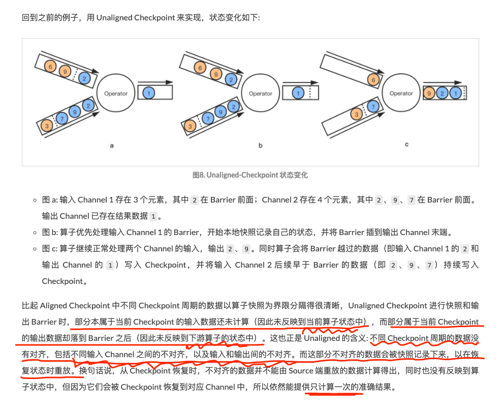
>
> **输入channel 1 的Barrier 到达后，当前算子开始CK，并将Barrier插到输出channel的末端，后续继续正常处理两个channel的输入，同时将channel 1 Barrier 越过的数据写入CK ，channel 2 早于Barrier的数据写入CK 。 ** 
>
> **!!!!    部分本属于当前 Checkpoint 的输入数据还未计算（因此`未反映到当前算子状态中`），而部分属于当前 Checkpoint 的输出数据却落到 Barrier 之后（因此`未反映到下游算子的状态中`） **
>
> **Unaligned 的含义: 包括不同输入 Channel 之间的不对齐，以及输入和输出间的不对齐 **
>
> 3、 为什么有了 Unaligned，不全用 Unaligned 呢？为什么社区方向是：平时正使用 Aligned，当反压比较严重时触发 Unaligned？
>
> 1. 由于要持久化缓存数据，State Size 会有比较大的增长，磁盘负载会加重。
> 2. 随着 State Size 增长，作业恢复时间可能增长，运维管理难度增加。
>
> Unaligned Checkpoint 更适合容易产生高反压同时又比较重要的复杂作业。对于像数据 ETL 同步等简单作业，更轻量级的 Aligned Checkpoint 显然是更好的选择。
>
> 4、 与对齐CK的不同点
>
> 1. 对齐检查点在最后一个屏障到达算子时触发，非对齐检查点在第一个屏障到达算子时就触发。
> 2. 对齐检查点在第一个屏障到最后一个屏障到达的区间内是阻塞的，而非对齐检查点不需要阻塞。
> 3. 对齐检查点能够保持快照N~N + 1之间的边界，但非对齐检查点模糊了这个边界。包括不同输入 Channel 之间的不对齐，以及输入和输出间的不对齐
>

#### 源码分析CK 流程


## 3、网络反压

> https://blog.csdn.net/yidan7063/article/details/90260434
>
> https://ververica.cn/developers/advanced-tutorial-2-analysis-of-network-flow-control-and-back-pressure/
>
> https://www.bilibili.com/video/BV124411P7V9
>
> 基于 Flink 的流控机制和反压如何定位 Flink 任务的瓶颈。或者说，如果⼀个平时正常的 Flink
>
> 任务突然出现延迟了，怎么来定位问题？到底是 Kafka 读取数据慢，还是中间某个计算环节
>
> ⽐较消耗资源使得变慢，还是由于最后的写⼊外部存储时⽐较慢？

**1.5 之前反压机制 --- 基于TCP流控处理**

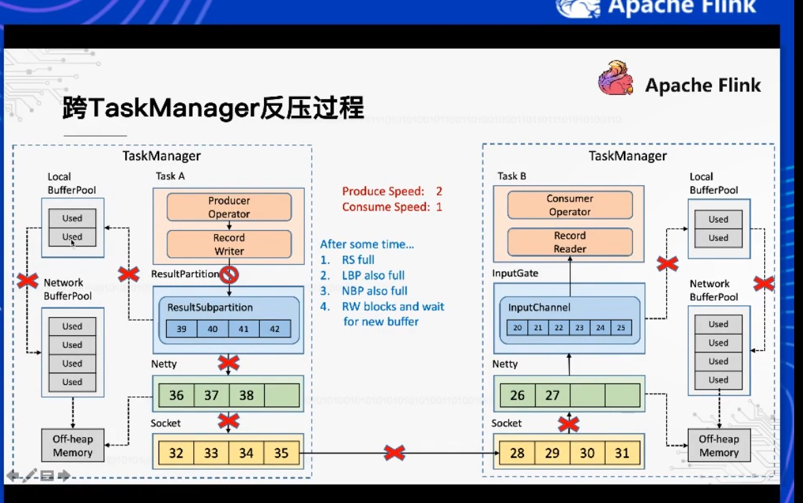

> 跨TM 反压 
>
> 由下游TM三层buffer（ InputChannel - >  local BufferPool   ->  Network BufferPool  - >  Netty  -> Socket ) 逐层打满， Socket 反馈到TCP流控反压机制 ， 再把上层三层buffer打满，最终反馈到 Producer Operator
>
>  同TM反压
>
> Socket 反馈到TCP流控反压机制 ， 再把上层三层buffer打满，IO Writer无法写入， 那么同线程的Reader无法读取
>
> 反压存在的问题
>
> 同TM的subTask 无法使用Socket ，  无法发送checkPoint barrior ， 反压的传播链路太长，且需要耗尽所有网络缓存之后才能有效触发，延迟比较大

**1.5 之后反压机制  --- 应用层模拟TCP流控**

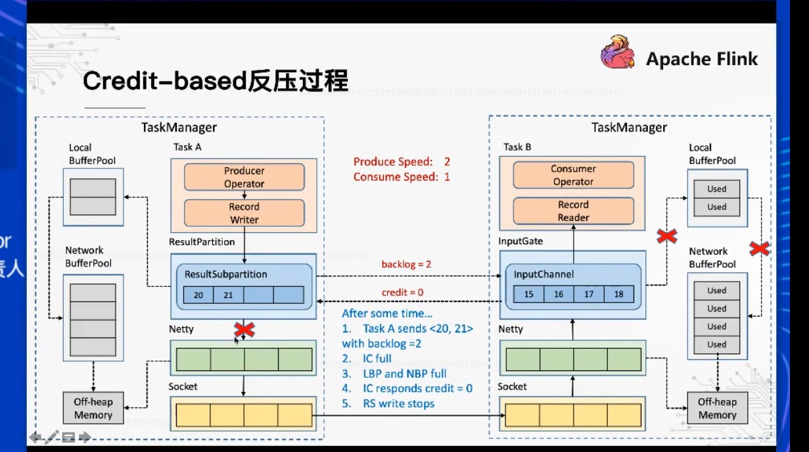

> 把当前可消费的能力大小值当作credit 信用值 传输给上游， 上游知晓可以发送的数据量大小

**反压思考**

> Flink 的反压是下游传到上游， 那么有些sink端存储系统不能 上传反压。  处理时要明辨清楚

#### ！！反压总结

> https://blog.csdn.net/weixin_42716237/article/details/110819629
>
> https://blog.csdn.net/weixin_42716237/article/details/111060274
>
> 逐级反压：   利用传输层TCP的流控和反压
>
> ​				弊端：同TM的subTask 无法使用Socket ，  无法发送checkPoint barrior ， 反压的传播链路太长，且需要耗尽所有网络缓存之后才能有效触发，延迟比较大
>
> 
>
> 动态反压：  RS会向IG发送这个要发送的量，IG返回当前空余量，包含LocalBufferPool的。如果这个时候发现backlog > credit，那么LocalBufferPool就会向NetWorkPool申请内存。长此以往，当credit返回0的时候，表示没有内存缓存了，那么RS接收到credit的时候，就不会继续往netty写数据了。这样socket就不会堵塞了，同时生效延迟也降低了。同时RP也会不断去探测IG是否有空余的空间。**本质上是将TCP的流控机制从传输层提升到了应用层。即ResultPartition和InputGate的层级，从而避免在传输层造成阻塞。 Sender和Receiver通过互相告知对方自己的处理能力的方式来精准地进行流控（注意backlog size和credit也是要通过传输层的，不是直接交换的）  **
>
> ​                 反压信号在TaskManager之间不需要再通过传输层随着数据向上反馈，大大降低了反压的延迟。并且也不会因为一个Task反压而阻塞整个Socket链路，能够相当精确地在Task粒度控制流量，不仅轻量级，而且高效


####  Unaligned Checkpoint 优化反压


#### 反压解决办法

* 网络IO交互
* GC
* disableOperatorChaining  逐个排查

**定位反压可以从 Web UI 的反压监控面板和 Task Metric 两者入手，前者方便简单分析，后者适合深入挖掘。**

**定位到反压节点后我们可以通过数据分布、CPU Profile 和 GC 指标日志等手段来进一步分析反压背后的具体原因并进行针对性的优化。**

#### 数据倾斜解决办法

* 数据标记分流   自定义keyed函数   两次聚合
* 高效 aggregate 累加中间结果

## 4、内存管理

> https://www.jianshu.com/p/4e4c188f5d7b   1.9 之前

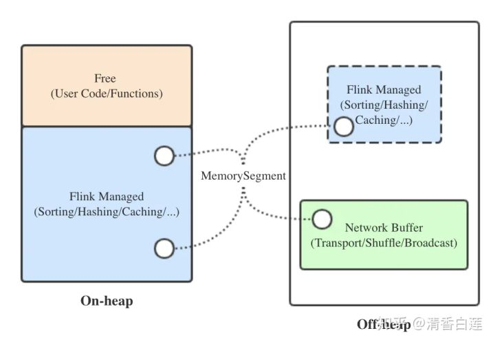

通过ytm传入的内存实际是container占用的总内存，TaskManager可使用的内存为

![[公式]](https://www.zhihu.com/equation?tex=tm%5C_total%5C_memory+%3D+container%5C_size+-+max%5Bcontainerized.heap-cutoff-min%2C+taskmanager.heap.size+%2A+containerized.heap-cutoff-ratio%5D+)  

其中

```text
# Container预留的非TM内存占设定的TM内存的比例，默认值0.25；
containerized.heap-cutoff-ratio: 0.25
# Container预留的非TM内存的最小值，默认值600MB； 
ontainerized.heap-cutoff-min: 600mb 
```

在TaskMaanger中内存主要从物理被分为为两块，On-heap与Off-heap，其中On-heap部分用于启动JVM进程。从逻辑上被分为三块网络缓存、托管内存与空闲内存，其中托管内存穿插于堆内外。

- 网络缓存（Network Buffer）：用于网络传输及与网络相关的动作（shuffle、广播等）的内存块，在Flink 1.5版本之后，被固定分配在堆外，与它相关的三个参数及我们的设定值如下：

```text
# 网络缓存占TM内存的默认比例，默认0.1
taskmanager.network.memory.fraction: 0.15
# 网络缓存的最小值和最大值 ，默认64MB和1GB
taskmanager.network.memory.min: 128mb
taskmanager.network.memory.max: 1gb
```

其实际分配逻辑为

![[公式]](https://www.zhihu.com/equation?tex=network%5C_buffer%5C_memory+%3D+min%5Btaskmanager.network.memory.max%2C+max%28taskmanager.network.memory.min%2C+tm%5C_total%5C_memory+%2A+taskmanager.network.memory.fraction%29%5D) 

-  托管内存（Flink Managed Memory）：用于所有Flink内部算子逻辑的内存分配与中间数据的存储，它默认在堆内分配，如果开启堆外内存分配的开关，也可以在堆内、堆外同时分配。

```text
# 堆内托管内存占TM堆内内存的比例，默认0.7
taskmanager.memory.fraction: 0.7
# 是否允许分配堆外托管内存，默认不允许
taskmanager.memory.off-heap: false
# 默认未设置
taskmanager.memory.size
```

其分配逻辑为：

先获尝试获取taskmanager.memory.size参数，如果成功则将其定为托管内存大小，否则按下列公司计算：

![[公式]](https://www.zhihu.com/equation?tex=flink%5C_managed%5C_memory+%3D+tm%5C_heap%5C_memory+%2A+taskmanager.memory.fraction+) 

- 空闲内存（Free）：虽然名为空闲，但实际上用户代码与创建的UDF等对象正式放在这部分内存，其固定在堆内，可以理解为堆内内存除去托管内存后剩下的那部分。

-ytm 8192 
tm_total_memory = taskmanager.heap.size - max[containerized.heap-cutoff-min, taskmanager.heap.size * containerized.heap-cutoff-ratio]
tm_total_memory = 8192 - max[600, 8192 * 0.25] = 6144

network_buffer_memory = min[1024, max(128, 6144 * 0.15)] = 921.6

tm_heap_memory = tm_total_memory - network_buffer_memory = 6144 - 921.6 ≈ 5222  5.1GB

Flink Managed Memory =  tm_heap_memory * 0.7    =  3.78 

max DirectMemorySize =  8192 - 5222  


Network Buffers：这个是在TaskManager启动的时候分配的，这是一组用于缓存网络数据的内存。可以经过下面的参数配置

managerMemory 用来排序、hash表和缓存中间结果。

freeMemory 用来保存用户在方法中创建的对象

cutoff从container 截取一部分内存，这部分内存暂定位cutoff部分，这部分内存是保证系统的运行，可以提供给其他jvm使用

### 1.11 内存管理

> https://blog.csdn.net/ytp552200ytp/article/details/107508034
>
> https://www.jianshu.com/p/96364463c831    1.10 版本
>
> 根据社区的说法，该proposal致力于解决1.9版本及之前的TM内存配置的三个缺点：
>
> 1. 流处理与批处理作业的内存配置方法不同；
> 2. 流处理作业中RocksDB状态后端的内存配置过于复杂，需要小心控制堆外内存的消耗量；
> 3. 内存配置有隐藏细节，且比较晦涩难懂，例如容器化会有内存截断（cutoff）等

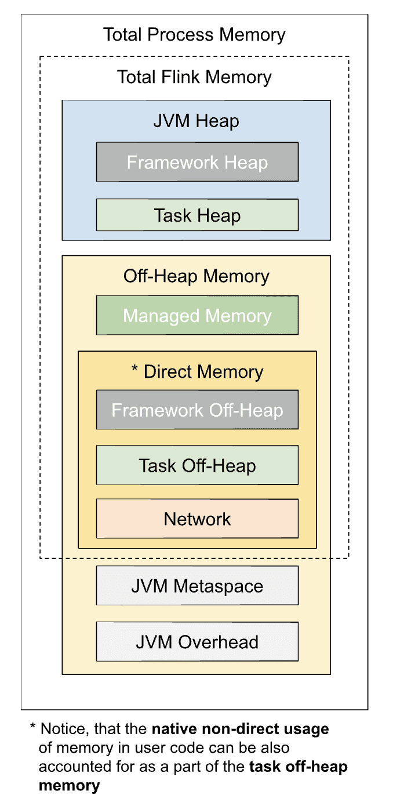

**还是堆内内存 与 堆外内存，对 flink (farmework)内存 与 任务（task）内存 区分开来， 更加清晰明显化**

> ##### TaskManager进程总内存（Total Process Memory）
>
> 是Flink总内存、JVM元空间与JVM额外内存开销的和，也就是容器本身的内存大小。
>
> ##### JVM元空间（Metaspace）
>
> `taskmanager.memory.jvm-metaspace.size`：默认值256MB。
>
> ##### JVM额外开销（Overhead）
>
> 为JVM预留的其他本地内存，用于线程栈、代码缓存等，作用有些类似于之前版本中为容器预留的截断（cutoff）内存。当然在1.10版本中，原先的`containerized.heap-cutoff-ratio`与`containerized.heap-cutoff-min`参数对TM就不再生效了
>
> ##### Flink总内存（Total Flink Memory）
>
> TaskManager进程占用的所有与Flink相关的内存（不包括JVM元空间和其他额外开销）。具体包含4大块：Flink框架内存（堆内、堆外）、托管内存（仅堆外）、网络缓存（仅堆外）、任务内存（堆内、堆外）。
>
> ##### Flink框架（Framework）内存
>
> - **含义**
>    Flink Runtime底层占用的内存，一般来讲相对固定，不需要更改。极特殊情况下才需要调大一些，比如非常高的算子并行度，或者与外部系统（如Hadoop）有密集交互等等。
>
> ##### 托管（Managed）内存
>
> - **含义**
>    纯堆外内存，由MemoryManager管理，用于中间结果缓存、排序、哈希表等，以及RocksDB状态后端。可见，RocksDB消耗的内存可以由用户显式控制了，不再像旧版本一样难以预测和调节。
>
> ##### 网络（Network）缓存
>
> - **含义**
>    纯堆外内存，用于TaskManager之间（shuffle、广播等）及与外部组件的数据传输，以直接内存形式分配。
>
> ##### 任务（Task）内存
>
> - **含义**
>    顾名思义，是算子逻辑和用户代码、自定义数据结构真正占用的内存。
> - 参数
>   - `taskmanager.memory.task.heap.size`：堆内部分（Task Heap），无默认值，一般不建议设置，会自动用Flink总内存减去框架、托管、网络三部分的内存推算得出。
>   - `taskmanager.memory.task.off-heap.size`：堆外部分（Task Off-Heap），以直接内存形式分配，默认值为0，即不使用。
>
> 
>
> 一大堆参数看得人眼花缭乱，但实际用起来并不需要管那么多。简而言之：
>
> - 如果是Standalone部署，就指定Flink总内存`taskmanager.memory.flink.size`；
> - 如果是容器化部署，就指定TM进程总内存`taskmanager.memory.process.size`。
>
> **其他部分内存的分配大可交给Flink本身去决定。如果需要依照业务特点做微调的话，建议首先修改网络缓存占比`taskmanager.memory.network.fraction`（根据网络流量大小）与托管内存占比`taskmanager.memory.managed.fraction`（根据RocksDB状态大小等），进而能够间接影响任务内存的配额。手动指定较多的参数——特别是固定内存量的参数——容易使内存配额出现冲突，导致部署失败，要小心。**

| 组件                      | 配置项                                                       | 描述                                                         |
| ------------------------- | ------------------------------------------------------------ | ------------------------------------------------------------ |
| Framework Heap Memory     | taskmanager.memory.framework.heap.size                       | （高级参数，一般不需要用户配置）分配给 Flink 框架的 JVM 堆内存（默认128MB） |
| Task Heap Memory          | taskmanager.memory.task.heap.size                            | 分配给 operator 和用户代码的 JVM 堆内存                      |
| Managed memory            | taskmanager.memory.managed.size(默认none)  taskmanager.memory.managed.fraction(默认0.4) | 被 flink 管理的本地内存，用于 batch 作业的中间结果排序(sort)、散列表(hash)、缓存(caching )和 Streaming 作业的 RocksDB state backend |
| Framework Off-heap Memory | taskmanager.memory.framework.off-heap.size(默认128 mb)       | （高级参数）分配给 Flink 框架的 Off-heap direct 内存         |
| Task Off-heap Memory      | taskmanager.memory.task.off-heap.size                        | 分配给 task operator 的 Off-heap direct 内存，默认（0 bytes） |
| Network Memory            | taskmanager.memory.network.min(默认64 mb)  taskmanager.memory.network.max(默认1 gb)  taskmanager.memory.network.fraction(默认0.1) | 为 tasks 之间的数据元素交换保留的 Off-heap direct(例如，通过网络进行传输的缓冲区)，它是 Total Flink Memory 的一个有上下限的细分组件 |
| JVM metaspace             | taskmanager.memory.jvm-metaspace.size(默认96 mb) flink-1.10.0 为 96 mb flink-1.10.1及flink-1.11为256 mb 更改原因见 [FLINK-16406](https://issues.apache.org/jira/browse/FLINK-16406) | Flink JVM 进程的元数据空间大小，为本地内存                   |
| JVM Overhead              | taskmanager.memory.jvm-overhead.min(默认192 mb) taskmanager.memory.jvm-overhead.max(默认1 gb) taskmanager.memory.jvm-overhead.fraction(默认0.1) | 为 JVM 进程预留的其他本地内存，用于线程栈、代码缓存、垃圾收集。它是 Total Process Memory(整个进程) 的一个有上下限的细分组件 |

> 总结与详细计算各个区间大小  https://www.cnblogs.com/lighten/p/13053828.html
>
> * 1.10 之前
>
> cutoff： flink为了防止内存溢出，计算的时候先切了一块内存下来不参与后续计算   Math.max(600, X * 0.25)
>
> networkBufMB：简单记成 0.75 * 0.1x，最大1g
>
> heapSizeMB： X  * 0.75  *  0.9      X - cutoff - networkBufMB
>
> offHeapSizeMB： X - heapSizeMB
>
> 
>
> * 1.10 之后
>
> **总内存 = Flink 内存 + JVM Metaspace （96m）+ JVM Overhead （计算为0.1 * 全局大小，结果必须在[192m, 1g]之间）**

### Flink 类型 与 序列化

> http://wuchong.me/blog/2016/04/29/flink-internals-memory-manage/
>
> 几乎所有的大数据框架都要面临分布式计算、数据传输和持久化问题。数据传输过程前后要进行数据的序列化和反序列化：序列化就是将一个内存对象转换成二进制串，形成网络传输或者持久化的数据流。反序列化将二进制串转换为内存对象，这样就可以直接在编程语言中读写和操作这个对象。一种最简单的序列化方法就是将复杂数据结构转化成JSON格式。序列化和反序列化是很多大数据框架必须考虑的问题，在Java和大数据生态圈中，已有不少序列化工具，比如Java自带的序列化工具、Kryo等。一些RPC框架也提供序列化功能，比如最初用于Hadoop的Apache Avro、Facebook开发的Apache Thrift和Google开发的Protobuf，这些工具在速度和压缩比等方面与JSON相比有一定的优势。
>
> 但是Flink依然选择了重新开发了自己的序列化框架，因为序列化和反序列化将关乎整个流处理框架个方便的性能，对数据类型了解越多，可以更早地完成数据类型检查，节省数据存储空间。
>
>  Flink 面对 JVM 存在的问题，而在内存管理的道路上越走越深。从自己管理内存，到序列化框架，再到堆外内存

```
类型信息由 TypeInformation 类表示
每个TypeInformation中，都包含了serializer，类型会自动通过serializer进行序列化，然后用Java Unsafe接口写入MemorySegments。
对于可以用作key的数据类型，Flink还同时自动生成TypeComparator，用来辅助直接对序列化后的二进制数据进行compare、hash等操作。
对于 Tuple、CaseClass、POJO 等组合类型，其TypeSerializer和TypeComparator也是组合的，序列化和比较时会委托给对应的serializers和comparators。
```


## 5、多流Join  coGroup 与 维表关联 

> 关系型数据库如mysql都是解耦，模块化。   数仓都是要把各个流业务线数据耦和，方便后续查询
>
> https://juejin.im/post/5e22b79cf265da3e2a79221e
>
> https://www.cnblogs.com/yunqishequ/p/10027909.html  ！！！！
>
> 
>
> https://ververica.cn/developers/how-does-flink-sql-realize-data-flow-join/
>
> 离线join实现方式有 Nested-loop Join、Sort-Merge Join 和 Hash Join 
>
> **实时join 需要同时缓存两个流的数据量， 但是无法无止境增长，所以需要设置缓存剔除策略， 关于缓存剔除策略的实现，正式三种join的主要区别。**

#### 流join与传统数据库join的区别？

* **左右两边是无穷集合**
* **join结果不断更新产生**
*  build table  probe table  ->  **查询计算的双边驱动**

**！！！！ 实时领域 Streaming SQL 中的 Join 与离线 Batch SQL 中的 Join  最大不同点在于无法缓存完整数据集，而是要给缓存设定基于时间的清理条件以限制 Join 涉及的数据范围。根据清理策略的不同，Flink SQL  分别提供了 Regular Join、Time-Windowed Join 和 Temporal Table Join 来应对不同业务场景。**

#### 流join如何处理晚到数据？

这个是不会的，在对A进行JOIN B时，如果B中的数据没有达到，会先把A中的数据保存到checkpoint中去，等待B到达时再进行join。这里需要注意下的是，采用A LEFT JOIN B的话，虽然B没有达到，但是他还是会把结果传递到下一个节点。

**如果有晚到数据如何处理？**

* 设置延迟时间  重定向迟到元素

```java
设置允许延迟的时间是通过allowedLateness(lateness: Time)设置

保存延迟数据则是通过sideOutputLateData(outputTag: OutputTag[T])保存

获取延迟数据是通过DataStream.getSideOutput(tag: OutputTag[X])获取
  
如果延迟的数据有业务需要，则设置好允许延迟的时间，每个窗口都有属于自己的最大等待延迟数据的时间限制：

window operator API提供了方法来明确声明我们要等待迟到元素。当使用event-time window，我们可以指定一个时间段叫做allowed lateness。window operator如果设置了allowed lateness，这个window operator在水位线没过窗口结束时间时也将不会删除窗口和窗口中的状态。窗口会在一段时间内(allowed lateness设置的)保留所有的元素。
窗口结束时间+延迟时间=最大waterMark值

即当waterMark值大于的上述计算出的最大waterMark值，该窗口内的数据就属于迟到的数据，无法参与window计算 !!!
  
如果业务有不确定的延迟时间， 该做法不适合  
```

* 自定义State 保存业务上未到的订单类信息
* 关联历史数据， 重新计算产生结果

> 对于一些需要关联窗口期很长的场景，比如关联的数据可能是几天以前的数据。对于这些历史数据，我们可以将其理解为是一种已经固定不变的”维度”。可以将需要被关联的历史数据采用和维度数据一致的处理方法：”缓存 + 离线”数据方式存储，  flink 支持hive 维表关联。   另外需要注意 Flink 对多表关联是直接顺序链接的，因此需要注意先进行结果集小的关联。

#### 流join后的结果如何更新？

撤回(retraction)可以理解成传统意义上的更新操作

### 5.1、Regular Join

> 没有窗口， 全量join
>
> Regular Join 是最为基础的没有缓存剔除策略的 Join。Regular Join 中两个表的输入和更新都会对全局可见，影响之后所有的 Join 结果。举例，在一个如下的 Join 查询里，Orders 表的新纪录会和 Product 表所有历史纪录以及未来的纪录进行匹配。
>
> ```mysql
> SELECT * FROM Orders
> INNER JOIN Product
> ON Orders.productId = Product.id
> ```
>
> 因为历史数据不会被清理，所以 Regular Join 允许对输入表进行任意种类的更新操作（insert、update、delete）。然而因为资源问题 Regular Join 通常是不可持续的，一般只用做有界数据流的 Join。

### 5.2、Time-Windowed Join

#### 5.2.1、Window Join

>  **Time-Windowed Join 利用窗口给两个输入表设定一个 Join 的时间界限，超出时间范围的数据则对 JOIN 不可见并可以被清理掉** 这里涉及到的一个问题是时间的语义。 如果是 Processing Time，Flink 根据系统时间自动划分 Join 的时间窗口并定时清理数据；如果是 Event Time，Flink 分配 Event Time 窗口并依据 Watermark 来清理数据。

> window中的关联通常是两个流中对应的window中的消息可以发生关联， 不能跨window
>
> join 和 coGroup 方法
>
> join是key范型    coGroup 中是迭代器，可以做更多的操作

```mysql
input1.join(input2)     -- coGroup()
    .where(<KeySelector>)      <- input1使用哪个字段作为Key
    .equalTo(<KeySelector>)    <- input2使用哪个字段作为Key
    .window(<WindowAssigner>)  <- 指定WindowAssigner
    [.trigger(<Trigger>)]      <- 指定Trigger（可选）
    [.evictor(<Evictor>)]      <- 指定Evictor（可选）
    .apply(<JoinFunction>)     <- 指定JoinFunction
```

**在Flink中，join的实现分为两个阶段，第一个阶段被称为Ship阶段，而第二个阶段被称为Local阶段，**

1. 这个Ship阶段很像mapreduce中的shuffle，就是将具有相同join key的element shuffle到同一个节点，不然没法在task节点进行本地join。ship阶段有两种不同的策略，一种是根据join  key把element重新进行partition。第二种策略是将一个完整的Dataset shuffle到每个task节点。比如R S两个Dataset，图中示例就是将R shuffle到每个节点。
2. Ship阶段完成之后，每个节点都要开始进行本地join，也就是上面所说的Local阶段。
3. Flink借用了数据库中常见的两种join方式，一种是Sort-Merge-Join，另一种是Hybrid-Hash-Join
4. 所谓Sort-Merge-Join其实就是先将两个Dataset中的元素进行排序，然后利用两个游标不断的从Dataset中取具有相同join  key的元素出来。而Hybrid-Hash-Join相对来说更复杂一些，先来看简单的Hash-Join，就是将一个较小的Dataset装进哈希表，然后遍历另一个Dataset，根据join  key进行配对。但是如果较小的那个Dataset中的数据量也很大根本没法装进内存中呢？这时候就要将Dataset再进行partition，然后在各个partition上进行简单的Hash-Join。Hybrid-Hash-Join在此基础上有个小的优化，就是在内存足够的情况下，将一些数据一直保存在内存中。
5. 因为不同阶段有不同的策略，所以可以构建出多种的join策略，具体选择哪种join策略，在Flink中会根据初始Dataset的数据量对各个join策略进行预估，然后选择预估时间最小的那个策略。


#### 5.2.2、Interval Join

> Interval Join则没有window的概念，直接用时间戳作为关联的条件，更具表达力。由于流消息的无限性以及消息乱序的影响，本应关联上的消息可能进入处理系统的时间有较大差异，一条流中的消息，可能需要和另一条流的多条消息关联因此流流关联时，通常需要类似如下关联条件：
>
> 等值条件如 a.id = b.id       必须要指定的时间类型为EventTime
>
> 时间戳范围条件 ： a.timestamp ∈ [   b.timestamp + lowerBound;       b.timestamp + upperBound    ] 
>
> 因此两个输入表都只需要缓存在时间下界以上的数据，将空间占用维持在合理的范围。
>
> https://www.jianshu.com/p/d457a6dff349

```mysql
SELECT *
FROM 
  Orders o, 
  Shipments s
WHERE 
  o.id = s.orderId AND
  s.shiptime BETWEEN o.ordertime AND o.ordertime + INTERVAL '4' HOUR
  

val intervalJoinResult = input1.keyBy(_._1)
      .intervalJoin(input2.keyBy(_._1))
      .between(Time.milliseconds(-5), Time.milliseconds(10))
      .upperBoundExclusive()
      .lowerBoundExclusive()
      .process(new MyProcessFunction)
```

### 5.3、Temporal Table Join

> **虽然 Timed-Windowed Join 通过窗口解决了资源问题，但也限制了使用场景: Join  两个输入流都必须有时间下界，超过之后则不可访问。这对于很多 Join  维表的业务来说是不适用的，因为很多情况下       维表并没有时间界限   。针对这个问题，Flink 提供了 Temporal Table Join  来满足用户需求。!!!!  !!!!  !!!!  **
>
> Temporal Table Join 类似于 Hash Join，将输入分为 Build Table 和 Probe  Table。前者一般是纬度表的 changelog，后者一般是业务数据流，典型情况下后者的数据量应该远大于前者。在 Temporal Table Join 中，Build Table 是一个基于 append-only 数据流的带时间版本的视图，所以又称为 Temporal  Table。
>
> *** （  build、probe 的概念。简而言之，就是用左表 build 一个 hashtable，用右表的每一行去 probe 看是否命中，命中则表示 row match  ）
>
> Temporal Table 要求定义一个主键和用于版本化的字段（通常就是 Event Time  时间字段），以反映记录在不同时间的内容。

```mysql
TemporalTableFunction rate = source.createTemporalTableFunction( "time" , "primary_key" );
tableEnv.registerFunction("Rates", rates) ; 

SELECT 
  o.amount * r.rate
FROM
  Orders o,
  LATERAL Table(Rates(o.time)) r
WHERE
  o.currency = r.currency
```


**值得注意的是，不同于在 Regular Join 和 Time-Windowed Join  中两个表是平等的，任意一个表的新记录都可以与另一表的历史记录进行匹配，在 Temporal Table Join 中，Temoparal  Table 的更新对另一表在该时间节点以前的记录是不可见的。这意味着我们只需要保存 Build Side 的记录直到 Watermark  超过记录的版本字段。因为 Probe Side 的输入理论上不会再有早于 Watermark 的记录，这些版本的数据可以安全地被清理掉。**

### 5.4、维表join

> https://yq.aliyun.com/articles/457385?spm=a2c4e.11153959.blogcont457438.27.67c71e995MMbLX
>
> https://www.bilibili.com/video/BV1q7411N75R

#### 预加载维表

#### 热存储关联  ASYNC IO

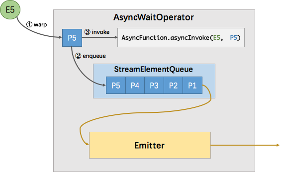

> http://wuchong.me/blog/2017/05/17/flink-internals-async-io/
>
> 如图所示，`AsyncWaitOperator` 主要由两部分组成：`StreamElementQueue` 和 `Emitter`。StreamElementQueue 是一个 Promise 队列，所谓 Promise 是一种异步抽象表示将来会有一个值（参考 [Scala Promise](http://docs.scala-lang.org/zh-cn/overviews/core/futures.html#promises) 了解更多），这个队列是未完成的 Promise 队列，也就是进行中的请求队列。Emitter 是一个单独的线程，负责发送消息（收到的异步回复）给下游。
>
> 图中`E5`表示进入该算子的第五个元素（”Element-5”），在执行过程中首先会将其包装成一个 “Promise” `P5`，然后将`P5`放入队列。最后调用 `AsyncFunction` 的 `ayncInvoke` 方法，该方法会向外部服务发起一个异步的请求，并注册回调。该回调会在异步请求成功返回时调用 `AsyncCollector.collect` 方法将返回的结果交给框架处理。实际上 `AsyncCollector` 是一个 Promise ，也就是 `P5`，在调用 `collect` 的时候会标记 Promise 为完成状态，并通知 Emitter 线程有完成的消息可以发送了。Emitter 就会从队列中拉取完成的 Promise ，并从 Promise 中取出消息发送给下游。

**异步IO —— EventTime 无序**

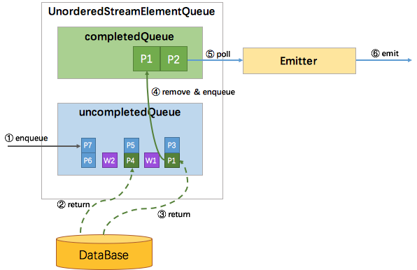

**EventTime 无序 因为有 watermark，需要协调 watermark 与消息之间的顺序性**

> 所以`uncompletedQueue`中存放的元素从原先的 Promise 变成了 Promise 集合。如果进入算子的是消息元素，则会包装成 Promise 放入队尾的集合中。如果进入算子的是 watermark，也会包装成 Promise 并放到一个独立的集合中，再将该集合加入到 `uncompletedQueue` 队尾，最后再创建一个空集合加到 `uncompletedQueue` 队尾。这样，watermark 就成了消息顺序的边界。只有处在队首的集合中的 Promise 返回了数据，才能将该 Promise 移到 `completedQueue` 队列中，由 Emitter 消费发往下游。只有队首集合空了，才能处理第二个集合。这样就保证了当且仅当某个 watermark 之前所有的消息都已经被发送了，该 watermark 才能被发送。

**快照与恢复**

分布式快照机制是为了保证状态的一致性。我们需要分析哪些状态是需要快照的，哪些是不需要的。首先，已经完成回调并且已经发往下游的元素是不需要快照的。否则，会导致重发，那就不是 exactly-once 了。而已经完成回调且未发往下游的元素，加上未完成回调的元素，就是上述队列中的所有元素。

所以快照的逻辑也非常简单，(1)清空原有的状态存储，(2)遍历队列中的所有 Promise，从中取出 `StreamElement`（消息或 watermark）并放入状态存储中，(3)执行快照操作。 

恢复的时候，从快照中读取所有的元素全部再处理一次，当然包括之前已完成回调的元素。所以在失败恢复后，会有元素重复请求外部服务，但是每个回调的结果只会被发往下游一次。

#### 广播维表 BroadcastStream

使用MapStateDescriptor , 分 keyed 与 no keyed   

- 第1步骤是要定义广播的状态描述符。
- 第2步骤我们这里去生成 broadCastStream。
- 第3步骤的话我们就需要去把两个 Stream 做 Connect。
- 第4步最主要的一个环节就是需要实现 BroadcastProcessFunction。第 1 个参数是我们的 probeStream，第 2 个参数是广播流的数据，第 3 个参数就是我们的要输出的数据，可以看到主要的数据处理逻辑是在processElement里面。

#### Temporal table function join 

>  在Flink中，通过TemporalTableFunction实现对temporal table的访问，必须定义主键和时间戳属性，主键确定覆盖哪些行，时间戳确定有效的时间，也就是表的数据版本。
>
> ！！！ **LATERAL JOIN是一个TableFunction，不具备state的管理能力，数据不具备版本特性。而Temporal Table JOIN是一个具备版本信息的数据表。**
>
> **Temporal Table JOIN 和 双流 JOIN都可以管理State，那么他们的本质区别是什么?  那就是计算驱动的差别，Temporal Table JOIN是单边驱动，Temporal  Table是被动的查询，而双流JOIN是双边驱动，两边都是主动的进行JOIN计算。**
>
> **Join当前维表数据，即每条处理的消息所关联上的维表数据是处理时刻的维表快照，也就是说，当数据到达时，我们会根据数据上的 key 去查询远程数据库，拿到维表里的当前数据后再关联输出。使用 JOIN 当前维表功能需要注意的是，JOIN行为只发生在处理时间（processing time），即使维表新插入了一条能关联上左表之前消息的维度数据，或者删除了维表中的数据，都不会对之前join结果流进行更新。**
>
> CREATE TABLE dim_user ( 
>
> mobile_city  varchar, user_id int  )
>
> WITH('connector.type'='jdbc''connector.table'='dim_user','connector.url'='jdbc:mysql://ip:port/database','connector.username'='username','connector.password'='passwd','connector.lookup.cache.max-rows'='1000','connector.lookup.cache.ttl'='10s');
>
> SELECT u.mobile_city, SUM(o.amount) AS amount FROM  Orders as o
>
>  JOIN  dim_user
>
> FOR SYSTEM_TIME AS OF o.o_proctimeasu ON  o.user_id = u.user_id
>
>  **FOR SYSTEM_TIME AS OF o.o_proctime**


#### 维表join使用注意事项

**1、使用 JOIN 当前维表功能需要注意的是，JOIN行为只发生在处理的时刻（processing time），即使维表中的数据都被删了或者修改，之前JOIN流已经发出的关联上的数据也不会被撤回或改变。
2、维表JOIN的ON条件中一定要包括维表primary key的等值条件，因为需要根据key去查维表
3、在使用维表join时，如果数据量超过百万时，要使用LRU进行缓存，不要使用ALL **

4、 **JOIN ReOrder ** 先join 数据量小的流。 避免热点问题 。大部分时候当A事件流入的时候，B还没有可以JOIN的数据，但是B来的时候，A已经有可以JOIN的数据了，这特点就会导致，A LEFT JOIN B 会产生大量的 (A, NULL),其中包括B里面的 cCol 列也是NULL，这时候当与C进行LEFT  JOIN的时候，首先Blink内部会利用cCol对AB的JOIN产生的事件流进行Shuffle，  cCol是NULL进而是下游节点大量的NULL事件流入，造成热点。那么这问题如何解决呢？`我们可以改变JOIN的先后顺序，来保证A LEFT JOIN B 不会产生NULL的热点问题` 

## 6、Fink SQL 功能揭秘

> https://yq.aliyun.com/articles/457438?spm=a2c4e.11153940.0.0.1ec34e9aNGwcWV

### 1、动态表 & 流表二象性

### 2、连续查询

### 3、双流 JOIN

### 4、维表 JOIN

### 5、TopN

> https://blog.csdn.net/wangpei1949/article/details/105471974
>
> 

```mysql
SELECT [column_list]
FROM (
   SELECT [column_list],
     ROW_NUMBER() OVER ([PARTITION BY col1[, col2...]]
       ORDER BY col1 [asc|desc][, col2 [asc|desc]...]) AS rownum
   FROM table_name)
WHERE rownum <= N [AND conditions]
```

优化： 

* 在计算过程中，如果某个分区的TopN发生了变化，则会将变化的记录以撤消/添加记录的形式发送到下游。建议使用支持更新的存储作为TopN查询结果的存储器。此外，如果需要将TopN记录存储在外部存储中，则外部存储应有相对应的主键或唯一键。

* TopN查询的唯一键是分区列和rownum列的组合。

* 外层查询`WHERE`条件中，必须通过如`rownum <= N`指定，Flink才能将其识别为TopN查询。

* 使用无排名输出优化，可以解决数据膨胀问题。

  - 数据膨胀问题

  根据TopN的语法，rownum字段会作为结果表的唯一键字段之一写入结果表。但是这可能导致数据膨胀的问题。例如，收到一条原排名9的更新数据，更新后排名上升到1，则从1到9的数据排名都发生变化了，需要将这些数据作为更新都写入结果表。这样就产生了数据膨胀，导致结果表因为收到了太多的数据而降低了更新速度。

  - 无排名输出优化方法

  结果表中不保存 rownum，最终的 rownum 由使用方取数时决定。因为TopN的数据量通常不会很大，使用方取数时排序也会很快。当收到一条原排名9，更新后排名上升到1的数据，此时，只需要发送这一条数据，不用把排名1到9的数据全发送下去进行更新。这种优化能明显提升结果表的更新速度。

### 6、Window

### 7、多路输入、多路输出

### 8、MiniBatch 优化

### 9、Retraction 撤回机制

> 通俗的讲"回退更新"就是传统数据里面的更新操作，也就是说Retract是流式计算场景下对数据更新的处理。
>
> 使用flinkSQL处理实时数据当我们把表转化成流的时候，需要用**toAppendStream**与**toRetractStream**这两个方法。
>
> https://ci.apache.org/projects/flink/flink-docs-release-1.12/zh/dev/table/streaming/dynamic_tables.html
>
> https://ci.apache.org/projects/flink/flink-docs-release-1.12/zh/dev/table/sourceSinks.html#define-a-tablesink

### 10、flink SQL 优化  Minibatch、LocalGlobal、Split Distinct、Agg With Filter

>  https://wangpei.blog.csdn.net/article/details/105619361


### 11 Flink SQL CDC   实时数据同步方案 ETL一体化

> https://developer.aliyun.com/article/777502?utm_content=g_1000201984
>
> 视频链接：
> https://www.bilibili.com/video/BV1zt4y1D7kt
> 文档教程：
> https://github.com/ververica/flink-cdc-connectors/wiki/中文教程  
>
> 


**Flink  SQL  group by  数据写入append only 的 Kafka ， 如何动态更新？？ **

* 使用Kafka  format 为 changelog-json  


### 12、 Flink SQL 如何实现数据流的join

> http://www.whitewood.me/2019/12/15/Flink-SQL-%E5%A6%82%E4%BD%95%E5%AE%9E%E7%8E%B0%E6%95%B0%E6%8D%AE%E6%B5%81%E7%9A%84-Join/
>
> 

### 13、UDF UDAF  UDTF 

> https://blog.csdn.net/wangpei1949/article/details/103444412

*  UDF 

UDF需要继承`ScalarFunction`抽象类，主要实现eval方法。

* UDAF 

UDAF，自定义聚合函数，需要继承`AggregateFunction`抽象类，实现一系列方法

* UDTF

UDTF，自定义表函数，继承`TableFunction`抽象类，主要实现`eval`方法

## 7、动态更改配置

### Flink中传递参数

> https://www.cnblogs.com/029zz010buct/p/10362451.html


原始流  connect  配置流

```java
既然它的名字叫“广播状态”，那么就一定要有与它对应的状态描述符StateDescriptor。Flink直接使用了MapStateDescriptor作为广播的状态描述符，方便存储多种不同的广播数据。示例：
    MapStateDescriptor<String, String> broadcastStateDesc = new MapStateDescriptor<>(      "broadcast-state-desc",      String.class,      String.class    );
接下来在控制流controlStream上调用broadcast()方法，将它转换成广播流BroadcastStream。controlStream的产生方法与正常数据流没什么不同，一般是从消息队列的某个特定topic读取。

BroadcastStream<String> broadcastStream = controlStream
  .setParallelism(1)
  .broadcast(broadcastStateDesc);
然后在DataStream上调用connect()方法，将它与广播流连接起来，生成BroadcastConnectedStream。

BroadcastConnectedStream<String, String> connectedStream = 
sourceStream.connect(broadcastStream);

最后就要调用process()方法对连接起来的流进行处理了。如果DataStream是一个普通的流，
需要定义BroadcastProcessFunction，反之，如果该DataStream是一个KeyedStream，
就需要定义KeyedBroadcastProcessFunction。
并且与之前我们常见的ProcessFunction不同的是，它们都多了一个专门处理广播数据的方法
processBroadcastElement()。类图如下所示。

    connectedStream.process(new BroadcastProcessFunction<String, String, String>() {
      private static final long serialVersionUID = 1L;

      @Override
      public void processElement(String value, ReadOnlyContext ctx, Collector<String> out) throws Exception {
        ReadOnlyBroadcastState<String, String> state = ctx.getBroadcastState(broadcastStateDesc);
        for (Entry<String, String> entry : state.immutableEntries()) {
          String bKey = entry.getKey();
          String bValue = entry.getValue();
          // 根据广播数据进行原数据流的各种处理
        }
        out.collect(value);
      }

      @Override
      public void processBroadcastElement(String value, Context ctx, Collector<String> out) throws Exception {
        BroadcastState<String, String> state = ctx.getBroadcastState(broadcastStateDesc);
        // 如果需要的话，对广播数据进行转换，最后写入状态
        state.put("some_key", value);
      }
    });

BroadcastProcessFunction的行为与RichCoFlatMapFunction、CoProcessFunction非常相像。其基本思路是processBroadcastElement()方法从广播流中获取数据，进行必要的转换之后将其以键值对形式写入BroadcastState。而processElement()方法从BroadcastState获取广播数据，再将其与原流中的数据结合处理。也就是说，BroadcastState起到了两个流之间的桥梁作用。
最后还有一点需要注意，processElement()方法获取的Context实例是ReadOnlyContext，说明只有在广播流一侧才能修改BroadcastState，而数据流一侧只能读取BroadcastState。这提供了非常重要的一致性保证：假如数据流一侧也能修改BroadcastState的话，不同的operator实例有可能产生截然不同的结果，对下游处理造成困扰。

```

## 8、Flink任务执行流程图

> https://zhuanlan.zhihu.com/p/107336730

 ###per job

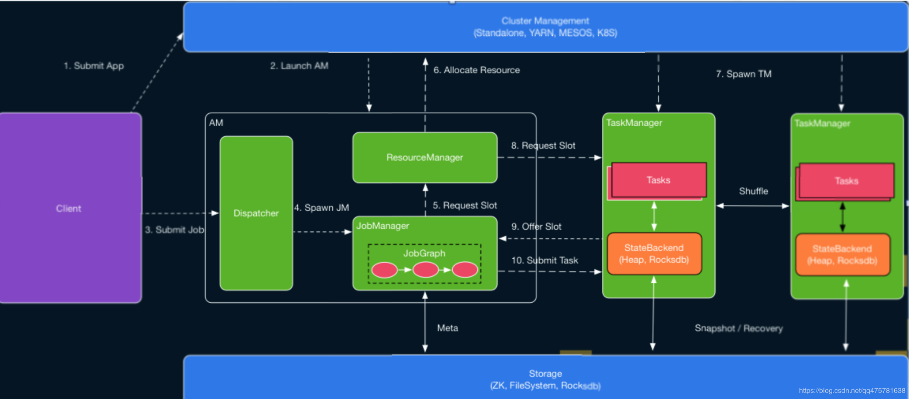

* Dispatcher（Application Master）提供REST接口来接收client的application提交，它负责启动JM和提交application，同时运行Web UI。

  引入Dispatcher是因为：

  - 某些集群管理器需要一个集中的作业生成和监视实例
  - 它包含独立JobManager的角色，等待提交作业

* ResourceManager：Yarn组件，当TM有空闲的slot就会告诉JM，没有足够的slot也会启动新的TM。kill掉长时间空闲的TM。

* JobManager ：其他工作类似Spark driver，如向RM申请资源、schedule tasks、保存作业的元数据，如checkpoints。如今JM可分为JobMaster和ResourceManager ，分别负责任务和资源，在Session模式下启动多个job就会有多个JobMaster。

* TaskManager：类似Spark的executor，会跑多个线程的task、数据缓存与交换。

### 新版执行流程

> https://ververica.cn/developers/advanced-tutorial-2-flink-job-execution-depth-analysis/

##### 没有 Dispatcher job 运行过程

客户端提交 JobGraph 以及依赖 jar 包到 YarnResourceManager，接着 Yarn  ResourceManager 分配第一个 container 以此来启动 AppMaster，Application Master  中会启动一个 FlinkResourceManager 以及 JobManager，JobManager 会根据 JobGraph 生成的  ExecutionGraph 以及物理执行计划向 FlinkResourceManager 申请  slot，FlinkResoourceManager 会管理这些 slot 以及请求，如果没有可用 slot 就向 Yarn 的  ResourceManager 申请 container，container 启动以后会注册到 FlinkResourceManager，最后  JobManager 会将 subTask deploy 到对应 container 的 slot 中去。

##### 在有 Dispatcher 的模式下

会增加一个过程，就是 Client 会直接通过 HTTP Server 的方式，然后用 Dispatcher 将这个任务提交到 Yarn ResourceManager 中。

新框架具有四大优势，详情如下：

- client 直接在 Yarn 上启动作业，而不需要先启动一个集群然后再提交作业到集群。因此 client 再提交作业后可以马上返回。
- 所有的用户依赖库和配置文件都被直接放在应用的 classpath，而不是用动态的用户代码 classloader 去加载。
- container 在需要时才请求，不再使用时会被释放。
- “需要时申请”的 container 分配方式允许不同算子使用不同 profile (CPU 和内存结构)的 container。

### DataFlowGraph 转换

> https://blog.csdn.net/weixin_41062002/article/details/105976241

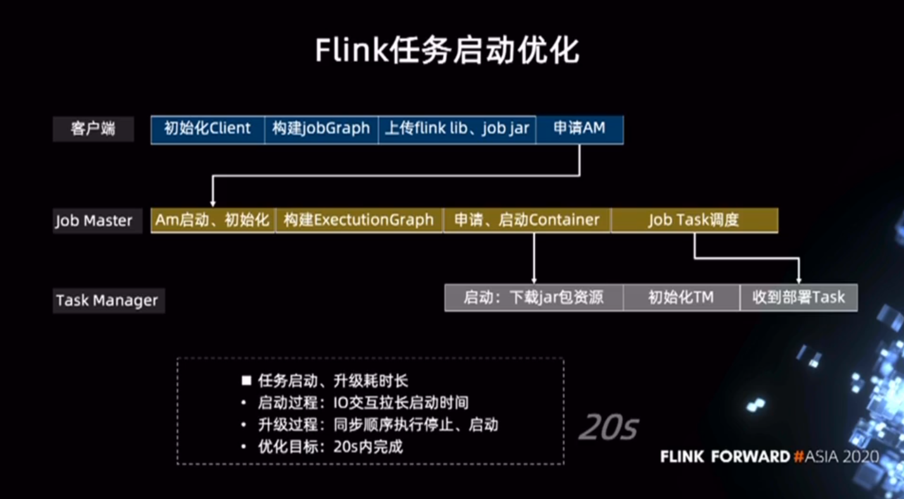

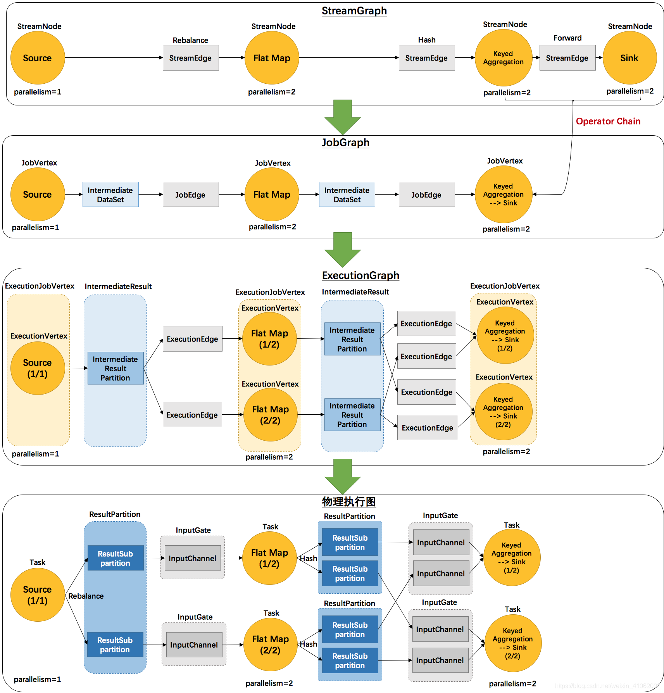

> 转换过程： 
>
> StreamExecutionEnvironment中存放的transformations->StreamGraph->JobGraph
>
> ->ExecutionGraph
>
> ->物理执行图；
>
> 2、transformations->StreamGraph->JobGraph在客户端完成，然后提交JobGraph到JobManager；
>
> 3、JobManager的主节点JobMaster，将JobGraph转化为ExecutionGraph，然后发送到不同的taskManager，在taskManager上实际的执行过程就是物理执行图。

```java
env.execute("myDemo start");
该段代码执行时做了两件事：
  把Transformation集合转换成StreamGraph、   把StreamGraph按照一定规则切分成JobGraph——逻辑上的DAG。

StreamGraph和JobGraph有什么区别，StreamGraph是逻辑上的DAG图，不需要关心jobManager怎样去调度每个Operator的调度和执行；JobGraph是对StreamGraph进行切分，因为有些节点可以打包放在一起被JobManage安排调度 **operator chain**  
  
JobManager收到客户端提交的JobGraph之后，会构建ExecutionGraph；然后根据集群中TaskManager上TaskSlot的使用情况（注册到Master节点上的TaskManager的slot使用情况），资源准备就绪之后就调度任务到TaskManager启动并运行任务。
```

### 作业链与共享组

> https://blog.csdn.net/weixin_41062002/article/details/106115006
>
> **当我们编写完一个Flink程序，从Client开始执行——>JobManager——>TaskManager——>Slot启动并执行Task的过程中，会对我们提交的执行计划进行优化，其中有两个比较重要的优化过程是：资源共享链与资源共享组，前者是对执行效率的优化，后者是对内存资源的优化。**

* 资源共享链

> - Chain：Flink会尽可能地将多个operator链接（chain）在一起形成一个task pipline。每个task pipline在一个线程中执行
> - 优点：*它能减少线程之间的切换，减少消息的序列化/反序列化，减少数据在缓冲区的交换（即降低本地数据交换成本），减少了延迟的同时提高整体的吞吐量。*
> - 概述：在StreamGraph转换为JobGraph过程中, StreamGraph转换为JobGraph过程中，实际上是逐条审查每一个StreamEdge和该SteamEdge两头连接的两个StreamNode的特性，来决定该StreamEdge两头的StreamNode是不是可以合并在一起形成算子链。这个判断过程flink给出了明确的规则，我们看一下StreamingJobGraphGenerator中的isChainable（）方法：
>
> 1. 上下游的并行度一致（槽一致）
> 2. 该节点必须要有上游节点跟下游节点；
> 3. 下游StreamNode的输入StreamEdge只能有一个） 
> 4. 上下游节点都在同一个 slot group 中（下面会解释 slot group） 
> 5. 下游节点的 chain 策略为 ALWAYS（可以与上下游链接，map、flatmap、filter等默认是ALWAYS） 
> 6. 上游节点的 chain 策略为 ALWAYS 或 HEAD（只能与下游链接，不能与上游链接，Source默认是HEAD） 
> 7. 上下游算子之间没有数据shuffle (数据分区方式是 forward) 
> 8. 用户没有禁用 chain 

* 资源共享组

> TaskManager 是一个 JVM 进程，并会以独立的线程来执行一个task。为了控制一个 TaskManager 能接受多少个 task，Flink 提出了 *Task Slot* 的概念，通过 *Task Slot* 来定义Flink 中的计算资源。solt 对TaskManager内存进行平均分配，每个solt内存都相同，加起来和等于TaskManager可用内存，但是仅仅对内存做了隔离，并没有对cpu进行隔离。将资源 slot 化意味着来自不同job的task不会为了内存而竞争，而是每个task都拥有一定数量的内存储备。
>
> 通过调整 task slot 的数量，用户可以定义task之间是如何相互隔离的。每个 TaskManager 有一个slot，也就意味着每个task运行在独立的 JVM 中。每个 TaskManager 有多个slot的话，也就是说多个task运行在同一个JVM中。而在同一个JVM进程中的task，可以共享TCP连接（基于多路复用）和心跳消息，可以减少数据的网络传输。也能共享一些数据结构，一定程度上减少了每个task的消耗。
>
> 所以在Flink中task需要按照一定规则共享Slot ，主要通过SlotSharingGroup和CoLocationGroup定义：

## 9、Flink调优

> https://my.oschina.net/u/1464083/blog/2870369

只需调整parallelism、core和heap_memory三个参数，即能满足大部分的资源调优需求。

- Parallelism   
  - source节点
     资源根据上游Partition数来。例如source的个数是16，那么source的并发可以配置为16、8、4等。不能超过16。
  - 中间节点
     根据预估的QPS计算。对于数据量较小的任务，设置和source相同的并发度。QPS高的任务，可以配置更大的并发数，例如64、128、或者256。
  - sink节点
     并发度和下游存储的Partition数相关，一般是下游Partition个数的2~3倍。如果配置太大会导致数据写入超时或失败。例如，下游sink的个数是16，那么sink的并发最大可以配置48。
- Core
   即CPU，根据实际CPU使用比例配置，建议配置值为0.25，可大于1。
- Heap_memory
   堆内存。根据实际内存使用状况进行配置。

* 分辨任务种类， 以及结合 GC 来进行调优

### Flink  数据倾斜

> 业务上：避免热点key的设计或者打散热点key，例如可以把北京和上海分成地区，然后单独汇总。
>
> 技术上：在热点出现时，需要调整方案避免直接进行聚合，可以借助框架本身的能力，例如进行mapside-join。
>
> 参数上：无论是Hadoop、Spark还是Flink都提供了大量的参数可以调整。

#### window 计算倾斜

* mini batch 优化
*  加随机前缀   两阶段聚合
* 并行度  内存 jvm  cpu
* 

#### Join 倾斜

* 
* 倾斜key 加盐N， 关联表该key膨胀N倍


## 10、题目

### 1、Flink 与 Spark 的区别

* 架构模型上 

Spark 是微批处理，每次运行job处理一个批次的数据

**Flink 是基于事件驱动的，事件驱动的应用程序是一种状态应用程序，它会从一个或多个流中读取事件，通过触发计算更新状态，或对外部的动作做出反应，并且可以做复合事件处理  CEP  complex event **

**事件驱动型应用实在计算存储分离的传统应用基础上进化而来，在传统的架构中，应用需要读写远程事务型数据库。
相反，事件驱动型应用是基于状态化流处理来完成，在该设计中，数据和计算不会分离，应用只要访问本地（内存或磁盘）即可获取数据。系统容错性的实现依赖于定期向远程持久化存储写入checkpoint.**

* 任务调度上

Spark调度分为构建DAG图，划分 stage， 生成 taskset， 调度task

Flink四层执行计划。 首先生成StreamGraph, 

* 时间机制


* 容错机制


### 2. 分布式快照、dataflow论文

> https://zhuanlan.zhihu.com/p/53482103
>
> https://www.jianshu.com/p/06fff1ffe0a7
>
> 
>
> https://github.com/legendtkl/paper_reading/blob/main/realtime-compute/Google_DataFlow.md
>
> http://www.whitewood.me/2018/05/07/The-Dataflow-Model-%E8%AE%BA%E6%96%87%E6%80%BB%E7%BB%93/#more


## 11、Flink CEP

>  https://developer.aliyun.com/article/738451


