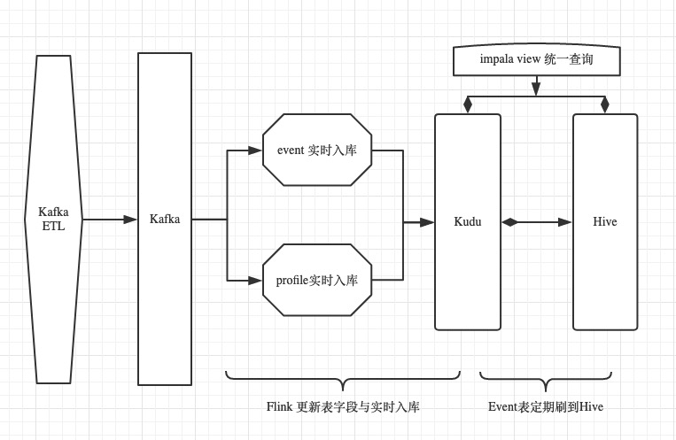
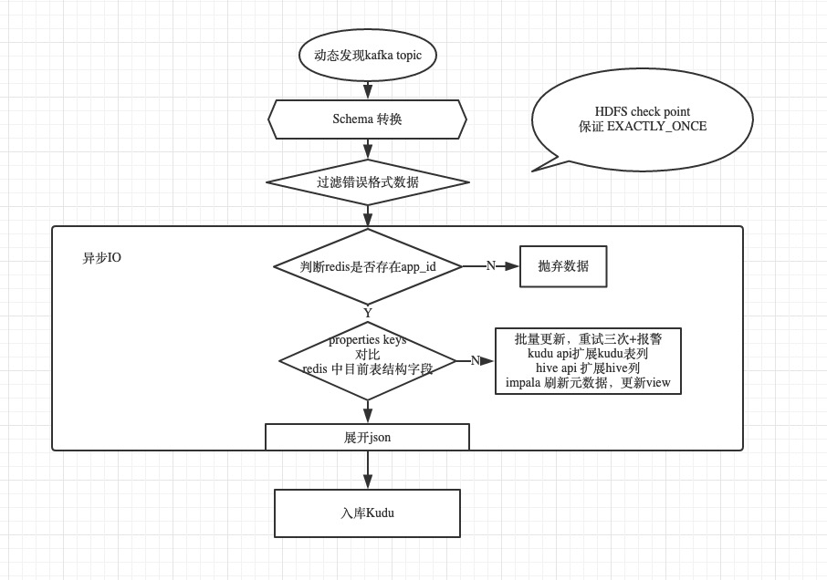

# GA-实时数仓设计文档

## 1、日志打点规范

**json中字段名称都需是合法的变量名包含：大小写字母、数字、下划线，且最大长度不超过100字符 **

```json
{
  "project_id": "6",    // 唯一标示产品
	"client_id": "Android_3.97_360.360,yisdkpay.0-hall6.360.happy",
	"device_id": "552cabde8ec24e3785c55fca32004571",
	"user_id": "617949",
	"event_time": 1565812883357,    // 毫秒值
	"type": "login",   //	区分日志类型
	"event": "sdk_login",
	"properties": {    // 根据前缀sdk_ game_ bi_ 等默认展开100列
			"sdk_system_version": "8.0",
    	"bi_param": "log_param",
      "game_room_id": "50009",
    	"product_id": "6" 
	},
	"lib": {         //sdk打点参数，默认不展开
		"sdk_lib_type": "python"
	}
}
```

## 2、总流程架构



## 3、Kudu/Hive建表逻辑

* Kudu

**数据库为ga_kudu  ， 使用kudu实时插入与可更新特性**

> 根据event日志建立event表，event 表包含充值数据

```mysql
CREATE TABLE if not exists ga_kudu.event_{project_id}_{version}
(  
  part_offset STRING , -- 清洗后含有该字段,Kafka唯一ID
  day STRING,     -- 日志收集时间
  event_time bigint,
  user_id STRING,
  event STRING,   
  project_id STRING,     
  client_id STRING, 
  device_id STRING, 
  type STRING,    
  properties STRING,
  lib STRING 
  PRIMARY KEY(part_offset,day,event_time, user_id, event)  
) 
PARTITION BY
   HASH(user_id) PARTITIONS 16,
   RANGE(day) (
      PARTITION '2019-09-01' <= VALUES < '2019-09-02', -- 今日
      PARTITION '2019-09-02' <= VALUES < '2019-09-03'  -- 明日  
    )
STORED AS KUDU
TBLPROPERTIES(
'kudu.master_addresses'='10.8.26.204:7051');
```

> 根据profile日志与主键ID不同建立users、devices两种表	

```mysql
-- users devices 建表
CREATE TABLE if not exists ga_kudu.users_{project_id}_{version}
( 
  user_id STRING,
  event_time bigint,
  event STRING,   
  project_id STRING,     
  client_id STRING, 
  device_id STRING, 
  type STRING,    
  properties STRING,
  lib STRING,     
  details STRING,
  PRIMARY KEY(user_id)
) 
PARTITION BY HASH(user_id) PARTITIONS 32
STORED AS KUDU
TBLPROPERTIES(
'kudu.master_addresses'='10.8.26.204:7051');
```

* Hive
  **数据库为ga_hive**

```mysql
create table if not exists ga_hive.event_{project_id}_{version}(
  project_id STRING, 
  client_id STRING, 
  device_id STRING, 
  event_id STRING,
  event_time TIMESTAMP,
  type STRING,    
  event STRING,  
  properties STRING,
  lib STRING,     
  details STRING,
  day STRING,     -- 根据event_time转为东八日期
) COMMENT 'hive'
partitioned by (day string, type string)
stored as parquet
```

## 4、View统一查询

**数据库为ga_view,  day默认为东八时区**

* Event

**使用view与滑动窗口模式来屏蔽底层存储细节**

```mysql
CREATE VIEW IF NOT EXISTS ga_view.event_{project_id}_{version} 
AS
  SELECT event_time, user_id, event as event_id, project_id, client_id, device_id, type, properties, lib, details,   from_unixtime(  cast(   (cast(event_time as bigint) + 28800000 ) / 1000  as bigint   ) ,'yyyy-MM-dd') as day
  FROM  ga_kudu.event_{project_id}_{version}
  WHERE day >= '2019-10-10'
  
  UNION ALL
  
  SELECT event_time, user_id, event as event_id, project_id, client_id, device_id, type, properties, lib, details, day
  FROM ga_hive.event_{project_id}_{version}
  WHERE day < '2019-10-10'    ; 
```

- Profile

**考虑到 users devices 量不是特别大，可以全部kudu存储**

```mysql
-- users  view
CREATE VIEW IF NOT EXISTS ga_view.users_{project_id}_{version}
AS
	SELECT event_time, user_id, event as event_id, project_id, client_id, device_id, type, properties, lib, details,   from_unixtime(  cast(   (cast(event_time as bigint) + 28800000 ) / 1000  as bigint   ) ,'yyyy-MM-dd') as day
  FROM  ga_kudu.users_{project_id}
  
-- divices  view  
CREATE VIEW IF NOT EXISTS ga_view.devices_{project_id}_{version}
AS
	SELECT event_time, user_id, event as event_id, project_id, client_id, device_id, type, properties, lib, details,   from_unixtime(  cast(   (cast(event_time as bigint) + 28800000 ) / 1000  as bigint   ) ,'yyyy-MM-dd') as day
  FROM  ga_kudu.devices_{project_id}
```

## 5、实时数仓导入设计方案

### 5.1、Flink导入逻辑设计



****

### 5.2、设计要点

* 端到端的EXACTLY_ONCE
* 自适应Kafka topic变动 与 分区变动
* 保证更新表操作一定成功
* 保证入库一定成功
* 作业监控 与 异常监控

## 6、离线数仓导入设计方案

**热转冷，kudu event 表定期转移数据到hive，使用parquet高效查询特性 **

待开发，准备采用Flink 批处理

### 6.1、逻辑设计

1. 查询Kudu中数据导入到HIve中，配置合理reduce数
2. 移动滑动窗口，更新view边界

### 6.2、设计要点

* 避免Hive表过多小文件
* 更新滑动窗口边界，保证准确
* COMPUTE STATS TABLENAME

## 7、监控模块

### 7.1、日志监控

发现没有存在的project_id , 邮件报警该错误日志

### 7.2、Flink作业监控

* 程序异常监控

关键逻辑步骤设置重试与邮件报警机制

- metric监控

自定义metric监控指标，可以再Flink web UI 查看监控指标状态

- Flink REST API

通过http请求实时获取flink任务状态，不是RUNNING状态则进行邮件报警，达到实时监控的效果

## 8、元数据维护

### 8.1、表元数据

不做特别操作，desc 查看view即可

### 8.2、字段元数据

* Event 

维护project_id下每种type类型下的event类别        与之出现过的      字段名

* Profile

维护project_id下所有出现过的字段

##实时维护元数据信息到redis中##

## 9、准确性与容错性

* 邮件报警机制
*  数据一致性检查  
*  

## 10、未来优化

* 充分测试与猜想错误点，保证上线后功能稳定
* 上线后异常实时捕捉，针对问题改进优化工程
* **单独维护拉链表来保存Profile历史消息**

