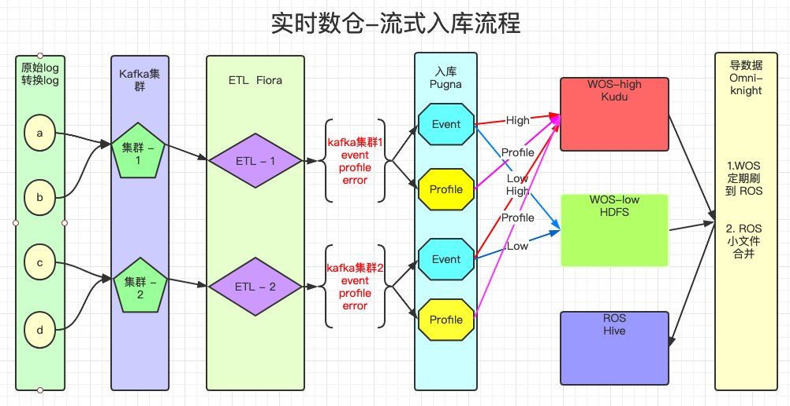
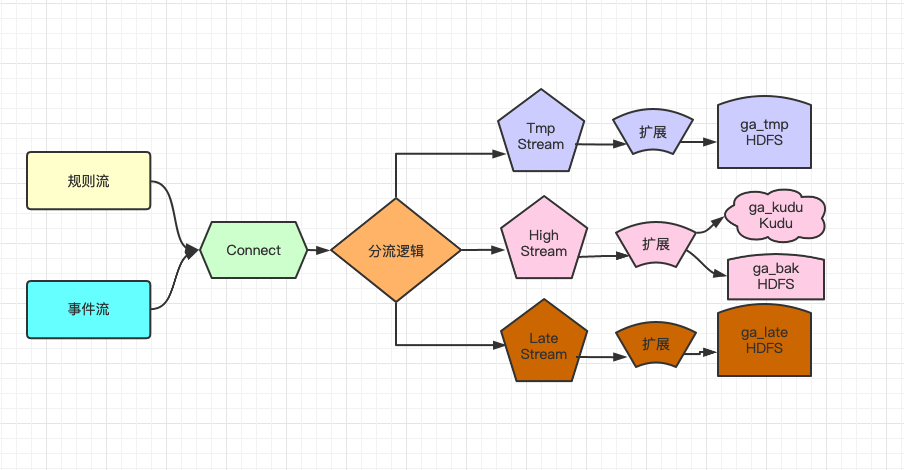

# GA-实时数仓设计文档_v4

## 1. 需求分析

### 1.1、历史原因

>  随之数据量的暴增，数仓V3版本采用全量写HDFS文件，加载到HIVE表的方式来承载数据规模，但是随之而来的弊端有：
>
> 1. 数据刷新间隔为10分钟，导致数据延迟10分钟+
> 2. 写HDFS采用事件分区模型，导致HDFS写线程压力大，有大量文件目录与巨量小文件
> 3. 由于原因2 导致HDFS读线程受影响已经查询速度较为缓慢。 存在CK时间过长文件未关闭提前导数据现象
> 4. 全量事件写HDFS方案，部分核心事件延迟时间项目组不可接受
> 5. 数仓为了承载所有项目组，做了许多让步，项目混合清洗入库相互受影响
> 6. 考虑到以后私有化部署与日志收费，需要对项目组日志量与事件量关心

### 1.2、需求描述

* 数据能够分级入库， 高优先级达到秒级延迟，低优先级小时延迟
* 核心数据完整性100%保证，重复率低于0.01%。日志问题发现处理自动化
* 小文件数严格控制，降低小文件数量80%，文件合并耗时降低40%/天
* 数仓组件深度调研与性能优化，同条件查询较之前提高10%

## 2. 方案设计

### 2.1、整体架构

`目前集群有两套Kafka集群，用于日志分级处理。`



### 2.2、分级规则

* 默认三个核心事件走高优先级
* 需要配置表，配置事件优先级 与  高优先级日志限制条数
* tmp 逻辑 低优先级事件日志中   currentTimeMillis() -  log.event_time  <=  3 days 
* late 逻辑  低优先级事件日志中   currentTimeMillis() -  log.event_time  >  3 days 

### 2.3、分级事件表设计

```mysql
grade_event_config | CREATE TABLE `grade_event_config` (
  `project_id` varchar(255) NOT NULL,
  `max_records` int(11) DEFAULT NULL,
  `default_events` varchar(1000) DEFAULT NULL,   -- 默认事件
  `config_events` varchar(15000) DEFAULT NULL,   -- 可配置事件
  PRIMARY KEY (`project_id`)
) ENGINE=InnoDB DEFAULT CHARSET=utf8mb4 
```

### 2.4、分级设计



## 3. 风险控制/问题解决

### 3.1、 风险控制

#### 3.1.1、事件配置表一致性

> 1. 考虑到数据优先级性，与初始化性，与游戏事件不同问题， 事件分级配置表由  游戏初始化时   默认配置 max_records 5000W条  与  default_events 3个核心事件 ， config_events 用于页面配置那些是高优先级  进行初始化操作
>
> 2. 因为存在游戏不一定含有三个重要事件， 所以GA元数据表单独维护两个字段为  事件等级  与  是否可以编辑 。 在元数据维护时， 三个核心字段就置为高优先级与不可编辑， 其他的操作由页面进行事件分级操作， 其他模块负责两个表数据信息一致

#### 3.1.2、核心事件完整性保证

* 三个核心事件通过自动修复任务处理解决
* 其他高优先级事件通过High Stream 落地HDFS一份进行对比，然后报警与自动修复

### 3.2、问题解决

 **针对V3数仓架构层面存在的问题，此次能够全部解决。**

* Tmp Stream  入HDFS不再做事件分区， 只保留小时分区， 这样小文件数大大降低95%
* 写文件线程降低，来个更快的CheckPoint时间， 这样不会出现CK失败超时问题
* 核心事件查kudu， 小文件降低 ，能够提升impala查询性能

**接下来就需要关注事件数据量与日志内容等方面**

## 4. 服务部署，监控

* 短期方案：     脚本，已部署
* 长期方案：     通过普罗米修斯进行，待完善更新

## 5. 现在不足/未来优化

* 事件数据量 与 日志内容 
* 报表层面优化
* Flink Sql  更方便进行ETL， 多关注中间层建设
* 数据治理， 元数据中心， 指标建设 等数据工具建设