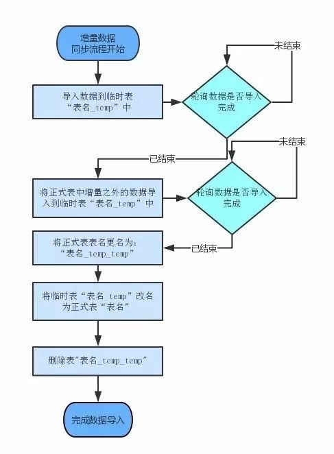

# GA-报表 ON ClickHouse

## 0、历史问题

* 数据查询严重依赖impala， 查询性能不稳定
* 数据更新依赖impala，加剧impala不稳定
* 数据恢复没有工具化
* 指标计算口径问题

**需要回顾新方案能否解决以上几点**

## 1、集群搭建与HA代理


> 通用的场景： 
>
> **LoadBalancer:** LVS。
> **Proxy:** 基于 Openresty 的 Apisix 代理网关，用于熔断，限流，安全，日志等功能。通过这里我们还可以自己开发相关插件，比如 DMP/CDP 使用的自定义插件。
> **Distribute table:** CH 中的分布式表，会关联多个节点中相应的本地分片表。一般用来做查询，用来分发查询请求，对每台节点的结果进行合并，排序等。虽然也能使用分布式表来写入数据，但是会造成性能问题，因此业界分享都是推荐读分布式表，写本地表。
> **CH Shard & Replication:** CH 中分片和复制集。一般多分片，多副本来保证高可用，可扩展性和性能。
> **Zookeeper:** CH 中使用 Zookeeper 来协调分布式方面的操作。业界经验，随着集群节点数目增多，最好是 SSD ZK 专用集群来保证性能。


### 集群部署


**使用的是三分片，两副本形式  **

### 分布式表还是本地表？

* 如果是读分布式表，写本地表。

需要： 反向代理设计与实现 ， 如何轮训到每一台节点。   节点意外上下线处理。

优点：写入性能最佳， 数据均衡

劣势：读取性能略低于本地表

*  如果是本地表

需要： 配置文件控制那些projectId写入到那台机器。 

优点：读取性能最佳

劣势：人工维护， 数据不均衡 

* 写分布式表，读分布式表

> 如果预估自己的业务数据量不大(日增不到百万行), 那么写分布式表和本地表都可以
>
>  比如1000W行数据, CH建议20次,每次50W. 这是MergeTree引擎原理决定的, 频繁少量插入会导致data part过多

优点： CH自己来实现数据均衡

劣势： 消耗CH节点socket链接，CH自己来把数据同步到其他节点上， 节点异常有严重问题。 

分布式表本身是为了读，并不是写。 需要考虑

## 2、数据存储选型

### 2.1、报表涉及数据表与表结构

* base_event   （  uid 纬度 指标 小时 ）

```mysql
-- user_id 
-- platform_id sub_platform_id channel_id sub_channel_id client_id game_id country province city phone_model phone_maker network os_name 
-- event_id 
-- counts 
-- total_amount 
-- dhour  
```

* base_LTV  （  uid 纬度 指标 天）

```mysql
-- user_id 
-- platform_id sub_platform_id channel_id sub_channel_id client_id game_id country province city phone_model phone_maker network os_name 
-- type 
-- total_amount 
-- day
```

* adbox_event  （  uid 纬度 指标 小时）

```mysql
-- user_id 
-- platform_id sub_platform_id channel_id sub_channel_id client_id game_id country province city 

-- counts 
-- total_amount 
-- dhour
```

* 用户分群表  

```mysql
ga_dwm.groups_users_{project_id}
 CREATE TABLE ga_dwm.groups_users_20474 (                                      
   user_id STRING,                                                              
   add_time STRING    )                                                                             
 PARTITIONED BY (   group_name STRING  )                                                                             
 STORED AS TEXTFILE
-- 数据全由业务人员配置定时，进行更新
```

* profile 表 （users  devices   roles)

```mysql
-- 目前存储在kudu上， 各个表结构不定。 表字段属性随时更新，内容值随时更新


CH 无法直接查询， 替代方案有
1） T+1 方案， 每天落地HDFS ， 同步到CH
2） 实时方案， 利用mysql，可以做到实时查询，但是对mysql性能要求高， 查询性能降低
```

### 2.2、CH数据表结构定义 

* 方案一  直接同步拉取落地到CH，每个游戏多张表， 表结构不变， 只改变字段属性与优化索引

优点：CH API维护， 简单实用，  

缺点：后续维护

* 方案二    合并Base Adbox 表结构 ,    加快查询速度

优点：查询快

缺点： join成宽表， 耗时较长， 后续维护复杂

### 2.3、CH数据表引擎

### MergeTree

* ReplacingMergeTree

使得数据有多个副本，可以提高查询性能

* AggregatingMergeTree

可以使用 `AggregatingMergeTree` 表来做增量数据的聚合统计，包括物化视图的数据聚合，加快特定场景下查询性能

## 3、数据读取策略

* 如果是分布式表

* 如果是本地表

## 4、可视化界面与集群状态监控

> https://blog.csdn.net/jmx_bigdata/article/details/109284338
>
> tabix支持通过浏览器直接连接 ClickHouse，不需要安装其他软件，就可以访问ClickHouse，具有以下特点：
>
> - ⾼亮语法的编辑器。
> - ⾃动命令补全。
> - 查询命令执⾏的图形分析⼯具。
> - 配⾊⽅案选项。
>
> 

## 5、暂定可行性计划

> 1. 写入方案：   
>
>    基于DWM层数据量与维护使用便捷性，写入采用本地表，所有游戏初始化到正式集群不同节点上，维护映射关系
>
> 2. 表结构设计
>
>    ```mysql
>    -- DWM表， 合并 base_report  和  adbox_report ， LTV表不使用 （可以从这两个表推算出）
>    
>    create table ga_test.base_report_event_hourly_{project_id} (
>    user_id   LowCardinality(String) -- 低基数string 优化查询性能, 
>    platform_id  LowCardinality(String) , 
>    sub_platform_id   LowCardinality(String) , 
>    channel_id   LowCardinality(String) , 
>    sub_channel_id   LowCardinality(String) , 
>    client_id   LowCardinality(String) , 
>    game_id   LowCardinality(String)  -- LowCardinality 无法插入null值  需要使用默认值！！ , 
>    country   LowCardinality(String)   , 
>    province   LowCardinality(String)  , 
>    city   LowCardinality(String)      , 
>    phone_model   LowCardinality(String)    , 
>    phone_maker   LowCardinality(String)    , 
>    network   LowCardinality(String)    , 
>    os_name   LowCardinality(String)    , 
>    event_id   LowCardinality(String) , 
>    counts  UInt16 ,   -- 一个小时量，可以不用bigint
>    total_amount UFloat32 , -- 一个小时量，可以不用bigint
>    event_time  UFloat32     -- 需要时间转化， 单位秒  
>    ) ENGINE = MergeTree()   
>    PARTITION BY FROM_UNIXTIME(event_time, '%Y-%m-%d')    
>    ORDER BY event_time， event_id    
>      
>    -- 用户分群表  
>    使用 HDFS 引擎表， 查询时射影下推到HDFS， 保证更新及时
>      
>    -- Profile
>    暂定一天一导出HDFS， 同步到 CH 中  
>    ```


## 二、趋势分析第三次会议——功能模块设计文档初版

## 1、项目初始化

### 1.1、 怎么分

* 根据目前体量排序后进行轮训分配
* 后续继续轮训分配

**新机器加入怎么办？ ** ——  需要手动维护与迁移

### 1.2、 映射结构维护

维护在redis  index = 1 .    

```mysql
key   =  projectId_clickhouse_map
value =  {"100010":"jdbc:clickhouse://10.8.26.207:8123/ga_test"}
```

## 2、数据插入更新与故障恢复策略

### 2.1、插入更新策略

| 数据源                                | 维护间隔         | 维护逻辑                                                     |
| ------------------------------------- | ---------------- | ------------------------------------------------------------ |
| DWM 表 （base_event  和 adbox_event ) | Spark  每小时    | 1 本次增量数据写入临时表（表名__temp）<br/>2 正式表中本次增量之外的数据写入临时表（表名_temp）<br/>3 正式表改名（表名_temp_temp)<br/>4 临时表改名 (表名)<br/>5 删除临时表（表名_temp_temp) |
| 用户分群                              | HDFS引擎查询下推 | 用户分群修改表结构                                           |
| Profile                               | Spark  每天      | 1 本次增量数据写入临时表（表名_temp）<br/>2 正式表改名（表名_temp_temp)<br/>3 临时表改名 (表名)<br/>4 删除临时表（表名_temp_temp) |



### 2.2、插入过程监控与预警

#### 2.2.1 携程做法

> 由于数据量大，数据同步的语句经常性超时。为保证数据同步的每一个过程都是可监控的，我们没有使用ClickHouse提供的JDBC来执行数据同步语句，所有的数据同步语句都是通过调用ClickHouse的RestfulAPI来实现的。
>
> 调用RestfulAPI的时候，可以指定本次查询的QueryID。在数据同步语句超时的情况下，通过轮询来获得某QueryID的执行进度。这样保证了整个查询过程的有序运行。在轮询的过程中，会对异常情况进行记录，如果异常情况出现的频次超过阈值，JOB会通过短信给相关人员发出预警短信。

#### 我们需要

* 数据插入预警


* 数据准确性预警


### 2.3、故障恢复策略

#### 事前：

> * 新版本需要进行压测 ！！，针对写入性能 写入量 与 查询并发度
> * 故障演练 ？ 

#### 事中：

> 预警尽快针对处理 ： ？
>
> 旧版逻辑不停，持续运行

#### 事后：

> 故障复盘 与 讨论修复


## 3、下阶段目标

* 能够全流程跑起来


## 三： 趋势分析第四次会议—表结构与数据插入更新逻辑终版

## 1.数据分类与插入更新需求

| 数据源分类                   | 更新需求                                                     |
| ---------------------------- | ------------------------------------------------------------ |
| **'login', 'regist', 'pay'** | 1. 每小时     从DWD表增量同步                                |
| **'adbox'**                  | 1. 每小时/每天三次   更新最近10天全量数据                    |
| **校验与修复**               | 1. 每天校验历史十天，重刷  'login', 'regist', 'pay'         ADbox 目前没有校验 |

### 方案一：

> 每次更新上下线删除更新方案

| 数据源分类                   | 更新步骤                                        |
| ---------------------------- | ----------------------------------------------- |
| **'login', 'regist', 'pay'** | 1. DWD-> Kafka -> 两台CK本地表                  |
| **'adbox'**                  | 1. 两台节点依次 下线-> delete -> insert -> 上线 |
| **校验与修复**               | 1. 两台节点依次 下线-> delete -> insert -> 上线 |

### 方案二：

> 数据插入数据多版本方案  ，  更新时删除无用数据

```mysql
argMax 它能够按照 field2 的最大值取 field1 的值。

SELECT
        user_id,
        platform_id,
        sub_platform_id,
        channel_id,
        sub_channel_id,
        client_id,
        game_id,
        country,
        province,
        city,
        phone_model,
        phone_maker,
        network,
        os_name,
        event_id,
        event_time,
        argMax(counts, data_version) AS counts, 
        argMax(total_amount, data_version) AS total_amount, 
        max(data_version) AS now_data_version
    FROM merge_trend_1 
    GROUP BY user_id, platform_id, sub_platform_id, channel_id, sub_channel_id, client_id, game_id, country, province, city, phone_model, phone_maker, network, os_name, event_id, event_time
    
    
user_id    event_time  event_id   data_version	 total_amount   counts

1   					01		   adbox			2021-01-01_12_00 		 100				10
1   					02		   adbox			2021-01-01_12_00 		 200				20

1   					01		   adbox			2021-01-01_12_01  	100				10
1   					02		   adbox			2021-01-01_12_01  	200				20    

```


| 数据源分类                   | 更新步骤                                                     |
| ---------------------------- | ------------------------------------------------------------ |
| **'login', 'regist', 'pay'** | 1. DWD-> Kafka -> 两台CK本地表                               |
| **'adbox'**                  | 1. DWD-> Kafka （多版本数据） -> 两台CK本地表                |
| **校验与修复**               | 1. DWD-> Kafka （多版本数据） -> 两台CK本地表     2,  定期删除历史版本数据 |


