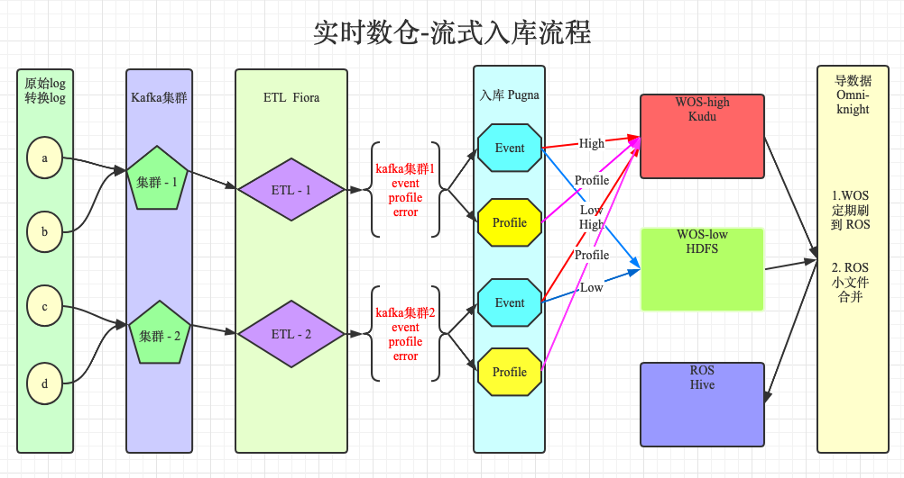
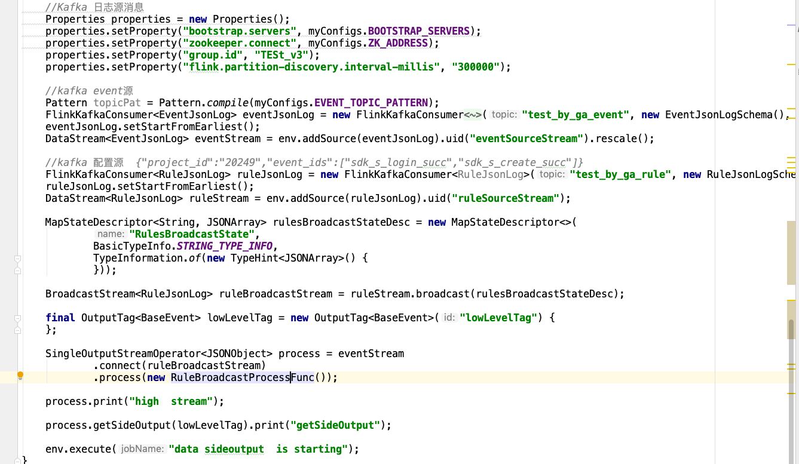
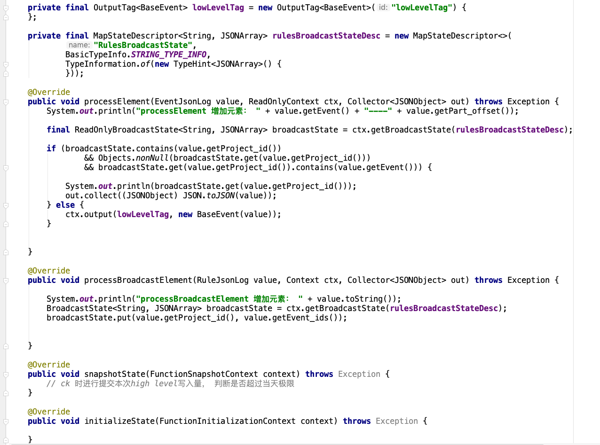

# 数据分级流程蓝图

> **数据入库 （ 源日志、转化日志  ->  ETL  ->  分级入库 ->  导入ROS  ）保证的重点功能 ：**
>
> ​			**数据分级·流式模型下，各自模块功能的稳定性与可靠性   **
>
> **数据报表 （ 基础事件报表，LTV报表，广告报表 ）保证的重点功能 ：**
>
> ​            **更换调度模型， 更换数据执行模型， 保障数据准确性与可靠性    **
>
> **全流程监控 与 故障恢复  ** 
>
> ​			 **小时级别构建全流程监控报警（增加电话报警）恢复操作文档，人员互相备份，减少故障恢复时间            **
>
> **数仓查询性能提升**
>
> ​             **数仓组件深度调研与性能优化，    十天内小文件合并 **
>
> ​          

## 0、Kafka 拆分后，入库流程图




## 1、分级管控界面与接口

```json
-- GA出界面配置游戏分级事件名称与条数限制 （ 界面位置 ？ 流程 ？   修改权限 ？  ）
-- 后端存储mysql ，游戏分级事件名称与条数限制， 格式如：
{"project_id":"20249","event_ids":["sdk_s_login_succ","sdk_s_create_succ","recharge"],"log_limit":50000000}

-- 当前已经使用条数、当天重要事件已使用条数     等内容展示
```

## 2、ETL-Fiora

> 在两套集群环境中消费 ga_log_* ,  每个游戏消费后写出 event 、 profile 、 error topic 。
>
> 其中 error topic 需要配套一个监控预警， 可以发现一些问题
>
> 

1. ETL 采用flink 重构

* 优点 ： ETL不用初始化，消费能力随资源量提升 
* 弊端：  意外重启后存在数据重复消费问题    ----->     导数据进行去重 （ 调研flink sql ）

2. error  topic 格式 与监控预警
3. 

## 3、入库-Pugna

> Event 入库 （需要数据分级）  涉及组件有    redis、zk、ga_kudu、ga_tmp、ga_hive、ga_view
>
> *  数据首先进行扩展字段处理（ga_kudu、ga_hive、ga_view 需要扩展 , ga_tmp 不需要扩展）， 然后再进行数据分流， 需要配置动态规则：事件名与条数限制
> * 分流后  high level  入库kudu ,  low level  写入hdfs , 一小时刷出间隔 
> * ga_view 只包含  ga_kudu 与 ga_hive 数据。 
> * ga_kudu 暂定1天一刷出（后续待定， 数据量查询速度是否可接受， 可以再优化）
> *  ga_tmp 1小时写入，1小时刷入，导数据保证两个小时延迟
> * 需要保证数据入库准确性   与 kudu 集群、表性能等调优
>
> Profile 入库 （暂无变动）
>
> 重构ga_ods， 采用flink 或调研flink sql  直接分游戏分天分事件落地hive表， 做实时与离线数据对比 与故障恢复使用

**广播流，动态更改规则**



**数据分流**



## 4、导数据-Omni-Knight

> 1. 需要读取  ga_kudu 、 ga_tmp  数据 导入到  ga_hive
> 2. ga_hive 小文件合并机制运行与优化 
> 3. 保障稳定性，故障恢复流程化，文档化， 可以多人操作


## 5、数仓组件优化

* kudu 表， 默认配置优化  


## 6、调度任务 与 spark/flink SQL执行引擎

* 梳理GA现有工作任务， 文档化，   是否可以落地到新的调度任务中
* 中间表、用户分群、导数据任务 执行引擎更换。    是否可以采用flink sql 执行