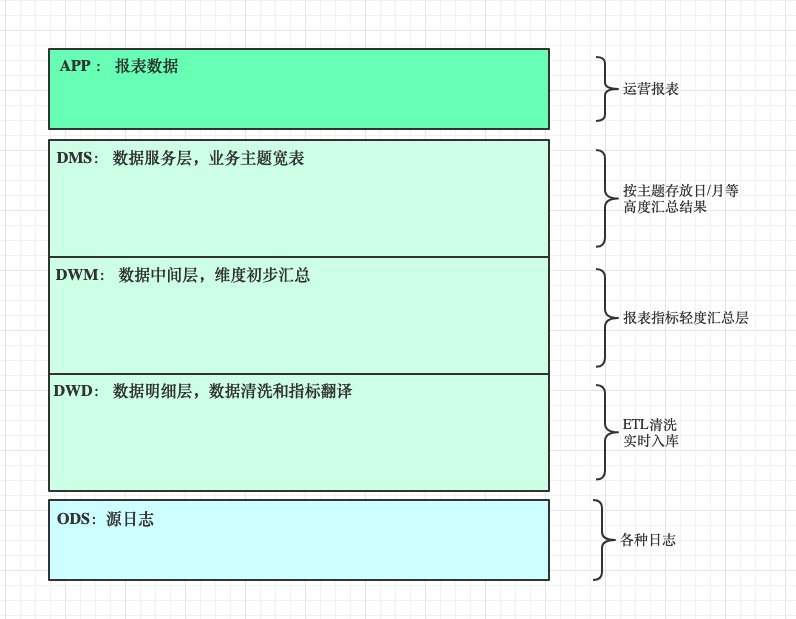

# GA报表-技术方案文档

## 1、需求描述

**GA报表页面->自定义指标项与维度项组合查看数据，要求支持自由切时区与最大粒度实时**

> 具体计算项如下
>
> 指标：
> 	用户量：注册、DAU、登录次数
> 	付费：付费金额、付费人数、付费率、注册且付费、注册且付费金额、arpu、arppu
>
> ​	LTV：当日LTV、2日LTV、3日LTV、、、15日LTV、30日LTV、45日LTV、60日LTV、90日LTV
>
> ​	留存：2日留存、3日留存、、、15日留存、30日留存、45日留存、60日留存
>
> 维度：
> 	固定维度：	地域（国家）、渠道、子渠道、client ID、系统（安卓/iOS）
>
> ​	扩展维度：   买量渠道（ads、 AF、 特征库 ）

## 2、需求分析

分析需求后可知，需要计算人数与人次指标。结合以前技术与经验，可以分析存储计算类型可为

1. 人数可以采用bitmap进行计算，需要实时构建bitmap，查询时再自由组合
2. 人次计算由于涉及维度自由组合过多，不能预先计算
3.  LTV可以不支持切时区（或主副两个时区），用临时表方案计算多日LTV
4. 这些指标所对应的event值 与 维度值都是GA系统日志中的固定字段，只需统计这些数据
5. 需要缓存存储历史不变值

考虑后可行方案如下

* Kylin高性能查询，但是实时性不太好，数据存储与数仓冗余
* 实时引擎计算bitmap存储Hbase，人数查询bitmap+缓存出结果， 人次进行实时+缓存
* 从实时导入的kudu表中，抽取出所需信息，部分聚合，Impala查询中间表组合出结果数据

**综合衡量利弊后，采用第三种方案，细节讨论完毕后，正式规划方案如下**

* **报表数仓：DWM层存储**

  > 从DWD层轻度汇总指标数据，保证数仓的准确性与一致性，保障数据的便捷查询

* **报表接口：SpringBoot服务**

  > 缓存模块：
  >
  > ​		分析常用功能，预计算数据、结果存储
  >
  > ​	 	涉及缓存数据的存储、更新、与定时计算

  > 查询模块：
  >
  > ​		基于impala + 数据仓库
  >
  > ​		涉及服务可用性与资源性能

## 3、报表数仓·设计方案

### 3.1、GA数仓规划

报表数仓结合实时数仓，目前数仓结构如下



### 3.2、报表数仓模型

* 非LTV指标

维护login,regist,pay在基本维度下的小时汇总值，达到每小时每个event_id下只有一条user_id数据

```mysql
user_id	 基本维度  ...	  event_id   count(1)   sum(event_field)    天_小时分区    
 111     	 中国				  	login			  5             0             2019-11-11_01
 111     	 中国				  	 pay			  2            100            2019-11-11_01
 222     	 巴黎			  	  regist			1             0             2019-11-11_01
 
-- 那么统计dau ：
select country,count(user_id) from dwm._ where event_id = 'login' and  day='..'

-- 那么统计次数 ：
select country,sum(count(1)) from dwm._ where event_id = 'pay' and  day='..'

-- 那么统计金额 ：
select country,sum(sum(event_field))from dwm._ where event_id = 'pay' and day='..'
```

* LTV指标

每天维护截止到当前日期每个用户的累积充值情况，以天做分区

```mysql
user_id    基本维度  ...   sum(amount)     day分区
  111			  中国			       6					2019-11-10
  222       中国      	  	 6          2019-11-10
  111				中国		  		   50					2019-11-11
  222       中国    	       6          2019-11-11

-- 那么查询LTV时，关联Profile表，找出注册日期，datediff出指定日期即可
```

### 3.3、报表数仓设计

#### 3.3.1、GA数仓命名规则

* GA数仓分层一览图

<table>
  <tr align="center">
    <th>层级</th>
    <th>database</th>
    <th>Event</th>
    <th>Profile</th>
  </tr>
  <tr align="center">
    <td>VIEW</td>
    <td>ga_view</td>
    <td>event_{project_id}</td>
    <td>users/devices_{project_id}</td>
  </tr>
  <tr align="center">
    <td >DWS</td>
    <td>ga_dws</td>
    <td></td>
    <td></td>
  </tr>
  <tr align="center">
    <td rowspan="3">DWM</td>
    <td rowspan="3">ga_dwm</td>
    <td>base_report_event_hourly_{project_id}</td>
    <td></td>
  </tr>
  <tr align="center">
    <td>base_report_order_daily_{project_id}</td>
    <td></td>
  </tr>
   <tr align="center">
    <td>groups_{project_id}_{names}</td>
    <td></td>
  </tr>
  <tr align="center">
    <td rowspan="2">DWD</td>
    <td>ga_kudu</td>
    <td>event_{project_id}</td>
    <td>users/devices_{project_id}</td>
  </tr>
  <tr align="center">
    <td>ga_hive</td>
    <td>event_{project_id}</td>
    <td></td>
  </tr>
   <tr align="center">
    <td>DIM</td>
    <td>ga_dim</td>
    <td></td>
    <td></td>
  <tr align="center">
    <td>TMP</td>
    <td>ga_tmp</td>
    <td>event_{project_id}_{day}</td>
    <td></td>
  </tr>
</table>

* 词根命名规范

固定单词含义，统一既定事物的名称

* 表名命名规范

**分层前缀[dwd|dwm|dws|dim|tmp].主题域_业务域_粒度__XXX_**

* 注意事项

**DWD、DIM统一接入配置**

**TMP、DWM、DWS、VIEW可以在符合规则前提下自由建表**

#### 3.3.2、表设计

```mysql
-- 非LTV指标      ？？ 不兼容device_id role_id 查看， 定制  ？？

CREATE TABLE ga_dwm.base_report_event_hourly_{project_id}(
user_id string,
platform_id string ,
sub_platform_id string ,
channel_id string ,
sub_channel_id string ,
client_id string ,
game_id string ,
country string ,
province string ,
city string ,
phone_model string ,
phone_maker string ,
network string ,
os_name string ,
event_id string,    -- event_id 为字符串login ，regist， pay   数字？
counts string,      -- 人次
total_amount string)   -- 小时充值金额
PARTITIONED BY ( dhour string)
STORED AS parquet  ;

-- LTV指标       是否需要主副时区？？
CREATE TABLE ga_dwm.base_report_order_daily_{project_id}(
user_id string,
platform_id string ,
sub_platform_id string ,
channel_id string ,
sub_channel_id string ,
client_id string ,
game_id string ,
country string ,
province string ,
city string ,
phone_model string ,
phone_maker string ,
network string ,
os_name string ,
total_amount string)      -- 当天总充值金额
PARTITIONED BY ( day string)
STORED AS parquet  ;
```

#### 3.3.3、生成规则

**ga_kudu 增加入库hour,  ga_view增加实际hour**

* base_report_event_hourly_{project_id}

1. 遍历ga_kudu下所有event表，并行执行以下逻辑

2. 查看前一个小时数据，根据event_time转换出day，hour

3. impala根据时间倒序从ga_view.event_{project_id}覆盖更新到ga_dwm表下
4. 涉及非当天前一小时数据信息，发送删除历史结果数据到缓存接口

```mysql
insert overwrite table ga_dwm.base_report_event_hourly_{project_id} partition (dhour ) 
select  user_id ,platform_id, sub_platform_id, channel_id, sub_channel_id, client_id, game_id, country, province, city,	phone_model, phone_maker, network, os_name, 'login' as event_id , count(1) as counts, 0 as total_amount , concat('_',hour ,day ) as dhour 
from ga_view.event_{project_id}
where day = '2019-11-11' and hour = '15'   and event in ('pj_login_success')  
group by user_id,platform_id, sub_platform_id, channel_id, client_id, game_id, country, province, city,	phone_model, phone_maker, network ,event_id,total_amount, dhour

union all
'sdk_create_success'
union all
'pay_success'

```

* base_report_order_daily_{project_id}

1. 遍历ga_kudu下所有event表，顺序/并行  执行以下逻辑
2. ga_view   day =  T-1 天基本维度充值汇总 +   该表T-2 天基本维度充值汇总    
3. 合并覆盖导入为  T-1天充值汇总 
4. 发送删除T-1 天数据

```mysql
insert overwrite table ga_dwm.base_report_order_daily_{project_id} partition (day) 
select user_id, platform_id, sub_platform_id, channel_id, sub_channel_id, client_id, game_id, country, province, city,	phone_model, phone_maker, network, os_name ,sum(total_amount) as total_amount 
from 	
	(select user_id, platform_id, sub_platform_id, channel_id, sub_channel_id, client_id, game_id, country, province, city,	phone_model, phone_maker, network, os_name,  sum(amount) as total_amount
	from ga_view.event_{project_id} where day = 'T-1'  and type = 'order'
	group by   user_id, platform_id, sub_platform_id, channel_id, sub_channel_id, client_id, game_id, country, province, city,	phone_model, phone_maker, network, os_name

	union all 

	select user_id, platform_id, sub_platform_id, channel_id, sub_channel_id, client_id, game_id, country, province, city,	phone_model, phone_maker, network, os_name,  total_amount
	from ga_dwm.base_report_order_daily_{project_id} where day = 'T-2') a 

group by   user_id, platform_id, sub_platform_id, channel_id, sub_channel_id, client_id, game_id, country, province, city,	phone_model, phone_maker, network, os_name
```

#### 3.3.4、部署与安全性

* oozie 调度   --->   重跑数据简单   --->   Java 工程

## 4、报表服务-缓存模块·设计方案

### 4.1、


### 4.2、


### 4.3、


## 5、报表服务-查询模块·设计方案

### 5.1、


### 5.2、


### 5.3、


## 6、性能优化


## 7、未来优化