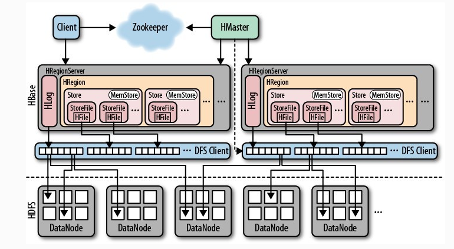
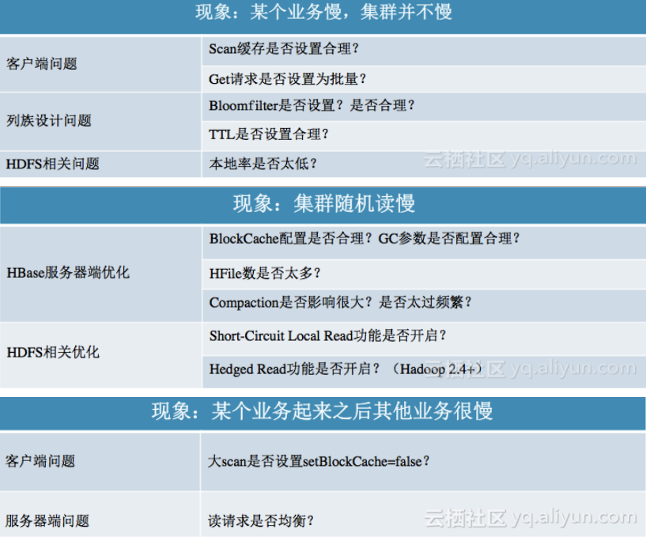

# Hbase 总结

HBase 是一个分布式，可扩展，面向列的适合存储海量数据的数据库，其最主要的功能是解决海量数据下的实时随机读写的问题。 通常依赖 **HDFS**做为底层分布式文件系统，

有赞技术博客 https://tech.youzan.com/hbase-read-optimization-practice/

## 1、架构



HBase 数据存储基于 LSM 架构。

> LSM 被很多存储产品作为存储结构，比如 [Apache HBase](https://link.jianshu.com/?t=https://hbase.apache.org/), [Apache Cassandra](https://link.jianshu.com/?t=http://cassandra.apache.org/), MongoDB 的 [Wired Tiger](https://link.jianshu.com/?t=http://source.wiredtiger.com/2.3.1/lsm.html)存储引擎, [LevelDB](https://link.jianshu.com/?t=https://github.com/google/leveldb)存储引擎, [RocksDB](https://link.jianshu.com/?t=https://github.com/facebook/rocksdb)存储引擎等。
>
> 核心思想的核心就是放弃部分读能力，换取写入的最大化能力。LSM Tree ，这个概念就是结构化合并树的意思，它的核心思路其实非常简单，就是假定内存足够大，因此不需要每次有数据更新就必须将数据写入到磁盘中，而可以先将最新的数据驻留在内存中，等到积累到最后多之后，再使用归并排序的方式将内存内的数据合并追加到磁盘队尾(因为所有待排序的树都是有序的，可以通过合并排序的方式快速合并到一起)。
>
> 简单地说，LSM 的设计目标是提供比传统的 B+ 树更好的**写性能**。LSM 通过**将磁盘的随机写转化为顺序写来提高写性能 ，而付出的代价就是牺牲部分读性能**、**写放大（B+树同样有写放大的问题，写放大为compaction中多次读取）**。
>
> LSM 相比 B+ 树能提高写性能的本质原因是：外存——**无论磁盘还是 SSD**，其随机读写都要慢于顺序读写。
>
> --优化LSM树
>
> **LSM Tree优化方式：**
>
> a、Bloom filter（布隆过滤器）: 就是个带随即概率的bitmap,可以快速的告诉你，某一个小的有序结构里有没有指定的那个数据的。于是就可以不用二分查找，而只需简单的计算几次就能知道数据是否在某个小集合里啦。效率得到了提升，但付出的是空间代价。
>
> b、compact:小树合并为大树:因为小树他性能有问题，所以要有个进程不断地将小树合并到大树上，这样大部分的**老数据**查询也可以直接使用log2N的方式找到，不需要再进行(N/m)*log2n的查询了

解读一： 数据先顺序写入 HLog，默认情况下 RegionServer 只有一个 Hlog 实例，之后再写入 **HRegion**的 **MemStore**之中。**HRegion**是一张 HBase 表的一块数据连续的区域，数据按照 rowkey 字典序排列，RegionServer 管理这些 HRegion 。当MemStore达到阈值时触发flush操作，刷写为一个 **HFile**文件，众多 HFile 文件会周期性进行 major， minor compaction 合并成大文件。所有 HFile 与日志文件都存储在HDFS之上。

解读二： HBase底层依赖HDFS，通过DFS Cilent进行HDFS操作。**HMaster**负责把HRegion分配给HRegionServer，每一个HRegionServer可以包含多个HRegion，**多个HRegion共享HLog，HLog用来做灾难恢复**。**每一个HRegion由一个或多个Store组成**，**一个Store对应表的一个列族**，每个Store中包含与其对应的MemStore以及一个或多个StoreFile（是实际数据存储文件HFile的轻量级封装），MemStore是在内存中的，保存了修改的数据，MemStore中的数据写到文件中就是StoreFile。

解读三：https://blog.csdn.net/Dante_003/article/details/79135031  **简明扼要分析方方面面**

### rowkey 设计原则

* #### rowkey长度原则  8字节的整数倍

* #### rowkey散列原则

* #### rowkey唯一原则   加盐 /  预分区  /  哈希  / 反转

### rowkey 设计实战

**在做Rowkey设计时，请先考虑业务是读比写多、还是读比写少， ！！！     HBase本身是为写优化的，即便是这样，也可能会出现热点问题，而如果我们读比较多的话，除了考虑以上Rowkey设计原则外，还可以考虑HBase的Coprocessor甚至elastic search结合的方法，无论哪种方式，都建议做实际业务场景下数据的压力测试以得到最优结果。 **

* 设计订单状态表时使用：Rowkey: reverse(order_id) + (Long.MAX_VALUE – timestamp)，
  这样设计的好处一是通过reverse订单号避免Region热点，二是可以按时间倒排显示。

* 设计event事件的Rowkey为：**两位随机数Salt + eventId + Date + kafka的Offset**

设计加盐的目的是为了增加查询的并发性，假如Salt的范围是0~n，那我们在查询的时候，可以将数据分为n个split同时做scan操作。经过我们的多次测试验证，增加并发度能够将整体的查询速度提升5～20倍以上。随后的eventId和Date是用来做范围Scan使用的。在我们的查询场景中，大部分都是指定了eventId的，因此我们把eventId放在了第二个位置上，同时呢，eventId的取值有几十个，通过Salt + eventId的方式可以保证不会形成热点。
 这样的rowkey设计能够很好的支持如下几个查询场景：
 **1、全表scan**
 在这种情况下，我们仍然可以将全表数据切分成n份并发查询，从而实现查询的实时响应。
 **2、只按照event_id查询**
 **3、按照event_id和date查询**

## 2、读解析

一次由客户端发起的完成的读流程，可以分为两个阶段。第一个阶段是客户端如何将请求发送到正确的 RegionServer 上，第二阶段是 RegionServer 如何处理读取请求。

### 2.1、客户端如何将请求发送到正确的 RegionServer 上

```java
// 表由多个HRegion组成，HRegion会在RegionServer上提供读写服务客户端发送请求到
// RegionServer需要知道HRegion的元数据信息，信息保存在hbase:meta 这张系统表之内，这张表也在某一个 RegionServer 上提供服务，而这个信息至关重要，是所有客户端定位 HRegion 的基础所在。这个映射信息是存储在 zookeeper 上面

我们以单条 rowkey 的 Get 请求为例，当用户初始化到 zookeeper 的连接之后，并发送一个 Get 请求时，需要先定位这条 rowkey 的 HRegion 地址。如果该地址不在缓存之中，就需要请求 zookeeper (箭头1)，询问 meta 表的地址。在获取到 meta 表地址之后去读取 meta 表的数据来根据 rowkey 定位到该 rowkey 属于的 HRegion 信息和 RegionServer 的地址(箭头2)，缓存该地址并发 Get 请求点对点发送到对应的 RegionServer(箭头3)，至此，客户端定位发送请求的流程走通
```

1.Client通过访问ZK来请求目标数据的地址。
2.ZK中保存了-ROOT-表的地址，所以ZK通过访问-ROOT-表来请求数据地址。
3.同样，-ROOT-表中保存的是.META.的信息，通过访问.META.表来获取具体的RS。
4..META.表查询到具体RS信息后返回具体RS地址给Client。
5.Client端获取到目标地址后，然后直接向该地址发送数据请求。

上述过程其实是一个三层索引结构，从ZK获取-ROOT-信息，再从-ROOT-获取.META.表信息，最后从.META.表中查到RS地址后缓存。
1.既然ZK中能保存-ROOT-信息，那么为什么不把.META.信息直接保存在ZK中，而需要通过-ROOT-表来定位？     ---> 考虑到文件太大
2.Client查找到目标地址后，下一次请求还需要走ZK —> -ROOT- —> .META.这个流程么？     ---> 有缓存

### 2.2、 RegionServer 如何处理读取请求

HBase 数据的组织架构，首先 Table 横向切割为多个 HRegion ，按照一个列族的情况，每一个 HRegion 之中包含一个 MemStore 和多个 HFile 文件。

用户需要知道给定一个 rowkey 可以根据索引结合二分查找可以迅速定位到对应的数据块即可。结合这些背景信息，我们可以把一个Read请求的处理转化下面的问题：如何从一个 MemStore，多个 HFile 中获取到用户需要的正确的数据（默认情况下是最新版本，非删除，没有过期的数据。同时用户可能会设定 filter ，指定返回条数等过滤条件） 


### 2.3 读优化

#### 2.3.1 客户端层面

**Get 请求优化**

- 将 Ge t请求批量化，减少 rpc 次数，但如果一批次的 Get 数量过大，如果遇到磁盘毛刺或者 Split 毛刺，则 Get 会全部失败（不会返回部分成功的结果），抛出异常。 
- 指定列族，标识符。这样可以服务端过滤掉很多无用的 scanner，减少 IO 次数，提高效率，该方法同样适用于 Scan。

**Scan 请求优化**

- 设定合理的 startRow 与 stopRow 。如果 scan 请求不设置这两个值，而只设置 filter，则会做全表扫描。
- 设置合理的 caching 数目， scan.setCaching(100)。 因为 Scan 潜在会扫描大量数据，因此客户端发起一次 Scan 请求，实际并不会一次就将所有数据加载到本地，而是分成多次 RPC 请求进行加载。默认值是100。用户如果确实需要扫描海量数据，同时不做逻辑分页处理，那么可以将缓存值设置到1000，减少 rpc 次数，提升处理效率。如果用户需要快速，迭代地获取数据，那么将 caching 设置为50或者100就合理。 

#### 2.3.2 服务端层面

相对于客户端，服务端优化可做的比较多，首先我们列出有哪些点会影响服务端处理读请求。

- gc 毛刺
- 磁盘毛刺
- HFile 文件数目
- 缓存配置
- 本地化率
- Hedged Read 模式是否开启
- 短路读是否开启
- 是否做高可用 

### 2.4、阿里推荐读优化

> https://developer.aliyun.com/article/685914?utm_content=g_1000136770



## 3、写解析

本文从 HBase 写链路开始分析，然后针对少量随机读和海量随机写入场景入手，全方面量化分析各种资源的开销, 从而做到以下两点：

1. 在给定业务量级的情况下，预先评估好集群的合理规模 
2. 在 HBase 的众多参数中，选择合理的配置组合

### 3.1、写链路

* Memstore 内存中的 Map, 保存随机的随机写入，待 memstore 达到一定量的时候会异步执行 flush 操作，在 HDFS 中生成 HFile 中
* 按照写入顺序，把数据写入一份到 HDFS 的 WAL（Write Ahead Log）中，用来保证数据的可靠性，即在异常（宕机，进程异常退出）的场景下，能够恢复 Memstore 中还没来得及持久化成 HFile 的数据.

```
WAL(Write-Ahead Logging)是一种高效的日志算法，几乎是所有非内存数据库提升写性能的不二法门，基本原理是在数据写入之前首先顺序写入日志，然后再写入缓存，等到缓存写满之后统一落盘。之所以能够提升写性能，是因为WAL将一次随机写转化为了一次顺序写加一次内存写。提升写性能的同时，WAL可以保证数据的可靠性，即在任何情况下数据不丢失。假如一次写入完成之后发生了宕机，即使所有缓存中的数据丢失，也可以通过恢复日志还原出丢失的数据。
```

### HBase之Memstore刷写

https://blog.csdn.net/u014297175/article/details/47975875

### 3.2、写入过快， 来不及flush的后果

> https://www.jianshu.com/p/421aa996c7ff

**整个写入流程从客户端调用API开始，数据会通过protobuf编码成一个请求，通过scoket实现的IPC模块被送达server的RPC队列中。最后由负责处理RPC的handler取出请求完成写入操作。写入会先写WAL文件，然后再写一份到内存中，也就是memstore模块，当满足条件时，memstore才会被flush到底层文件系统，形成HFile。**

## 4、Flush & Compaction

，其中 HFile 是 HBase 数据持久化的最终形态, 本节将介绍 HBase 如何生成 HFile 和管理 HFile。关于 HFile， 主要涉及到两个核心操作：

1. Flushing 
2. Compaction

**HBase 的写入最先会放入内存中，提供实时的查询，当 Memstore 中数据达到一定量的阈值（128MB），会通过 Flush 操作生成 HFile 持久化到 HDFS 中，随着用户的写入，生成的 HFile 数目会逐步增多，这会影响用户的读操作，同时也会系统占用（HDFS 层 block 的数目， regionserver 服务器的文件描述符占用）， region split 操作，region reopen 操作也会受到不同程度影响**。 HBase 通过 Compaction 机制将多个 HFile 合并成一个 HFile 以控制每个 Region 内的 HFile 的数目在一定范围内， 当然 Compaction 还有其他的作用，比如数据本地化率，多版本数据的合并，数据删除标记的清理等等，本文不做展开。

HBase 中 Flush 操作和 Compaction 操作和读写链路是由独立线程完成的，互不干扰。

>  小范围的HFile文件合并，称之为Minor Compaction，一个列族中将所有的HFile文件合并，称之为Major Compaction。

### 4.1、Flush

https://blog.csdn.net/u010039929/article/details/74253093

https://blog.csdn.net/yuexianchang/article/details/80434741

**Memstore级别限制**：

当Region中任意一个MemStore的大小达到了上限（hbase.hregion.memstore.flush.size，默认128MB），会触发Memstore刷新。
**Region级别限制**：

当Region中所有Memstore的大小总和达到了上限（hbase.hregion.memstore.block.multiplier * hbase.hregion.memstore.flush.size，默认 2* 128M = 256M），会触发memstore刷新。
**Region Server级别限制**：

当一个Region Server中所有Memstore的大小总和达到了上限（hbase.regionserver.global.memstore.upperLimit ＊ hbase_heapsize，默认 40%的JVM内存使用量），会触发部分Memstore刷新。

Flush顺序是按照Memstore由大到小执行，先Flush Memstore最大的Region，再执行次大的，直至总体Memstore内存使用量低于阈值（hbase.regionserver.global.memstore.lowerLimit ＊ hbase_heapsize，默认 38%的JVM内存使用量）。
当一个Region Server中HLog数量达到上限（可通过参数hbase.regionserver.max.logs配置）时，系统会选取最早的一个 HLog对应的一个或多个Region进行flush
**HBase定期刷新Memstore**：默认周期为1小时，确保Memstore不会长时间没有持久化。为避免所有的MemStore在同一时间都进行flush导致的问题，定期的flush操作有20000左右的随机延时。
手动执行flush：用户可以通过shell命令 flush ‘tablename’或者flush ‘region name’分别对一个表或者一个**Region进行flush**。

### 4.2、Compaction

**触发 Compaction 的时机有以下几种**：

- 通过 CompactionChecker 线程来定时检查是否需要执行 compaction（RegionServer 启动时在 initializeThreads() 中初始化），每隔10000秒（可配置）检查一次
- 每当 RegionServer 发生一次 Memstore flush 操作之后也会进行检查是否需要进行 Compaction 操作
- 手动触发，执行命令 `major_compact`、 `compact`

RegionServer这种类LSM存储引擎需要不断的进行Compaction来减少磁盘上数据文件的个数和删除无用的数据从而保证读性能。

* Major Compaction 

耗资源，禁止或7天一进行

Major操作是对Region下的HStore下的所有StoreFile执行合并操作，最终的结果是整理合并出一个文件

* Minor Compaction

Minor操作只用来做部分文件的合并操作以及包括minVersion=0并且设置ttl的过期版本清理，不做任何删除数据、多版本数据的清理工作。

https://blog.csdn.net/u014297175/article/details/50456147 **HBase之MinorCompact全程解析**

https://www.jianshu.com/p/fb3caf96b2ba

请一定要结合实际的业务场景，选择合理的Compaction策略，通过不断的测试和观察，选择合理的配置，何谓合理？可以观察如下几点：

- 写入吞吐量能否满足要求。随着时间的推移，写入吞吐量是否会不断降低？
- 读取时延能否满足要求。随着时间的推移，读取时延是否出现明显的增大？
- 观察过程中，建议不断的统计分析Compaction产生的IO总量，以及随着时间的变化趋势。2.0版本中尽管增加了一些与Compaction相关的Metrics信息，但关于Compaction IO总量的统计依然是非常不充分的，这一点可以自己定制实现，如果你有兴趣，也完全可以贡献给社区。

## 5、优化总结

1. 业务接入初期，协助业务做 Rowkey 的设计，避免写入热点 
2. 增加 hbase.hstore.compaction.min，增加每次 Compaction参加的文件数，相当于减少了每条数据整个生命周期经历过的 Compaction 次数 
3. 根据业务稳态的规模，做好预分区，尽量减少 Split 造成的额外开销 
4. 对于读 RT 不敏感的业务，可以设置 hbase.hstore.compaction.max.size 为 4g，尽可能减少过大的文件做 Compaction，因为大文件做 compaction 的 ROI 实在太低 
5. 对于没有多版本并且有 TTL 的数据，可以关闭系统的 MajorCompaction 周期，数据过期采用文件整体过期的方式，消除 MajorCompaction 的系统开销 
6. 对于吞吐大的场景，用户在写入数据的时候就对数据做压缩，减小写路径造成的网络开销，毕竟 WAL 是不能压缩的（压缩功能形同虚设） 
7. 调整 Memstore 的内存比例，保证单机上每个 Region 尽可能的分配到 Flushsize 大小的内存，尽可能的 flush 大文件，从而减少后续 Compaction 开销

rowkey

**预分区  ----- 避免后期region自动拆分造成IO负载**

**调整 Memstore 的内存比例，增大 flush 大文件  /增加每次 Compaction参加的文件数 减少后续 Compaction 开销  ，减少大文件做Compaction，因为大文件做 compaction 的 ROI 实在太低**

对于吞吐大的场景，用户在写入数据的时候就对数据做压缩，减小写路径造成的网络开销， 减少WAL

关闭系统的 MajorCompaction 周期，数据过期采用文件整体过期的方式

### 优化总结2

https://blog.csdn.net/u014297175/article/details/47979859

* **垃圾回收优化**

HBASE_REGIONSERVER_OPT="-Xmx8g -Xms8g –Xmn256m -XX:+UseParNewGC -XX:+UseConcMarkSweepGC  \

-XX:CMSInitiatingOccupancyFraction=70   -verbose:gc \

-XX:+PrintGCDetails -XX:+PrintGCTimeStamps \

-Xloggc:$HBASE_HOME/logs/gc-$(hostname)-hbase.log
 hbase.hregion.memstore.mslab.enabled默认值：true，这个是在hbase-site.xml中进行配置的值。减少因内存碎片导致的Full GC，提高整体性能。

* **优化Region拆分合并以及与拆分Region**

1）hbase.hregion.max.filesize默认为256M（在hbase-site.xml中进行配置），当region达到这个阈值时，会自动拆分。可以把这个值设的无限大，则可以关闭HBase自动管理拆分，手动运行命令来进行region拆分，这样可以在不同的region上交错运行，分散I/O负载。

（2）预拆分region

**用户可以在建表的时候就制定好预设定的region，这样就可以避免后期region自动拆分造成I/O负载。为什么进行预分区的原因**

* **客户端入库调优**

1）用户在编写程序入库时，HBase的自动刷写是默认开启的，即用户每一次put都会提交到HBase server进行一次刷写，如果需要高速插入数据，则会造成I/O负载过重。在这里可以关闭自动刷写功能，setAutoFlush(false)。如此，put实例会先写到一个缓存中，这个缓存的大小通过hbase.client.write.buffer这个值来设定缓存区，当缓存区被填满之后才会被送出。如果想要显示刷写数据，可以调用flushCommits()方法。

此处引申：采取这个方法要估算服务器端内存占用则可以：hbase.client.write.buffer*hbase.regionserver.handler.count得出内存情况。

（2）第二个方法，是关闭每次put上的WAL（writeToWAL(flase)）这样可以刷写数据前，不需要预写日志，但是如果数据重要的话建议不要关闭。

（3）hbase.client.scanner.caching：默认为1

这是设计客户端读取数据的配置调优，在hbase-site.xml中进行配置，代表scanner一次缓存多少数据（从服务器一次抓取多少数据来scan）默认的太小，但是对于大文件，值不应太大。

（4）hbase.regionserver.lease.period默认值：60000

说明：客户端租用HRegion server 期限，即超时阀值。

调优：这个配合hbase.client.scanner.caching使用，如果内存够大，但是取出较多数据后计算过程较长，可能超过这个阈值，适当可设置较长的响应时间以防被认为宕机。

（5）还有诸多实践，如设置过滤器，扫描缓存等，指定行扫描等多种客户端调优方案，需要在实践中慢慢挖掘。

* 读缓存 BlockCache

这是涉及hbase读取文件的主要配置，BlockCache主要提供给读使用。读请求先到memstore中查数据，查不到就到blockcache中查，再查不到就会到磁盘上读，并把读的结果放入blockcache。由于blockcache是一个LRU,因此blockcache达到上限(heapsize * hfile.block.cache.size)后，会启动淘汰机制，淘汰掉最老的一批数据。对于注重读响应时间的系统，应该将blockcache设大些，比如设置blockcache=0.4，memstore=0.39，这会加大缓存命中率。

* HDFS优化部分

HBase是基于hdfs文件系统的一个数据库，其数据最终是写到hdfs中的，因此涉及hdfs调优的部分也是必不可少的。

（1）dfs.replication.interval:默认3秒

可以调高，避免hdfs频繁备份，从而提高吞吐率。

（2）dfs.datanode.handler.count:默认为10

可以调高这个处理线程数，使得写数据更快

（3）dfs.namenode.handler.count：默认为8

（4）dfs.datanode.socket.write.timeout：默认480秒，并发写数据量大的时候可以调高一些，否则会出现我另外一篇博客介绍的的错误。

（5）dfs.socket.timeout:最好也要调高，默认的很小。

### 优化总结3

https://blog.csdn.net/Dante_003/article/details/79145184  **23点优化分析建议**


## 5、并发安全机制

https://blog.csdn.net/Dante_003/article/details/79144838   **Hbase并发控制讲解的非常好**

> HBase提供了各种锁机制和MVCC机制来保证数据的原子性、一致性等特性，其中使用互斥锁实现的行锁保证了行级数据的原子性，使用JDK提供的读写锁实现了Store级别、Region级别的数据一致性，同时使用行锁+MVCC机制实现了在高性能非锁定读场景下的数据一致性。

https://www.jianshu.com/p/db334404d909   **Mysql MVCC机制**

**MVCC使得大部分支持行锁的事务引擎，不再单纯的使用行锁来进行数据库的并发控制，取而代之的是把数据库的行锁与行的多个版本结合起来，只需要很小的开销,就可以实现非锁定读，从而大大提高数据库系统的并发性能。**


## 6、一问一答

1. hbase在从StoreMemery刷新到HFile时候，是否对写有影响？？

memstore在不同的条件下会触发数据刷盘，那么整个数据在刷盘过程中，对region的数据写入等有什么影响？memstore的数据刷盘，对region的直接影响就是：在数据刷盘开始到结束这段时间内，该region上的访问都是被拒绝的，这里主要是因为在数据刷盘结束时，RS会对改region做一个snapshot，同时HLog做一个checkpoint操作，通知ZK哪些HLog可以被移到.oldlogs下。从前面图上也可以看到，在memstore写盘开始，相应region会被加上UpdateLock锁，写盘结束后该锁被释放。

2. 大的HFile为什么要Split成小的HFile？

compact将多个HFile合并单个HFile文件，随着数据量的不断写入，单个HFile也会越来越大，大量小的HFile会影响数据查询性能，大的HFile也会，HFile越大，相对的在HFile中搜索的指定rowkey的数据花的时间也就越长，HBase同样提供了region的split方案来解决大的HFile造成数据查询时间过长问题。

其实，split只是简单的把region从逻辑上划分成两个，并没有涉及到底层数据的重组，split完成后，Parent region并没有被销毁，只是被做下线处理，不再对外部提供服务。而新产生的region Daughter A和Daughter B，内部的数据只是简单的到Parent region数据的索引，Parent region数据的清理在Daughter A和Daughter B进行major compact以后，发现已经没有到其内部数据的索引后，Parent region才会被真正的清理。

3. 为什么不建议在Hbase中使用过多列族

* 对Flush的影响

越多的列族，将会导致内存中存在越多的Memstore；而存储在Memstore中的数据在满足一定的条件将会进行Flush操作；每次Flush的时候，每个Memstore将在磁盘生成一个Hfile文件

**如果当前Flush操作是Region级别的**，也就是说，Region中某个Memstore被Flush，同一个Region的其他Memstore也会进行Flush操作。当表有很多列族，且列族之间数据不均匀，比如一个列族有100W行，一个列族只有10行，这样会导致持久化到磁盘的文件数很多，同时有很多小文件，而且每次Flush操作也涉及到一定的IO操作。

* 对Split的影响

Region Split的时候会导致原本数据量很小的Hfile文件进一步被拆分，从而产生更多的小文件。

* 对Compactino

与Flush操作一样，Hbase的Compaction操作是Region级别的，过多的列族也会产生不必要的IO

* 对HDFS

  