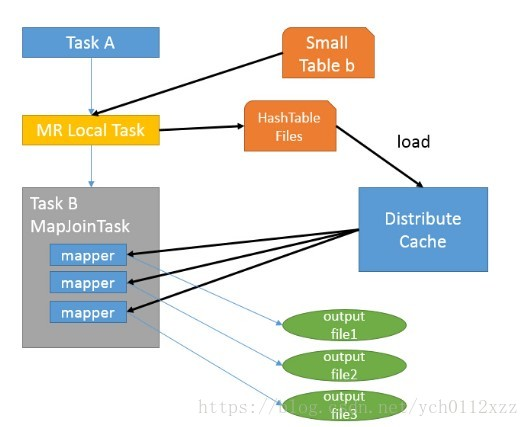
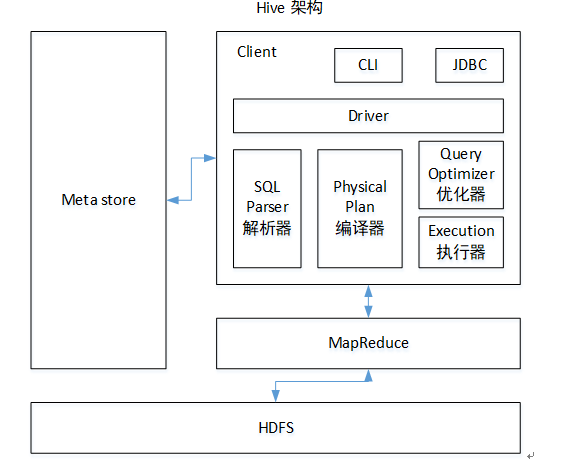
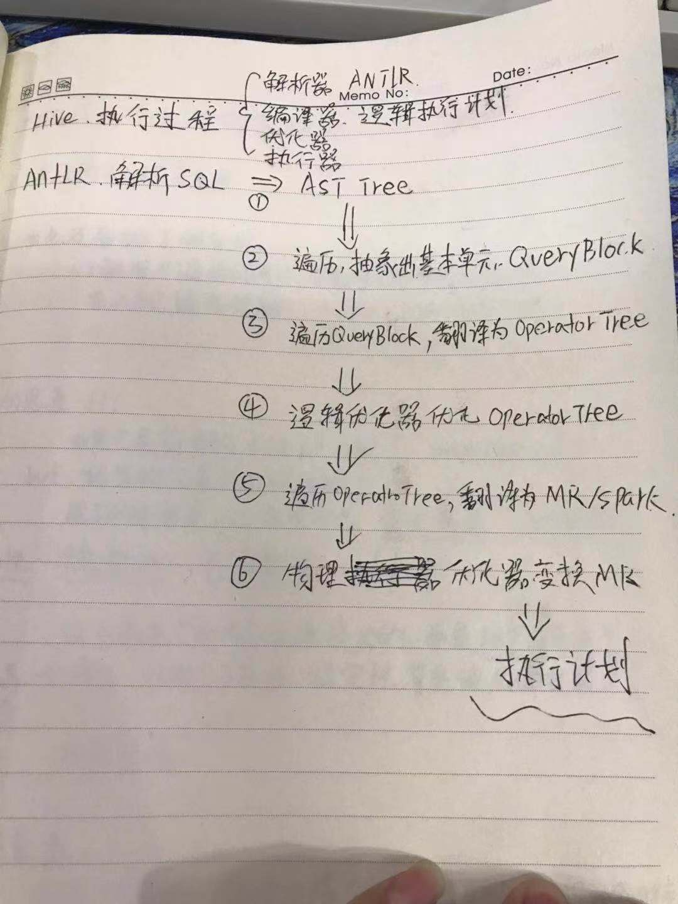
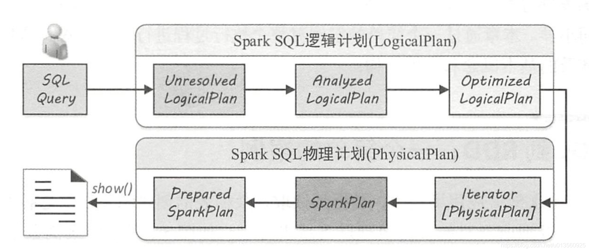
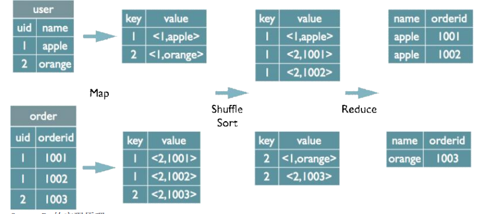
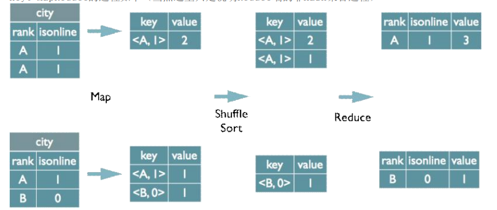
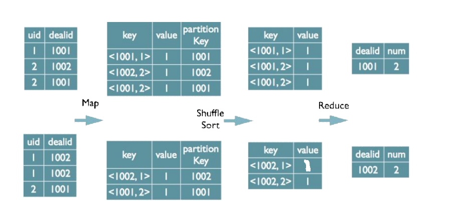
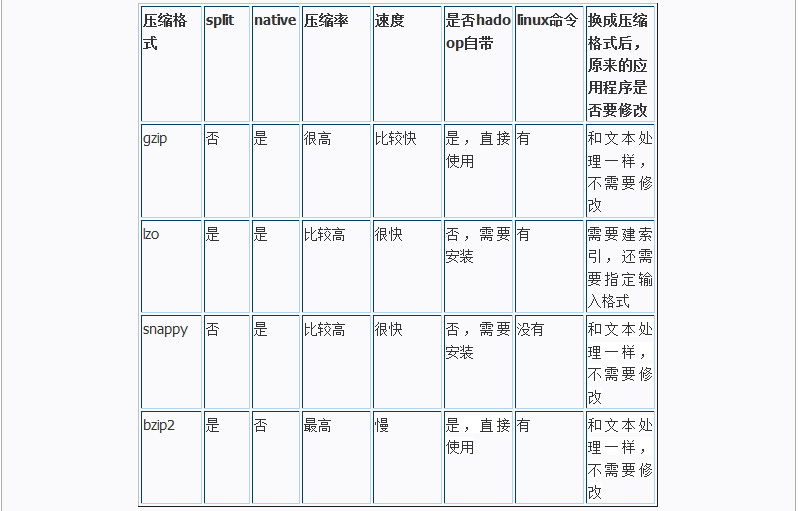

# Hive 总结

## 1、Hive任务map数和reduce数

### 1.1、如何合并小文件，减少map数目

假设一个SQL任务， 

```mysql
select count(1) from bicloud_log.login_log where day  = '2019-08-01' 
```

该任务的HDFS目录下共有194个文件，其中很多是远远小于128m的小文件，总大小9G，map 数目默认由  input文件数目决定，正常执行会用194个map任务。那么该查询会非常耗时。
 通过以下方法来在map执行前合并小文件，减少map数：

```mysql
set mapred.max.split.size=100000000;
set mapred.min.split.size.per.node=100000000;
set mapred.min.split.size.per.rack=100000000;
set hive.input.format=org.apache.hadoop.hive.ql.io.CombineHiveInputFormat;
```

  再执行上面的语句，用了74个map任务, 对于这个简单SQL任务，执行时间上可能差不多，但节省了一半的计算资源。100000000表示100M, set hive.input.format=org.apache.hadoop.hive.ql.io.CombineHiveInputFormat;这个参数表示执行前进行小文件合并。  前面三个参数确定合并文件块的大小，大于文件块大小128m的，按照128m来分隔，小于128m,大于100m的，按照100m来分隔，把那些小于100m的（包括小文件和分隔大文件剩下的），进行合并,最终生成了74个块。

```mysql
-- hive表文件就一个，为充值数据重新刷表增多文件数， 导表速度快了很多。
insert overwrite  table  test.cloud_vouch_log_repait
select * from  test.cloud_vouch_log_38_57 
distribute by rand(1234); 
set  mapreduce.job.queuename=root.hive ;

set hive.exec.reducers.bytes.per.reducer=1073741824;
set parquet.compression=snappy;
set hive.merge.mapredfiles=true;
set hive.exec.dynamic.partition.mode=nonstrict;
set hive.exec.max.dynamic.partitions.pernode=10000;
set hive.exec.max.dynamic.partitions.pernode.Maximum=1000000;

// jvm 参数
set mapreduce.map.memory.mb=8096;
set mapreduce.map.java.opts=-Xmx8096m;

```

### 1.2、如何适当的增加map数

当input的文件都很大，任务逻辑复杂，map执行非常慢的时候，可以考虑增加Map数，来使得每个map处理的数据量减少，从而提高任务的执行效率。
 假设有这样一个任务：

```mysql
select data_desc, count(1), count(distinct id), sum(case when …), sum(case when ...)
from a group by data_desc
```

 如果表a只有一个文件，大小为120M，但包含几千万的记录，如果用1个map去完成这个任务，肯定是比较耗时的，这种情况下，我们要考虑将这一个文件合理的拆分成多个，这样就可以用多个map任务去完成。

```mysql
set mapred.reduce.tasks=10;      -- 设置reduce数目
create table a_1 as 
select * from a 
distribute by rand(123); 
```

这样会将a表的记录，随机的分散到包含10个文件的a_1表中，再用a_1代替上面sql中的a表，文件数是map数，则会用10个map任务去完成。每个map任务处理大于12M（几百万记录）的数据，效率肯定会好很多。
看上去，貌似这两种有些矛盾，一个是要合并小文件，一个是要把大文件拆成小文件，这点正是重点需要关注的地方，根据实际情况，控制map数量需要遵循两个原则：使大数据量利用合适的map数；使单个map任务处理合适的数据量；

#### Mapper 文件数

mapper数量与输入文件的split数息息相关，在Hadoop源码`org.apache.hadoop.mapreduce.lib.input.FileInputFormat`类中可以看到split划分的具体逻辑。这里不贴代码，直接叙述mapper数是如何确定的。

- 可以直接通过参数`mapred.map.tasks`（默认值2）来设定mapper数的期望值，但它不一定会生效，下面会提到。
- 设输入文件的总大小为`total_input_size`。HDFS中，一个块的大小由参数`dfs.block.size`指定，默认值64MB或128MB。在默认情况下，mapper数就是：
  `default_mapper_num = total_input_size / dfs.block.size`。
- 参数`mapred.min.split.size`（默认值1B）和`mapred.max.split.size`（默认值64MB）分别用来指定split的最小和最大大小。split大小和split数计算规则是：
  `split_size = MAX(mapred.min.split.size, MIN(mapred.max.split.size, dfs.block.size))`；
  `split_num = total_input_size / split_size`。
- 得出mapper数：
  `mapper_num = MIN(split_num, MAX(default_num, mapred.map.tasks))`。

**如果想减少mapper数，就适当调高`mapred.min.split.size`  （默认值1B）！！！，split数就减少了。如果想增大mapper数，除了降低`mapred.min.split.size`之外，也可以调高`mapred.map.tasks`。**

### 1.3、控制hive任务的reduce数目

>  Hive自己如何确定reduce数 ?

reduce个数的设定极大影响任务执行效率，不指定reduce个数的情况下，Hive会猜测确定一个reduce个数，基于以下两个设定：

```mysql
-- 参数1  
hive.exec.reducers.bytes.per.reducer（每个reduce任务处理的数据量，默认为1000^3=1G） 
-- 参数2
hive.exec.reducers.max（每个任务最大的reduce数，默认为999）
```

**计算reducer数的公式 N=min(参数2，总输入数据量/参数1)**
即，如果reduce的输入（map的输出）总大小不超过1G,那么只会有一个reduce任务；

> 调整reduce个数方法一:

调整hive.exec.reducers.bytes.per.reducer参数的值；
set hive.exec.reducers.bytes.per.reducer=500000000; （500M）

> 调整reduce个数方法二:

set mapred.reduce.tasks = 15;

---

1. reduce个数并不是越多越好 ? 
   同map一样，启动和初始化reduce也会消耗时间和资源；
   另外，有多少个reduce,就会有多少个输出文件，如果生成了很多个小文件，那么如果这些小文件作为下一个任务的输入，则也会出现小文件过多的问题；

2. 什么情况下只有一个reduce ?
   很多时候你会发现任务中不管数据量多大，不管你有没有设置调整reduce个数的参数，任务中一直都只有一个reduce任务；其实只有一个reduce任务的情况，除了数据量小于hive.exec.reducers.bytes.per.reducer参数值的情况外，还有以下原因：

   1. 没有group by的汇总

   ```mysql
   select day,count(1) from bicloud_log.login_log where day = '2018-07-04' group by day;
   -- 下面是一个reduce
   select count(1) from bicloud_log.login_log where day = '2018-07-04';
   ```

   2. 用了Order by
   3. 有笛卡尔积
      这些操作都是全局的，所以hadoop不得不用一个reduce去完成。

---

同样的，在设置reduce个数的时候也需要考虑这两个原则：使大数据量利用合适的reduce数；使单个reduce任务处理合适的数据量；

### 1.4、合并小文件

- 输入阶段合并
  需要更改Hive的输入文件格式，即参数`hive.input.format`，默认值是`org.apache.hadoop.hive.ql.io.HiveInputFormat`，我们改成`org.apache.hadoop.hive.ql.io.CombineHiveInputFormat`。
  这样比起上面调整mapper数时，又会多出两个参数，分别是`mapred.min.split.size.per.node`和`mapred.min.split.size.per.rack`，含义是单节点和单机架上的最小split大小。如果发现有split大小小于这两个值（默认都是100MB），则会进行合并。具体逻辑可以参看Hive源码中的对应类。
- 输出阶段合并
  直接将`hive.merge.mapfiles`和`hive.merge.mapredfiles`都设为true即可，前者表示将map-only任务的输出合并，后者表示将map-reduce任务的输出合并。
  另外，`hive.merge.size.per.task`可以指定每个task输出后合并文件大小的期望值，`hive.merge.size.smallfiles.avgsize`可以指定所有输出文件大小的均值阈值，默认值都是1GB。如果平均大小不足的话，就会另外启动一个任务来进行合并。

```mysql
#在Map-only的任务结束时合并小文件 
set hive.merge.mapfiles = true
#在Map-Reduce的任务结束时合并小文件 
set hive.merge.mapredfiles= true
#合并后文件的大小为1GB左右 
set hive.merge.size.per.task = 1024000000
#当输出文件的平均大小小于1GB时，启动一个独立的map-reduce任务进行文件merge
set zhive.merge.smallfiles.avgsize=1024000000
```

### 1.5 向量化执行

向量化查询执行通过一次性批量执行1024行而不是每次单行执行，从而提高扫描，聚合，筛选器和连接等操作的性能。 在Hive 0.13中引入，此功能显着提高了查询执行时间，并可通过两个参数设置轻松启用： 

设置hive.vectorized.execution.enabled = true; 

设置hive.vectorized.execution.reduce.enabled = true;

### 1.6 API获取执行Job数，输入输出表

>  http://lxw1234.com/archives/2015/09/476.htm

### 1.7 UDF UDAF UDTF 

> https://www.studytime.xin/article/hive-functions.html
>
> https://www.cnblogs.com/sx66/p/12039552.html

* UDF 

定义UDF函数要注意下面几点:

1. 继承`org.apache.hadoop.hive.ql.exec.UDF`
2. 重写`evaluate`()，这个方法不是由接口定义的,因为它可接受的参数的个数,数据类型都是不确定的。Hive会检查UDF,看能否找到和函数调用相匹配的evaluate()方法

* UDTF 

继承`org.apache.hadoop.hive.ql.udf.generic.GenericUDF`，

重写initlizer（）、getdisplay（）、evaluate()。

执行流程如下

1. UDTF首先会调用initialize方法，此方法返回UDTF的返回行的信息（返回个数，类型）。
2. 初始化完成后，会调用process方法,真正的处理过程在process函数中，在process中，每一次forward()调用产生一行；如果产生多列可以将多个列的值放在一个数组中，然后将该数组传入到forward()函数。
3. 最后close()方法调用，对需要清理的方法进行清理。

* UDAF

1. UDF自定义函数必须是org.apache.hadoop.hive.ql.exec.UDAF的子类,并且包含一个或多个个嵌套的的实现了org.apache.hadoop.hive.ql.exec.UDAFEvaluator的静态类。
2. 函数类需要继承UDAF类，内部类Evaluator实UDAFEvaluator接口。
3. Evaluator需要实现 init、iterate、terminatePartial、merge、terminate这几个函

**group_concat(op_id order by op_time)  是UDAF ,  在有序的场景下需要order by ，这样在UDAF iterate中一行一行处理才会有序 ！！！！**

## 2、Hive调优

### 2.0、优化原则

- 优化时，把hive sql当做mapreduce程序来读，会有意想不到的惊喜。理解hadoop的核心能力，是hive优化的根本
- 不怕数据多，就怕数据倾斜。
- 减少job数
- 对小文件进行合并，是行至有效的提高调度效率的方法
- 优化时把握整体，单个作业最优不如整体最优
- 

### 2.1、JVM重用

JVM重用是hadoop调优参数的内容，对hive的性能具有非常大的影响，特别是对于很难避免小文件的场景或者task特别多的场景，这类场景大多数执行时间都很短。hadoop默认配置是使用派生JVM来执行map和reduce任务的，这是jvm的启动过程可能会造成相当大的开销，尤其是执行的job包含有成千上万个task任务的情况。JVM重用可以使得JVM实例在同一个JOB中重新使用N次，

```mysql
N的值可以在Hadoop的mapre-site.xml文件中进行设置
mapred.job.reuse.jvm.num.tasks
也可在hive的执行设置
set  mapred.job.reuse.jvm.num.tasks=10;
```

- JVM的一个缺点是，开启JVM重用将会一直占用使用到的task插槽，以便进行重用，直到任务完成后才能释放。如果某个“不平衡“的job中有几个reduce task 执行的时间要比其他reduce task消耗的时间多得多的话，那么保留的插槽就会一直空闲着却无法被其他的job使用，直到所有的task都结束了才会释放。

### 2.2、并行执行

并行执行，意思是同步执行hive的多个阶段，hive在执行过程，将一个查询转化成一个或者多个阶段。某个特定的job可能包含众多的阶段，而这些阶段可能并非完全相互依赖的，也就是说可以并行执行的，这样可能使得整个job的执行时间缩短

```mysql
set hive.exec.parallel=true
```

在资源充足的时候hive.exec.parallel会让那些存在并发job的sql运行得更快,

### 2.3、COUNT( DISTINCT id )

select count(distinct game_id) from bicloud_log.login_log where day ='2020-01-09' and cloud_id = '1' ;

由于引入了DISTINCT，因此在Map阶段无法利用combine对输出结果消重，必须将id作为Key输出，在Reduce阶段再对来自于不同Map Task、相同Key的结果进行消重，计入最终统计值。
我们看到作业运行时的Reduce Task个数为1，对于统计大数据量时，这会导致最终Map的全部输出由单个的ReduceTask处理。这唯一的Reduce Task需要Shuffle大量的数据，并且进行排序聚合等处理，这使得它成为整个作业的IO和运算瓶颈。

使用 set mapred.reduce.tasks=100 ， 调整后我们发现这一参数并没有影响实际Reduce Task个数，Hive运行时输出“Number of reduce tasks determined at compile time: 1”。原来Hive在处理COUNT这种“全聚合(full aggregates)”计算时，它会忽略用户指定的Reduce Task数，而强制使用1

```mysql
SELECT COUNT(*) FROM (SELECT DISTINCT id FROM TABLE_NAME WHERE … ) t;
-- 也可以
SELECT COUNT(*) FROM TABLE_NAME WHERE …  group by id

select a,count(distinct b) from t group by a;类型的sql时，会出现数据倾斜的问题。
 使用sum...group by   count...group by   代替 

select project_id, count(distinct day ) from ga_view.event_999_v1 group by project_id;

select project_id , sum(1) from (select project_id, day  from ga_view.event_999_v1 group by project_id,day ) a  group by project_id;
select project_id , count(1) from (select project_id, day  from ga_view.event_999_v1 group by project_id,day ) a  group by project_id; 

```

SELECT COUNT(*) FROM (SELECT DISTINCT id FROM TABLE_NAME WHERE … ) t;

实际运行时，我们发现Hive还对这两阶段的作业做了额外的优化。它将第二个MapReduce作业Map中的Count过程移到了第一个作业的Reduce阶段。这样在第一阶Reduce就可以输出计数值，而不是消重的全部id。这一优化大幅地减少了第一个作业的Reduce输出IO以及第二个作业Map的输入数据量

> select cloud_id, count(distinct game_id) from bicloud_log.login_log where day ='2020-01-09'  group by cloud_id;
>
> a , count(distinct  b )    按照 group 与 distinct 字段分组， partition 为 distinct 字段

### 2.4、map端优化

#### 2.4.1、map端聚合

* set hive.map.aggr=true;     

相当于 map端的 combiner操作

#### 2.4.2、map端join

Join 操作在 Map 阶段完成，不再需要Reduce，前提条件是需要的数据在 Map 的过程中可以访问到

```mysql
hive.auto.convert.join=true
hive.join.emit.interval = 1000
hive.mapjoin.size.key = 10000
hive.mapjoin.cache.numrows = 10000
hive.mapjoin.smalltable.filesize来决定， 默认值25M 进行小表广播
```

#### 2.4.3、hive 桶分区 -> map join

对于每一个表或者分区， Hive可以进一步组织成桶，也就是说桶是更为细粒度的数据范围划分服

对某一列进行桶的组织，采用对列值哈希，然后除以桶的个数求余的方式决定该条记录存放在个桶当中

把表（或者分区）组织成桶（Bucket）有两个理由：

* 获得更高的查询处理效率。桶为表加上了额外的结构，Hive 在处理有些查询时能利用这个结构。
* 具体而言，连接两个在（包含连接列的）相同列上划分了桶的表，可以使用 Map 端连接 （Map-side join）高效的实现。比如JOIN操作。对于JOIN操作两个表有一个相同的列，如果对这两个表都进行了桶操作。那么将保存相同列值的桶进行JOIN操作就可以，可以大大较少JOIN的数据量。

* 使取样（sampling）更高效。在处理大规模数据集时，在开发和修改查询的阶段，如果能在数据集的一小部分数据上试运行查询，会带来很多方便。

```mysql
-- 对于map端连接的情况，两个表以相同方式划分桶。处理左边表内某个桶的 mapper知道右边表内相匹配的行在对应的桶内。因此，mapper只需要获取那个桶 (这只是右边表内存储数据的一小部分)即可进行连接。这一优化方法并不一定要求 两个表必须桶的个数相同，两个表的桶个数是倍数关系也可以。

CREATE TABLE bucketed_user (id INT) name STRING) 
CLUSTERED BY (id) INTO 4 BUCKETS; 

-- 桶中的数据可以根据一个或多个列另外进行排序。由于这样对每个桶的连接变成了高效的归并排序(merge-sort) ！！！, 因此可以进一步提升map端连接的效率。
CREATE TABLE bucketed_users (id INT, name STRING) 
CLUSTERED BY (id) SORTED BY (id ASC) INTO 4 BUCKETS; 

要向分桶表中填充成员，需要将 hive.enforce.bucketing 属性设置为 true 
set hive.enforce.bucketing = true

INSERT OVERWRITE TABLE bucketed_users SELECT * FROM users; 

事实上，桶对应于 MapReduce 的输出文件分区：一个作业产生的桶(输出文件)和reduce任务个数相同。
将显示有4个新建的文件 ，第一个桶里包括用户IDO和4，因为一个INT的哈希值就是这个整数本身，在这里 除以桶数(4)以后的余数：  

-对桶中的数据进行采样
SELECT * FROM bucketed_users  TABLESAMPLE(BUCKET 1 OUT OF 4 ON id); 

注：tablesample是抽样语句，语法：TABLESAMPLE(BUCKET x OUT OF y)
y必须是table总bucket数的倍数或者因子。hive根据y的大小，决定抽样的比例。例如，table总共分了64份，当y=32时，抽取(64/32=)2个bucket的数据，当y=128时，抽取(64/128=)1/2个bucket的数据。x表示从哪个bucket开始抽取。例如，table总bucket数为32，tablesample(bucket 3 out of 16)，表示总共抽取（32/16=）2个bucket的数据，分别为第3个bucket和第（3+16=）19个bucket的数据。
```

bucket map join 的必要条件

* set hive.optimize.bucketmapjoin = true;
* 两个都是桶表，一个表的bucket数是另一个表bucket数的整数倍
* bucket列 == join列  
* hive并不检查两个join的表是否已经做好bucket且sorted，需要用户自己去保证join的表，否则可能数据不正确。 通过在sql中用 distributed c1 sort by c1 或者 cluster by c1  
  cluster by = distributed by + sort by on same key 

```mysql
样例 1 
create table emp_info_bucket(ename string,deptno int)
partitioned by (empno string)
clustered by(deptno) into 4 buckets;

insert overwrite table emp_info_bucket
partition (empno=7369)
select ename ,deptno from emp

create table dept_info_bucket(deptno string,dname string,loc string)
clustered by (deptno) into 4 buckets;

insert overwrite table dept_info_bucket
select * from dept;

select * from emp_info_bucket emp  join dept_info_bucket dept
on(emp.deptno==dept.deptno);

样例 2
create table new_left as select * from left_table cluster by id  into 4 buckets;
create table new_right as select * from right_table cluster by id into 4 buckets;
select * from new_left join new_right on new_left.id=new_right.id

样例 3
CREATE   TABLE `test`.`clickcube_mid`(             
   `logtype` bigint,                                
   `date` string,                                   
   `hour` bigint,                                   
   `projectid` bigint,                              
   `campaignid` bigint,                             
   `templateid` bigint)                          
  PARTITIONED BY (`day` string , `cloud_id` string) 
  CLUSTERED BY (`campaignid`,  `mediaid` ) INTO 100 BUCKETS                                   
  STORED AS PARQUET                                
-- cluster by 的字段不能是 partition by 的字段  
```

#### order by distribute by sort by cluster by 

* distribute by 关键字控制map输出结果的分发,相同字段的map输出会发到一个reduce节点去处理
* sort by为每一个reducer产生一个排序文件 

> HiveSQL中的order by与其他SQL方言中的功能一样，就是将结果按某字段全局排序，这会导致所有map端数据都进入一个reducer中，在数据量大时可能会长时间计算不完。
>
> 如果使用sort  by，那么还是会视情况启动多个reducer进行排序，并且保证每个reducer内局部有序。**为了控制map端数据分配到reducer的key，往往还要配合distribute by一同使用。如果不加distribute by的话，map端数据就会随机分配到reducer **

```mysql
select uid,upload_time,event_type,record_data
from calendar_record_log
where pt_date >= 20190201 and pt_date <= 20190224
distribute by uid
sort by upload_time desc,event_type desc;
```


#### 2.4.4、Map join 详解



执行流程如下： 

- 如图中的流程，首先是Task A，它是一个Local Task（在客户端本地执行的Task），负责扫描小表b的数据，将其转换成一个HashTable的数据结构，并写入本地的文件中，之后将该文件加载到**DistributeCache**中，该HashTable的数据结构可以抽象为：  

   |key| value| 
   | 1 | 26 | 
   | 2 | 34 |

- 接下来是Task B，该任务是一个没有Reduce的MR，启动MapTasks扫描大表a,在Map阶段，根据a的每一条记录去和DistributeCache中b表对应的HashTable关联，并直接输出结果。 

-  由于MapJoin没有Reduce，所以由Map直接输出结果文件，有多少个Map Task，就有多少个结果文件

**为什么是DistributeCache？？**

```java
// map 端直接拉取存在的问题
Map Join 的目的是减少 Shuffle 和 Reducer 阶段的代价，并仅在 Map 阶段进行 Join。通过这样做，当其中一个连接表足够小可以装进内存时，所有 Mapper 都可以将数据保存在内存中并完成 Join。因此，所有 Join 操作都可以在 Mapper 阶段完成。但是，这种类型的 Map Join 存在一些扩展问题。当成千上万个 Mapper 同时从 HDFS 将小的连接表读入内存时，连接表很容易成为性能瓶颈，导致 Mapper 在读取操作期间超时。
// 优化为 读取原始表加载为hashtable,序列化到HDFS哈希表文件。 分发到每个Mapper本地磁盘中
优化的基本思想是在原始 Join 的 MapReduce 任务之前创建一个新的 MapReduce 本地任务。这个新任务是将小表数据从 HDFS 上读取到内存中的哈希表中。读完后，将内存中的哈希表序列化为哈希表文件。在下一阶段，当 MapReduce 任务启动时，会将这个哈希表文件上传到 Hadoop 分布式缓存中，该缓存会将这些文件发送到每个 Mapper 的本地磁盘上。因此，所有 Mapper 都可以将此持久化的哈希表文件加载回内存，并像之前一样进行 Join。优化的 Map Join 的执行流程如下图所示。优化后，小表只需要读取一次。此外，如果多个 Mapper 在同一台机器上运行，则分布式缓存只需将哈希表文件的一个副本发送到这台机器上。
// 总结为
   原始 Join 的 MapReduce 任务之前创建了一个 MapReduce Local Task。这个新任务是将小表数据从 HDFS 上读取到内存中的哈希表中，并列化为哈希表文件。后面会将这个哈希表文件上传到 Hadoop 分布式缓存中。该缓存会将这些文件发送到每个 Mapper 的本地磁盘上。这些完成之后才会启动一个只有 Map Task 的 MapReduce 作业来完成 Join。
```

### 2.5、join 优化

> 美团：  https://blog.csdn.net/sinat_15443203/article/details/88529045

* 避免有null值

* 两边数据类型一致

* set hive.optimize.skewjoin=true;
  如果是join过程中出现数据倾斜应该设置为true,变成自动优化

  **有数据倾斜时，查询计划生成两个mr job， 第一个job先进行key随机分配处理，先缩小数据量。第二个job再进行真正的group by key处理**

* set hive.skewjoin,key=10000;
  当join的建对应的记录条数超过这个值则会进行优化

* join时容易造成节点OOM，导致任务失败，可以尝试以下方法：

  ```mysql
  -- map阶段OOM，适当增加map阶段内存
  set mapreduce.map.memory.mb=3096
  -- reduce阶段OOM，适当增加reduce阶段内存 
  set mapreduce.reduce.memory.mb=4096
  -- 根据数据大小量级合理增加reduce数量，reduce不宜设置过大
  set mapreduce.job.reduces=200;
  ```

### 小表cache 广播

可以把小表广播出去，加载到内存中

### 减少数据量，两次join

> build table会大到无法直接使用map join的地步，比如全量用户维度表，而使用普通join又有数据分布不均的问题。这时就要充分利用probe  table的限制条件，**削减build table的数据量，再使用map join解决。代价就是需要进行两次join**

```mysql
select /*+mapjoin(b)*/ a.uid,a.event_type,b.status,b.extra_info
from calendar_record_log a
left outer join (
select /*+mapjoin(s)*/ t.uid,t.status,t.extra_info
from (select distinct uid from calendar_record_log where pt_date = 20190228) s
inner join user_info t on s.uid = t.uid
) b on a.uid = b.uid
where a.pt_date = 20190228;
```

* 局部聚合加全局聚合。
* 增加Reducer
* 自定义分区函数

### 加盐与膨胀

>  大表与大表join，但是分桶的判断字段0值或空值过多
>  后果：这些空值/0值都由一个Reducer处理，非常慢
> **解决方式：把空值的key变成一个字符串加上随机数，把倾斜的数据分到不同的reduce上，由于null值关联不上，处理后并不影响最终结果。 **
>
> **可以使用case when对空值赋上随机值。此方法比直接写`is not null`更好，因为前者job数为1，后者为2.**

**倾斜key 加盐N， 关联表该key膨胀N倍**

```mysql
-- 只膨胀维表， 右表随机加N以内随机数
 ( select 
     seller_id,  sale_level ,member
   from table_B
     join members     -- 0 - N 表
   )  b
 on  a.seller_id  = b.seller_id
   and mod(a.pay_cnt_90day,10)+1 = b.number  --  取模关联上

```

1. 对有数据倾斜那个RDD，使用sample算子采样出一份样本，统计下每个key的数量，看看导致数据倾斜数据量最大的是哪几个key。
2. 然后将这几个key对应的数据从原来的RDD中拆分出来，形成一个单独的RDD，并给每个key都打上n以内的随机数作为前缀；不会导致倾斜的大部分key形成另外一个RDD。
3. 接着将需要join的另一个RDD，也过滤出来那几个倾斜key对应的数据并形成一个单独的RDD，将每条数据膨胀成n条数据，这n条数据都按顺序附加一个0~n的前缀，不会导致倾斜的大部分key也形成另外一个RDD。
4. 再将附加了随机前缀的独立RDD与另一个膨胀n倍的独立RDD进行join，这样就可以将原先相同的key打散成n份，分散到多个task中去进行join了。
5. 而另外两个普通的RDD就照常join即可。
6. 最后将两次join的结果使用union算子合并起来即可，就是最终的join结果。

### 压缩中间结果，减少IO

### 2.6、group by 优化

* hive.groupy.skewindata=true;

  如果是group by 过程中出现出具倾斜应该设置为true

* set hive.groupby.mapaggr.checkinterval=100000;
  当group的键对应的记录条数超过这个值则会进行优化

  数据倾斜时进行负载均衡

>  此处需要设定 hive.groupby.skewindata，当选项设定为 true 是，生成的查询计划有两 个 MapReduce 任务。在第一个 MapReduce 中，map 的输出结果集合会随机分布到 reduce 中， 每个 reduce 做部分聚合操作，并输出结果。这样处理的结果是，相同的 Group By Key 有可 能分发到不同的 reduce 中，从而达到负载均衡的目的；第二个 MapReduce 任务再根据预处 理的数据结果按照 Group By Key 分布到 reduce 中（这个过程可以保证相同的 Group By Key 分布到同一个 reduce 中），最后完成最终的聚合操作。
>
>  目的都是减少热点问题。
>
>  部分查询并不支持

### 2.7、合并小文件

我们知道文件数目小，容易在文件存储端造成瓶颈，给 HDFS 带来压力，影响处理效率。对此，可以通过合并Map和Reduce的结果文件来消除这样的影响。

>  map输入合并小文件（map端聚合小文件） 

```mysql
set mapred.max.split.size=256000000;  #每个Map最大输入大小
set mapred.min.split.size.per.node=100000000; #一个节点上split的至少的大小 
set mapred.min.split.size.per.rack=100000000; #一个交换机下split的至少的大小
set hive.input.format=org.apache.hadoop.hive.ql.io.CombineHiveInputFormat;  #执行Map前进行小文件合并

在开启了org.apache.hadoop.hive.ql.io.CombineHiveInputFormat后，一个data node节点上多个小文件会进行合并，合并文件数由mapred.max.split.size限制的大小决定。
mapred.min.split.size.per.node 决定了多个data node上的文件是否需要合并~
mapred.min.split.size.per.rack 决定了多个交换机上的文件是否需要合并~
```
> reduce输出合并小文件

```mysql
set hive.merge.mapfiles = true    #是否合并Map输出文件 ,默认值为真
set hive.merge.mapredfiles = true #是否合并Reduce 端输出文件 默认值为假
set hive.merge.size.per.task = 256*1000*1000 #合并文件的大小,适当调大
set hive.merge.smallfiles.avgsize=16000000 #当输出文件的平均大小小于该值时，启动一个独立的map-reduce任务进行文件merge
```

### 2.8、优化SQL

* 无效ID在关联时的数据倾斜问题

```mysql
SELECT * FROM log a
LEFT OUTER JOIN bmw_users b 
ON 
CASE WHEN a.user_id IS NULL THEN CONCAT('dp_hive',RAND())
ELSE a.user_id END = b.user_id;
```

这个优化适合无效 id（比如-99、''，null 等）产生的倾斜问题。把空值的 key 变成一个字符串加上随机数，就能把倾斜的 数据分到不同的Reduce上，从而解决数据倾斜问题。因为空值不参与关联，即使分到不同 的 Reduce 上，也不会影响最终的结果

### 2.9 列剪裁与谓词下推

* Hive谓词下推(Predicate pushdown)

关系型数据库借鉴而来，关系型数据中谓词下推到外部数据库用以减少数据传输

基本思想：尽可能早的处理表达式

属于逻辑优化，优化器将谓词过滤下推到数据源，使物理执行跳过无关数据

参数打开设置：hive.optimize.ppd=true

* parquet   列裁剪和谓词下推

运用列式数据库的优点，进行过滤不必要的数据字段  

### 2.10、hive 索引

```mysql
ALTER INDEX employees_index ON TABLE employees   
PARTITION(country = 'US')  
REBUILD;  

PARTITIONED BY表明只对某个分区创建索引，若没有该选项则表示对所有分区都创建索引，另外要注意的是index的分区索引默认是和表的分区一致的，也不能对视图VIEW创建索引。

SHOW FORMATTED INDEXES ON employees;  

DROP INDEX IF EXISTS employees_index ON TABLE employees; 
```

### 2.11、Fetch 抓取

Hive中对某些情况的查询可以不必使用MapReduce计算。例如：SELECT * FROM employees;在这种情况下，Hive可以简单地读取employee对应的存储目录下的文件，然后输出查询结果到控制台。

```mysql
hive-default.xml文件中hive.fetch.task.conversion默认是more，老版本hive默认是minimal，该属性修改为more以后，在全局查找、字段查找、limit查找等都不走mapreduce。
```

### 2.12、EXPLAIN查看执行计划与查看执行日志

```mysql
explain  sql


hive -hiveconf hive.root.logger=INFO,console -e "sql" >> hive.query.debug 2>&1
```

### 2.13、数据倾斜解决

>  Hive倾斜的原因很大部分是由于sql中的join语句与group by语句
>
> hive查询的优化可以大致分为针对M/R中单个步骤的优化，针对M/R全局的优化，和针对整个查询（多M/R job）的优化

```mysql
-- Map阶段的优化   数量
-- Reduce阶段的优化
-- Map与Reduce之间的优化
(所谓map和reduce之间，主要有3道工序。首先要把map输出的结果进行排序后做成中间文件，其次这个中间文件就能分发到各个reduce，最后reduce端在执行reduce phase之前把收集到的排序子文件合并成一个排序文件.  第一个阶段中，由于内存不够，数据可能没办法在内存中一次性排序完成，那么就只能把局部排序的文件先保存到磁盘上，这个动作叫spill，然后spill出来的多个文件可以在最后进行merge。如果发生spill，可以通过设置io.sort.mb来增大mapper输出buffer的大小，避免spill的发生。另外合并时可以通过设置io.sort.factor来使得一次性能够合并更多的数据。调试参数的时候，一个要看spill的时间成本，一个要看merge的时间成本，还需要注意不要撑爆内存)
-- 文件格式的优化
-- 数据倾斜  -- group by  和 join 
-- SQL整体优化
-- join key 加盐， 两次聚合思路  分而治之
-- 增大JVM内存，增加reduce个数  增加索引
```

* join 小表放前原则

Join 操作的 Reduce 阶段，位于 Join 操作符左边的表的内容会被加载进内存，将条目少的表放在左边，可以有效减少发生 OOM 错误的几率

* SQL优化

```mysql
select * from a left outer join b on (a.key=b.key) where a.date='2017-07-11' and b.date='2017-07-11';
-- 先按连接条件进行连接，连接后再看where条件，如果不满足就丢弃，那之前连接所做的那些功夫就浪费
select * from a left outer join b on (a.key=b.key and a.date='2017-07-11' and b.date='2017-07-11'）;
-- where限制条件直接放到on里面，那么就变成了满足这三个条件才会进行连接，不满足的直接过滤掉 
```

数据倾斜没有一劳永逸的方式可以解决，了解你的数据集的分布情况，然后了解你所使用计算框架的运行机制和瓶颈，针对特定的情况做特定的优化，做多种尝试，观察是否有效.

* 业务逻辑， 过滤与预处理
* 技术、程序层面调优    如join过程中
* 调参

### 2.13、in 优化

**LEFT SEMI JOIN （左半连接）是 IN/EXISTS 子查询的一种更高效的实现**。

1、left semi join 的限制是， JOIN 子句中右边的表只能在 ON 子句中设置过滤条件，在 WHERE 子句、SELECT 子句或其他地方过滤都不行。

2、left semi join 是只传递表的 join key 给 map 阶段，因此left semi join 中最后 select 的结果只许出现左表。

3、因为 left semi join 是 in(keySet) 的关系，遇到右表重复记录，左表会跳过，而 join 则会一直遍历。这就导致右表有重复值得情况下 left semi join 只产生一条，join 会产生多条，也会导致 left semi join 的性能更高。 
**not in **

```mysql
-- join 方式， 性能低
select id from a
left  join b  on b.id=a.id
where b.id is null;

-- hive本身不支持直接not in，但是可以用where not exists来替代该逻辑
select * from dt_data
where not exists (select id from delete where delete.id = dt_data.id)

select user_id from ga_hive.event_44_v4  a   
where day = '2021-01-15' and not exists (select 1 from ga_hive.event_6_v4 b  where day = '2021-01-14' and  a.user_id = b.user_id  )

```

## 3、Hive 架构原理



> Hive通过给用户提供的一系列交互接口，接收到用户的指令(SQL)，使用四种Hive Driver，结合元数据(MetaStore)，将这些指令翻译成MapReduce，提交到Hadoop中执行，最后，将执行返回的结果输出到用户交互接口。

#### Driver驱动器

```mysql
-- （1）解析器（SQL Parser）：
将SQL字符串转换成抽象语法树AST，这一步一般都用第三方工具库完成，比如antlr；对AST进行语法分析，比如表是否存在、字段是否存在、SQL语义是否有误。
-- （2）编译器（Physical Plan）：
将AST编译生成逻辑执行计划。
-- （3）优化器（Query Optimizer）：
对逻辑执行计划进行优化。
-- （4）执行器（Execution）：
把逻辑执行计划转换成可以运行的物理计划。对于Hive来说，就是MR/Spark。
```

#### Hive执行过程

> 美团技术博客 https://tech.meituan.com/2014/02/12/hive-sql-to-mapreduce.html

1. `语法解析`：ANTLR 定义SQL的语法规则，完成SQL词法，语法解析，将SQL转化为抽象语法树AST Tree
2. `语义解析`：遍历AST Tree，抽象出查询的基本组成单元QueryBlock
3. `生成逻辑执行计划`：遍历QueryBlock，翻译为执行操作树OperatorTree
4. `优化逻辑执行计划`：逻辑层优化器进行OperatorTree变换，合并不必要的ReduceSinkOperator，减少shuffle数据量
5. `生成物理执行计划`：遍历OperatorTree，翻译为MapReduce任务
6. `优化物理执行计划`：物理层优化器进行MapReduce任务的变换，生成最终的执行计划



#### Spark sql 解析流程



> 用户编写的SQL是无法直接被底层计算框架执行的，必须要经过几个转换阶段，转变成框架能够识别的代码或者类对象，在Spark中，一般需要经过以下几个步骤，分为逻辑执行计划部分和物理执行计划部分
>
> SQL Query，需要经过词法和语法解析，由字符串转换为，树形的抽象语法树， 通过遍历抽象语法树生成`未解析的逻辑语法树（unresolved  logic  plan）`，对应SQL解析后的一种树形结构，本身不包含任务数据信息，需要经过一次遍历之后，转换成成包含解析后的`逻辑算子树（Analyzed  LogicPlan）`，本身携带了各种信息，最后经过优化后得到最终的`逻辑语法树（Optimized LogicPlan）`
>
> 不管解析被划分为几步，在Spark 执行环境中，都要转化成RDD的调用代码，才能被spark core所执行

1. SqlParser生成LogicPlan Tree
2. Analyzer和Optimizer将各种rule作用于LogicalPlan Tree
3. 最终优化生成的LogicalPlan生成Spark RDD
4. 最后将生成的RDD交由Spark执行

### SQL -> MR  过程

#### Join 实现原理

> **使用Join 关联的字段作为Key，并为Value打上不同的表来源标识。**
>
> 在map的输出value中为不同表的数据打上tag标记，在reduce阶段根据tag判断数据来源。MapReduce的过程如下 （这里只是说明最基本的Join的实现，还有其他的实现方式）



#### Group by 实现原理

> **Group By 的字段组合作为Key**，并且Map端预聚合
>
> select rank, isonline, count(*) from city group by rank, isonline;  将GroupBy的字段组合为map的输出key值，利用MapReduce的排序，在reduce阶段保存LastKey区分不同的  key。MapReduce的过程如下（当然这里只是说明Reduce端的非Hash聚合过程）




#### Distinct 实现原理

> **单个distinct，使用group字段和distinct字段作为排序Key，Group字段作为分区Key，在Reduce阶段保存LastKey（因为排序后每组是按key有序的，因此只需使用一个LastKey作为去重字段）**
>
> select dealid, count(distinct uid) num from order group by dealid;
>
> 当只有一个distinct字段时，如果不考虑Map阶段的Hash GroupBy，只需要将GroupBy字段和Distinct字段组合为  map输出key，利用mapreduce的排序，同时将GroupBy字段作为reduce的key，在reduce阶段保存LastKey即可完成去 重



## 4、建表与shell

* parquet 表

```mysql
CREATE EXTERNAL TABLE spark_bi_wx_log.wx_device_center_log
( 
event_time STRING,
event_id STRING,
user_id STRING,
game_id STRING,
product_id STRING,
device_id STRING,
ip_addr STRING,
network_type STRING,
phone_maker STRING,
phone_model STRING,
phone_carrier STRING,
param01 STRING,
param02 STRING,
sys_version STRING,
wx_version STRING)
PARTITIONED BY ( `day` string , `cloud_id` string)
stored as parquet
;

MSCK REPAIR TABLE  spark_bi_wx_log.wx_device_center_log ; 

-- 在 impala中 
invalidate metadata  spark_bi_wx_log.wx_device_center_log ;

-- 其他方法格式
ROW FORMAT SERDE 
  'org.apache.hadoop.hive.ql.io.parquet.serde.ParquetHiveSerDe' 
STORED AS INPUTFORMAT 
  'org.apache.hadoop.hive.ql.io.parquet.MapredParquetInputFormat' 
OUTPUTFORMAT 
  'org.apache.hadoop.hive.ql.io.parquet.MapredParquetOutputFormat'


ROW FORMAT SERDE 
  'org.apache.hadoop.hive.serde2.lazy.LazySimpleSerDe' 
WITH SERDEPROPERTIES ( 
  'field.delim'='\t', 
  'serialization.format'='\t') 
STORED AS INPUTFORMAT 
  'org.apache.hadoop.mapred.TextInputFormat' 
OUTPUTFORMAT 
  'org.apache.hadoop.hive.ql.io.HiveIgnoreKeyTextOutputFormat'
```

* mysql 导出

```mysql
mysql -s -h10.3.13.46 -uroot -pTuYougame2018! -e "$select_sql" > /home/wangzhaoqi/done.txt 
```

* hive 调用  注意

```shell
#!/bin/bash
source /etc/profile

#导入日期
day=$1

#变量
local_dir="/home/data/oozie/illegal_users"
hdfs_dir="/user/root/illegal_user_new"

#下载jar包
hadoop fs -copyToLocal /user/hue/oozie/workspaces/hue-oozie-1539769981.3/lib/brush.jar  $local_dir
#导出数据
java  -jar  "$local_dir/brush.jar"  jdbc:mysql://10.8.28.14:3306/cloud_data_1   ${day}

#遍历插入
dir_name="$local_dir/$day"
for i in ${dir_name}/*;
do
    temp=`basename $i`
    partition_day=${temp:0:10}
    echo $partition_day
    echo "$dir_name/$temp"
	if [ -f "$dir_name/$temp" ];then

        sql="load data local inpath '$dir_name/$temp' into table bidata_log.illegal_user_new partition(day='$partition_day')"
        echo $sql
        hive -e "$sql"
    fi

done
```

* 注意分布式运行，目录一定要在各个节点上存在

## 5、样例笔记

```mysql
添加列后，部分分区查看该字段的值为null， 那么可以 
alter table ...  cascade

---- 禁书，慎用
hive在删除一个数据库前，需要将数据库中的所有数据表全部删除，才能删除database；
强制性删除数据库需要使用cascade关键字；
DROP DATABASE IF EXISTS mydb CASCADE;
```

### Hadoop Shuffle过程


* HDFS中数据块为block，mapreduce读取block后会进行计算输入分区input split, 每个input split针对一个map task。每个input split是记录分区长度和数据位置的数组。  关于input split 大小有计算规则，可以进行特定设置优化map task 数量。**如把一个258MB的文件上传到HDFS上，假设block块大小是128MB，那么它就会被分成三个block块，与之对应产生三个split，所以最终会产生三个map task**  （https://blog.csdn.net/Dr_Guo/article/details/51150278） 
* 每个map task会根据Partitioner函数计算key值分布，然后把计算结果以字节数组的方式写入内存缓冲区中。内存缓冲期就是为了减少磁盘IO的影响，数据优先写入内存达到80%后刷出到磁盘，刷出与写入由不同的线程来完成，互不影响。**调优可以调节缓冲期大小，减少写入磁盘次数**,spill溢写时默认对key进行排序。**溢写完成了对key值分布与key值排序**，

```java
sortAndSpill()方法中的内部流程是这样的： 
** 第一步，使用用快速排序算法对kvbuffer[bufstart,bufend)中的数据排序，先对partition分区号排序，然后再按照key排序，经过这两轮排序后，数据就会以分区为单位聚集在一起，且同一分区内的数据按key有序； 
** 第二步，按分区大小由小到大依次将每个分区中的数据写入任务的工作目录下的临时文件中，如果用户设置了Combiner，则写入文件之前，会对每个分区中的数据做一次聚集操作，比如<key1,val1>和<key1,val2>合并成<key1,<val1,val2>>； （不确定是否正确这句话，有的说是在merge时将相同key的value合成list，待** 第三步，将分区数据的元信息写到内存索引数据结构SpillRecord中。分区的元数据信息包括临时文件中的偏移量、压缩前数据的大小和压缩后数据的大小。 
https://www.cnblogs.com/acSzz/p/6383618.html
```

* 如果配置了Combiner,**将有相同key的key/value对的value加起来，减少溢写到磁盘的数据量Combiner会优化MapReduce的中间结果**，Combiner只应该用于那种Reduce的输入key/value与输出key/value类型完全一致，且不影响最终结果的场景。比如累加，最大值等。Combiner的使用一定得慎重，如果用好，它对job执行效率有帮助，反之会影响reduce的最终结果。 
* Merge , 多个溢写的磁盘文件合并为一个的过程。**merge成group**。什么是group。对于“aaa”就是像这样的：{“aaa”, [5, 8, 2, …]}，数组中的值就是从不同溢写文件中读取出来的。**同时生成相应的索引文件**
* Map阶段完成，告诉jobManager reduce可以进行拉取数据。
* reduce task在执行之前的工作就是不断地拉取当前job里每个map task的最终结果，然后对从不同地方拉取过来的数据不断地做merge，也最终形成一个文件作为reduce task的输入文件
*   Copy过程，简单地拉取数 。Merge阶段。这里的merge如map端的merge动作.内存到内存，默认不启用，内存到磁盘，磁盘到磁盘。
*   Reducer的输入文件。不断地merge后，最后会生成一个“最终文件”？因为这个文件可能存在于磁盘上，也可能存在于内存中。对我们来说，当然希望它存放于内存中，直接作为Reducer的输入，但默认情况下，这个文件是存放于磁盘中的。

参考 https://blog.csdn.net/luyee2010/article/details/8624469

#### 为什么要排序!!!

1. key存在combine操作，排序之后相同的key放到一块显然方便做合并操作。
2. reduce task是按key去处理数据的。 如果没有排序那必须从所有数据中把当前相同key的所有value数据拿出来，然后进行reduce逻辑处理。显然每个key到这个逻辑都需要做一次全量数据扫描，影响性能，有了排序很方便的得到一个key对于的value集合。
3. reduce task按key去处理数据时，如果key按顺序排序，那么reduce task就按key顺序去读取，显然当读到的key是文件末尾的key那么就标志数据处理完毕。如果没有排序那还得有其他逻辑来记录哪些key处理完了，哪些key没有处理完。

#### 深入细节思考

1. input spilt 与 Hadoop block对应关系

````java
  long minSize = Math.max(getFormatMinSplitSize(), getMinSplitSize(job));
   long maxSize = getMaxSplitSize(job);
   long blockSize = file.getBlockSize();
   long splitSize = computeSplitSize(blockSize, minSize, maxSize);
   protected long computeSplitSize(long blockSize, long minSize,
                                  long maxSize) {
    return Math.max(minSize, Math.min(maxSize, blockSize));
  }

input spilt 是根据三个值计算得出， 默认与 blockSize   一比一 
````


2. 细节

> https://zhuanlan.zhihu.com/p/79978059

3. reduce task是怎么拉取数据的

> https://www.jianshu.com/p/cfa7dc8ce14e
>
> 1.map task 执行完毕后会将计算状态以及磁盘小文件位置等信息分装到mapStatue对象中，然后由本进程中的MapOutPutTrackerWorker对象将mapStatus对象发送给Driver进程的MapOutPutTrackerMaster对象
>
> 2.在reduce task开始执行之前会先让本进程中的MapOutputTrackerWorker向Driver进程中的MapoutPutTrakcerMaster发动请求，请求磁盘小文件位置信息。
>
> 3.当所有的Map task执行完毕后，Driver进程中的MapOutPutTrackerMaster就掌握了所有的磁盘小文件的位置信息。此时MapOutPutTrackerMaster会告诉MapOutPutTrackerWorker磁盘小文件的位置信息.
>
> 4.完成之前的操作之后，就由ConnectionManager来链接node1和node2之间的信息。由BlockTransforService去Executor0所在的节点拉数据，默认会启动五个子线程。每次拉取的数据量不能超过48M（reduce task每次最多拉取48M数据，将拉来的数据存储到Executor内存的20%内存中）.

### Hadoop 通信协议

HDFS通信协议呢，有两种，一种是Hadoop RPC接口，一种是流式接口，

前者主要是负责一些连接的管理、节点的管理以及一些数据的管理，而后者主要是数据的读写传输。

* RPC

ClientDatanodeProtocol接口，这个接口是Client端和Datanode端通信使用的

datanode和namenode通信的接口，DatanodeProtocol

InterDatanodeProtocol接口，这个接口很简单，就是datanode之间相互通信的接

NamenodeProtocol了，这个接口就不说了吧，在2.x都没什么用了，这个是namenode和secondary namenode通信的接口。

* 流式接口

那么就是DataTransferProtocol了，这个接口最主要的方法就是readBlock()、writeBlock()和transferBlock()了。读数据块、写数据块以及数据块额复制就是靠这些方法来实现。

### Hadoop 心跳机制


### Hadoop 读写流程

https://www.jianshu.com/p/8c94ddf958a8

> 写流程
>
> 1）客户端通过Distributed FileSystem模块向namenode请求上传文件，namenode检查目标文件是否已存在，父目录是否存在。
>  2）namenode返回是否可以上传。
>  3）客户端请求第一个 block上传到哪几个datanode服务器上。
>  4）namenode返回3个datanode节点，分别为dn1、dn2、dn3。
>  5）客户端通过FSDataOutputStream模块请求dn1上传数据，dn1收到请求会继续调用dn2，然后dn2调用dn3，将这个通信管道建立完成。
>  6）dn1、dn2、dn3逐级应答客户端。
>  7）客户端开始往dn1上传第一个block（先从磁盘读取数据放到一个本地内存缓存），以packet为单位（大小为64k），dn1收到一个packet就会传给dn2，dn2传给dn3；dn1每传一个packet会放入一个应答队列等待应答。
>  8）当一个block传输完成之后，客户端再次请求namenode上传第二个block的服务器。（重复执行3-7步）。
>
> 读流程
>
> 1）客户端通过Distributed FileSystem向namenode请求下载文件，namenode通过查询元数据，找到文件块所在的datanode地址。
>  2）挑选一台datanode（就近原则，然后随机）服务器，请求读取数据。
>  3）datanode开始传输数据给客户端（从磁盘里面读取数据输入流，以packet为单位来做校验,大小为64k）。
>  4）客户端以packet为单位接收，先在本地缓存，然后写入目标文件。

### HDFS 读写失败恢复

https://www.cnblogs.com/mindwind/p/4833098.html

### Hadoop 数据清洗处理

```mysql
--  在map端和reduce端都有可能发生数据倾斜。在map端的数据倾斜会让多样化的数据集的处理效率更低。在reduce端的数据倾斜常常来源于MapReduce的默认分区器。
-- 数据倾斜在reduce端产生，因为map程序会将数据处理成键值对的形式，这样就有可能出现有的键相同的数据多，有的键相同的数据少。因此在进行partition分区的时候会将键相同的数据分配到同一个reduce当中去，这样就会导致有的reduce要处理数据会很多，有的就会很少，从而导致数据倾斜问题的产生。
```

* 增加reduce 的jvm内存

既然reduce 本身的计算需要以合适的内存作为支持，在硬件环境容许的情况下，增加reduce 的内存大小显然有改善数据倾斜的可能，这种方式尤其适合数据分布第一种情况，单个值有大量记录, 这种值的所有纪录已经超过了分配给reduce 的内存，无论你怎么样分区这种情况都不会改变。

* 增加reduce 个数

这个对于数据分布第二种情况有效，唯一值较多，单个唯一值的记录数不会超过分配给reduce 的内存. 如果发生了偶尔的数据倾斜情况，增加reduce 个数可以缓解偶然情况下的某些reduce 不小心分配了多个较多记录数的情况. 但是对于第一种数据分布无效。

* 自定义partition

如果map输出键的单词来源于一本书。其中大部分必然是省略词（stopword： a，the，or ）。那么就可以将自定义分区将这部分省略词发送给固定的一部分reduce实例。而将其他的都发送给剩余的reduce实例。

* 设定combiner

减少流向reduce的文件数量，从而减轻reduce数据倾斜

*  MapReduce中Kvbuffer的大小默认100M
* 减少磁盘IO和网络IO还可以进行：压缩，对spill，merge文件都可以进行压缩
* copier时可以调节并行度。默认情况下，每个Reducer只会有5个map端并行的下载线程在从map下数据，如果一个时间段内job完成的map有100个或者更多，那么reduce也最多只能同时下载5个map的数据，所以这个参数比较适合map很多并且完成的比较快的job的情况下调大，有利于reduce更快的获取属于自己部分的数据。 在Reducer内存和网络都比较好的情况下，可以调大该参数
* 涉及数据连接时，可以优先考虑在map端连接

### Hadopp 压缩算法



## #自我检测

数据倾斜优化  。  从整个数据流程开始捋，


1. map 数目  减少小文件， 查看输入源文件大小， 可以根据需要 开启小文件合并   或  手动合并
2. 环形缓冲区 溢写文件 时 内存大小 调节， 可以减少输出到磁盘次数     分区内有序
3. combiner 合并磁盘文件为一个， 分区内有序 各个分区相连接
4. reduce 数目适量增大 ,调节copy中并行度
5. 自定义 partition ,减少倾斜
6. 尽量map端join， 桶join  map join
7. jvm 重用 ， 增大JVM内存，
8. SQL 优化， 查看执行计划
9. 优化数仓数据格式，换个格式能更好的查询结果


**运行前的资源参数设置调优、运行中的数据倾斜的解决方案、为了精益求精的shuffle调优**

> 总结 https://mp.weixin.qq.com/s?__biz=Mzg3NjIyNjQwMg==&mid=100000226&idx=1&sn=0279ed125f0c94cab91bbe5ed334fa49&scene=19#wechat_redirect

* 列剪裁与分区剪裁 与 谓词 filter 下推
* sort by + distribute by 代替 order by
* group by  代替 distinct
* group by 调优      sum类操作可以map端预聚合      数据倾斜配置hive.groupby.skewindata
* join 优化   1，小表前置   2. 多表key相同  3 map join 分桶表  4 空值随机打散  5 key值类型一致 

## Parquet格式编码

> https://mp.weixin.qq.com/s/r0N8LOTmONAgoqFklznhgg

#### 文件模型

Parquet文件是以二进制方式存储的，是不可以直接读取和修改的，Parquet文件是自解析的，文件中包括该文件的数据和元数据

- **行组(Row Group)：按照行将数据物理上划分为多个单元，每一个行组包含一定的行数，**在一个HDFS文件中至少存储一个行组，Parquet读写的时候会将整个行组缓存在内存中，所以如果每一个行组的大小是由内存大的小决定的。
- 列块(Column Chunk)：在一个行组中每一列保存在一个列块中，行组中的所有列连续的存储在这个行组文件中。不同的列块可能使用不同的算法进行压缩。
- 页(Page)：每一个列块划分为多个页，一个页是最小的编码的单位，在同一个列块的不同页可能使用不同的编码方式。

一个Parquet文件的结构，一个文件中可以存储多个行组，文件的首位都是该文件的Magic Code，用于校验它是否是一个Parquet文件，Footer length存储了文件元数据的大小，通过该值和文件长度可以计算出元数据的偏移量，文件的元数据中包括每一个行组的元数据信息和当前文件的Schema信息。除了文件中每一个行组的元数据，每一页的开始都会存储该页的元数据，在Parquet中，有三种类型的页：数据页、字典页和索引页。数据页用于存储当前行组中该列的值，字典页存储该列值的编码字典，每一个列块中最多包含一个字典页，索引页用来存储当前行组下该列的索引，目前Parquet中还不支持索引页，但是在后面的版本中增加。

在执行MR任务的时候可能存在多个Mapper任务的输入是同一个Parquet文件的情况，每一个Mapper通过InputSplit标示处理的文件范围，如果多个InputSplit跨越了一个Row Group，Parquet能够保证一个Row Group只会被一个Mapper任务处理。

#### 映射下推(Project PushDown)

**映射每次会扫描一个Row Group的数据，然后一次性得将该Row Group里所有需要的列的Cloumn  Chunk都读取到内存中，每次读取一个Row  Group的数据能够大大降低随机读的次数，除此之外，Parquet在读取的时候会考虑列是否连续，如果某些需要的列是存储位置是连续的，那么一次读操作就可以把多个列的数据读取到内存。**

#### 谓词下推(Predicate PushDown)

> 无论是行式存储还是列式存储，都可以在将过滤条件在读取一条记录之后执行以判断该记录是否需要返回给调用者，

**在Parquet做了更进一步的优化，优化的方法时对每一个Row Group的每一个`Column Chunk`在存储的时候都计算对应的统计信息，包括该Column  Chunk的最大值、最小值和空值个数。通过这些统计值和该列的过滤条件可以判断该Row  Group是否需要扫描。另外Parquet未来还会增加诸如Bloom Filter和Index等优化数据，更加有效的完成谓词下推。**

* 在使用Parquet的时候可以通过如下两种策略提升查询性能：**1、类似于关系数据库的主键，对需要频繁过滤的列设置为有序的，这样在导入数据的时候会根据该列的顺序存储数据，这样可以最大化的利用最大值、最小值实现谓词下推。2、减小行组大小和页大小，这样增加跳过整个行组的可能性，但是此时需要权衡由于压缩和编码效率下降带来的I/O负载。**


## Hive Shuffle  Spark Shuffle  Flink Shuffle

> https://mp.weixin.qq.com/s?__biz=MzI4MzY5MDU5Mg==&mid=2247483861&idx=1&sn=da90622bcd18aa5a1b6884a444da94a7&chksm=eb8792dadcf01bccdba0002c60e6aa2e0c4c849edaf0004f174f1854acae87dae06c2afd5470&scene=21#wechat_redirect
>
> Shuffle的主要工作是从Map结束到Reduce开始之间的过程。Shuffle阶段又可以分为Map端的Shuffle和Reduce端的Shuffle。
>
> ①分区partition
>
> ②写入环形内存缓冲区
>
> ③执行溢出写
>
> ​    排序sort--->合并combiner--->生成溢出写文件
>
> ④归并merge
>
> ​				①复制copy
>
> ​				②归并merge
>
> ​				③reduce

1) MapReduce 任务根据HDFS文件计算输入分区 input split ，其中input split 记录分区长度和数据位置的数组。 每个input split对应一个map task，input split有特定的计算规则，可以优化map task任务数量

2）每个map task会根据Partitioner 函数计算key值分布，并将结果以字节数组的方式优先写入内存中，

当写入的数据量达到预先设置的阙值后便会启动溢写出线程将缓冲区中的那部分数据溢出写（spill）到磁盘的临时文件中，**并在写入前根据key进行排序（sort）和合并（combine，可选操作）。**溢出写过程按轮询方式将缓冲区中的内容写到mapreduce.cluster.local.dir属性指定的本地目录中。

如果指定了Combiner，可能在两个地方被调用： 
1.当为作业设置Combiner类后，缓存溢出线程将缓存存放到磁盘时，就会调用； 
2.缓存溢出的数量超过mapreduce.map.combine.minspills（默认3）时，在缓存溢出文件合并的时候会调用

3）当整个map任务完成溢出写后，会对磁盘中这个map任务产生的所有临时文件（spill文件）进行归并（merge）操作生成最终的正式输出文件，**此时的归并是将所有spill文件中的相同partition合并到一起，并对各个partition中的数据再进行一次排序（sort），生成key和对应的value-list，**

4)reduce task从每个map task的结果文件中拉取对应分区的数据。因为数据在map阶段已经是分好区了，并且会有一个额外的索引文件记录每个分区的起始偏移量。所以reduce task取数的时候直接根据偏移量去拉取数据就ok。

5) reduce task从每个map task拉取分区数据的时候会进行再次合并，排序，按照自定义的reducer的逻辑代码去处理。

6) 最后就是Reduce过程了，在这个过程中产生了最终的输出结果，并将其写到HDFS上。

### 为什么要排序!!!

1. key存在combine操作，排序之后相同的key放到一块显然方便做合并操作。
2. reduce task是按key去处理数据的。 如果没有排序那必须从所有数据中把当前相同key的所有value数据拿出来，然后进行reduce逻辑处理。显然每个key到这个逻辑都需要做一次全量数据扫描，影响性能，有了排序很方便的得到一个key对于的value集合。
3. reduce task按key去处理数据时，如果key按顺序排序，那么reduce task就按key顺序去读取，显然当读到的key是文件末尾的key那么就标志数据处理完毕。如果没有排序那还得有其他逻辑来记录哪些key处理完了，哪些key没有处理完。

**虽有千万种理由需要这么做，但是很耗资源，并且像排序其实我们有些业务并不需要排序。**

## Spark的Shuffle

Spark的Shuffle是在MapReduce Shuffle基础上进行的调优。**其实就是对排序、合并逻辑做了一些优化。Spark丰富了任务类型，有些任务之间数据流转不需要通过Shuffle，但是有些任务之间还是需要通过Shuffle来传递数据**，比如宽依赖的group by key以及各种by key算子。宽依赖之间会划分stage，而Stage之间就是Shuffle，如下图中的stage0，stage1和stage3之间就会产生Shuffle。

在Spark的中，负责shuffle过程的执行、计算和处理的组件主要就是ShuffleManager，也即shuffle管理器。ShuffleManager随着Spark的发展有两种实现的方式，分别为HashShuffleManager和SortShuffleManager，因此spark的Shuffle有Hash Shuffle和Sort Shuffle两种。

HashShuffleManager的运行机制主要分成两种，一种是普通运行机制，另一种是合并的运行机制。合并机制主要是通过复用buffer来优化Shuffle过程中产生的小文件的数量。Hash shuffle是不具有排序的Shuffle。

#### 普通机制的Hash Shuffle

最开始使用的Hash Based Shuffle，每个Mapper会根据Reducer的数量创建对应的bucket，bucket的数量是M * R，M是map的数量，R是Reduce的数量。
如下图所示：2个core 4个map task 3 个reduce task，会产生4*3=12个小文件。

#### 优化后的Hash Shuffle

普通机制Hash Shuffle会产生大量的小文件(M * R），对文件系统的压力也很大，也不利于IO的吞吐量，后来做了优化（**设置spark.shuffle.consolidateFiles=true开启，默认false**），把在同一个core上的多个Mapper输出到同一个文件，这样文件数就变成core * R 个了。
如下图所示：2个core 4个map task 3 个reduce task，会产生2*3=6个小文件。

SortShuffleManager的运行机制主要分成两种，一种是普通运行机制，另一种是bypass运行机制。当shuffle read task的数量小于等于spark.shuffle.sort.bypassMergeThreshold参数的值时(默认为200)，就会启用bypass机制。


bypass运行机制的触发条件如下：
1)shuffle map task数量小于spark.shuffle.sort.bypassMergeThreshold参数的值，默认值200。

2)不是聚合类的shuffle算子(比如reduceByKey)。

而该机制与普通SortShuffleManager运行机制的不同在于：
第一，磁盘写机制不同;
第二，不会进行排序。也就是说，启用该机制的最大好处在于，shuffle write过程中，不需要进行数据的排序操作，也就节省掉了这部分的性能开销。


## Spark与MapReduce Shuffle的异同

1. 从整体功能上看，两者并没有大的差别。 都是将 mapper（Spark 里是 ShuffleMapTask）的输出进行 partition，不同的 partition 送到不同的 reducer（Spark 里 reducer 可能是下一个 stage 里的 ShuffleMapTask，也可能是 ResultTask）。Reducer 以内存作缓冲区，边 shuffle 边 aggregate 数据，等到数据 aggregate 好以后进行 reduce（Spark 里可能是后续的一系列操作）。
2. 从流程的上看，两者差别不小。 Hadoop MapReduce 是 sort-based，进入 combine和 reduce的 records 必须先 sort。这样的好处在于 combine/reduce可以处理大规模的数据，因为其输入数据可以通过外排得到（mapper 对每段数据先做排序，reducer 的 shuffle 对排好序的每段数据做归并）。以前 Spark 默认选择的是 hash-based，通常使用 HashMap 来对 shuffle 来的数据进行合并，不会对数据进行提前排序。如果用户需要经过排序的数据，那么需要自己调用类似 sortByKey的操作。在Spark 1.2之后，sort-based变为默认的Shuffle实现。
3. 从流程实现角度来看，两者也有不少差别。 Hadoop MapReduce 将处理流程划分出明显的几个阶段：map, spill, merge, shuffle, sort, reduce等。每个阶段各司其职，可以按照过程式的编程思想来逐一实现每个阶段的功能。在 Spark 中，没有这样功能明确的阶段，只有不同的 stage 和一系列的 transformation，所以 spill, merge, aggregate 等操作需要蕴含在 transformation中。


\1. 从逻辑角度来讲，Shuffle 过程就是一个 GroupByKey 的过程，两者没有本质区别。
只是 MapReduce 为了方便 GroupBy 存在于不同 partition 中的 key/value records，就提前对 key 进行排序。Spark 认为很多应用不需要对 key 排序，就默认没有在 GroupBy 的过程中对 key 排序。

\2. 从数据流角度讲，两者有差别。
MapReduce 只能从一个 Map Stage shuffle 数据，Spark 可以从多个 Map Stages shuffle 数据

1）最大的区别： 中间数据的存储／落地

2）从数据 fetch 与数据计算的重叠粒度来讲 :  Hadoop的reducer一定要等到所有的mapper全部完成之后才能开始，而Spark的reducer在mapper的总算完成到一定的量之后就会开始，也就是可以一边map一边reduce，这估计是另外一个加速度的效果导致比Hadoop的MR要快。

3）从性能优化角度来讲:  代码级别的实现 \  Spark 针对不同类型的操作、不同类型的参数，会使用不同的 shuffle write 方式   Inputs抽象称为RDD，在各个不同的Stage，各种花式转换，之后还是RDD，抽象的越优雅的东西越简单，越简单的东西越容易组合，组合的力量也越大 

4）作业出错重试： Hadoop的MR过程，如果一个Job执行错了，需要从头再来一遍；而Spark的job执行有类似于“增量”的效果在里面， 如果job执行到哪个步骤出错了，这个错误之前的结果会被直接用到下一次的job执行中，也即是job可以做到从出错的地方开始，而非每次都全部从头再来。

## Flink Shuffle 优化

本文讲述的shuffle概念范围如下图虚线框所示，从上游算子产出数据到下游算子消费数据的全部流程，基本可以划分成三个子模块：

- 上游写数据：算子产出的record序列化成buffer数据结构插入到sub partition队列；
- 网络传输：上下游可能调度部署到不同的container中，上游的数据需要经过网络传输到下游，涉及到数据拷贝和编解码流程；
- 下游读数据：从网络上接收到的buffer反序列化成record给op处理。

当job被调度开始运行后，除了算子内部的业务逻辑开销外，整个runtime引擎的运行时开销基本都在shuffle过程，其中涉及了数据序列化、编解码、内存拷贝和网络传输等复杂操作，因此可以说shuffle的整体性能决定了runtime引擎的性能。

##### **Credit-based流控机制**

##### **序列化和内存拷贝优化**

##### **网络内存零拷贝**