# Java基础深入理解

## 0、常用数据结构的时间复杂度

```java
// 数组
采用一段连续的存储单元来存储数据。对于指定下标的查找，时间复杂度为O(1)；
通过给定值进行查找，需要遍历数组，逐一比对给定关键字和数组元素，时间复杂度为O(n)，当然，对于有序数组，则可采用二分查找，插值查找，斐波那契查找等方式，可将查找复杂度提高为O(logn)；
对于一般的插入删除操作，涉及到数组元素的移动，其平均复杂度也为O(n)

// 线性链表
对于链表的新增，删除等操作（在找到指定操作位置后），仅需处理结点间的引用即可，时间复杂度为O(1)，而查找操作需要遍历链表逐一进行比对，复杂度为O(n)

// 二叉树
对一棵相对平衡的有序二叉树，对其进行插入，查找，删除等操作，平均复杂度均为O(logn)。

// 哈希表
相比上述几种数据结构，在哈希表中进行添加，删除，查找等操作，性能十分之高，不考虑哈希冲突的情况下，仅需一次定位即可完成，时间复杂度为O(1)
```

## 1、从ArrayList说起Java复制机制与参数传递与引用传递

### 深拷贝与浅拷贝

> https://blog.csdn.net/anurnomeru/article/details/79621794
>
> https://blog.csdn.net/huwentao_totti/article/details/82755217

```java
ArrayList<Student> copyList = new ArrayList<>();
copyList = originalList;
copyList.set(1,new Student("haha",16));
```

copyList = originalList;只是把元素的引用复制了一遍。也就是说调用clone、add、addAll方法，当改变元素中的属性时，新List中的元素也会跟着改变。**List Map clone、add、addAll 浅复制**
**java的参数传递也是如此，参数的传递都是值传递。当一个对象实例作为一个参数被传递到方法中时，参数的值就是该对象的引用一个副本。当这个副本的属性在方法内部被改变时，这个副本的正本也会被改变**

--- 深拷贝方法

* 手动赋值，效率高，但代码过于啰嗦。
* 序列化与反序列化，使用SerializationUtils的clone(Object obj)方法，要求拷贝的对象实现了Serializable，Map不行，使用HashMap即可。

```java
List<String> cols = (List<String>) SerializationUtils.clone( (ArrayList<String>)addColums);
```

* 用fastjson从Object转成json，然后转回object，本质上是反射

### 传递机制

**需要结合JVM内存模型中，考虑此问题！！！**

**局部变量和方法参数在jvm中的储存方法是相同的，都是在栈上开辟空间来储存的**，随着进入方法开辟，退出方法回收。以32位JVM为例，boolean/byte/short/char/int/float以及引用都是分配4字节空间，long/double分配8字节空间。**每个线程都分配一个独享的stack，所有线程共享一个heap。**对于每个方法的局部变量来说，是绝对无法被其他方法，甚至其他线程的同一方法所访问到的，更遑论修改。

**当我们在方法中声明一个 int i = 0，或者 Object obj = null 时，仅仅涉及stack，不影响到heap，当我们 new Object() 时，会在heap中开辟一段内存并初始化Object对象。当我们将这个对象赋予obj变量时，仅仅是stack中代表obj的那4个字节变更为这个对象的地址。**

**值类型/引用类型，是用于区分两种内存分配方式，值类型在调用栈上分配，引用类型在堆上分配。**

**值传递和引用传递，属于函数调用时参数的求值策略(**[Evaluation Strategy](https://link.zhihu.com/?target=http%3A//en.wikipedia.org/wiki/Evaluation_strategy)**)，这是对调用函数时，求值和传值的方式的描述**

> 调用函数时，传递给函数的是实参的地址的拷贝（如果实参在栈中，则直接拷贝该值）
>
> 在函数内部对参数进行操作时，需要先拷贝的地址寻找到具体的值，再进行操作。
>
> ​	如果该值在栈中，那么因为是直接拷贝的值，所以函数内部对参数进行操作不会对外部变量产生影响。
>
> ​	如果原来拷贝的是原值在堆中的地址，那么需要先根据该地址找到堆中对应的位置，再进行操作。因为传递的是地址的拷贝所以函数内对值的操作对外部变量是可见的

## 2、Static final  abstract

* final 修饰 类， 方法， 方法参数， 变量
* static作用与成员变量用来表示只保存一份副本，  final是保证变量不可变

final、static、static final修饰的字段赋值的区别
（1）static修饰的字段在类加载过程中的准备阶段被初始化为0或null等默认值，而后在初始化阶段（触发类构造器）才会被赋予代码中设定的  
   值，如果没有设定值，那么它的值就为默认值。
（2）final修饰的字段在运行时被初始化（可以直接赋值，也可以在实例构造器中赋值），一旦赋值便不可更改；
（3）static final修饰的字段在Javac时生成ConstantValue属性，在类加载的准备阶段根据ConstantValue的值为该字段赋值，它没有默认       值，必须显式地赋值，否则Javac时会报错。 可以理解为在编译期即把结果放入了常量池中。

5. final关键字的好处
       # final关键字提高了性能。JVM和Java应用都会缓存final变量。 
       # final变量可以安全的在多线程环境下进行共享，而不需要额外的同步开销。
       # 使用final关键字，JVM会对方法、变量及类进行优化。
       # final和abstract这两个关键字是反相关的，final类就不可能是abstract的
       # 在匿名类中所有变量都必须是final变量

## Java多态含义

面向对象编程bai有三大特性：封装、继承、多态。

> 1 封装隐藏了类的内部实现机制，可以在不影响使用的情况下改变类的内部结构，同时也保护了数据。对外界而已它的内部细节是隐藏的，暴露给外界的只是它的访问方法。
>
> 2 继承是为了重用父类代码。两个类若存在IS-A的关系就可以使用继承。，同时继承也为实现多态做了铺垫。
>
> 3 所谓多态: **就是指程序中定义的引用变量所指向的具体类型和通过该引用变量发出的方法调用在编程时并不确定，而是在程序运行期间才确定，即一个引用变量倒底会指向哪个类的实例对象，该引用变量发出的方法调用到底是哪个类中实现的方法，必须在由程序运行期间才能决定。因为在程序运行时才确定具体的类，这样，不用修改源程序代码，就可以让引用变量绑定到各种不同的类实现上，从而导致该引用调用的具体方法随之改变，即不修改程序代码就可以改变程序运行时所绑定的具体代码，让程序可以选择多个运行状态，这就是多态性。**

**Java实现多态有三个必要条件：继承、重写、向上转型。**

在Java中有两种形式可以实现多态。继承和接口。

多态分为编译时多态和运行时多态。其中编辑时多态是静态的，主要是指方法的重载，它是根据参数列表的不同来区分不同的函数，通过编辑之后会变成两个不同的函数。而运行时多态是动态的，它是通过动态绑定来实现的，也就是我们所说的多态性。

## 3、transient

> https://www.cnblogs.com/tiantanglw/p/9142895.html
>
> ​		在缓存机制中、IO(读写文件)、网络传输的过程中，我们对一些文件、字符、图像的传输是没有办法整体传输的，那么我们这个时候会将这些对象转换成字节进行数据的传输，这个过程就是序列化的过程。但是，打个比方我们在进行信息传递的过程中有一些敏感信息例如密码是不能够进行传输的，这时候我们就需要在密码属性前面添加transient关键字，使密码属性跳出对象序列化的范围中，所以在一定程度上保证了该信息的安全。
> ​		序列化 (Serialization)将对象的状态信息转换为可以存储或传输的形式的过程。在序列化期间，对象将其当前状态写入到临时或持久性存储区。以后，可以通过从存储区中读取或反序列化对象的状态，重新创建该对象。
> pwd参数添加了transient关键字，但是因为实现的是Externalizable接口，所以在重写的writeExternal和readExternal函数中只要添加了pwd参数的写入和读取，transient关键字就相当于是失效的。

## 4、线程池

https://www.cnblogs.com/itdragon/p/8319183.html

**从线程池申请的链接，使用完毕后一定要归还(特别是实时处理)，不然后续没有资源可请求**

**不允许使用Executors快速创建线程池，因为默认请求队列Integer.MAX_VALUE,存在OOM 风险**

```java
// 推荐定制化建立连接池
ThreadPoolExecutor executor = new ThreadPoolExecutor(
        1, //corePoolSize
        100, //maximumPoolSize
        100, //keepAliveTime
        TimeUnit.SECONDS, //unit
        new LinkedBlockingDeque<>(100));//workQueue/BlockingQueue
```

#### 线程池参数含义

> https://www.cnblogs.com/aspirant/p/8628843.html

```java
public ThreadPoolExecutor(int corePoolSize,  
                          int maximumPoolSize,  
                          long keepAliveTime,  
                          TimeUnit unit,  
                          BlockingQueue<Runnable> workQueue) {  
    this(corePoolSize, maximumPoolSize, keepAliveTime, unit, workQueue,  
         Executors.defaultThreadFactory(), defaultHandler);  
}  
// corePoolSize: 线程池维护线程的最少线程数,也是核心线程数,包括空闲线程
// maximumPoolSize: 线程池维护线程的最大线程数
// keepAliveTime: 线程池维护线程所允许的空闲时间
// unit: 程池维护线程所允许的空闲时间的单位
// workQueue: 线程池所使用的缓冲队列
// handler: 线程池对拒绝任务的处理策略 --------- 拒绝策略，通知任务

```

线程的管理过程：**首先创建一个线程池，然后根据任务的数量逐步将线程增大到corePoolSize，如果此时仍有任务增加，则放置到workQueue中，**直到workQueue爆满为止，然后继续增加池中的线程数量（增强处理能力），最终达到maxinumPoolSize。那如果此时还有任务要增加进来呢？这就需要handler来处理了，**或者丢弃新任务，或者拒绝新任务，或者挤占已有的任务（拒绝策略）**。在任务队列和线程池都饱和的情况下，一旦有线程处于等待（任务处理完毕，没有新任务）状态的时间超过keepAliveTime，则该线程终止，也就是说池中的线程数量会逐渐降低，直至为corePoolSize数量为止。

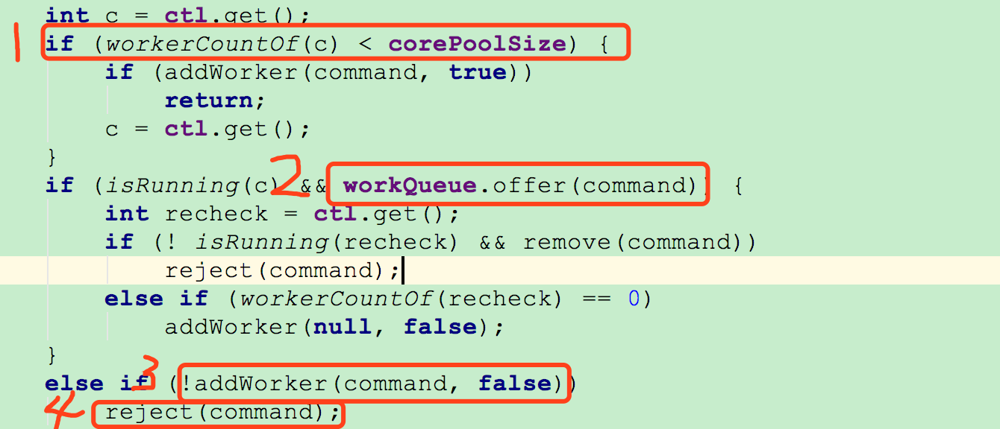

①：判断当前活跃线程数是否小于corePoolSize,如果小于，则调用addWorker创建线程执行任务

②：如果不小于corePoolSize，则将任务添加到workQueue队列。

③：如果放入workQueue失败，则创建线程执行任务，如果这时创建线程失败(当前线程数不小于maximumPoolSize时)，就会调用reject(内部调用handler)拒绝接受任务。

> 1. 在什么样的线程中执行任务
>
> **Exectors.newFixedThreadPool(int size)：**创建一个**固定大小**的线程池。 每来一个任务创建一个线程，当线程数量为size将会停止创建。当线程池中的线程已满，继续提交任务，如果有空闲线程那么空闲线程去执行任务，否则将任务添加到一个无界的等待队列中。
> **Exectors.newCachedThreadPool():**创建一个可缓存的线程池。**对线程池的规模没有限制**，当线程池的当前规模超过处理需求时(比如线程池中有10个线程，而需要处理的任务只有5个)，那么将回收空闲线程。当需求增加时则会添加新的线程。
> **Exectors.newSingleThreadExcutor():**创建一个**单线程的Executor**,它创建单个工作者线程来执行任务，**如果这个线程异常结束，它会创建另一个线程来代替**。
> **Exectors.newScheduledThreadPool():**创建一个固定长度的线程池，而且以延迟或定时的方式来执行任务。
>
> 2. 任务按照什么顺序来执行(FIFO,LIFO,优先级)
>
>    lockingQueue,提交的任务都先放到该队列中。如果传入不同的BlockQueue就可以实现不同的执行顺序。传入LinkedBlockingQueue则表示先来先服务，传入PriorityBlockingQueue则使用优先级来处理任务
>
> 3. 最多有多少个任务能并发执行
>
>    ThreadPoolExecutor在初始化是并不会马上创建corePoolSize个线程对象，它使用的是懒加载模式。
>
>    - 当线程数小于corePoolSize时,提交一个任务创建一个线程(即使这时有空闲线程)来执行该任务。
>    - 当线程数大于等于corePoolSize，首选将任务添加等待队列workQueue中（这里的workQueue是上面的BlockingQueue），等有空闲线程时，让空闲线程从队列中取任务。
>    - 当等待队列满时，如果线程数量小于maximumPoolSize则创建新的线程，否则使用拒绝线程处理器来处理提交的任务
>
> 4. 最多有多个任务等待执行
>
>    这个问题和BlockingQueue相关。  BlockingQueue有三个子类，一个是ArrayBlockingQueue(有界队列),一个是LinkedBlockingQueue(默认无界，但可以配置为有界)，PriorityBlockingQueue(默认无界，可配置为有界)。所以，对于有多少个任务等待执行与传入的阻塞队列有关。
>
>    **newFixedThreadPool**和**newSingleThreadExector**使用的是LinkedBlockingQueue的无界模式。而**newCachedThreadPool**使用的是SynchronousQueue，这种情况下线程是不需要排队等待的，SynchronousQueue适用于线程池规模无界。
>
> 5. 如果系统过载则需要拒绝一个任务，如何通知任务被拒绝？
>
>    当有界队列被填满或者某个任务被提交到一个已关闭的Executor时将会启动饱和策略，即使用RejectedExecutionHandler来处理。JDK中提供了几种不同的RejectedExecutionHandler的实现：AbortPolicy，CallerRunsPolicy, DiscardPolicy和DiscardOldestPolicy。
>
>    **AbortPolicy：**默认的饱和策略。该策略将抛出未检查的**RejectedExcutionException**,调用者可以捕获这个异常，然后根据自己的需求来处理。
>
>    **DiscardPolicy：**该策略将会抛弃提交的任务
>
>    **DiscardOldestPolicy：**该策略将会抛弃下一个将被执行的任务(处于队头的任务)，然后尝试重新提交该任务到等待队列
>
>    **CallerRunsPolicy:**该策略既不会抛弃任务也不会抛出异常，而是在调用execute()的线程中运行任务。比如我们在主线程中调用了execute(task)方法，但是这时workQueue已经满了，并且也不会创建的新的线程了。这时候将会在主线程中直接运行execute中的task。
>
> 6. 在执行一个任务之前或之后需要进行哪些操作 ?
>
>    **ThreadPoolExecutor**是可扩展的，它提供了几个可以重载的方法：**beforeExecute**,**afterExecute**和**terminated**,这里用到了面向的切面编程的思想。无论任务是从run中正常返回，还是抛出异常而返回，**afterExectue**都会被调用。如果 **beforeExecute**中抛出了一个 **RunntimeException**,那么任务将不会被执行，并且 **afterExecute**也不会被调用。
>
> ------> 线程池中shutdown()和shutdownNow()方法的区别
>
> shutdown只是将线程池的状态设置为SHUTWDOWN状态，正在执行的任务会继续执行下去，没有被执行的则中断。**
>
> **而shutdownNow则是将线程池的状态设置为STOP，正在执行的任务则被停止，没被执行任务的则返回。**

有三种方法可以结束线程：

- 1.设置退出标志，使线程正常退出，也就是当run()方法完成后线程终止，**比如使用一个volatile 的变量；**
- 2.使用interrupt()方法中断线程，包含两种情况(a)当线程阻塞时，抛出InterruptedException 异常，捕获这个异常，然后退出，(b)不阻塞情况下，使用函数isInterrupt()函数判断，如果为true就退出；
- 3.使用stop方法强行终止线程，使用它们是极端不安全的！不推荐使用，类似于断电关电脑（不推荐使用，Thread.stop,  Thread.suspend, Thread.resume 和Runtime.runFinalizersOnExit  这些终止线程运行的方法已经被废弃，）

### Netty是如何使用线程池的？

> https://www.jianshu.com/p/2c3f2253e30c

## 5、HashMap ConcurrentHashMap

https://blog.csdn.net/huaxun66/article/details/53036625

https://cloud.tencent.com/developer/article/1393485

https://juejin.im/post/5dee6f54f265da33ba5a79c8

https://juejin.im/post/5df8d7346fb9a015ff64eaf9

* HashMap采用链地址法解决哈希冲突，多线程访问哈希表的位置并修改映射关系的时候，头插法，后执行的线程会覆盖先执行线程的修改，所以不是线程安全的。

  **HashMap的原理，HashMap存储数据的时候，是取的key值的哈希值，然后计算数组下标，采用链地址法解决冲突，然后进行存储；取数据的时候，依然是先要获取到hash值，找到数组下标，然后for遍历链表集合，进行比较是否有对应的key。比较关心的有2点：*1.*不管是put还是get的时候，都需要得到key的哈希值，去定位key的数组下标； *2.*在get的时候，需要调用equals方法比较是否有相等的key存储过 。    所以没有重写equal方法与hashCode方法时， put 两次 (new TestA() ,1) ，由于new对象内存分配地址不一样，所以key不一样，map中数组下标不一样，即时hash碰撞放到链表中，get时用 eauals( Object默认比较内存分配地址) 还是两个值。 所以对象需要重写 hashcode 保证同一对象在map数组下标一致，重新equals 保证两个对象为相同值。  保证每个对象唯一性   !! put 自定义对象一定要重写，不然同一个对象内存地址不同，找不到数据**

* Hashtable采用synchronized关键字解决了并发访问的安全性问题但是效率较低，所有线程竞争同一把锁。

* SynchronizedMap线程安全，其实是保持外部同步来实现的，效率也很低。

* ConcurrentHashMap JDK7使用了线程锁分段技术，它包含一个segment数组，将数据分段存储，给每一段数据配一把锁，每次访问只允许一个线程修改哈希表的映射关系，所以是线程安全的而且效率高。

https://blog.csdn.net/stone_tomcate/article/details/100110453

**从以下几个方面来阐述：**

* 数据结构

>  HashMap 

​		哈希数组(解决查找速度)+链表（解决Hash碰撞）+JDK8红黑树（优化Hash碰撞下查找速度） 

​		允许键值为null

​		**HashMap扩展因子缘由**

 ```java
// 初始容量，加载因子。
加载因子是哈希表在其容量自动增加之前可以达到多满的一种尺度，它衡量的是一个散列表的空间的使用程度，负载因子越大表示散列表的装填程度越高，反之愈小。
对于使用链表法的散列表来说，查找一个元素的平均时间是 O(n)，因此如果负载因子越大，对空间的利用更充分，然而后果是查找效率的降低；如果负载因子太小，那么散列表的数据将过于稀疏，对空间造成严重浪费
  
// 随着HashMap中元素的数量越来越多，发生碰撞的概率就越来越大，所产生的链表长度就会越来越长，这样势必会影响HashMap的速度，为了保证HashMap的效率，系统必须要在某个临界点进行扩容处理。该临界点在当HashMap中元素的数量等于table数组长度*加载因子。
  
//  什么时候resize呢？
  Capacity：HashMap当前长度。
LoadFactor：负载因子，默认值0.75f。
// 扩容过程
  扩容：创建一个新的Entry空数组，长度是原数组的2倍。
    ReHash：遍历原Entry数组，把所有的Entry重新Hash到新数组。
  1.7之前是头插法，容易死循环   1.8之后尾插法，解决了死循环问题， 但是由于没有锁，put  get 还是线程不安全
  
// 你那知道为啥初始大小是16么？
因为在使用是2的幂的数字的时候，Length-1的值是所有二进制位全为1，这种情况下，index的结果等同于HashCode后几位的值。   ** 2的幂的数字的时候，Length-1的值是所有二进制位全为1  15 = 1111 **
只要输入的HashCode本身分布均匀，Hash算法的结果就是均匀的。 这是为了实现均匀分布。

// new HashMap(1000) , 可以存放1000 个数据不扩容吗？
在 tableSizeFor() 方法中，通过逐步位运算，就可以让返回值，保持在 2 的 N 次幂。以方便在扩容的时候，快速计算数据在扩容后的新表中的位置。
虽然 HashMap 初始容量指定为 1000，会被 tableSizeFor() 调整为 1024，但是它只是表示 table 数组为 1024，扩容的重要依据扩容阈值会在 resize() 中调整为 768（1024 * 0.75）
 // new HashMap(10000) , 可以存放10000 个数据不扩容吗？ 
  tableSizeFor() 后， 初始容量为 就会变成 2 的 14 次幂 16384，再算上负载因子 0.75f，实际在不触发扩容的前提下，可存储的数据容量是 12288（16384 * 0.75f）
  https://blog.csdn.net/zzzgd_666/article/details/98033866
 ```

> ConcurrentHashMap  

​		JDK7     **ReentrantLock+Segment+HashEntry **   哈希数组分成16个桶，每个桶加锁达到安全与并发

​        **Segment里有两个volatile变量：count和table；HashEntry里有一个volatile变量：value**

​		JDK8      **synchronized+CAS+HashEntry+红黑树 **   加锁粒度更细致，为哈希数组中HashEntry

​	   **Node类成员变量Node的元素val和指针next都标注volatile，目的是在多线程环境下线程A修改结点的val或者新增节点的时候是对线程B可见的。 ConcurrentHashMap有成员变量transient volatile Node<K,V>[] table，目的是为了使Node数组在扩容的时候对其他线程具有可见性而加的volatile。（例如：volatile int array[10]是指array的地址是volatile的而不是数组元素的值是volatile的.）**

* 安全性

HashMap  put 不安全，  resize可能会闭环，导致死循环

ConcurrentHashMap线程安全，**Unsafe和CAS，乐观锁**弱一致性， 但逻辑不安全疏忽会使方法不安全

**Java7在多线程操作HashMap时可能引起死循环，原因是扩容转移后前后链表顺序倒置，在转移过程中修改了原来链表中节点的引用关系。 因为resize的赋值方式，也就是使用了**单链表的头插入方式，同一位置上新元素总会被放在链表的头部位置**，在旧数组中同一条Entry链上的元素，通过重新计算索引位置后，有可能被放到了新数组的不同位置上。****使用头插**会改变链表的上的顺序，但是如果**使用尾插**，在扩容时会保持链表元素原本的顺序，就不会出现链表成环的问题了**

**Java8在同样的前提下并不会引起死循环，原因是扩容转移后前后链表顺序不变，保持之前节点的引用关系。**

> 那是不是意味着Java8就可以把HashMap用在多线程中呢？

我认为即使不会出现死循环，但是通过源码看到put/get方法都没有加同步锁，多线程情况最容易出现的就是：无法保证上一秒put的值，下一秒get的时候还是原值，所以线程安全还是无法保证。

* 迭代器

HashMap 迭代过程中，修改map结构，则抛出了ConcurrentModificationException，**因为HashMap包含一个修改计数器，当你调用他的next()方法来获取下一个元素时，迭代器将会用到这个计数器**

ConcurrentHashMap Iterator对象的使用，不一定是和其它更新线程同步，获得的对象可能是更新前的对象，允许一边更新、一边遍历，也就是说在Iterator对象遍历的时候，也可以进行remove,put操作，且遍历的数据会随着remove,put操作产出变化。   **原因是由于 在clear、迭代器和get方法中没有加锁**，**遍历的时候都能获得最新的值----> volatile 关键字**

```java
// 使用的都是线程安全类，为什么操作完毕后发现线程不安全？
int key = map.get("key").incrementAndGet();
map.put("key", new AtomicInteger(key));
// 单个看是线程安全的，但是代码逻辑组合起来没有保证原子操作。
map.get("key").incrementAndGet();
```

```
ConcurrentHashMap 源码解读
https://blog.csdn.net/qq_41737716/article/details/90549847#_123
https://www.jianshu.com/p/31f773086e98
```

## 6、并发

### Unsafe类

> https://www.cnblogs.com/wangzhongqiu/p/8441458.html
>
> java不能直接访问操作系统底层，而是通过本地方法来访问。Unsafe类提供了硬件级别的原子操作
>
> https://www.cnblogs.com/tong-yuan/p/Unsafe.html

* ##### 实例化一个类

* ##### 修改私有字段的值

* ##### 抛出checked异常

* ##### 使用堆外内存

* ##### CAS功能 - 比较obj的offset处内存位置中的值和期望的值 compareAndSwap，无锁线程安全

Java中java.util.concurrent.atomic包下面的原子变量类就是使用了乐观锁的一种实现方式CAS实现

* ##### 阻塞/唤醒线程

### CAS

```
加锁是一种悲观的策略，它总是认为每次访问共享资源的时候，总会发生冲突，所以宁愿牺牲性能（时间）来保证数据安全。

       无锁是一种乐观的策略，它假设线程访问共享资源不会发生冲突，所以不需要加锁，因此线程将不断执行，不需要停止。一旦碰到冲突，就重试当前操作直到没有冲突为止。

       无锁的策略使用一种叫做比较交换的技术（CAS Compare And Swap）来鉴别线程冲突，一旦检测到冲突产生，就重试当前操作直到没有冲突为止。

  在CAS的核心算法中，通过死循环不断获取最新的E。如果在此之间，V被修改了两次，但是最终值还是修改成了旧值V，这个时候，就不好判断这个共享变量是否已经被修改过。为了防止这种不当写入导致的不确定问题，原子操作类提供了一个带有时间戳的原子操作类。

 带有时间戳的原子操作类AtomicStampedReferenc
 当带有时间戳的原子操作类AtomicStampedReference对应的数值被修改时，除了更新数据本身外，还必须要更新时间戳。
	当AtomicStampedReference设置对象值时，对象值以及时间戳都必须满足期望值，写入才会成功。因此，即使对象值被反复读写，写回原值，只要时间戳发生变化，就能防止不恰当的写入。

```

### volatile

```java
// 对于可见性，Java提供了volatile关键字来保证引用可见性、指令有序性。但不保证原子性

1）它确保指令重排序时不会把其后面的指令排到内存屏障之前的位置，也不会把前面的指令排到内存屏障的后面；即在执行到内存屏障这句指令时，在它前面的操作已经全部完成；
2）它会强制将对缓存的修改操作立即写入主存；
3）如果是写操作，它会导致其他CPU中对应的缓存行无效。
    
实现原理----如果对声明了volatile变量进行写操作时，JVM会向处理器发送一条Lock前缀的指令，将这个变量所在缓存行的数据写会到系统内存。 这一步确保了如果有其他线程对声明了volatile变量进行修改，则立即更新主内存中数据。  Lock前缀指令实际上相当于一个内存屏障（也成内存栅栏），它确保指令重排序时不会把其后面的指令排到内存屏障之前的位置  

// 普通的共享变量不能保证可见性，因为普通共享变量被修改之后，什么时候被写入主存是不确定的，当其他线程去读取时，此时内存中可能还是原来的旧值，因此无法保证可见性。 volatile关键字对于基本类型的修改可以在随后对多个线程的读保持一致，但是对于引用类型如数组，实体bean，仅仅保证引用的可见性，但并不保证引用内容的可见性。。
  
// volatile解决的是多线程间共享变量的可见性问题，而保证不了多线程间共享变量原子性问题。
// 对于多线程的i++,++i,依然还是会存在多线程问题,volatile是无法解决的 
// ！！！！！！！！！！！ ** 内存屏障是插入在写操作之后的指令 **  ！！！！！！！！！！！
//所以多线程 i++ , 同时读到都是0，加一后陆续写入，i最终值为1，不能保障原子性
```

```java
// AtomicInteger = volatile + CAS
private volatile int count = 0;
private static long offset;
private static Unsafe unsafe;

static {
        try {
            Field f = Unsafe.class.getDeclaredField("theUnsafe");
            f.setAccessible(true);
            unsafe = (Unsafe) f.get(null);
            offset = unsafe.objectFieldOffset(Counter.class.getDeclaredField("count"));
        } catch (NoSuchFieldException e) {
            e.printStackTrace();
        } catch (IllegalAccessException e) {
            e.printStackTrace();
        }
    }

    public void increment() {
        int before = count;
        // 失败了就重试直到成功为止
        while (!unsafe.compareAndSwapInt(this, offset, before, before + 1)) {
            before = count;
        }
    }

    public int getCount() {
        return count;
    }

    public static void main(String[] args) throws InterruptedException {
        Counter counter = new Counter();
        ExecutorService threadPool = Executors.newFixedThreadPool(100);

        // 起100个线程，每个线程自增10000次
        IntStream.range(0, 100)
                .forEach(i -> threadPool.submit(() ->
                        IntStream.range(0, 10000).forEach(j ->
                                counter.increment())));

        threadPool.shutdown();

        // 打印1000000
        System.out.println(counter.getCount());
    }
```

### volatile 与 synchronized 关键字的不同

一旦一个共享变量（类的成员变量、类的静态成员变量）被 volatile 修饰之后，那么就具备了两层语义：
1）保证了不同线程对这个变量进行操作时的可见性，即一个线程修改了某个变量的值，这新值对其他线程来说是立即可见的。
2）禁止进行指令重排序。
**volatile 本质是在告诉 jvm 当前变量在寄存器（工作内存）中的值是不确定的，需要从主存中读取；**

**synchronized 则是锁定当前变量，只有当前线程可以访问该变量，其他线程被阻塞住。**

1.volatile 仅能使用在变量级别；synchronized 则可以使用在变量、方法、和类级别的;
2.volatile 仅能实现变量的修改可见性，并不能保证原子性；synchronized 则可以保证变量的修改可见性和原子性;
3.volatile 不会造成线程的阻塞；synchronized 可能会造成线程的阻塞;
4.volatile 标记的变量不会被编译器优化；synchronized 标记的变量可以被编译器优化。

### i++ ++i 引深

```java
int x = 1;
int y = 1;
int a = x++;   //先赋值 后自增
int b = ++y;   //先自增 后赋值

System.out.println(x);      // 2
System.out.println(a);      // 1
System.out.println(y);      // 2
System.out.println(b);      // 2

i++和++i的线程安全分为两种情况：
1、如果i是局部变量（在方法里定义的），那么是线程安全的。因为局部变量是线程私有的，别的线程访问不到，其实也可以说没有线程安不安全之说，因为别的线程对他造不成影响。
2、如果i是全局变量，则同一进程的不同线程都可能访问到该变量，因而是线程不安全的，会产生脏读。
------> 引深到线程共享与线程非共享区域
++i和i++都不是线程安全的，都不是原子操作
如何解决：
  乐观锁    AtomicInteger = volatile + CAS
  悲观锁    ReentrantLock    synchronized
```

### JVM内存，线程共享与非共享

> https://blog.csdn.net/weixin_35713860/article/details/82656972

JVM 将内存区域划分为 Method Area（Non-Heap）（方法区） ,Heap（堆） , Program Counter  Register（程序计数器） ,   VM Stack（虚拟机栈，也有翻译成JAVA 方法栈的）,Native Method Stack  （ 本地方法栈 ），其中Method Area 和  Heap 是**线程共享**的  ，VM Stack，Native Method Stack  和Program Counter Register  是**非线程共享**。

**JVM初始运行的时候都会分配好 Method Area（方法区） 和Heap（堆） ，而JVM 每遇到一个线程，就为其分配一个 Program Counter Register（程序计数器） ,   VM Stack（虚拟机栈）和Native Method Stack   （本地方法栈），  当线程终止时，三者（虚拟机栈，本地方法栈和程序计数器）所占用的内存空间也会被释放掉。这也是为什么我把内存区域分为线程共享和非线程共享的原因，非线程共享的那三个区域的生命周期与所属线程相同，而线程共享的区域与JAVA程序运行的生命周期相同，所以这也是系统垃圾回收的场所只发生在线程共享的区域（实际上对大部分虚拟机来说知发生在Heap上）的原因**

### ThreadLocal 与高并发容器总结

> 并发总结 ：https://blog.csdn.net/zimiao552147572/article/details/90273511
>
> 高并发容器总结 ：https://blog.csdn.net/sihai12345/article/details/82788068

> ThreadLocalMap. Entry 是一个包含 key 和 value 的一个对象，**Entry的key为ThreadLocal，value为ThreadLocal对应的值，只不过是对这个Entry做了一些特殊处理，即 使用 WeakReference<ThreadLocal>将 ThreadLocal对象变成一个弱引用的对象，这样做的好处就是在线程销毁的时候，对应的实体就会被回收，不会出现内存泄漏**
>
> **在每个Thread中包含 ThreadLocal.ThreadLocalMap** . **ThreadLocalMap的key是ThreadLocal的对象，value是独享数据**
>
> **ThreadLocal 所操作的是当前线程的 ThreadLocalMap 对象中的 table 数组，并把操作的 ThreadLocal 作为键存储。**

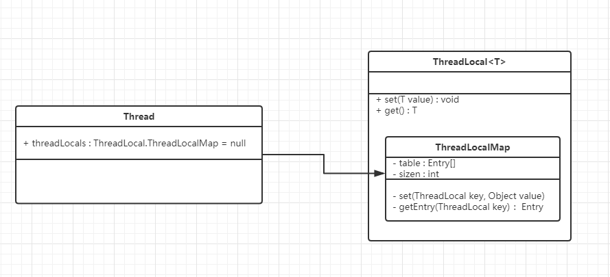

```java
public void set(T value) {
        Thread t = Thread.currentThread();
        ThreadLocalMap map = getMap(t);
        if (map != null)
            map.set(this, value);
        else
            createMap(t, value);
    }
```

实现多线程安全地使用同一份对象数据，每个线程使用的都是ThreadLocal中存储的对象数据的拷贝副本**

* 所以当多线程中每个线程都要操作同一个对象/数据时，会出现数据同步安全问题，因此可以通过把对象数据存到ThreadLocal中，然后每个线程再从ThreadLocal取出该对象/数据，每个线程从 ThreadLocal取出的对象/数据实际都是存进ThreadLocal中的对象/数据的拷贝副本。

* Spring框架中操作单例对象是安全的。

  **Spring框架底层会使用ThreadLocal把存进来的单例对象进行拷贝副本，变成多个对象，操作安全**

>  ThreadLocal出现OOM内存溢出
>
>  ThreadLocalMap使用**ThreadLocal的弱引用作为key**，如果一个ThreadLocal没有外部强引用来引用它，那么系统 GC  的时候，这个ThreadLocal势必会被回收，这样一来，ThreadLocalMap中就会出现key为null的Entry，就没有办法访问这些key为null的Entry的value，如果当前线程再迟迟不结束的话，这些key为null的Entry的value就会一直存在一条强引用链：Thread Ref -> Thread -> ThreaLocalMap -> Entry ->  value永远无法回收，造成内存泄漏。
>
>  当把threadlocal实例置为null以后，没有任何强引用指向threadlocal实例，所以threadlocal将会被gc回收。 但是，我们的**value却不能回收**，而这块value永远不会被访问到了，所以存在着内存泄露。因为存在一条从current  thread连接过来的强引用。只有当前thread结束以后，current thread就不会存在栈中，强引用断开，Current  Thread、Map value将全部被GC回收。最好的做法是将调用threadlocal的remove方法
>
>  在ThreadLocal的get(),set(),remove()的时候都会清除线程ThreadLocalMap里所有key为null的value
>
>  **完全避免内存泄漏的唯一手段就是在ThreadLocal用完后，调用remove()方法。**

```java
脏数据

线程复用会产生脏数据。由于结程池会重用Thread对象，那么与Thread绑定的类的静态属性ThreadLocal变量也会被重用。如果在实现的线程run()方法体中不显式地调用remove() 清理与线程相关的ThreadLocal信息，那么倘若下一个结程不调用set() 设置初始值，就可能get() 到重用的线程信息，包括 ThreadLocal所关联的线程对象的value值。
内存泄漏

通常我们会使用使用static关键字来修饰ThreadLocal（这也是在源码注释中所推荐的）。在此场景下，其生命周期就不会随着线程结束而结束，寄希望于ThreadLocal对象失去引用后，触发弱引用机制来回收Entry的Value就不现实了。如果不进行remove() 操作，那么这个线程执行完成后，通过ThreadLocal对象持有的对象是不会被释放的。

以上两个问题的解决办法很简单，就是在每次用完ThreadLocal时， 必须要及时调用 remove()方法清理。
父子线程共享线程变量

//通常用ThreadLocal来透传全局上下文，会发现子线程的value和主线程不一致！！！！  这就需要使用InheritableThreadLocal来解决父子线程之间共享线程变量的问题，使整个连接过程中的一致。
  
// Synchronized用于线程间的数据共享，而ThreadLocal则用于线程间的数据隔离,为每个线程都提供了变量的副本
```

### synchronized实现原理

**何为锁？ 到底锁住了什么来保证线程安全？**

> **synchronized 作用于不同方法时，锁住的对象亦不同。**
>
> **锁住了对象中对象头信息，加锁。   其他线程无法访问有锁的对象，只能等待。**

- [synchronized作用于实例方法]      锁住了当前实例对象
- [synchronized作用于静态方法]      锁住了当前 类class
- [synchronized同步代码块]              锁住传入的实例对象

**如果一个线程A调用一个实例对象的非static synchronized方法，而线程B需要调用这个实例对象所属类的静态 synchronized方法，是允许的，不会发生互斥现象，因为访问静态 synchronized 方法占用的锁是当前类的class对象，而访问非静态 synchronized 方法占用的锁是当前实例对象锁**

> https://blog.csdn.net/javazejian/article/details/72828483
>
> https://www.jianshu.com/p/e62fa839aa41

**在JVM中，对象在内存中分为三个区域： 对象头、实例数据、对齐填充**


### JAVA Monitor 

> 监视器用来监视线程进入这个特别房间，他确保同一时间只能有一个线程可以访问特殊房间中的数据和代码。

当一个消费者(线程)使用了这个房间，首先他必须到一个大厅(Entry  Set)等待，调度程序将基于某些标准(e.g.FIFO)将从大厅中选择一个消费者(线程)，进入特殊房间，如果这个线程因为某些原因被“挂起”，它将被调度程序安排到“等待房间”，并且一段时间之后会被重新分配到特殊房间，按照上面的线路，这个建筑物包含三个房间，分别是“特殊房间”、“大厅”以及“等待房间”。 

ObjectMonitor对象中有两个队列：_WaitSet 和 _EntryList，用来保存ObjectWaiter对象列表；_

**_EntryList：所有在等待获取锁的线程的对象，也就是说如果有线程处于等待获取锁的状态的时候，将被挂入这个队列。**

**WaitSet：主要存放所有wait的线程的对象，也就是说如果有线程处于wait状态，将被挂入这个队列。**

**_owner指向获得ObjectMonitor对象的线程。**

**在 “Entry Set”中等待的线程状态是 “Waiting for monitor entry”，而在 “Wait Set”中等待的线程状态是 “in Object.wait()”。**

 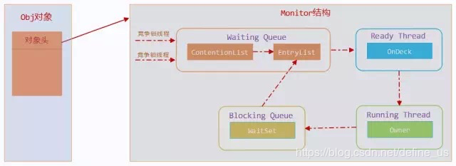

 **jstack 查看线程状态， wait 是 WaitSet   Waiting on condition 是 EntryList**

### Lock原理->AQS算法

> https://www.cnblogs.com/aspirant/p/8657681.html
>
> 源码解读： http://www.blogjava.net/zhanglongsr/articles/356782.html 

### AQS

> https://segmentfault.com/a/1190000017372067  详细！！

```
AQS 全称为AbstractQueuedSynchronizer，它提供了一个FIFO队列，可以看成是一个用来实现同步锁以及其他涉及到同步功能的核心组件，常见的有:ReentrantLock、CountDownLatch等。
AQS是一个抽象类，主要是通过继承的方式来使用，它本身没有实现任何的同步接口，仅仅是定义了同步状态的获取以及释放的方法来提供自定义的同步组件。
可以这么说，只要搞懂了AQS，那么J.U.C中绝大部分的api都能轻松掌握。

从使用层面来说，AQS的功能分为两种：独占和共享

 独占锁，每次只能有一个线程持有锁，比如前面给大家演示的ReentrantLock就是以独占方式实现的互斥锁
 共享锁，允许多个线程同时获取锁，并发访问共享资源，比如ReentrantReadWriteLock
```

* 独占锁

>  https://www.cnblogs.com/takumicx/p/9338983.html

* 共享锁

> https://www.cnblogs.com/xiaoxi/p/9140541.html

### CyclicBarrier 与 CountDownLatch 区别

* CountDownLatch 是一次性的，CyclicBarrier 是可循环利用
* CountDownLatch 参与的线程的职责是不一样的，有的在倒计时，有的在等待倒计时结束。CyclicBarrier 参与的线程职责是一样的。

### synchronized与Lock的区别

> 

```mysql
-- synchronized使用Object对象本身的notify、wait、notifyAll调度机制，    JVM层面
-- lock可以使用Condition进行线程之间的调度，完成synchronized实现所有功能   JDK层面

1）用法不一样。在需要同步的对象中加入synchronized控制，synchronized既可以加在方法上，也可以加在特定代码中，括号中表示需要锁的对象。而Lock需要显示的指定起始位置和终点位置。synchronized是托管给JVM执行的，而Lock的锁定是通过代码实现的，它有比synchronized更精确的线程定义

2）性能不一样。在JDK 5中增加的ReentrantLock。它不仅拥有和synchronized相同的并发性和内存语义，还增加了锁投票，定时锁，等候和中断锁等。它们的性能在不同情况下会不同：在资源竞争不是很激励的情况下，synchronized的性能要优于ReentrantLock，带在资源紧张很激烈的情况下，synchronized的性能会下降的很快，而ReentrantLock的性能基本保持不变。

3）锁机制不一样。synchronized获得锁和释放锁的机制都在代码块结构中，当获得锁时，必须以相反的机制去释放，并且自动解锁，不会因为异常导致没有被释放而导致死锁。而Lock需要开发人员手动去释放，并且写在finally代码块中，否则会可能引起死锁问题的发生。此外，Lock还提供的更强大的功能，可以通过tryLock的方式采用非阻塞的方式取获得锁。

(synchronized 字节码指令   悲观锁
那图上有2个monitorexit呀？synchronized锁释放有两种机制，一种就是执行完释放；另外一种就是发送异常，虚拟机释放。图中第二个monitorexit就是发生异常时执行的流程，而且，从图中我们也可以看到在第13行，有一个goto指令，也就是说如果正常运行结束会跳转到19行执行  )

(Lock 三个特性 
1.等待可中断，持有锁的线程长期不释放的时候，正在等待的线程可以选择放弃等待，这相当于Synchronized来说可以避免出现死锁的情况。通过lock.lockInterruptibly()来实现这个机制。
2.公平锁，多个线程等待同一个锁时，必须按照申请锁的时间顺序获得锁，Synchronized锁非公平锁，ReentrantLock默认的构造函数是创建的非公平锁，可以通过参数true设为公平锁，但公平锁表现的性能不是很好。
3.锁绑定多个条件，一个ReentrantLock对象可以同时绑定对个对象。ReenTrantLock提供了一个Condition（条件）类，用来实现分组唤醒需要唤醒的线程们，而不是像synchronized要么随机唤醒一个线程要么唤醒全部线程。
 
--  ReentrantLock的实现基于AQS AQS的本质上是一个同步器/阻塞锁的基础框架，其作用主要是提供加锁、释放锁，并在内部维护一个FIFO等待队列，用于存储由于锁竞争而阻塞的线程。


-- ReentrantLock 可重入性
(1) 当一个线程在获取锁过程中，先判断state的值是否为0，如果是表示没有线程持有锁，就可以尝试获取锁（不一定获取成功）。
(2) 当state的值不为0时，表示锁已经被一个线程占用了，这时会做一个判断current == getExclusiveOwnerThread()（这个方法返回的是当前持有锁的线程），这个判断是看当前持有锁的线程是不是自己，如果是自己，那么将state的值加1就可以了，表示重入返回即可。

```

### synchronized优化

* 自旋锁

* 锁消除
* 锁粗化
* 偏向锁  (只要一个线程)
* 轻量级锁 （多个线程加入）

> **锁升级过程**
>
> https://www.cnblogs.com/linghu-java/p/8944784.html

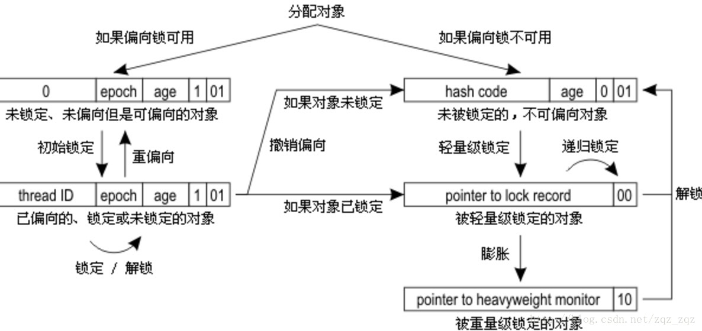

1. 检测Mark Word里面是不是当前线程的ID，如果是，表示当前线程处于偏向锁 
2. 如果不是，则使用CAS将当前线程的ID替换Mard Word，如果成功则表示当前线程获得偏向锁，置偏向标志位1 
3. 如果失败，则说明发生竞争，撤销偏向锁，进而升级为轻量级锁。 
4. 当前线程使用CAS将对象头的Mark Word替换为锁记录指针，如果成功，当前线程获得锁 
5. 如果失败，表示其他线程竞争锁，当前线程便尝试使用自旋来获取锁。 
6. 如果自旋成功则依然处于轻量级状态。 
7. 如果自旋失败，则升级为重量级锁。

### CopyOnWriteArrayList

**读写分离的思想，读和写对应不同的容器**

https://blog.csdn.net/u013452337/article/details/90238052

```java
两个使用CopyOnWrite机制实现的并发容器,它们是CopyOnWriteArrayList和CopyOnWriteArraySet。

当我们往一个容器添加元素的时候，不直接往当前容器添加，而是先将当前容器进行Copy，复制出一个新的容器，然后向新的容器里添加元素，添加完元素之后，再将原容器的引用指向新的容器。这样做的好处是我们可以对CopyOnWrite容器进行并发的读，而不需要加锁，因为在当前读的容器中不会添加任何元素。所以CopyOnWrite容器是一种读写分离的思想，读和写对应不同的容器。
```

```java
 // 这个数组是核心的，因为用volatile修饰了
    // 只要把最新的数组对他赋值，其他线程立马可以看到最新的数组
    private transient volatile Object[] array;
 
    public boolean add(E e) {
        final ReentrantLock lock = this.lock;
        lock.lock();
        try {
            Object[] elements = getArray();
            int len = elements.length;
            // 对数组拷贝一个副本出来
            Object[] newElements = Arrays.copyOf(elements, len + 1);
            // 对副本数组进行修改，比如在里面加入一个元素
            newElements[len] = e;
            // 然后把副本数组赋值给volatile修饰的变量
            setArray(newElements);
            return true;
        } finally {
            lock.unlock();
        }
    }
```

### Feature到CompletableFuture

Feature

异步执行，返回执行结果的引用，当运算结束后，这个引用被返回给调用方。

get方法去获取操作的结果。如果操 作已经完成，该方法会立刻返回操作的结果，否则它会阻塞你的线程，直到操作完。重载版本的get方法，它接受一个超时的参数

CompletableFuture

> https://www.cnblogs.com/cjsblog/p/9267163.html
>
> https://blog.csdn.net/wangdong5678999/article/details/81842451

- 简化异步编程的复杂性，并且提供了函数式编程的能力，可以通过回调的方式处理计算结果，也提供了转换和组合 CompletableFuture 的方法。
- 它可能代表一个明确完成的Future，也有可能代表一个完成阶段（ CompletionStage ），它支持在计算完成以后触发一些函数或执行某些动作。
- 它实现了Future和CompletionStage接口

### Join

```
  for (int m = 0; m < 10; m++) {
            Thread t = new Thread(new Runnable() {
                @Override
                public void run() {
                    for (int p = 0; p < 4000; p++) {
                        System.out.println("i：" + i.get());
                        i.getAndIncrement();
                        System.out.println("k: " + k);
                        k++;
                    }
                }
            });
            t.start();
            t.join();
        }
        System.out.println("最终i： --------------" + i);
        System.out.println("最终k: --------------" + k);
没有join， 主线程直接数据最终值， 发现不是预期值， 因为子线程还没有结束， 加上join就好了

t.join()方法阻塞调用此方法的线程(calling thread)进入 TIMED_WAITING 状态，直到线程t完成，此线程再继续；

通常用于在main()主线程内，等待其它线程完成再结束main()主线程
```

### ！---如何解决三高问题？ 需要

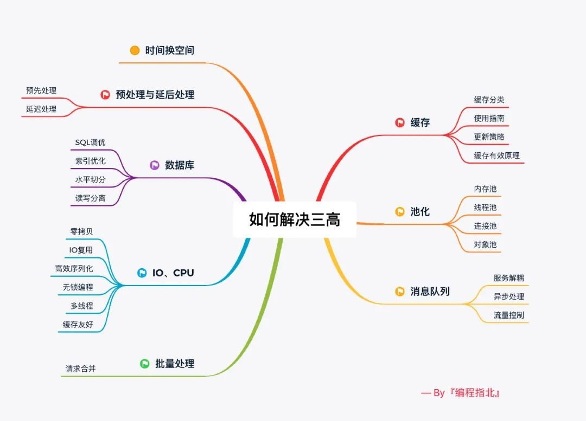

### COW 在 linux  java应用

> https://www.jianshu.com/p/8dced9de1742

## 7、NIO-多路复用选择器

#### NIO 与堆外内存

* 写NIO程序经常使用ByteBuffer来读取或写入数据，这是一种基于通道与缓冲区的I/O方式。它可以使用Native函数库直接分配堆外内存，通过存储在堆内的DirectByteBuffer对象作为这块内存的引用，提高性能，避免在堆和Native堆来回复制数据
* **ByteBuffer.allocate() 分配JVM堆内存，属于GC管辖范围，需要拷贝所以速度相对较慢**
* **ByteBuffer.allocateDirect() 分配操作系统本地内存，不属于GC管辖范围，不需要内存拷贝所以速度相对较快**


#### 从IO阻塞/非阻塞模型到轮询机制

> 操作系统内核对于I/O只有两种方式：阻塞和非阻塞。
>
> 调用阻塞I/O时，应用程序需要等待I/O完成才返回结果，阻塞I/O的一个特点是调用之后一定要等到系统内核层面完成所有操作后，调用才结束。
>
> 调用非阻塞I/O跟阻塞I/O的差别为调用之后立即返回，返回后，CPU的时间片可以用来处理其他事务，此时性能是提升的。但是非阻塞I/O的问题是：由于完整的I/O没有完成，立即返回的并不是业务层期望的数据，而仅仅是当前调用的状态。为了获取完整的数据，应用程序需要重复调用I/O操作来确认是否完成。**这种重复调用判断操作是否完成的技术叫做轮询。**
>
> 轮询技术主要有以下四种：
>
> 1、read 
>
> 最原始、性能最低，通过重复调用来检查I/O的状态来完成完整数据的读取。在得到数据前，CPU一直好用在等待上。
>
> 2、select
>
> 改进了read，通过对文件描述符上的事件状态来进行判断。有一个较弱的限制为由于它采用一个1024长度的数组来存储状态，所以它最多可以同时检查1024个文件描述符。
>
> 3、poll
>
> 对select改进，采用链表方式避免数组长度的限制，其次它能避免不需要的检查。担当文件描述符较多时，它的性能还是低下。
>
> 4、epoll
>
> LInux下效率最高的I/O事件通知机制，在进入轮询的时候如果没有检查到I/O事件，将会进行休眠，直到事件发生将它唤醒。它是真实利用了事件通知、执行回调的方式，而不是遍历查询，所以不会浪费CPU，执行效率较高。
>
> ** 多路复用 IO 模型，建立在多路事件分离函数 Select，Poll，Epoll 之上。**

**同步IO和异步IO的区别就在于：**数据拷贝的时候进程是否阻塞        内核态

**阻塞IO和非阻塞IO的区别就在于：**应用程序的调用是否立即返回     API层

**Linux中套接字也是文件**，当server端监听到有连接时，应用程序会请求内核创建Socket，Socket创建好后会返回一个文件描述符给应用程序，当有数据包过来网卡时，内核会通过数据包的源端口，源ip，目的端口等在内核维护的一个ipcb双向链表中找到对应的Socket，并将数据包赋值到该Socket的缓冲区，应用程序请求读取Socket中的数据时，内核就会将数据拷贝到应用程序的内存空间，从而完成读取Socket数据。

**事件驱动机制**

> https://www.cnblogs.com/aspirant/p/8630283.html


#### 零拷贝的实现原理

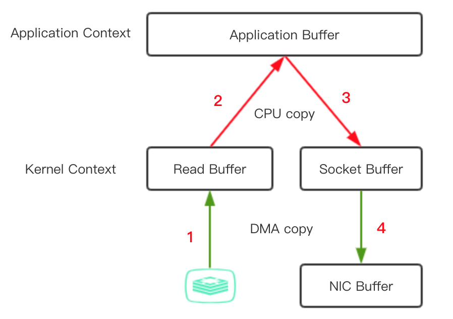

```java
第一步：当用户请求www.test.com/index.html网页时，nginx服务器通过网卡接收到请求后，系统调用read导致了从用户空间到内核空间的上下文切换，内核再向磁盘发送关于Index.html的请求，DMA模块从磁盘中读取index.html（以下简称为数据）发送到内核缓冲区，完成第一次复制。

第二步：系统调用read返回，导致从内核空间到用户空间的上下文切换，此时数据已存放在用户缓冲区中，完成第二次复制。

第三步：系统调用write导致了从用户空间到内核空间的上下文切换，此时数据存放在了内核空间与socket相关的特定缓冲区中（注意这里要将第一步中的内核缓冲区区分开来），完成第三次复制。

第四步：系统再次调用返回，导致了第四次上下文切换，数据来到了相关协议引擎，完成了第四次复制。再有相关引擎返回给用户浏览器。
```

  ####sendfile 零拷贝##

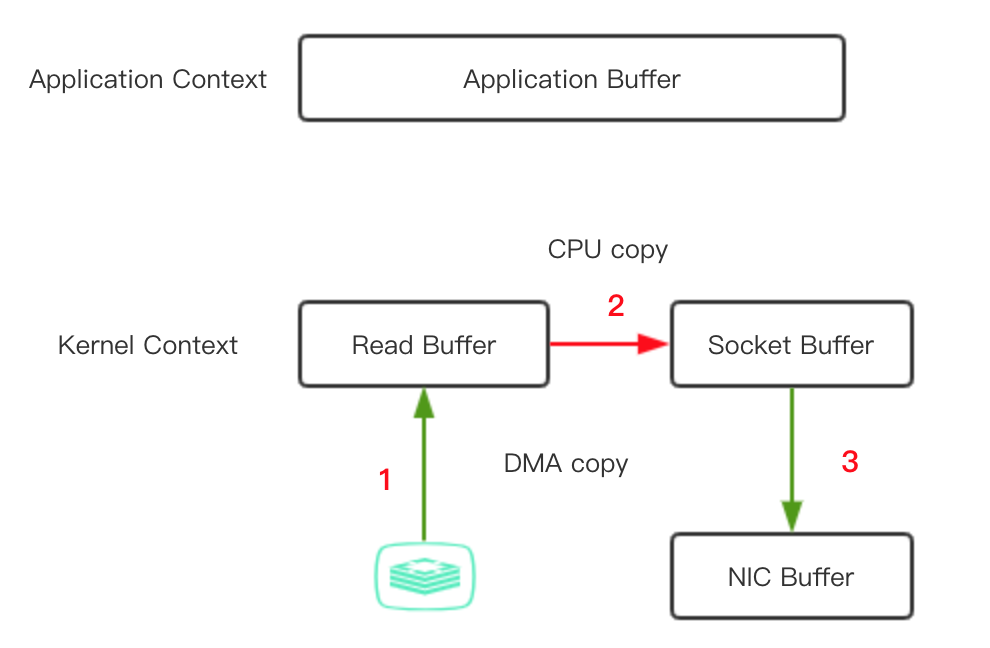

```java
如上图中的红色箭头，sendfile机制实际上就是节省了从内核空间到用户空间，再从用户空间到内核空间这个往返的过程，相比于传统的方式节省了一次数据的复制，提高了访问效率。它的大致步骤是：

第一步：从磁盘到内核空间，完成第一次复制。

第二步：从内核空间到socket buffer（注意这里的缓冲区也要和传统方式中第三部的socket区别开来，可以理解为另一块与socket相关的特定缓冲区），完成第二次复制。

第三步：数据从socket buffer到协议相关引擎，完成第三次复制。

自内核版本号2.1，引进了sendfile2.4之后，sendfile实现了更简单的方式，不同之处在于，文件到达内核缓冲区后，不必再将数据全部复制到socket buffer缓冲区，//而只将记录数据位置和长度相关的数据保存到socket buffer，而数据实际由DMA模块直接发送给协议相关引擎，再次降低了复制操作。
  
**！！！ 在 Linux 2.4 版本，对 sendfile 进行了优化，直接通过 DMA 将磁盘文件数据读取到 socket 缓存，真正实现了 ”0” 拷贝。前面 mmap 和 2.1 版本的 sendfile 实际上只是消除了用户空间和内核空间之间拷贝，而页缓存和 socket 缓存之间的拷贝依然存在。**  
```

#### MMAP 内存映射

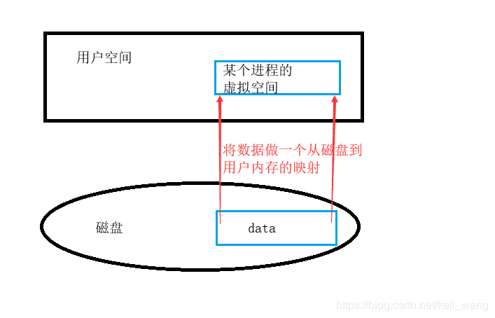

```java
用户的虚拟地址空间中寻找空闲的一段地址进行对文件的操作，不必再调用read、write系统调用，
  //它的最终目的是将磁盘中的文件映射到用户进程的虚拟地址空间，实现用户进程对文件的直接读写，减少了文件复制的开销，提高了用户的访问效率。
```

#### DirectByteBuffer ？ Native Memory ？MMAP  区别与联系

> https://blog.csdn.net/ctwy291314/article/details/84872271       Native Memory
>
> https://blog.csdn.net/xiaoduanayu/article/details/83715391        DirectByteBufferMMAP 区别
>
> *直接内存（**Direct Memory**）*和*本地内存（**Native Memory**）*。

    JVM管理的内存可以总体划分为两部分：Heap Memory和Native Memory。前者我们比较熟悉，是供Java应用程序使用的；后者也称为C-Heap，是供JVM自身进程使用的。Heap Memory及其内部各组成的大小可以通过JVM的一系列命令行参数来控制，在此不赘述。Native Memory没有相应的参数来控制大小，其大小依赖于操作系统进程的最大值（对于32位系统就是3~4G，各种系统的实现并不一样），以及生成的Java字节码大小、创建的线程数量、维持java对象的状态信息大小（用于GC）以及一些第三方的包，比如JDBC驱动使用的native内存。

Native Memory里存些什么？

> 1.管理java heap的状态数据（用于GC）;
> 2.JNI调用，也就是Native Stack;
> 3.JIT（即使编译器）编译时使用Native Memory，并且JIT的输入（Java字节码）和输出（可执行代码）也都是保存在Native Memory；
> 4.**NIO direct buffer**。对于IBM JVM和Hotspot，都可以通过-XX:MaxDirectMemorySize来设置nio直接缓冲区的最大值。默认是64M。超过这个时，会按照32M自动增大。
> 5.对于IBM的JVM某些版本实现，类加载器和类信息都是保存在Native Memory中的。

DirectBuffer的好处

    DirectBuffer访问更快，避免了从HeapBuffer还需要从java堆拷贝到本地堆，操作系统直接访问的是DirectBuffer。DirectBuffer对象的数据实际是保存在native heap中，但是引用保存在HeapBuffer中。
    另外，DirectBuffer的引用是直接分配在堆得Old区的，因此其回收时机是在FullGC时。因此，需要避免频繁的分配DirectBuffer，这样很容易导致Native Memory溢出。

为什么会内存溢出？

    简单理解java process memory = java heap + native memory。因此内存溢出时，首先要区分是堆内存溢出还是本地内存溢出。Native Memory本质上就是因为耗尽了进程地址空间。对于HotSpot JVM来书，不断的分配直接内存，会导致如下错误信息：Allocated 1953546760 bytes of native memory before running out
Java NIO中有三种`ByteBuffer`

1. `HeapByteBuffer`：`ByteBuffer.allocate()`使用的就是这种缓冲区，**叫堆缓冲区，因为它是在JVM堆内存的，支持GC和缓存优化。但是它不是页对齐的，也就是说如果要使用JNI的方式调用native代码时，JVM会先将它拷贝到页对齐的缓冲空间。**
2. `DirectByteBuffer`：`ByteBuffer.allocateDirect()`方法被调用时，**JVM使用C语言的`malloc()`方法分配堆外内存。由于不受JVM管理，这个内存空间是页对齐的且不支持GC，和native代码交互频繁时使用这种缓冲区能提高性能。不过内存分配和销毁的事就要靠你自己了。**
3. `MappedByteBuffer`：`FileChannel.map() `调用返回的就是这种缓冲区，**这种缓冲区用的也是堆外内存，本质上其实就是对系统调用`mmap()`的封装，以便通过代码直接操纵映射物理内存数据。**

#### 磁盘IO 网络IO

* 对于磁盘文件访问的操作，可以采用线程池方式，并设置线程上线，从而避免整个 JVM 线程池污染，进而导致线程和 CPU 资源耗尽。

* 对于网络间远程调用。为了避免服务间调用的全链路故障，要设置合理的 TImeout 值，高并发场景下可以采用熔断机制。


## 8、锁与Mysql锁机制

#### 锁

https://blog.csdn.net/FansUnion/article/details/78011811

#### !!! MVCC

> https://blog.csdn.net/w2064004678/article/details/83012387

#### 3NF 

* 第一范式的目标是确保每列的原子性:如果每列都是不可再分的最小数据单元（也称为最小的原子

  单元），则满足第一范式（1NF）

* 首先满足第一范式，并且表中非主键列不存在对主键的部分依赖。 第二范式要求每个表只描述一

  件事情

* 第三范式定义是，满足第二范式，并且表中的列不存在对非主键列的传递依赖。除了主键订单编

  号外，顾客姓名依赖于非主键顾客编号。

#### 数据库幂等操作

* 利用数据库的主键唯一约束实现幂等
* 为更新的数据设置前置条件。 如之前状态，之前版本号

#### 为何用事务？

```java
// 事务：是数据库操作的最小工作单元，是作为单个逻辑工作单元执行的一系列操作；这些操作作为一个整体一起向系统提交，要么都执行、要么都不执行；事务是一组不可再分割的操作集合（工作逻辑单元）；

事务的四大特性：
1 、原子性 
事务是数据库的逻辑工作单位，事务中包含的各操作要么都做，要么都不做 
2 、一致性 
事 务执行的结果必须是使数据库从一个一致性状态变到另一个一致性状态。因此当数据库只包含成功事务提交的结果时，就说数据库处于一致性状态。如果数据库系统 运行中发生故障，有些事务尚未完成就被迫中断，这些未完成事务对数据库所做的修改有一部分已写入物理数据库，这时数据库就处于一种不正确的状态，或者说是 不一致的状态。 
3 、隔离性 
一个事务的执行不能其它事务干扰。即一个事务内部的操作及使用的数据对其它并发事务是隔离的，并发执行的各个事务之间不能互相干扰。 
4 、持续性 
也称永久性，指一个事务一旦提交，它对数据库中的数据的改变就应该是永久性的。接下来的其它操作或故障不应该对其执行结果有任何影响。 

//引深到 分布式事务  最终一致性 两阶段提交 三阶段提交
```

#### 事务的隔离级别

> https://blog.csdn.net/FansUnion/article/details/78011811

#### 分布式锁

>  https://www.cnblogs.com/aspirant/p/9200492.html

#### 分布式事务：从CAP到BASE理论到最终一致性

> https://mp.weixin.qq.com/s/hqkoMu8JIgzIthxGRtB9Nw

#### MyISAM与InnoDB对比

> https://www.cnblogs.com/y-rong/p/8110596.html
>
> 1、MyISAM不支持事务，InnoDB是事务类型的存储引擎，当我们的表需要用到事务支持的时候，那肯定是不能选择MyISAM了。
>
> 2、MyISAM只支持表级锁，BDB支持页级锁和表级锁默认为页级锁，而InnoDB支持行级锁和表级锁默认为行级锁 
>
> 3.在写多读少的应用中还是Innodb插入性能更稳定，在并发情况下也能基本，如果是对读取速度要求比较快的应用还是选MyISAM

#### Innodb的索引实现为什么是B+树？

二叉查找树 -> 平衡二叉树 -> B 树 -> B+ 树

```java
// 平衡二叉树可是每个节点只存储一个键值和数据的。
那说明什么？说明每个磁盘块仅仅存储一个键值和数据！那如果我们要存储海量的数据呢？可以想象到二叉树的节点将会非常多，高度也会极其高，我们查找数据时也会进行很多次磁盘 IO，我们查找数据的效率将会极低！

// B 树（Balance Tree） 每个节点存储了更多的键值（key）和数据（data
 B树相对于平衡二叉树，每个节点存储了更多的键值（key）和数据（data），并且每个节点拥有更多的子节点，子节点的个数一般称为阶.

//  B+ 树
//B+ 树非叶子节点上是不存储数据的，仅存储键值，而 B 树节点中不仅存储键值，也会存储数据。
之所以这么做是因为在数据库中页的大小是固定的，InnoDB 中页的默认大小是 16KB。如果不存储数据，那么就会存储更多的键值，相应的树的阶数（节点的子节点树）就会更大，树就会更矮更胖，如此一来我们查找数据进行磁盘的 IO 次数又会再次减少，数据查询的效率也会更快。  
//因为 B+ 树索引的所有数据均存储在叶子节点，而且数据是按照顺序排列的。B+ 树中各个页之间是通过双向链表连接的，叶子节点中的数据是通过单向链表连接的。
  
```

**二叉搜索树查询效率无疑是最高的，因为平均来说每次比较都能缩小一半的搜索范围，但是一般在数据库索引的实现上却会选择 B 树或 B+ 树而不用二叉搜索树，为什么呢？**

这就涉及到数据库的存储介质了，数据库的数据和索引都是存放在磁盘，并且是 InnoDB 引擎是以页为基本单位管理磁盘的，一页一般为 16 KB。AVL 或红黑树搜索效率虽然非常高，**但是同样数据项，它也会比 B、B+ 树更高，高就意味着平均来说会访问更多的节点，即磁盘IO次数！**

> “
>
> 根据 Google 工程师 Jeff Dean 的统计，访问内存数据耗时大概在 100 ns，访问磁盘则是 10,000,000 ns。
>
> ”

所以表面上来看我们使用 B、B+ 树没有 二叉查找树效率高，但是实际上由于 B、B+ 树降低了树高，减少了磁盘 IO 次数，反而大大提升了速度。

**这也告诉我们，没有绝对的快和慢，系统分析要抓主要矛盾，先分析出决定系统瓶颈的到底是什么，然后才是针对瓶颈的优化。**

#### 聚集索引 VS 非聚集索引

* 聚集索引

以 InnoDB 作为存储引擎的表，表中的数据都会有一个主键，即使你不创建主键，系统也会帮你创建一个隐式的主键

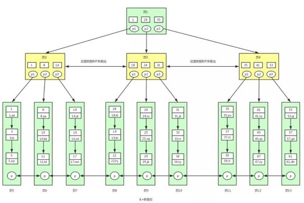

* 非聚集索引

以主键以外的列值作为键值构建的 B+ 树索引，我们称之为非聚集索引。

查找过程：  **存储的是键值和主键的键值对**

根据键值会找到主键值 ，找到主键后需要再到聚集索引中查找具体对应的数据信息

##### 引深到索引失效规则

* 最左匹配原则
* 查询条件中有or
* like查询是以'%'开头
* 对查询的列上有运算或者函数的

```mysql
SELECT name,age,address FROM user where substr(name,-2)='aa'
```

* 如果列类型是字符串，那一定要在条件中将数据使用引号引用起来,否则不使用索引
* 左连接查询或者右连接查询查询关联的字段编码格式不一样
* 连接查询中，按照优化器顺序的第一张表不会走索引

```
从上面三个连接查询来看只有左外连接a表没有用到索引的，这就是因为由于是左外连接，所以优化器的执行顺序是a表、b表，也就是说首先全表扫描a表，再根据a表的name查询b表的值，所以a表无法用到索引。
```

#### 慢查询定位与解决思路

> https://mp.weixin.qq.com/s/u_oT9sUfDzNt2vPsUH65KQ
>
> 1.扫描行数
>  2.过滤性好
>  3.过滤性好了，但是扫描层数+回表可能也会比较大
>  4.虚拟列，联合索引

- 全表扫描    					 --->    增加索引

- **全索引扫描**                     --->    可能会扫整个索引树      用到索引，但是数据还是很多

- **索引过滤性不好             --->     5.5 版本之前  联合索引（name,age)   查询非聚集索引 name 找出主键， 回表，过滤age 结果** 

- **频繁回表的开销**             --->     5.6版本 index condition pushdown    查询非聚集索引 name，过滤age，回表    

  ​												   5.7 版本	更佳方案：  虚拟列    （更紧凑的索引）

```mysql
-- 虚拟列
CREATE TABLE `t_people`(
`id` int(11) DEFAULT NULL,
`name` varchar(20) DEFAUT NULL,
`name_first` varchar(2) GENERATED ALWAYS AS (left(`name`,1)) VIRTUAL,KEY `name_first`(`name_first`,'age')
) ENGINE=InnoDB DEFAULT CHARSET=utf8;
```


## 9、JAVA内存模型--JMM->JVM->GC

### 1、JMM

> https://blog.csdn.net/aA518189/article/details/100176280
>
> https://blog.csdn.net/wangdong5678999/article/details/80960051

在说Java内存模型之前，需要了解硬件的内存模型和指令重排序

从冯·诺伊曼计算机结构到CPU、内存、高速缓存（在多核cpu中，每个处理器都有各自的高速缓存(L1,L2,L3)，而主内存确只有一个）。高速缓存解决了CPU与内存一快一慢的矛盾，但是引来新的问题——缓存一致性。——>  多个处理器运算涉及到同一个内存区域时，多线程场景下会存在缓存一致性问题，那么怎么解决这个问题呢？  ——> 各个处理器需遵循MESI协议（写屏障和读屏障）运行时保证数据一致性 ！

> 为什么需要内存屏障 ?
>
> 多处理器操作系统中，每个处理器都会有自己的缓存，可能存在不同处理器缓存不一致的问题，而且由于操作系统可能存在重排序，导致读取到错误的数据，因此，操作系统提供内存屏障以解决这种问题
>
> 1、阻止屏障两侧指令重排序
>
> 2、读屏障:在指令前插入读屏障，可以让高速缓存中的数据失效，强制从主内存取。
>
> 3、写屏障:强制把写缓冲区/高速缓存中的脏数据等写回主内存，让缓存中相应的数据失效。
>
> Java提供了 volatile 关键字，volatile通过在读写操作前后添加内存屏障。
>
> 1.可见性，对于一个该变量的读，一定能看到读之前最后的写入。
>
> 2.有序性，读写操作前后添加内存屏障，禁止指令重排序，happens before原则
>
> 3.原子性，对volatile变量的读写具有原子性，即单纯读和写的操作，都不会受到干扰。

提到这么多计算机内存模型，是因为Java内存模型的设定符合来计算机规范。**Write once run anywhere实现的前提是Java内存模型（Java Memory Model ,JMM)屏蔽了各种硬件和操作系统的访问差异的，保证了Java程序在各种平台下对内存的访问都能保证效果一致的机制及规范。**

**JMM是JVM的一种规范，定义了JVM的内存模型，屏蔽了访问差异，不像C那样直接访问硬件内存，相对安全很多。 Java内存模型是围绕着在并发过程中如何处理原子性、 可见性和有序性这3个特征来建立的，它的主要目的是解决由于多线程通过共享内存进行通信时，存在的本地内存数据不一致，编译器会对代码指令重排序，处理器会对代码乱序执行带来的问题。可以保证并发场景下原子性，可见性，有序性。**

----------Java内存数据区域分为五大数据区域，这些区域各有各的用途，创建及销毁时间----------


1. 计数器

   保证**线程执行切换的时候就可以在上次执行的基础上继续执行（每个线程独有计数器）**也是唯一一个没有OOM异常的区域。

2. 虚拟机栈

   每个方法被执行的时候都会**创建一个栈帧用于存储局部变量表，操作栈，动态链接，方法出口等信息**。每一个方法被调用的过程就对应一个栈帧在虚拟机栈中从入栈到出栈的过程（对象的引用）

3. 本地方法栈

   本地方法栈是与虚拟机栈发挥的作用十分相似,**区别是虚拟机栈执行的是Java方法(也就是字节码)服务，而本地方法栈则为虚拟机使用到的native方法服务**

4. 堆

   **堆是java虚拟机管理内存最大的一块内存区域，因为堆存放的对象是线程共享的，所以多线程的时候也需要同步机制，所有new出来的对象都存在堆中。**

5. 方法区

   方法区是所有线程共享的内存区域，方法区逻辑上属于堆的一部分,为了区分堆,又被称为非堆

   **用于存储已被虚拟机加载的类信息、常量、静态变量，如static修饰的变量加载类的时候就被加载到方法区中。**

   > **PermGen（永久代）**在java.lang.OutOfMemoryError: PermGen space 这个异常。这里的 PermGen  space其实指的就是方法区。不过方法区和PermGen space又有着本质的区别。前者是 JVM 的规范，而后者则是 JVM  规范的一种实现，并且只有 HotSpot 才有 PermGen space
   >
   > jdk1.7运行时常量池从永久代移除。从String.interns()方法可以看出来，放到堆中
   >
   > **jdk8真正开始废弃方法区永久代，而使用元空间(Metaspace)**

   #### 关于方法区/永久代及JDK8的元空间注意！！！！

   ```java
   JDK 1.6下，会出现PermGen Space的内存溢出，而在 JDK 1.7和 JDK 1.8 中，会出现堆内存溢出，并且 JDK 1.8中 PermSize 和 MaxPermGen 已经无效
   
   元空间的本质和永久代类似，都是对JVM规范中方法区的实现。/*不过元空间与永久代之间最大的区别在于：元空间并不在虚拟机中，而是使用本地内存。因此，默认情况下，元空间的大小仅受本地内存限制*/，但可以通过以下参数来指定元空间的大小
   		-XX:MetaspaceSize，初始空间大小，达到该值就会触发垃圾收集进行类型卸载，同时GC会对该值进行调整：如果释放了大量的空间，就适当降低该值；如果释放了很少的空间，那么在不超过MaxMetaspaceSize时，适当提高该值。
   　　-XX:MaxMetaspaceSize，最大空间，默认是没有限制的。
   
   　　除了上面两个指定大小的选项以外，还有两个与 GC 相关的属性：
   　　-XX:MinMetaspaceFreeRatio，在GC之后，最小的Metaspace剩余空间容量的百分比，减少为分配空间所导致的垃圾收集
   　　-XX:MaxMetaspaceFreeRatio，在GC之后，最大的Metaspace剩余空间容量的百分比，减少为释放空间所导致的垃圾收集
   
   //为什么要做这个转换？
   　	 1、字符串存在永久代中，容易出现性能问题和内存溢出。
   　　2、类及方法的信息等比较难确定其大小，因此对于永久代的大小指定比较困难，太小容易出现永久代溢出，太大则容易导致老年代溢出。
   　　3、永久代会为 GC 带来不必要的复杂度，并且回收效率偏低。    
   ```

### 2、Java类加载机制

> https://www.cnblogs.com/aspirant/p/7200523.html


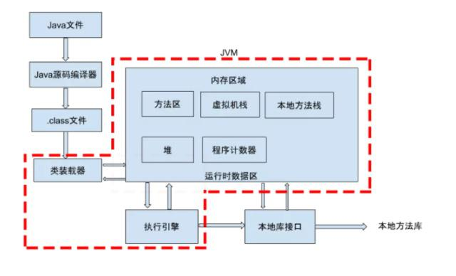

 (1) 装载：查找和导入Class文件；   ---- 双亲委派原则

 (2) 链接：把类的二进制数据合并到JRE中；

​	(a)校验：检查载入Class文件数据的正确性；

​	(b)准备：给类的静态变量分配存储空间；

​	(c)解析：将符号引用转成直接引用；

 (3) 初始化：**对类的静态变量，静态代码块执行初始化操作**

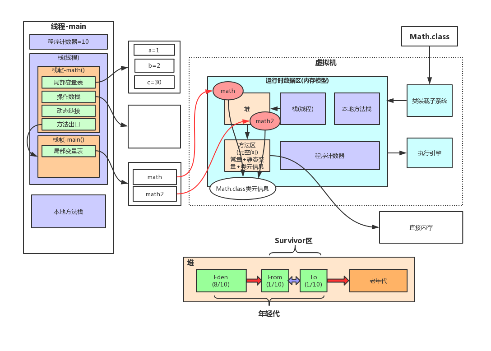

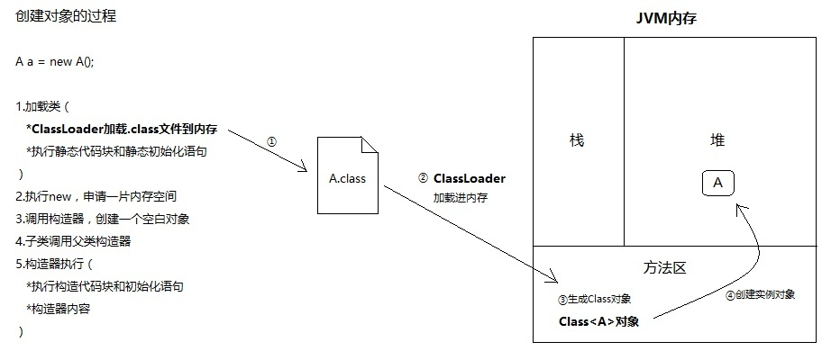

**首先JVM会启动，你的代码会编译成一个.class文件，然后被类加载器加载进jvm的内存中，你的类Object加载到方法区中，创建了Object类的class对象到堆中。   字节码文件 -- 双亲委派原则**

#### 对象一定是在堆中分配的吗？

> https://blog.csdn.net/w372426096/article/details/80938788
>
> https://msd.misuland.com/pd/3255817963235712812
>
> 一个Java的源代码文件变成计算机可执行的机器指令的过程中，需要经过两段编译，第一段是把.java文件转换成.class文件(Javac 命令)。 第二段编译是把.class转换成机器指令的过程 （为了优化JVM的解释器执行速度，引入了 JIT（即时编译） 技术-- >JIT优化中最重要的一个就是逃逸分析

1、全局逃逸（GlobalEscape）

即一个对象的作用范围逃出了当前方法或者当前线程，有以下几种场景：

- 对象是一个静态变量
- 对象是一个已经发生逃逸的对象
- 对象作为当前方法的返回值

2、参数逃逸（ArgEscape）

即一个对象被作为方法参数传递或者被参数引用，但在调用过程中不会发生全局逃逸，这个状态是通过被调方法的字节码确定的。

3、没有逃逸

即方法中的对象没有发生逃逸。

针对上面第三点，当一个对象没有逃逸时，可以得到以下几个虚拟机的优化。

**1) 锁消除**

我们知道线程同步锁是非常牺牲性能的，当编译器确定当前对象只有当前线程使用，那么就会移除该对象的同步锁。

例如，StringBuffer 和 Vector 都是用 synchronized 修饰线程安全的，但大部分情况下，它们都只是在当前线程中用到，这样编译器就会优化移除掉这些锁操作。

锁消除的 JVM 参数如下：

- 开启锁消除：-XX:+EliminateLocks
- 关闭锁消除：-XX:-EliminateLocks

锁消除在 JDK8 中都是默认开启的，并且锁消除都要建立在逃逸分析的基础上。

**2) 标量替换**

首先要明白标量和聚合量，基础类型和对象的引用可以理解为标量，它们不能被进一步分解。而能被进一步分解的量就是聚合量，比如：对象。

对象是聚合量，它又可以被进一步分解成标量，将其成员变量分解为分散的变量，这就叫做标量替换。

这样，如果一个对象没有发生逃逸，那压根就不用创建它，只会在栈或者寄存器上创建它用到的成员标量，节省了内存空间，也提升了应用程序性能。

标量替换的 JVM 参数如下：

- 开启标量替换：-XX:+EliminateAllocations
- 关闭标量替换：-XX:-EliminateAllocations
- 显示标量替换详情：-XX:+PrintEliminateAllocations

标量替换同样在 JDK8 中都是默认开启的，并且都要建立在逃逸分析的基础上。

**3) 栈上分配**

当对象没有发生逃逸时，该对象就可以通过标量替换分解成成员标量分配在栈内存中，和方法的生命周期一致，随着栈帧出栈时销毁，减少了 GC 压力，提高了应用程序性能。

**其实在现有的虚拟机中，并没有真正的实现栈上分配，对象没有在堆上分配，其实是标量替换实现的。**

开发过程中就要可尽可能的控制变量的作用范围了，变量范围越小越好，让虚拟机尽可能有优化的空间

#### 双亲委派原则

```java
①启动类加载器(BootStrap Class Loader)
引导类装入器是用本地代码实现的类装入器，它负责将 <Java_Runtime_Home>/lib下面的核心类库或-Xbootclasspath选项指定的jar包加载到内存中。由于引导类加载器涉及到虚拟机本地实现细节，开发者无法直接获取到启动类加载器的引用，所以不允许直接通过引用进行操作

②扩展类加载器(Extension Class Loader)
扩展类加载器是由Sun的ExtClassLoader（sun.misc.Launcher$ExtClassLoader）实现的。它负责将< Java_Runtime_Home >/lib/ext或者由系统变量-Djava.ext.dir指定位置中的类库加载到内存中,其实就是加载扩展的jre。开发者可以直接使用标准扩展类加载器。

③系统类加载器(System Class Loader)
系统类加载器是由 Sun的 AppClassLoader（sun.misc.Launcher$AppClassLoader）实现的。它负责将系统类路径java -classpath或-Djava.class.path变量所指的目录下的类库加载到内存中。开发者可以直接使用系统类加载器
```

某个特定的类加载器在接收到加载类的任务请求时，首先将加载任务委托给父类加载器进行加载，然后父类加载器又向上委托，以此类推一直到加载任务处于BootStrap Class Loader中，其中如果父类加载器可以执行加载则加载成功或直接返回，若父类没有成功加载，则由子类加载器进行加载，再次以此类推

* 可以避免重复加载，父类已经加载了，子类就不需要再次加载

* 更加安全，很好的解决了各个类加载器的基础类的统一问题，如果不使用该种方式，那么用户可以随意定义类加载器来加载核心api，会带来相关隐患。

(1)可以不可以自己写个String类

答案：不可以，因为 根据类加载的双亲委派机制，会去加载父类，父类发现冲突了String就不再加载了;

(2)能否在加载类的时候，对类的字节码进行修改

答案：可以，使用Java探针技术，可以参考：[Java探针-Java Agent技术-阿里面试题](http://www.cnblogs.com/aspirant/p/8796974.html)

(3) JDBC 破坏双亲委派原则

理解一下为什么JDBC需要破坏双亲委派模式，**原因是原生的JDBC中Driver驱动本身只是一个接口，并没有具体的实现，具体的实现是由不同数据库类型去实现的。例如，MySQL的mysql-connector-*.jar中的Driver类具体实现的。 原生的JDBC中的类是放在rt.jar包的，是由启动类加载器进行类加载的，在JDBC中的Driver类中需要动态去加载不同数据库类型的Driver类，而mysql-connector-*.jar中的Driver类是用户自己写的代码，那启动类加载器肯定是不能进行加载的，既然是自己编写的代码，那就需要由应用程序启动类去进行类加载。于是乎，这个时候就引入线程上下文件类加载器(Thread Context ClassLoader)。有了这个东西之后，程序就可以把原本需要由启动类加载器进行加载的类，由应用程序类加载器去进行加载了。**

//callerCL为空的时候，其实说明这个ClassLoader是启动类加载器，但是这个启动类加载并不能识别rt.jar之外的类，这个时候就把callerCL赋值为Thread.currentThread().getContextClassLoader();也就是应用程序启动类

**一个Java Agent既可以在程序运行前加载，也可以在程序运行后加载**

* 通过JVM参数 `-javaagent:**.jar`启动，程序启动的时候，会优先加载Java Agent，并执行其 `premain`方法
* 程序启动之后，通过某种特定的手段加载Java Agent，这个特定的手段就是 `VirtualMachine`的 `attach api`，这个api其实是JVM进程之间的的沟通桥梁，底层通过socket进行通信，JVM A可以发送一些指令给JVM B，B收到指令之后，可以执行对应的逻辑，**比如在命令行中经常使用的jstack、jcmd、jps等，很多都是基于这种机制实现的。**因为是进程间通信，所以使用 `attach api`的也是一个独立的Java进程

(3) 静态(static)成员何时才会初始化 ?

```java
private static int num = 11;
private static int num2;
private static final int num3 = 12

类加载的准备阶段会给所有static 成员在方法区中分配内存，并设置变量初始值
  
num2默认初始化为0，因为它没有显示初始化，之后不会再初始化num2的值了
//!【即准备阶段】num值也为0,在类加载的初始化阶段num才会执行类变量赋值的操作，初始化阶段num值为11;
//! 准备阶段num3的值就会被赋值为12而不是0，这是因为num3被final修饰 类字段的字段属性表中就存在ConstantValue属性，而准备阶段变量num3就会被初始化为ConstantValue属性所指定的值”
```

#### 自定义加载类实现热部署

热部署（hotswap），热部署是在不重启 Java 虚拟机的前提下，能自动侦测到 class 文件的变化，更新运行时 class  的行为。Java 类是通过 Java 虚拟机加载的，某个类的 class 文件在被 classloader 加载后，会生成对应的 Class  对象，之后就可以创建该类的实例。默认的虚拟机行为只会在启动时加载类，如果后期有一个类需要更新的话，单纯替换编译的 class 文件，Java  虚拟机是不会更新正在运行的 class。如果要实现热部署，最根本的方式是修改虚拟机的源代码，改变 classloader  的加载行为，使虚拟机能监听 class 文件的更新，重新加载 class 文件，这样的行为破坏性很大，为后续的 JVM 升级埋下了一个大坑。

**另一种友好的方法是创建自己的 classloader 来加载需要监听的 class，这样就能控制类加载的时机，从而实现热部署。**

 热部署步骤：

1、销毁自定义classloader(被该加载器加载的class也会自动卸载)；

2、更新class

3、使用新的ClassLoader去加载class 

OSGI的最关键理念就是应用模块（bundle）化，对于每一个bundle,都有其自己的类加载器，当需要更新bundle时，把bundle和它的类加载器一起替换掉，就可以实现模块的热替换

#### 什么时候出现类加载？实例化类方法

* 通过构造方法实例化一个类
* 通过Class实例化一个类
* 通过反射实例化一个类
* 通过克隆实例化一个类
* 通过反序列化实例化一个类
* 通过Unsafe实例化一个类

#### 类加载出现的隐形死锁！！

已知：虚拟机会保证一个类的`()`方法在多线程环境中被正确的加锁、同步，如果多个线程同时去初始化一个类，那么只会有一个线程去执行这个类的`()`方法，其他线程都需要阻塞等待，直到活动线程执行`()`方法完毕，**需要注意的是，其他线程虽然会被阻塞，但如果执行()方法的那条线程退出()方法后，其他线程唤醒之后不会再次进入()方法。同一个类加载器下，一个类型只会初始化一次。**

**类加载的时候初始化单例（静态成员变量、内部类等单例方法）。即借助了ClassLoader的线程安全机制。所谓ClassLoader的线程安全机制，就是ClassLoader的loadClass方法在加载类的时候使用了synchronized关键字。也正是因为这样， 除非被重写，这个方法默认在整个装载过程中都是同步的，也就是保证了线程安全。底层实现原理synchronized。 CAS 实现单例模式 **

> 此无法继续执行线程等待是一个在另外一个执行流中处于类加载的Class。进一步深入分析dump信息，又显示此Class类加载时竟然要获取一个业务级别的Lock，而这个Lock在执行不下去执行流，已在使用这个类前，已先行掌握到！

```
因为类加载作为一种含有特殊的隐含锁过程，执行流必须等待类加载完成，如果此类加载过程中，又去获取其它执行流可能先期占用的业务级别上的锁，则就容易在此类加载时出现类似隐性死锁现象。JAVA世界中又一死锁的可能场景！

后来解决起来也很简单，类加载时申请业务级别的锁，这种代码实现在我看来就是一种设计瑕疵，在不必要底层机制过程中反调、回调属于代码运行时中高层资源，存在设计上回路，应该避免在程序金字塔中出现飞线！

```

### 对象晋升分配原则

- 对象优先分配在Eden区，如果Eden区，如果Eden区没有足够的空间，虚拟机执行一次Minor GC。
- 大对象直接进入老年代，这样做的目的是为了避免在Eden区和两个Survivor区之间发生大量的内存拷贝。
- 长期存活的对象进入老年代。虚拟机给每个对象定义了一个对象年龄(Age)计数器。如果对象在Eden区出生并经过第一次Minor GC后仍然存活，并且能被Survivor容纳的话，将被移动到Survivor空间中，并将对象年龄设为1.对象在Survivor中每熬过一次Minor GC，年龄就将增加1岁，当他的年龄增加到一定程度(默认为15岁)时，就会被晋升到老年代中。
- 动态判断对象的年龄。如果Survivor区中相同年龄的所有对象大小总和大于Survivor空间的一半，年龄大于或等于该年龄的对象可直接进入老年代。
- 空间分配担保。每次进行Minor GC时，JVM会计算Survivor区移至老年去的对象的平均大小，如果这个值大于老年去的剩余值大小则进行一次Full GC，如果小于则进入检查HandlePromotionFailure逻辑。判断这个逻辑，如果是True则只进行Minor GC，如果是False则进行Full GC。

### 3、什么是GC？

#### 1、那些内存需要回收？

> java内存模型中分为五大区域已经有所了解。我们知道程序计数器、虚拟机栈、本地方法栈，由线程而生，随线程而灭，其中栈中的栈帧随着方法的进入顺序的执行的入栈和出栈的操作，一个栈帧需要分配多少内存取决于具体的虚拟机实现并且在编译期间即确定下来【忽略JIT编译器做的优化，基本当成编译期间可知】，当方法或线程执行完毕后，内存就随着回收，因此无需关心。
>
> 而Java堆、方法区则不一样。**GC垃圾回收主要集中在堆和方法区**，在程序运行期间，这部分内存的分配和使用都是动态的。方法区存放着类加载信息，但是一个接口中多个实现类需要的内存可能不太一样，一个方法中多个分支需要的内存也可能不一样【只有在运行期间才可知道这个方法创建了哪些对象没需要多少内存】，这部分内存的分配和回收都是动态的，GC关注的也正是这部分的内存。

#### 堆的回收区域（分代收集算法）

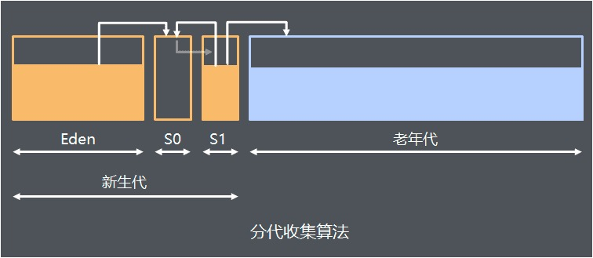

#### 是否存活算法

> https://blog.csdn.net/wangdong5678999/article/details/68931378

##### 堆是否存活

- **引用计数算法**（[reference-counting](https://link.zhihu.com/?target=http%3A//www.memorymanagement.org/glossary/r.html%23reference.counting)） ：每个对象有一个引用计数器，当对象被引用一次则计数器加1，当对象引用失效一次则计数器减1，对于计数器为0的对象意味着是垃圾对象，可以被GC回收。
- **可达性算法**(GC Roots Tracing)：从GC Roots作为起点开始搜索，那么整个连通图中的对象便都是活对象，对于GC Roots无法到达的对象便成了垃圾回收的对象，随时可被GC回收。

##### 那些可以作为GC Roots的对象

```java
- 虚拟机栈的栈帧的局部变量表所引用的对象；
- 本地方法栈的JNI（Java Native Interface）所引用的对象；
- 方法区的静态变量和常量所引用的对象；
```

##### 方法区是否存活

方法区主要回收的内容有：废弃常量和无用的类。

**对于废弃常量也可通过引用的可达性来判断，但是对于无用的类则需要同时满足下面3个条件：		**

- 该类所有的实例都已经被回收，也就是Java堆中不存在该类的任何实例；
- 加载该类的`ClassLoader`已经被回收；
- 该类对应的`java.lang.Class`对象没有在任何地方被引用，无法在任何地方通过反射访问该类的方法。

#### 3、GC基本原理

GC (Garbage  Collection)的基本原理：将内存中不再被使用的对象进行回收，GC中用于回收的方法称为收集器，由于GC需要消耗一些资源和时间，Java在对对象的生命周期特征进行分析后，按照新生代、旧生代的方式来对对象进行收集，以尽可能的缩短GC对应用造成的暂停

1. 对新生代的对象的收集称为minor GC；
2. 对旧生代的对象的收集称为Full GC；
3. 程序中主动调用System.gc()强制执行的GC为Full GC。
4. 不同的对象引用类型， GC会采用不同的方法进行回收，JVM对象的引用分为了四种类型： 
    （1）强引用：默认情况下，对象采用的均为强引用（这个对象的实例没有其他对象引用，GC时才会被回收） 
    （2）软引用：软引用是Java中提供的一种比较适合于缓存场景的应用（只有在内存不够用的情况下才会被GC） 
    （3）弱引用：在GC时一定会被GC回收 
    （4）虚引用：虚引用只是用来得知对象是否被GC

#### 4、什么时候触发GC

(1)程序调用System.gc时可以触发

(2)系统自身来决定GC触发的时机（根据Eden区和From Space区的内存大小来决定。当内存大小不足时，则会启动GC线程并停止应用线程）

```java
GC又分为 minor GC 和 Full GC (也称为 Major GC )

// Minor GC触发条件：当Eden区满时，触发Minor GC。

Full GC触发条件：

//  a.调用System.gc时，系统建议执行Full GC，但是不必然执行

//  b.老年代空间不足

//  c.方法区空间不足

//  d.通过Minor GC后进入老年代的平均大小 大于 老年代的可用内存

//  e.由Eden区、From Space区向To Space区复制时，对象大小大于To Space可用内存，则把该对象转存到老年代，且老年代的可用内存小于该对象大小
```
#### 5、垃圾收集算法

* 标记-清除算法
* 复制算法
* 标记-整理算法
* 分代收集算法

#### 垃圾方式的选择

jvm有client和server两种模式，这两种模式的gc默认方式是不同的：

    client模式下，新生代选择的是串行gc，旧生代选择的是串行gc
    server模式下，新生代选择的是并行回收gc，旧生代选择的是并行gc
    一般来说我们系统应用选择有两种方式：吞吐量优先和暂停时间优先，对于吞吐量优先的采用server默认的并行gc方式，对于暂停时间优先的选用并发gc（CMS）方式。
#### 6、垃圾收集器

* Serial (串型)
* Serial Old
* Parallel
* Parallel Old
* CMS(Concurrent Mark Sweep)收集器（标记-清理算法）


| young             | old            | 参数                                     |
| ----------------- | -------------- | ---------------------------------------- |
| Serial            | Serial old     | -XX:+UseSerialGC                         |
| ParNew            | Serial old     | -XX:+UseParNewGC                         |
| Parallel Scavenge | Serial old     | -XX:+UseParallelGC                       |
| Parallel Scavenge | Parallel Old   | -XX:+UseParallelOldGC                    |
| ParNew            | CMS+Serial Old | -XX:+UseConcMarkSweepGC                  |
| Serial            | CMS            | -XX:+UseConcMarkSweepGC -XX:-UseParNewGC |

**G1 垃圾回收器**

> 为什么G1可以做到回收时间用户可以设定? https://www.cnblogs.com/aspirant/p/8663872.html 
>
> **G1回收的第4步，它是“选择一些内存块”，而不是整代内存来回收，这是G1跟其它GC非常不同的一点，其它GC每次回收都会回收整个Generation的内存(Eden, Old), 而回收内存所需的时间就取决于内存的大小，以及实际垃圾的多少，所以垃圾回收时间是不可控的；而G1每次并不会回收整代内存，到底回收多少内存就看用户配置的暂停时间，配置的时间短就少回收点，配置的时间长就多回收点，伸缩自如。**

#### 看完这篇，全懂 

> https://blog.csdn.net/g6u8w7p06dco99fq3/article/details/104140285

#### 7、JVM参数

```java
// -Xms 
  初始堆大小，默认为物理内存的1/64(<1GB)；默认(MinHeapFreeRatio参数可以调整)空余堆内存小于40%时，JVM就会增大堆直到-Xmx的最大限制
// -Xmx
  最大堆大小，默认(MaxHeapFreeRatio参数可以调整)空余堆内存大于70%时，JVM会减少堆直到 -Xms的最小限制

// -Xmn
    新生代的内存空间大小，注意：此处的大小是（eden+ 2 survivor space)。与jmap -heap中显示的New gen是不同的。整个堆大小=新生代大小 + 老生代大小 + 永久代大小。在保证堆大小不变的情况下，增大新生代后,将会减小老生代大小。此值对系统性能影响较大,Sun官方推荐配置为整个堆的3/8。
// -XX:SurvivorRatio
    新生代中Eden区域与Survivor区域的容量比值，默认值为8。两个Survivor区与一个Eden区的比值为2:8,一个Survivor区占整个年轻代的1/10

// -Xss
		每个线程的堆栈大小。JDK5.0以后每个线程堆栈大小为1M,以前每个线程堆栈大小为256K。应根据应用的线程所需内存大小进行适当调整。在相同物理内存下,减小这个值能生成更多的线程。但是操作系统对一个进程内的线程数还是有限制的，不能无限生成，经验值在3000~5000左右。一般小的应用， 如果栈不是很深， 应该是128k够用的，大的应用建议使用256k。

// -XX:PermSize
    设置永久代(perm gen)初始值。默认值为物理内存的1/64。
// -XX:MaxPermSIze
    设置持久代最大值。物理内存的1/4。
// -XX:MetaspaceSize 
      初始空间大小，达到该值就会触发垃圾收集进行类型卸载，同时GC会对该值进行调整：如果释放了大量的空间，就适当降低该值；如果释放了很少的空间，那么在不超过MaxMetaspaceSize时，适当提高该值。
// -XX:MaxMetaspaceSize
      元空间最大空间，默认是没有限制的。
```

> **JAVA_OPTS="-server -Xms2000m -Xmx2000m -Xmn800m -XX:PermSize=64m -XX:MaxPermSize=256m -XX:SurvivorRatio=4
> -verbose:gc -Xloggc:$CATALINA_HOME/logs/gc.log 
> -Djava.awt.headless=true 
> -XX:+PrintGCTimeStamps -XX:+PrintGCDetails 
> -Dsun.rmi.dgc.server.gcInterval=600000 -Dsun.rmi.dgc.client.gcInterval=600000
> -XX:+UseConcMarkSweepGC -XX:MaxTenuringThreshold=15"**
>
> 细节分析
>
> https://www.cnblogs.com/honey01/p/9475726.html

```shell
# JDK在1.8 设置PermSize已经无效， 转为MetaspaceSize ！！
java -server -Xmx12g -Xms12g -Xmn6g  -XX:PermSize=512m -XX:MaxPermSize=1g  -jar  butcher-0.0.1-SNAPSHOT.jar 

jmap -heap 185473
Attaching to process ID 185473, please wait...
Debugger attached successfully.
Server compiler detected.
JVM version is 25.181-b13

using thread-local object allocation.
Parallel GC with 18 thread(s)

Heap Configuration:
   MinHeapFreeRatio         = 0
   MaxHeapFreeRatio         = 100
   MaxHeapSize              = 12884901888 (12288.0MB)
   NewSize                  = 6442450944 (6144.0MB)
   MaxNewSize               = 6442450944 (6144.0MB)
   OldSize                  = 6442450944 (6144.0MB)
   NewRatio                 = 2
   SurvivorRatio            = 8
   MetaspaceSize            = 21807104 (20.796875MB)
   CompressedClassSpaceSize = 1073741824 (1024.0MB)
   MaxMetaspaceSize         = 17592186044415 MB
   G1HeapRegionSize         = 0 (0.0MB)

Heap Usage:
PS Young Generation
Eden Space:
   capacity = 2147483648 (2048.0MB)
   used     = 261321736 (249.21582794189453MB)
   free     = 1886161912 (1798.7841720581055MB)
   12.168741598725319% used
From Space:
   capacity = 2147483648 (2048.0MB)
   used     = 936648 (0.8932571411132812MB)
   free     = 2146547000 (2047.1067428588867MB)
   0.043616071343421936% used
To Space:
   capacity = 2147483648 (2048.0MB)
   used     = 0 (0.0MB)
   free     = 2147483648 (2048.0MB)
   0.0% used
PS Old Generation
   capacity = 6442450944 (6144.0MB)
   used     = 3310249840 (3156.9002532958984MB)
   free     = 3132201104 (2987.0997467041016MB)
   51.381840060154595% used

14024 interned Strings occupying 1977656 bytes.

# jstat -gc 185473    查看GC情况
# jmap -histo:live 185473 > a.log      查看目前存活对象占用内存
jmap  -heap  查看各代内存情况
# jstack 185473  查看Java进程堆栈情况   ----> 进程hang住怎么办？
top 查到占用最大资源进程PID
top -Hp PID   查看该进程下各线程资源使用情况   找到线程最大资源pid
jstack PID
将线程最大资源pid转成16进制的值，在thread dump中每个线程都有一个nid，找到对应的nid即可

jstack -F  -m   PID
-F to force a thread dump. Use when jstack <pid> does not respond (process is hung)
-m  to print both java and native frames (mixed mode)

https://blog.csdn.net/T2080305/article/details/80855831
```

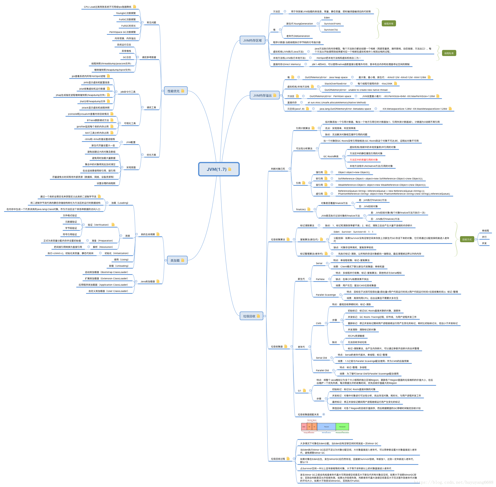

#### 8、Java进程Hang住怎么处理？

>  http://ifeve.com/find-bug-online/
>
>  在这里可能会出现三种情况：
>
>  1. 第一种情况，某个线程一直CPU利用率100％，则说明是这个线程有可能有死循环，那么请记住这个PID。
>  2. 第二种情况，某个线程一直在TOP十的位置，这说明这个线程可能有性能问题。
>  3. 第三种情况，CPU利用率TOP几的线程在不停变化，说明并不是由某一个线程导致CPU偏高。
>
>  如果是第一种情况，也有可能是GC造成，我们可以用jstat命令看下GC情况,看看是不是因为持久代或年老代满了，产生Full GC，导致CPU利用率持续飙高， 
>
>  jstat PID
>
>  jstack  -F  -m   PID
>
>  dump出来的线程ID（nid）是十六进制的，而我们用TOP命令看到的线程ID是10进制的，所以我们要printf命令转换一下进制。然后用16进制的ID去dump里找到对应的线程。
>
>  首先我们通过top命令查看当前CPU消耗过高的进程是哪个，从而得到进程id；然后通过top -Hp <pid>来查看该进程中有哪些线程CPU过高，这样我们就能得到CPU消耗比较高的线程id。接着通过该线程id的十六进制表示在jstack日志中查看当前线程具体的堆栈信息。   printf "%x\n" 31558

https://blog.csdn.net/lusa1314/article/details/84134458

Full GC次数过多，主要有以下两种原因：

- 代码中一次获取了大量的对象，导致内存溢出，此时可以通过eclipse的mat工具查看内存中有哪些对象比较多；
- 内存占用不高，但是Full GC次数还是比较多，此时可能是显示的`System.gc()`调用导致GC次数过多，这可以通过添加`-XX:+DisableExplicitGC`来禁用JVM对显示GC的响应。

 CPU过高,原因， 表现

如果是Full GC次数过多，那么通过jstack得到的线程信息会是类似于VM Thread之类的线程，而如果是代码中有比较耗时的计算，那么我们得到的就是一个线程的具体堆栈信息。

某个线程进入WAITING状态，怎么破

grep在jstack日志中找出所有的处于`TIMED_WAITING`状态的线程，将其导出到某个文件中，如a1.log， 隔一段时间后重复导出几个文件，进行分析

```mysql
-- 平时碰到系统CPU飙高和频繁GC，你会怎么排查？  
通过 `top`命令查看CPU情况，如果CPU比较高，则通过`top -Hp `命令查看当前进程的各个线程运行情况，找出CPU过高的线程之后，将其线程id转换为十六进制的表现形式，然后在jstack日志中查看该线程主要在进行的工作。这里又分为两种情况

如果是正常的用户线程，则通过该线程的堆栈信息查看其具体是在哪处用户代码处运行比较消耗CPU；

如果该线程是`VM Thread`，则通过`jstat -gcutil   `命令监控当前系统的GC状况，然后通过`jmap dump:format=b,file= `导出系统当前的内存数据。导出之后将内存情况放到eclipse的mat工具中进行分析即可得出内存中主要是什么对象比较消耗内存，进而可以处理相关代码；

如果通过 `top` 命令看到CPU并不高，并且系统内存占用率也比较低。此时就可以考虑是否是由于另外三种情况导致的问题。具体的可以根据具体情况分析：

如果是接口调用比较耗时，并且是不定时出现，则可以通过压测的方式加大阻塞点出现的频率，从而通过`jstack`查看堆栈信息，找到阻塞点；

如果是某个功能突然出现停滞的状况，这种情况也无法复现，此时可以通过多次导出`jstack`日志的方式对比哪些用户线程是一直都处于等待状态，这些线程就是可能存在问题的线程；

如果通过`jstack`可以查看到死锁状态，则可以检查产生死锁的两个线程的具体阻塞点，从而处理相应的问题。

-- 有可能统一服务器其他进程占用CPU过高，导致。  首先看top  cpu ,再看内存
```

#### 8-2 通过jstack日志分析和问题排查

```
dump 文件里，值得关注的线程状态有
死锁， Deadlock（重点关注） 

执行中，Runnable   

等待资源， Waiting on condition（重点关注） 
该状态出现在线程等待某个条件的发生。具体是什么原因，可以结合 stacktrace来分析。最常见的情况是线程在等待网络的读写，比如当网络数据没有准备好读时，线程处于这种等待状态，而一旦有数据准备好读之后，线程会重新激活，读取并处理数据。
等待获取监视器， Waiting on monitor entry（重点关注）
Monitor是 Java中用以实现线程之间的互斥与协作的主要手段，它可以看成是对象或者 Class的锁。每一个对象都有，也仅有一个 monitor。

暂停，Suspended

对象等待中，Object.wait() 或 TIMED_WAITING

阻塞， Blocked（重点关注）  

停止，Parked
```


#### 9、Java堆外内存怎么回收？

堆外内存的好处主要有以下两个：https://blog.csdn.net/nazeniwaresakini/article/details/104220245

- 避免堆内内存Full GC造成的stop-the-world延迟，当然也可以降低OOM风险；
- 绕过用户态到内核态的切换，实现高效数据读写，如[零拷贝和内存映射](https://www.jianshu.com/p/193cae9cbf07)。

1. 减少GC管理内存:
   由于GCIH会从Old区*“切出”*一块, 因此导致GC管理区域变小, 可以明显降低GC工作量, 提高GC效率, 降低Full GC STW时间(且由于这部分内存仍属于堆, 因此其访问方式/速度不变- *不必付出序列化/反序列化的开销*).
2. GCIH内容进程间共享:
   由于这部分区域不再是JVM运行时数据的一部分, 因此GCIH内的对象可供对个JVM实例所共享(如一台Server跑多个MR-Job可共享同一份Cache数据), 这样一台Server也就可以跑更多的VM实例.

> https://www.jianshu.com/p/35cf0f348275
>
> JDK 的 ByteBuffer.class 类提供了一个接口 allocateDirect(int capacity) 进行堆外内存的申请，
> 底层通过 Unsafe.class allocateMemory(size) 实现.最底层是通过 malloc() 方法申请的，但是这块内存需要进行手动释放，JVM并不会进行回收，幸好Unsafe提供了另一个接口 freeMemory()可以对申请的堆外内存进行释放。
> **DirctByteBuffer 虚引用   在DirectByteBuffer对象实例被GC掉时，它背后的堆外内存也同步被回收。这个机制就靠Cleaner来实现，因为它本质上是个虚引用（Phantom Reference）** 
> **Finalizer中又有GC ROOT 引用就清除不了了**
>
> 由于堆外内存并不直接控制于JVM，因此只能等到full GC的时候才能垃圾回收！（direct buffer归属的的JAVA对象是在堆上且能够被GC回收的，一旦它被回收，JVM将释放direct buffer的堆外空间。前提是没有关闭DisableExplicitGC）

JDK中使用`DirectByteBuffer`对象来表示堆外内存，每个`DirectByteBuffer`对象在初始化时，都会创建一个对用的`Cleaner`对象，这个`Cleaner`对象会在合适的时候执行`unsafe.freeMemory(address)`，从而回收这块堆外内存。

当初始化一块堆外内存时，对象的引用关系如下：

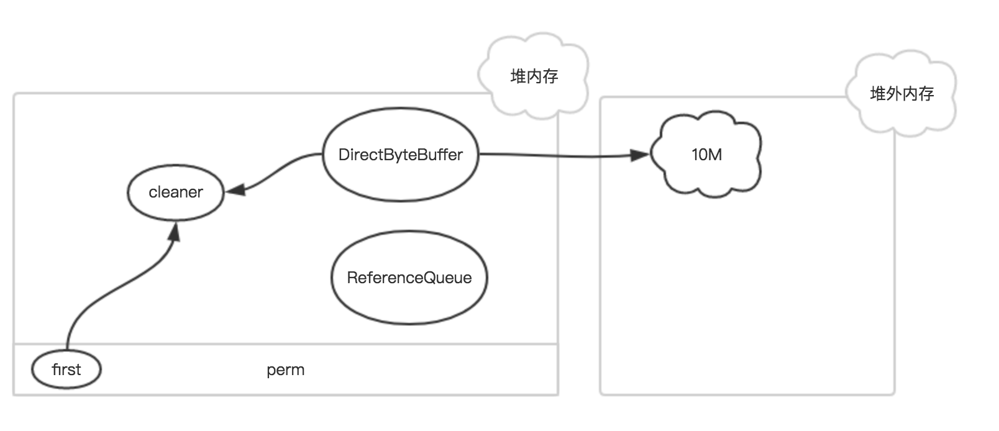

**其中`first`是`Cleaner`类的静态变量，`Cleaner`对象在初始化时会被添加到`Clener`链表中，和`first`形成引用关系，`ReferenceQueue`是用来保存需要回收的`Cleaner`对象。**

如果该`DirectByteBuffer`对象在一次GC中被回收了 , **此时，只有`Cleaner`对象唯一保存了堆外内存的数据（开始地址、大小和容量），在下一次FGC时，把该`Cleaner`对象放入到`ReferenceQueue`中，并触发`clean`方法。**

`Cleaner`对象的`clean`方法主要有两个作用：
 1、把自身从`Clener`链表删除，从而在下次GC时能够被回收
 2、释放堆外内存

如果JVM一直没有执行FGC的话，无效的`Cleaner`对象就无法放入到ReferenceQueue中，从而堆外内存也一直得不到释放，内存岂不是会爆？

> 根据JVM堆的分代GC机制，DirectByteBuffer这种小对象在经过-XX:MaxTenuringThreshold次的Young GC之后，很容易晋升到老生代。如果堆内内存的状况良好，余量充足，没有超大对象进入，那么可能很久都不会触发Full GC，造成堆外内存迟迟不被回收。为了避免这种情况，在前面的tryReserveMemory()方法中才会主动调用System.gc()方法。重要的话再说一遍： **在堆外内存使用频繁的场合，不要擅自开启-XX:+DisableExplicitGC开关进行“优化”。**
>
> 其实在初始化`DirectByteBuffer`对象时，如果当前堆外内存的条件很苛刻时，会主动调用`System.gc()`强制执行FGC。
>
> **堆外内存  ：   其垃圾回收依赖于代码显式调用System.gc()。**

当然，我们也可以不等JVM，而是主动调用DirectByteBuffer.getCleaner().clean()方法，就可以在我们认为合适的时机回收堆外内存。**Netty用了这种打法。**

### 4、GC调优 ！

#### GC 优化的核心思路：

1. 尽可能让对象在新生代中分配和回收，尽量避免过多进入老年代，导致对老年代频繁进行垃圾回收，
2. 同时给系统足够的内存减少新生代垃圾回收次数

进行系统分析和优化也是围绕着这个思路展开。

```
1.最基本的建议就是尽早释放无用对象的引用。大多数程序员在使用临时变量的时候，都是让引用变量在退出活动域（scope）后，自动设置为 null.我们在使用这种方式时候，必须特别注意一些复杂的对象图，例如数组，队列，树，图等，这些对象之间有相互引用关系较为复杂。对于这类对象，GC 回收它们一般效率较低。如果程序允许，尽早将不用的引用对象赋为null.这样可以加速GC的工作。 

2.尽量少用finalize函数。finalize函数是Java提供给程序员一个释放对象或资源的机会。但是，它会加大GC的工作量，因此尽量少采用finalize方式回收资源。 

3.如果需要使用经常使用的图片，可以使用soft应用类型。它可以尽可能将图片保存在内存中，供程序调用，而不引起OutOfMemory. 

4.注意集合数据类型，包括数组，树，图，链表等数据结构，这些数据结构对GC来说，回收更为复杂。另外，注意一些全局的变量，以及一些静态变量。这些变量往往容易引起悬挂对象（dangling reference），造成内存浪费。 

5.当程序有一定的等待时间，程序员可以手动执行System.gc（），通知GC运行，但是Java语言规范并不保证GC一定会执行。使用增量式GC可以缩短Java程序的暂停时间。

```


#### 程序设计思路：

```
关于程序设计的几点建议： 

1.最基本的建议就是尽早释放无用对象的引用。大多数程序员在使用临时变量的时候，都是让引用变量在退出活动域（scope）后，自动设置为 null.我们在使用这种方式时候，必须特别注意一些复杂的对象图，例如数组，队列，树，图等，这些对象之间有相互引用关系较为复杂。对于这类对象，GC 回收它们一般效率较低。如果程序允许，尽早将不用的引用对象赋为null.这样可以加速GC的工作。 

2.尽量少用finalize函数。finalize函数是Java提供给程序员一个释放对象或资源的机会。但是，它会加大GC的工作量，因此尽量少采用finalize方式回收资源。 

3.如果需要使用经常使用的图片，可以使用soft应用类型。它可以尽可能将图片保存在内存中，供程序调用，而不引起OutOfMemory. 

4.注意集合数据类型，包括数组，树，图，链表等数据结构，这些数据结构对GC来说，回收更为复杂。另外，注意一些全局的变量，以及一些静态变量。这些变量往往容易引起悬挂对象（dangling reference），造成内存浪费。 
```


## 10、缓存策略

### 1、全链路缓存设计

缓存设计有五大策略，从用户请求开始依次是：

- **HTTP 缓存**
- **CDN 缓存**
- **负载均衡缓存**
- **进程内缓存**
- **分布式缓存**

前两种缓存静态数据，后三种缓存动态数据：

- HTTP 缓存包括强制缓存和对比缓存。
- CDN 缓存和 HTTP 缓存是好搭档。
- 负载均衡器缓存相对稳定资源，需要服务协助工作。
- 进程内缓存，效率高，但容量有限制，有两个方案可以应对缓存同步的问题。
- **分布式缓存容量大，能力强，牢记三个性能算法（一致性hash）并且防范三个缓存风险。**


### 2、进程内缓存回收策略

 Ehcache、GuavaCache、Caffeine

- **FIFO（First In First Out）：**先进先出算法，最先放入缓存的数据最先被移除。
- **LRU（Least Recently Used）：**最近最少使用算法，把最久没有使用过的数据移除缓存。
- **LFU（Least Frequently Used）：**最不常用算法，在一段时间内使用频率最小的数据被移除缓存。

>  LRU（Least recently used，最近最少使用）算法根据数据的历史访问记录来进行淘汰数据，其核心思想是“如果数据最近被访问过，那么将来被访问的几率也更高”。
>
> 1.新数据插入到链表头部；
>
> 2.每当缓存命中（即缓存数据被访问），则将数据移到链表头部；
>
> 3.当链表满的时候，将链表尾部的数据丢弃。
>
> 当存在热点数据时，LRU的效率很好，但偶发性的、周期性的批量操作会导致LRU命中率急剧下降，缓存污染情况比较严重。

> LRU-K中的K代表最近使用的次数，因此LRU可以认为是LRU-1。LRU-K的主要目的是为了解决LRU算法“缓存污染”的问题，其核心思想是将“最近使用过1次”的判断标准扩展为“最近使用过K次”。
>
> Two queues（以下使用2Q代替）算法类似于LRU-2，不同点在于2Q将LRU-2算法中的访问历史队列（注意这不是缓存数据的）改为一个FIFO缓存队列，即：2Q算法有两个缓存队列，一个是FIFO队列，一个是LRU队列。
>
> 当数据第一次访问时，2Q算法将数据缓存在FIFO队列里面，当数据第二次被访问时，则将数据从FIFO队列移到LRU队列里面，两个队列各自按照自己的方法淘汰数据。详细实现如下
>
> \1. 新访问的数据插入到FIFO队列；
>
> \2. 如果数据在FIFO队列中一直没有被再次访问，则最终按照FIFO规则淘汰；
>
> \3. 如果数据在FIFO队列中被再次访问，则将数据移到LRU队列头部；
>
> \4. 如果数据在LRU队列再次被访问，则将数据移到LRU队列头部；
>
> \5. LRU队列淘汰末尾的数据。

#### 多应用中进程缓存更新策略

多应用中如果采用进程内缓存会存在数据一致性的问题。这里推荐两个方案：

- **消息队列修改方案**

应用在修改完自身缓存数据和数据库数据之后，给消息队列发送数据变化通知，其他应用订阅了消息通知，在收到通知的时候修改缓存数据

- **Timer 修改方案**

每个应用都会启动一个 Timer，定时从数据库拉取最新的数据，更新缓存。

不过在有的应用更新数据库后，其他节点通过 Timer 获取数据之间，会读到脏数据。这里需要控制好 Timer 的频率，以及应用与对实时性要求不高的场景。

#### 先更新数据库，再删缓存

其次，因为可能存在删除缓存失败的问题，提供一个补偿措施即可，例如利用消息队列。

### 3、redis缓存雪崩、缓存穿透、缓存击穿

**①缓存雪崩**

> 当缓存失效，缓存过期被清除，缓存更新的时候。请求是无法命中缓存的，这个时候请求会直接回源到数据库。如果上述情况频繁发生或者同时发生的时候，就会造成大面积的请求直接到数据库，造成数据库访问瓶颈。我们称这种情况为缓存雪崩。

从如下两方面来思考解决方案：

- **缓存方面**
- **设计方面**

缓存方面：

- **避免缓存同时失效，不同的 key 设置不同的超时时间**
- **增加互斥锁，对缓存的更新操作进行加锁保护，保证只有一个线程进行缓存更新。缓存一旦失效可以通过缓存快照的方式迅速重建缓存。对缓存节点增加主备机制，当主缓存失效以后切换到备用缓存继续工作。**

设计方面:

- **熔断机制：**某个缓存节点不能工作的时候，需要通知缓存代理不要把请求路由到该节点，减少用户等待和请求时长。
- **限流机制：**在接入层和代理层可以做限流（之前的文章讲到过），当缓存服务无法支持高并发的时候，前端可以把无法响应的请求放入到队列或者丢弃。
- **隔离机制：**缓存无法提供服务或者正在预热重建的时候，把该请求放入队列中，这样该请求因为被隔离就不会被路由到其他的缓存节点。

**②缓存穿透**

> 缓存一般是 Key，Value 方式存在，一个 Key 对应的 Value 不存在时，请求会回源到数据库。**假如对应的 Value 一直不存在，则会频繁的请求数据库，对数据库造成访问压力。如果有人利用这个漏洞攻击，就麻烦了。**

**解决方法：**

* 如果一个 Key 对应的 Value 查询返回为空，我们仍然把这个空结果缓存起来，如果这个值没有变化下次查询就不会请求数据库了。
* 将所有可能存在的数据哈希到一个足够大的 Bitmap 中，那么不存在的数据会被这个 Bitmap 过滤器拦截掉，避免对数据库的查询压力。
* 布隆过滤器

**③缓存击穿**

> **在数据请求的时候，某一个缓存刚好失效或者正在写入缓存，同时这个缓存数据可能会在这个时间点被超高并发请求，成为“热点”数据。这就是缓存击穿问题**，这个和缓存雪崩的区别在于，这里是针对某一个缓存，前者是针对多个缓存。

**解决方案：**

导致问题的原因是在同一时间读/写缓存，所以只有保证同一时间只有一个线程写，写完成以后，其他的请求再使用缓存就可以了。

比较常用的做法是使用 mutex（互斥锁）。在缓存失效的时候，不是立即写入缓存，而是先设置一个 mutex（互斥锁）。当缓存被写入完成以后，再放开这个锁让请求进行访问。

### 4、布隆过滤器

- 布隆过滤器说某个元素在，可能会被误判
- 布隆过滤器说某个元素不在，那么一定不在

- Google布隆过滤器的缺点

  基于JVM内存的一种布隆过滤器 重启即失效 本地内存无法用在分布式场景 不支持大数据量存储

- Redis布隆过滤器

  可扩展性Bloom过滤器：一旦Bloom过滤器达到容量，就会在其上创建一个新的过滤器 不存在重启即失效或者定时任务维护的成本：基于Google实现的布隆过滤器需要启动之后初始化布隆过滤器 缺点：需要网络IO，性能比Google布隆过滤器低

在判断用户是否是会员的时候，第一步先通过布隆过滤器过滤掉99%的非会员（误码率为1%的情况下），由于布隆过滤器有可能将一个不存在布隆过滤器中的误判成在布隆过滤器中，也就是有可能会把非会员判断为会员，所以第二步查询数据库中用户对应的数据库信息判断该用户是否是会员

### 5、redis 常见问题

https://blog.csdn.net/hcmony/article/details/80694560

>  [解决Redis数据库响应延迟问题(转载)](http://www.blogjava.net/zhanglongsr/archive/2014/07/22/416090.html)
>
> 检测是否响应慢 redis-cli --latency -h `host` -p `port`
>
> 内部   **低效操作产生的延迟**，**AOF fork进程**  **数据过期造成**
>
> 外部   网络和通信引起的延迟， swap分区文件（ /proc/PID/smaps）
>
> 高可靠，高可用，高性能原理分析https://blog.csdn.net/weixin_33970449/article/details/88021447
>
> 方方面面 --> https://blog.csdn.net/weixin_34353714/article/details/93268386

### 6、redis单线程吗？性能为什么高？

1、纯内存访问，Redis将所有数据放在内存中，内存的响应时间大约为100纳秒，这时Redis达到每秒万级别访问的重要基础；

2、非阻塞I/O，Redis使用epoll作为I/O多路复用技术的实现，在加上Redis自身的事件处理模型将epoll中的链接、读写、关闭都转换为事件，不在网络I/O上浪费过多的时间；

3、单线程避免了线程切换和竞态产生的消耗。

4、数据结构优化，Redis全程使用hash结构，读取速度快，还有一些特殊的数据结构，对数据存储进行了优化，如压缩表，对短数据进行压缩存储，再如，跳表，使用有序的数据结构加快读取的速度。

5、Redis采用自己实现的事件分离器，效率比较高，内部采用非阻塞的执行方式，吞吐能力比较大。

### 7  redis 数据删除策略

第一种和第三种为主动删除策略，而第二种则为被动删除策略

#### 1、定时删除

定时删除策略对内存是最友好的：通过使用定时器，定时删除策略可以保证过期键会尽可能快地被删除，并释放过期键所占用的内存

定时删除策略的缺点是，它对CPU时间是最不友好的：在过期键比较多的情况下，删除过期键这一行为可能会占用相当一部分CPU时间

创建一个定时器需要用到Redis服务器中的时间事件，而当前时间事件的实现方式——无序列表，查找一个事件的时间复杂度为O(N)——并不能高效地处理大量时间事件

#### 2、惰性删除

惰性删除策略对CPU时间来说是最友好的：程序只会在取出键时才对键进行过期检查，这可以保证删除过期键的操作只会在非做不可的情况下进行，并且删除的目标仅限于当前处理的键，这个策略不会再删除其他无关的过期键上花费任何CPU时间

惰性删除策略的缺点是，它对内存是最不友好的：如果一个键已经过期，而这个键又仍然保留在数据库中，那么只要这个过期键不被删除，它所占用的内存就不会释放

#### 3、定期删除

定期删除策略是前两种策略的一种整合和折中：

- 定期删除策略每隔一段时间执行一次删除过期键操作，并通过限制删除操作执行的时长和频率来减少删除操作对CPU时间的影响
- 通过定期删除过期键，定期删除策略有效地减少了因为过期键而带来的内存浪费

定期删除策略的难点是确定删除操作执行的时长和频率：

- 如果删除操作执行得太频繁，或者执行的时间太长，定期删除策略就会退化成定时删除策略，以至于将CPU时间过多地消耗在删除过期键上面
- 如果删除操作执行得太少，或者执行的时间太短，定期删除策略又会和惰性删除策略一样，出现浪费内存的情况

#### 4 在RDB  AOP 主从 下

##### 1、生成RDB文件

在执行SAVE命令或者BGSAVE命令创建一个新的RDB文件时，程序会对数据库中的键进行检查，已过期的键不会被保存到新创建的RDB文件中

##### 2、载入RDB文件

在启动Redis服务器时，如果服务器开启了RDB功能，那么服务器将对RDB文件进行载入：

- 如果服务器以主服务器模式运行，那么在载入RDB文件时，程序会对文件中保存的键进行检查，未过期的键会被载入到数据库中，而过期键则会被忽略，所以过期键对载入RDB文件的主服务器不会造成影响
- 如果服务器以从服务器模式运行，那么在载入RDB文件时，文件中保存的所有键，不论是否过期，都会被载入到数据库中。不过，因为主从服务器在进行数据同步的时候，从服务器的数据库就会被清空，所以一般来说，过期键在载入RDB文件的从服务器也不会造成影响

##### 3、AOF文件写入

当服务器以AOF持久化模式运行时，如果数据库中的某个键已经过期，但它还没有被惰性删除或者定期删除，那么AOF文件不会因为这个过期键而产生任何影响

当过期键被惰性删除或者定期删除之后，程序会向AOF文件追加一个DEL命令，来显式地记录该键已被删除

##### 4、AOF重写

和生成RDB文件时类似，在执行AOF重写的过程中，程序会对数据库中的键进行检查，已过期的键不会被保存到重写后的AOF文件中

##### 5、复制

当服务器运行在复制模式下时，从服务器的过期键删除动作由主服务器控制：

- 主服务器在删除一个过期键之后，会显示地向所有从服务器发送一个DEL命令，告知从服务器删除这个过期键
- 从服务器在执行客户端发送的读命令时，即使碰到过期键也不会将过期键删除，而是继续处理未过期的键一样来处理过期键
- 从服务器只有在接到主服务器发来的DEL命令之后，才会删除过期键

## 11、回调、异步回调与静态、动态代理到AOP

#### 回调

> 回调函数就是一个通过[函数指针]调用的函数。如果你把函数的[指针]（地址）作为[参数传递]给另一个函数，当这个指针被用来调用其所指向的函数时，我们就说这是回调函数。回调函数不是由该函数的实现方直接调用，而是在特定的事件或条件发生时由另外的一方调用的，用于对该事件或条件进行响应。

* 函数回调就是将函数指针的地址当作参数传递给另一个函数。
* 函数回调的用途简单来说就是进行事件的响应或者事件触发

#### AOP原理是什么？

* 代理模式

A对象要做一件事情，在没有代理前，自己来做；在对 A 代理后，由 A 的代理类 B 来做。代理其实是在原实例前后加了一层处理，这也是 AOP 的初级轮廓。

* 静态代理原理

程序运行前就已经存在代理类的字节码文件、代理类和原始类的关系在运行前就已经确定

* 动态代理原理及实践

动态代理类的源码是在程序运行期间，通过 JVM 反射等机制动态生成。代理类和委托类的关系是运行时才确定的

**使用 JDK 生成的动态代理的前提是目标类必须有实现的接口**

**CGLIB 是以动态生成的子类继承方式实现，在运行期动态的在内存中构建子类，目标类不能为 final **

* Spring AOP原理及实战

 AOP 的定义：面向切面编程，核心原理是**使用动态代理模式在方法执行前后或出现异常时加入相关逻辑**。

- AOP 是基于动态代理模式。
- AOP 是方法级别的。
- AOP 可以分离业务代码和关注点代码（重复代码），在执行业务代码时，动态的注入关注点代码。切面就是关注点代码形成的类。

## 12、网络

### 网络分层

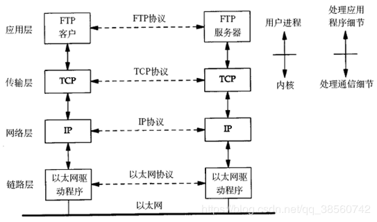

### TCP握手与挥手

https://blog.csdn.net/qq_38950316/article/details/81087809

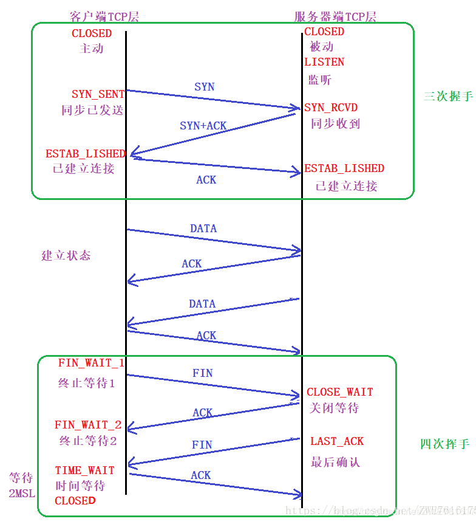

### TCP、UDP和HTTP区别详解

> https://www.cnblogs.com/hanfanfan/p/9579771.html

http:是用于www浏览的一个协议。
tcp：是机器之间建立连接用的到的一个协议。

```java
1、TCP/IP是个协议组，可分为三个层次：网络层、传输层和应用层。
在网络层有IP协议、ICMP协议、ARP协议、RARP协议和BOOTP协议。
在传输层中有TCP协议与UDP协议。
在应用层有FTP、HTTP、TELNET、SMTP、DNS等协议。
因此，HTTP本身就是一个协议，是从Web服务器传输超文本到本地浏览器的传送协议。 

//	面向连接的TCP
//  面向非连接的UDP协议
HTTP是超文本传输协议，是客户端浏览器或其他程序与Web服务器之间的应用层通信协议。在Internet上的Web服务器上存放的都是超文本信息， 客户机需要通过HTTP协议传输所要访问的超文本信息。HTTP包含命令和传输信息，不仅可用于Web访问，也可以用于其他因特网/内联网应用系统之间的通信，从而实现各类应用资源超媒体访问的集成

TCP （传输控制协议）通过序列化应答和必要时重发数据包，TCP 为应用程序提供了可靠的传输流和虚拟连接服务。TCP 主要提供数据流转送，可靠传输，有效流控制，全双工操作和多路传输技术。

//HTTP协议,它是TCP协议族中的一种。使用TCP80端口
// HTTP是应用层协议，TCP是传输层协议！
// 数据包在网络传输过程中，HTTP被封装在TCP包内！！
```

### RPC与HTTP与gRPC

> https://www.jianshu.com/p/7d6853140e13

* RPC 


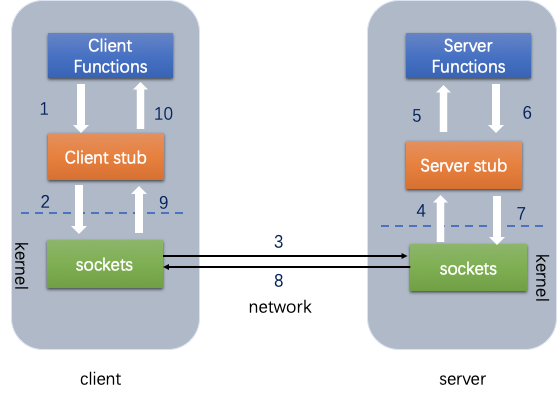

```java
// Client端 
//    Student student = Call(ServerAddr, addAge, student)
1. 将这个调用映射为Call ID。
2. 将Call ID，student（params）序列化，以二进制形式打包
3. 把2中得到的数据包发送给ServerAddr，这需要使用网络传输层
4. 等待服务器返回结果
5. 如果服务器调用成功，那么就将结果反序列化，并赋给student，年龄更新

// Server端
1. 在本地维护一个Call ID到函数指针的映射call_id_map，可以用Map<String, Method> callIdMap
2. 等待服务端请求
3. 得到一个请求后，将其数据包反序列化，得到Call ID
4. 通过在callIdMap中查找，得到相应的函数指针
5. 将student（params）反序列化后，在本地调用addAge()函数，得到结果
6. 将student结果序列化后通过网络返回给Client

```

* REST

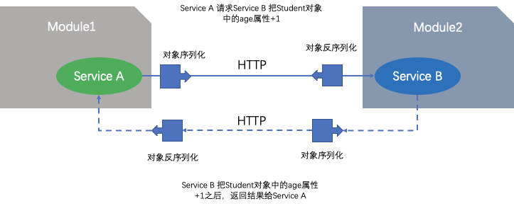

在微服务的设计中，一个服务A如果访问另一个Module下的服务B，可以采用HTTP REST传输数据，并在两个服务之间进行序列化和反序列化操作，服务B把执行结果返回过来

> **两者差异**:
>
> REST由于HTTP在应用层中完成，整个通信的代价较高
>
> RPC远程过程调用中直接基于TCP进行远程调用，数据传输在传输层TCP层完成，更适合对效率要求比较高的场景，RPC主要依赖于客户端和服务端之间建立Socket链接进行，底层实现比REST更复杂。

* gRPC 

gRPC 是一种基于二进制流的消息协议，可以采用基于Protocol Buffer的IDL定义grpc API,这是Google公司用于序列化结构化数据提供的一套语言中立的序列化机制，客户端和服务端使用HTTP/2以Protocol Buffer格式交换二进制消息。

gRPC的优势是，设计复杂更新操作的API非常简单，具有高效紧凑的进程通信机制，在交换大量消息时效率高，远程过程调用和消息传递时可以采用双向的流式消息方式，同时客户端和服务端支持多种语言编写，互操作性强；不过gRPC的缺点是不方便与JavaScript集成，某些防火墙不支持该协议。

Hbase 协处理器交互就是 gRPC

### RPC Dubbo REST Spring cloud

> https://segmentfault.com/a/1190000019896723
>
> https://www.jianshu.com/p/3090d63e9cb3

### 进程间通信， 线程间通信

> https://www.jianshu.com/p/65874b2b713e

进程间的通信：
1.无名管道(PIPE)
    在内核中申请一块固定大小的缓冲区，程序拥有写入和读取的权利，一般使用fork函数实现父子进程的通信。
    速度慢，容量有限，只有父子进程能通讯 （fork），且是单工的。

2.有名管道(FIFO)

    在内核中申请一块固定大小的缓冲区，程序拥有写入和读取的权利，没有血缘关系的进程也可以进程间通信。
    任何进程间都能通讯，但速度慢

3.消息队列

    在内核中创建一队列，队列中每个元素是一个数据报，不同的进程可以通过句柄去访问这个队列。
    每个消息队 列的总的字节数是有上限的（MSGMNB），系统上消息队列的总数也有⼀个上限（MSGMNI）
    容量受到系统限制，且要注意第一次读的时候，要考虑上一次没有读完数据的问题

4.信号

    信号是Linux系统中用于进程之间通信或操作的一种机制，信号可以在任何时候发送给某一进程，而无须知道该进程的状态。如果该进程并未处于执行状态，则该信号就由内核保存起来，知道该进程恢复执行并传递给他为止。如果一个信号被进程设置为阻塞，则该信号的传递被延迟，直到其阻塞被取消时才被传递给进程。

5.信号量

    在内核中创建一个信号量集合（本质是个数组），数组的元素（信号量）都是1，使用P操作进行-1，使用V操作+1，
    不能传递复杂消息，只能用来同步

6.共享内存区：

    将同一块物理内存一块映射到不同的进程的虚拟地址空间中，实现不同进程间对同一资源的共享。共享内存可以说是最有用的进程间通信方式，也是最快的IPC形式。
        特点：
        1，不用从用户态到内核态的频繁切换和拷贝数据，直接从内存中读取就可以。
        2，共享内存是临界资源，所以需要操作时必须要保证原子性。使用信号量或者互斥锁都可以。

6.socket
    socket本质是编程接口(API)，对TCP/IP的封装，TCP/IP也要提供可供程序员做网络开发所用的接口，这就是Socket编程接口

线程间：

    1.锁
    2.信号量


## 13、互联网架构变迁史

> 阿里架构变迁 https://www.jianshu.com/p/9f985bbc9c70

