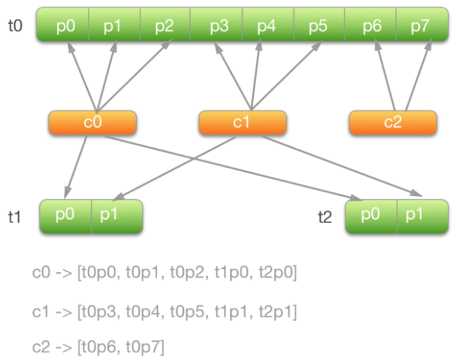

# Kakfa总结

>  **尴尬，Kafka竟然没有总结，导致失败， 要涨教训**
>
>  https://mp.weixin.qq.com/s/Qxw_1mgtcZPCGhqBsmVx3Q
>
> 知识的学习要结合自己简历中的项目和技术架构，不能原封不动的抄袭；公司做的有哪些项目，那么安排上，再从群主的帖子里去找灵感，这一点很重要，你不能拿着没有做过的项目来套这些东西，因为一个项目会牵涉到业务场景，项目背景以及实现中的很多细节，乱编的项目肯定有考虑不到的地方，有一些细节都会被问出来，结果让面试官对你产生了怀疑。基于真实项目的技术架构，吸收帖子里边的一些思想，加上自己的思考，这样进步就会很快。
>
> kafka怎么实现实时性（pagecage页缓存，顺序写磁盘，零复制技术等等），面试官问到这一块的时候，我都有说的很详细，然后面试官都会跟我说：嗯，你的基础能力很扎实。还有spark调优那一块，这个是我的强项。我把自己掌握和实践中用的方法用自己的语言总结了一部分（数据倾斜，内存溢出，开发调优，资源调优，shuffle调优等），每一个点都能够自己总结出一个例子出来，说给面试官听，之后面试官都会给出高度的评价。

## 1、Kafka 架构

### 1.1、架构

- **Broker**
  　　Kafka集群包含一个或多个服务器，这种服务器被称为broker
- **Topic**
  　　每条发布到Kafka集群的消息都有一个类别，这个类别被称为Topic。（物理上不同Topic的消息分开存储，逻辑上一个Topic的消息虽然保存于一个或多个broker上但用户只需指定消息的Topic即可生产或消费数据而不必关心数据存于何处）
- **Partition**
  　　Parition是物理上的概念，每个Topic包含一个或多个Partition.
- **Producer**
  　　负责发布消息到Kafka broker
- **Consumer**
  　　消息消费者，向Kafka broker读取消息的客户端。
- **Consumer Group**
  　　每个Consumer属于一个特定的Consumer Group（可为每个Consumer指定group name，若不指定group name则属于默认的group）。

### 1.2、为什么用消息队列

* 解耦
* 冗余
* 扩展性 
* 灵活性， 峰值处理能力
* 可恢复性
* 顺序保证
* 缓存

## 2、Kafka 数据怎么解决有序？ 分区扩展后还是有序吗？

**Kafka 只是单个分区内有序， 那么利用此条件， 可以进行根据数据的`主键`进行特定发送到某一个分区。**

> 如果改变了分区， 还是有序吗？  如何保证 ?????

**默认根据主键hash partition进行发送的， 那么扩展分区后，数据被发送就错乱了。 要避免这个问题，就是要保证扩展分区前后发送的分区保持不变。**

```java
// 分区定义如下：
private int partitionDefine(String keyToPartition) {
	if (keyToPartition == null) {
		return new Random().nextInt(numPartitions);
	} else {
		return Math.abs(keyToPartition.hashCode()) % numPartitions;
	}
}
//  可以不用 % numPartitions ， 而是根据主键唯一发送到特定分区
```

* 对于配置分库分表或者多库同步任务的BinlogSource，服务会根据库表信息进行hash，将数据写入相应的partiton，保证同一张表的数据在一个partition中，使得下游消费数据的顺序性；    `tableName+主键`
* 对于单表同步的作业目前使用一个partition保证其数据有序。

> **如果是订单场景， 可以用订单ID作为Kafka生产者key，那么同一个订单的数据会到同一个分区。 **
>
> 如果消费者能力不足，需要多线程消费的话，会存在乱序，可以利用N内存队列queue 与 N个线程， 相同Key的数据都存在同一个queue中

## 3、什么是Kafka ISR   in-sync Replica  保持同步的副本

**ISR 副本同步机制**

> https://cloud.tencent.com/developer/article/1476632
>
> 众所周知，**kafka中一个topic可以分为多个Partition，每个partition又有多个副本，**
>
> **对于每个topic的partition而言，有一个leader副本，其余的都是follower，**
>
> **leader负责读与写，follower同步leader的数据。**
>
> **当leader挂掉的时候，由controller主持在剩余follower中选举出一个leader**
>
> **但是这个剩余follower有一个条件，就是follower必须在ISR列表中**
>
> **ISR （IN-SYNC Replication） 维护了与leader信息一致的follower的信息**
>
> **当leader挂掉的时候 就从这个ISR中选举**
>
>  
>
> 那么问题来了，这个ISR是由leader维护，leader挂了ISR怎么办呢？
>
> 没有关系，ZK中存储了这个ISR！
> Kafka集群的一些重要信息都记录在ZK中，比如集群的所有代理节点、主题的所有分区、分区的副本信息(副本集(AR)、主副本(leader)、同步的副本集(ISR))。外部事件会更新ZK的数据，ZK中的数据一旦发生变化，控制器都要做出不同的相应处理。

**每个Partition有一个leader与多个follower，producer往某个Partition中写入数据是，只会往leader中写入数据，然后数据才会被复制进其他的Replica中。**
`数据是由leader push过去还是有flower pull过来？`
**kafka是由follower周期性尝试去pull(拉)过来，写是都往leader上写，但是读并不是任意flower上读都行，读也只在leader上读，flower只是数据的备份，保证leader被挂掉后顶上来，并不往外提供服务。**

#### kafka不是完全同步，也不是完全异步，是一种ISR机制：

```mysql
-- Kafka 交付语义、producer中都提到了消息提交给broker中，保证不丢消息主要是依赖于broker 中的ISR机制  ！！！

-- 首先Kafka 消息在broker的存储形式是以log的形式存在的，打开Kafka的存储的文件夹时就能发现有.log .index .timeindex 三类文件，其中index、timeindex是索引文件，而.log就是具体的消息的存储文件。不同的文件存在于不同的分区，这个是由分区选择器确定的。按照常识，要想保证高可用保证不丢失，最直观的就是制造冗余，多做备份，数据互备嘛，Kafka 也是这么去做的。

-- 在Kafka 中备份日志文件被称为replica，replica 又分为leader replica 和follower replica，而follower replica存在的唯一目的就是防止消息丢失，并不参与具体的业务逻辑的交互。只有leader 才参与服务，follower的作用就是充当leader的候补，平时的操作也只有信息同步。ISR （in-sync replica）也就是这组与leader保持同步的replica集合，我们要保证不丢消息，首先要保证ISR的存活（至少有一个备份存活），并且消息提交成功。那存活的概念是什么呢，就是说不仅需要机器正常，还需要跟上leader的消息进度，当达到一定程度的时候就会认为“非存活”状态。
```

1. leader会维护一个与其基本保持同步的Replica列表，该列表称为ISR(in-sync Replica)，每个Partition都会有一个ISR，而且是由leader动态维护
2. 如果一个flower比一个leader落后太多，或者超过一定时间未发起数据复制请求，则leader将其重ISR中移除
3. 当ISR中所有Replica都向Leader发送ACK时，leader才commit

#### ISR 踢出机制

* 超时多久没有连接leader
* 落后多久数据

1. server配置

```mysql
  rerplica.lag.time.max.ms=10000
  # 如果leader发现flower超过10秒没有向它发起fech请求，那么leader考虑这个flower是不是程序出了点问题
  # 或者资源紧张调度不过来，它太慢了，不希望它拖慢后面的进度，就把它从ISR中移除。

  rerplica.lag.max.messages=4000 # 相差4000条就移除
  # flower慢的时候，保证高可用性，同时满足这两个条件后又加入ISR中，
  # 在可用性与一致性做了动态平衡   亮点
```

2. topic配置

```mysql
min.insync.replicas=1 # 需要保证ISR中至少有多少个replica
```

3. Producer配置

 ```mysql
 request.required.asks=0
  # 0:相当于异步的，不需要leader给予回复，producer立即返回，发送就是成功,
      那么发送消息网络超时或broker crash(1.Partition的Leader还没有commit消息 2.Leader与Follower数据不同步)，
      既有可能丢失也可能会重发
  # 1：当leader接收到消息之后发送ack，丢会重发，丢的概率很小
  # -1：当所有的follower都同步消息成功后发送ack.  丢失消息可能性比较低
 ```

#### Leader挂掉处理方法

> leader挂掉了，从它的follower中选举一个作为leader，并把挂掉的leader从ISR中移除，继续处理数据。一段时间后该leader重新启动了，它知道它之前的数据到哪里了，尝试获取它挂掉后leader处理的数据，获取完成后它就加入了ISR

#### acks=all 就可以代表数据一定不会丢失了吗？

> 当然不是，如果你的Partition只有一个副本，也就是一个Leader，任何Follower都没有，你认为acks=all有用吗？
>
> 当然没用了，因为ISR里就一个Leader，他接收完消息后宕机，也会导致数据丢失。
>
> 所以说，这个acks=all，必须跟ISR列表里至少有2个以上的副本配合使用，起码是有一个Leader和一个Follower才可以。

## 4、消息处理语义

> https://my.oschina.net/u/992559/blog/1821399

* at most once     至多一次，可能丢失
* at least once     至少一次，可能重复
* exactly  once     刚好一次

### 4.1、Producer 配置

#### 消息持久化粒度

> Durable主要通过“acks”控制，最强的级别是“all”，在broker返回ack之前，它会确认每一个副本都已经保存了该消息。这样它能在n-1个副本宕机后，仍保留完整数据。最弱的级别是“0”，broker收到消息不确认持久化就返回，如果后续持久化失败，消息会丢失。当“acks”设置为“1”的时候，broker会确认主分片（leader  replication）已经保存了消息，同时副本会主动向主分片同步，消息丢失风险较小。但是存在这种情况，消息到达主分片并且返回了success的ack，这时主分片fail并且副本未来得及同步这条消息，消息会丢失。

**通过  request.required.acks    all   0  1 **

#### 消息发送次数

> Producer的at-most-once和at-least-once语义主要由“retries”控制（在callback中实现异常重发也相当于retry）
>
> 如果配置值是一个大于0的整数，Producer在收到error的callback后，Producer将重新发送消息。考虑这一种情况，收到消息后，Broker正确的保存了消息，只是在返回ack时出现broker故障或者网络异常。这时候，producer收到error的callback，它不能确认异常原因，只能重新发送消息，这样就导致了消息重复。
>
> 如果配置值等于0，Producer在收到error的callback后，不重新发送消息。如果异常时由于broker没有正确保存消息导致，那么将导致消息丢失。
>
> **Producer的Exactly-Once语义，主要由“enable.idempotence”控制，如果该参数为true，将会确保消息最终只会被broker保存一次。“acks”不能被设置为0或者1，因为万一主分片（leader replication）异常下线，将导致数据丢失，这样语义被破坏**

**通过 retries     0   1              enable.idempotence= true   acks = all**

```mysql
-- Kafka幂等性实现简析 https://www.jianshu.com/p/4761ad7bcde3
```

### 4.2、Consumer 语义

> Consumer的at-most-once和at-least-once语义主要通过“offset”控制。offset的可配置为自动提交和手动提交。若配置“enable.auto.commit”为true，在Consumer  fetch数据后，后台会自动提交offset。若配置“enable.auto.commit”为false,需要主动调用commitSync()或者commitAsync()来提交offset。

> 在自动提交的情形下，Consumer表现为at-most-once语义。在主动提交的情形下，根据用户对异常处理的不同，可表现为at-most-once或者at-least-once。

> *假设Consumer在fetch完数据后，后续的处理步骤出现了异常*。

> 如果offset是自动提交的，那么Consumer将不能再次消费这些数据（除非重启Consumer，并通过seek(TopicPartition, long)重置offset）。它表现出at-most-once语义。

> 在捕获异常后，如果手动提交offset，表现出at-most-once语义。如果不提交offset，Consumer可重复消费该消息，表现出at-least-once语义。

> 在Consumer中，没有配置可以保证Exactly-Once语义。若要达到这个目标，需要在at-least-once的基础上实现幂等。这点和Producer是类似的，区别是Consumer的幂等性需要用户自己来完成。

**需要自己在at-least-once的基础上实现幂等**

### 4.3 ACK 

待定

### 4.4 事务


## 5、Partition消费分配策略

* RangeAssignor

> 范围来尽量平均分配Partition的，所以得名RangeAssignor
>
> 1个Topic，8个Partition，3个Consumer，最终分配的比例为3:3:2

**再多加两个Topic，每个Topic有2个Partition? **



> c2完全没有分配到t2中的Partition，因为c0和c1按照字典序排在它前面，已经被优先分配到了。如果推广上述情况，很容易发现该策略无法保证平均分配，造成负载倾斜。当订阅了多个Topic时，尤其需要注意RangeAssignor的适用性。

* RoundRobinAssignor

> "round-robin"一词的含义是轮询。RoundRobinAssignor策略仍然会将所有Consumer按照预设好的Member ID字典序排序，同时也会将所有Topic中的所有Partition按照字典序排序（注意这点不同），再轮询进行分配
>
> **由于分配时是按所有Partition来的，所以即使Topic之间Partition的数量是不平均的，分配结果也是基本平均的，克服了RangeAssignor的缺点**
>
> RoundRobinAssignor也并非十全十美的。由于一个Group内的Consumer可以订阅不同的Topic，所以仍然可能会产生倾斜。考虑一种情况：Topic t0、t1、t2分别有1、2、3个Partition，而Consumer c0订阅了t0，c1订阅了t0~t1，c2订阅了t0~t2，

* StickyAssignor

> StickyAssignor是在Kafka 0.11版本引入的，它的实现比RangeAssignor和RoundRobinAssignor都要复杂得多
>
> First, it guarantees an assignment that is as balanced as possible——Partition的分配尽量平均，这也是前两种分配策略努力要达到的目标；
>
> Second, it preserved as many existing assignment as possible when a reassignment occurs——当Partition重新分配时，能够尽量保留上一次的分配，即尽量少将已经分配了的Partition分配给其他的Consumer，这也就是"sticky"（粘性）一词的含义。
> 链接：https://www.jianshu.com/p/e9b0a07fab77

* 自定义 PartitionAssignor  AbstractPartitionAssignor

## 6 Kafka 高性能原因

### 6.0 分布式分区   并发写入与读取多台Broker

分区的设计使得Kafka消息读写性能可以突破单台瓶颈

### 6.1 日志分段存储 文件追加机制  PageCache功能    

**分片和索引机制: ** 每个partition分为多个segment，每个segment对应两个索引文件  偏移量索引 和 时间戳索引  稀疏索引 二分查找

**省去大量磁头寻址时间**

PageCache 多次写入汇聚一次flush  写入重排序，优化写入性能

Kafka并不太依赖JVM内存大小，而是主要利用Page Cache，如果使用应用层缓存（JVM堆内存），会增加GC负担，增加停顿时间和延迟，创建对象的开销也会比较高。

读取操作可以直接在Page Cache上进行，如果消费和生产速度相当，甚至不需要通过物理磁盘直接交换数据，这是Kafka高吞吐量的一个重要原因。

这么做还有一个优势，如果Kafka重启，JVM内的Cache会失效，Page Cache依然可用。

### 6.2  sendFile 零拷贝

> Linux 2.4+内核通过`sendfile`系统调用，提供了零拷贝。数据通过DMA拷贝到内核态Buffer后，直接通过DMA拷贝到NIC Buffer，无需CPU拷贝。这也是零拷贝这一说法的来源。除了减少数据拷贝外，因为整个读文件-网络发送由一个`sendfile`调用完成，整个过程只有两次上下文切换，因此大大提高了性能。

### 6.3 Reactor 网络模型

> https://www.jianshu.com/p/eab8f15880b5

## 7.Kafka日志删除策略

