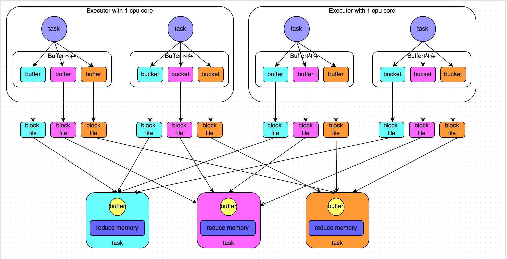
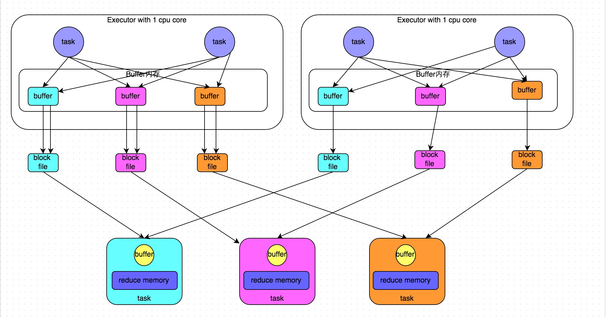

# Spark 总结

## 1、Join原理与三种join方式

> https://blog.csdn.net/lp284558195/article/details/80717219
>
> Nested-loop Join 最为简单直接，将两个数据集加载到内存，并用内嵌遍历的方式来逐个比较两个数据集内的元素是否符合 Join 条件。Nested-loop Join 虽然时间效率以及空间效率都是最低的，但胜在比较灵活适用范围广，因此其变体 BNL 常被传统数据库用作为 Join 的默认基础选项。
>
> SparkSQL支持三种Join算法：shuffle hash join、broadcast hash join以及sort merge join。其中前两者归根到底都属于hash join，只不过在hash join之前需要先shuffle还是先broadcast。其实，hash join算法来自于传统数据库，而shuffle和broadcast是大数据的皮（分布式），两者一结合就成了大数据的算法了。

### Hash Join -  build table probe table


第1步名为build阶段（建立哈希表），第2步名为probe阶段（探测哈希表）。相应地，小表R就称为build table，大表S就称为probe table。Hash join的I/O复杂度是O(|R| + |S|)，效率很高，但是它受到两点限制：

1. 小表必须保证能完全放入内存；
2. 只适用于equi join，即仅包含"="条件的连接。

**为什么Build Table选择小表？道理很简单，因为构建的Hash Table最好能全部加载在内存，效率最高；这也决定了hash join算法只适合至少一个小表的join场景，对于两个大表的join场景并不适用；**

### Broadcast hash join

​	1. broadcast阶段：将小表广播分发到大表所在的所有主机。广播算法可以有很多，最简单的是先发给driver，driver再统一分发给所有executor；要不就是基于bittorrete的p2p思路；

​	2. hash join阶段：在每个executor上执行单机版hash join，小表映射，大表试探；

> Broadcast 就是将数据从一个节点发送到其他各个节点上去
>
> Spark有两种方式：一种是HttpBroadcast，另一种是TorrentBroadcast ( 字节比特， 内容分发 P2P)

HttpBroadcast ： 数据先放到Driver中，通知BlockManagerMaster 已经就绪， Executor可以拉起

TorrentBroadcast： task 先在本地开一个ByteBuffer用于存放将要 fetch 过来的data block。然后打乱要 fetch 的 data blocks 的顺序，比如如果 data block 共有 5 个，那么打乱后的 fetch 顺序可能是 3-1-2-4-5。然后按照打乱后的顺序去 fetch 一个个 data block。fetch 的过程就是通过 “本地 blockManager－driver/executor 的 blockManager－data” 得到 data。每 fetch 到一个 block 就将其存放到 executor 的 blockManager 里面，同时通知 driver 上的 blockManagerMaster 说该 data block 多了一个存储地址。这一步通知非常重要，意味着 blockManagerMaster 知道 data block 现在在 cluster 中有多份，下一个不同节点上的 task 再去 fetch 这个 data block 的时候，可以有两个选择了，而且会随机选择一个去 fetch。这个过程持续下去就是 BT 协议，随着下载的客户端越来越多，data block 服务器也越来越多，就变成` p2p`下载了。

> 小表能够被广播出去的大小阈值由Spark配置项`spark.sql.autoBroadcastJoinThreshold`指定，默认值为10MB。
>
> ？？？？怎么判断一个表被广播出去的大小？ 比如HDFS中是10M，parquert 格式， 那么实际可以做为广播表吗？？？
>
> spark 读取broadcast 数据到内存中是 hashtable ， 比原始HDFS大很多， 如果parquert 压缩极限，实际内存值比HDFS存储值大很多。

### Shuffle hash join

​	1. shuffle阶段：分别将两个表按照join key进行分区，将相同join key的记录重分布到同一节点，两张表的数据会被重分布到集群中所有节点。这个过程称为shuffle

​	2. hash join阶段：每个分区节点上的数据单独执行单机hash join算法。

### Sort Merge join

​	1. shuffle阶段：将两张大表根据join key进行重新分区，两张表数据会分布到整个集群，以便分布式并行处理

​	2. sort阶段：对单个分区节点的两表数据，分别进行排序

​	3. merge阶段：对排好序的两张分区表数据执行join操作。join操作很简单，分别遍历两个有序序列，碰到相同join key就merge输出，否则取更小一边

**因为没有驱动表，所以数据库会随机选择一张表驱动，如果选择了A扫描到1，然后扫描B，当扫描=1的时候则匹配当扫描到B=2时，再以B=2为驱动扫描A表，不是从1开始扫，而是从2开始扫描，交替的进行扫描、关联。**

**仔细分析的话会发现，sort-merge join的代价并不比shuffle hash join小，反而是多了很多。那为什么SparkSQL还会在两张大表的场景下选择使用sort-merge  join算法呢？这和Spark的shuffle实现有关，`目前spark的shuffle实现都适用sort-based  shuffle算法，因此在经过shuffle之后partition数据都是按照key排序的。`因此理论上可以认为数据经过shuffle之后是不需要sort的，可以直接merge。 第二个原因 为什么更优：hash-join的复杂度O(a+b)；而merge小于O(a+b)。a,b代表数组的长度）。**


##  2、调优指南


* Mapper 的 Shuffle 输出数据仍然按原方案写本地磁盘，写完后上传到 HDFS。Reducer 仍然按原始方案通过 Mapper 侧的 External Shuffle Service 读取 Shuffle 数据。如果失败了，则从  HDFS 读取。这种方案极大减少了对 HDFS 的访问频率。

## 3、宽依赖、窄依赖

**窄依赖是指每个父RDD的Partition最多被子RDD的一个Partition所使用，例如map、filter， **

1对一

**宽依赖是指一个父RDD的Partition会被多个子RDD的Partition所使用，例如groupByKey、reduceByKey等**

1对多

> map是对RDD中元素逐一进行函数操作映射为另外一个RDD，而flatMap操作是将函数应用于RDD之中的每一个元素，将返回的迭代器的所有内容构成新的RDD
>
> map 输入一条记录， 输出一条记录
>
> flatMap 输入一条记录 输出多条记录

## 4、数据倾斜解决办法

https://blog.csdn.net/u010039929/article/details/68067194

* **map侧预聚合**

* Hive ETL 预处理
* 过滤少数倾斜key ， 单独进行
* 提高shuffle并行度

`spark.sql.shuffle.partitions`，该参数代表了shuffle read task的并行度，默认是200

缓解数据倾斜，没有根治

*  聚合类操作---->两阶段预聚合

对RDD执行reduceByKey等聚合类shuffle算子或者在Spark SQL中使用group by语句进行分组聚合

* join类操作 ---->  Broadcast变量

* 采样倾斜key并分拆join操作   （少量key倾斜， 进行分开union， 倾斜的 加盐膨胀）
* 全部膨胀（多量key倾斜， 无法彻底解决倾斜，对内存要求高）
* 多种结合处理
* 分桶表， map join  sort merge join

## 5、排序，二次排序

排序 https://blog.csdn.net/qq_21439395/article/details/80200790

二次排序基本思想

```scala
				.map(line => {
  				...
          (key, value)
        })        
				.groupByKey()
        .map(line => (line._1, line._2.toList.sortWith(_.toInt < _.toInt).mkString(","))) //value内部进行升序排列
        .sortByKey(true) //key升序排列
```

二次排序分区排序， 自定义分区+隐式函数排序

https://blog.csdn.net/luofazha2012/article/details/80587128

```scala
val valueToKey: RDD[((String, Int), Int)] = input.map(x => {
            val line: Array[String] = x.split("\t")
            ((line(0) + "-" + line(1), line(3).toInt), line(3).toInt)
        })     // key+value 为key
//隐式转换排序
implicit def tupleOrderingDesc = new Ordering[Tuple2[String, Int]] {
            override def compare(x: Tuple2[String, Int], y: Tuple2[String, Int]): Int = {
                if (y._1.compare(x._1) == 0) -y._2.compare(x._2)
                else -y._1.compare(x._1)
            }
        }
// 拆分key
val sorted: RDD[((String, Int), Int)] = valueToKey.repartitionAndSortWithinPartitions(new SortPartitioner(partitions))
        val result = sorted.map {
            case (k, v) => (k._1, v.toString())
        }.reduceByKey(_ + "," + _)

```

## 6、Spark 内存管理

> https://mp.weixin.qq.com/s?__biz=MzI4MzY5MDU5Mg==&mid=2247483849&idx=1&sn=3a53d18d44a0c272e570ddafe1cd904d&chksm=eb8792c6dcf01bd04110e20459718cac96295213802d0dda066c350c4486206865664978714b&scene=21#wechat_redirect
>
> https://developer.ibm.com/zh/articles/ba-cn-apache-spark-memory-management/

待进行！！！！

## 6、Spark Shuffle

> https://tech.meituan.com/2016/05/12/spark-tuning-pro.html
>
> 在Spark 1.2以前，默认的shuffle计算引擎是HashShuffleManager。该ShuffleManager而HashShuffleManager有着一个非常严重的弊端，就是会产生大量的中间磁盘文件，进而由大量的磁盘IO操作影响了性能。
>
> 因此在Spark  1.2以后的版本中，默认的ShuffleManager改成了SortShuffleManager。
>
> ----------------------------SortShuffleManager相较于HashShuffleManager来说，有了一定的改进。--------------
>
> **主要就在于，每个Task在进行shuffle操作时，虽然也会产生较多的临时磁盘文件，但是最后会将所有的临时文件合并（merge）成一个磁盘文件，因此每个Task就只有一个磁盘文件。在下一个stage的shuffle read task拉取自己的数据时，只要根据索引读取每个磁盘文件中的部分数据即可。**

### 6.1、HashShuffle

* 未经优化的HashShuffleManager

 

* 优化后的HashShuffleManager



### 6.2、SortShuffle

> 在Spark 1.2以前，默认的shuffle计算引擎是HashShuffleManager。该ShuffleManager而HashShuffleManager有着一个非常严重的弊端，就是会产生大量的中间磁盘文件，进而由大量的磁盘IO操作影响了性能。
>
> 因此在Spark  1.2以后的版本中，默认的ShuffleManager改成了SortShuffleManager。SortShuffleManager相较于HashShuffleManager来说，有了一定的改进。主要就在于，每个Task在进行shuffle操作时，虽然也会产生较多的临时磁盘文件，但是最后会将所有的临时文件合并（merge）成一个磁盘文件，因此每个Task就只有一个磁盘文件。在下一个stage的shuffle read task拉取自己的数据时，只要根据索引读取每个磁盘文件中的部分数据即可。
>
> SortShuffleManager的运行机制主要分成两种，一种是普通运行机制，另一种是bypass运行机制。当shuffle read  task的数量小于等于spark.shuffle.sort.bypassMergeThreshold参数的值时（默认为200），就会启用bypass机制。

* SortShuflle

```
在该模式下，数据会先写入一个内存数据结构中，此时根据不同的shuffle算子，可能选用不同的数据结构。如果是reduceByKey这种聚合类的shuffle算子，那么会选用Map数据结构，一边通过Map进行聚合，一边写入内存；如果是join这种普通的shuffle算子，那么会选用Array数据结构，直接写入内存。接着，每写一条数据进入内存数据结构之后，就会判断一下，是否达到了某个临界阈值。如果达到临界阈值的话，那么就会尝试将内存数据结构中的数据溢写到磁盘，然后清空内存数据结构。

在溢写到磁盘文件之前，会先根据key对内存数据结构中已有的数据进行排序。排序过后，会分批将数据写入磁盘文件。默认的batch数量是10000条，也就是说，排序好的数据，会以每批1万条数据的形式分批写入磁盘文件。写入磁盘文件是通过Java的BufferedOutputStream实现的。BufferedOutputStream是Java的缓冲输出流，首先会将数据缓冲在内存中，当内存缓冲满溢之后再一次写入磁盘文件中，这样可以减少磁盘IO次数，提升性能。

一个task将所有数据写入内存数据结构的过程中，会发生多次磁盘溢写操作，也就会产生多个临时文件。最后会将之前所有的临时磁盘文件都进行合并，这就是merge过程，此时会将之前所有临时磁盘文件中的数据读取出来，然后依次写入最终的磁盘文件之中。此外，由于一个task就只对应一个磁盘文件，也就意味着该task为下游stage的task准备的数据都在这一个文件中，因此还会单独写一份索引文件，其中标识了下游各个task的数据在文件中的start offset与end offset。

SortShuffleManager由于有一个磁盘文件merge的过程，因此大大减少了文件数量。比如第一个stage有50个task，总共有10个Executor，每个Executor执行5个task，而第二个stage有100个task。由于每个task最终只有一个磁盘文件，因此此时每个Executor上只有5个磁盘文件，所有Executor只有50个磁盘文件。
```


#### Bypass 运行机制

* shuffle map task数量小于spark.shuffle.sort.bypassMergeThreshold参数的值。
* 不是聚合类的shuffle算子（比如reduceByKey）。

```


此时task会为每个下游task都创建一个临时磁盘文件，并将数据按key进行hash然后根据key的hash值，将key写入对应的磁盘文件之中。当然，写入磁盘文件时也是先写入内存缓冲，缓冲写满之后再溢写到磁盘文件的。最后，同样会将所有临时磁盘文件都合并成一个磁盘文件，并创建一个单独的索引文件。

该过程的磁盘写机制其实跟未经优化的HashShuffleManager是一模一样的，因为都要创建数量惊人的磁盘文件，只是在最后会做一个磁盘文件的合并而已。因此少量的最终磁盘文件，也让该机制相对未经优化的HashShuffleManager来说，shuffle read的性能会更好。

而该机制与普通SortShuffleManager运行机制的不同在于：第一，磁盘写机制不同；第二，不会进行排序。也就是说，启用该机制的最大好处在于，shuffle write过程中，不需要进行数据的排序操作，也就节省掉了这部分的性能开销。 
```


```mysql
假如用户使用Spark SQL的适合用了hints，那Spark会先采用Hints提示的join方式。

broadcastHashJoin，hints写法如下：

-- 支持 BROADCAST, BROADCASTJOIN and MAPJOIN 来表达 broadcast hint SELECT /*+ BROADCAST(r) */ * FROM records r JOIN src s ON r.key = s.key

ShuffledHashJoin，hints的sql写法如下：

-- 仅支持 SHUFFLE_HASH 来表达 ShuffledHashJoin hint SELECT /*+ SHUFFLE_HASH(r) */ * FROM records r JOIN src s ON r.key = s.key

SortMergeJoin，hints的SQL写法如下：

-- 支持 SHUFFLE_MERGE, MERGE and MERGEJOIN 来表达 SortMergeJoin hintSELECT /*+ MERGEJOIN(r) */ * FROM records r JOIN src s ON r.key = s.key

假设用户没有使用hints，默认顺序是：

1.先判断，假设join的表统计信息现实，一张表大小大于0，且小于等于用户配置的自动广播阈值则，采用广播。

plan.stats.sizeInBytes >= 0 && plan.stats.sizeInBytes <= conf.autoBroadcastJoinThreshold参数：spark.sql.autoBroadcastJoinThreshold

假设两张表都满足广播需求，选最小的。

2.不满足广播就判断是否满足ShuffledHashJoin，首先下面参数要设置为false，默认为true。

spark.sql.join.preferSortMergeJoin=true，

还有两个条件，根据统计信息，表的bytes是广播的阈值*总并行度：

plan.stats.sizeInBytes < conf.autoBroadcastJoinThreshold * conf.numShufflePartitions

并且该表bytes乘以3要小于等于另一张表的bytes：

a.stats.sizeInBytes * 3 <= b.stats.sizeInBytes

那么这张表就适合分治之后，作为每个分区构建本地hashtable的表。

3.不满足广播，也不满足ShuffledHashJoin，就判断是否满足SortMergeJoin。条件很简单，那就是key要支持可排序。

def createSortMergeJoin() = {if (RowOrdering.isOrderable(leftKeys)) {    Some(Seq(joins.SortMergeJoinExec(      leftKeys, rightKeys, joinType, condition, planLater(left), planLater(right))))  } else {    None  }}

这段代码是在SparkStrageties类，JoinSelection单例类内部。

createBroadcastHashJoin(hintToBroadcastLeft(hint), hintToBroadcastRight(hint))  .orElse { if (hintToSortMergeJoin(hint)) createSortMergeJoin() else None }  .orElse(createShuffleHashJoin(hintToShuffleHashLeft(hint), hintToShuffleHashRight(hint)))  .orElse { if (hintToShuffleReplicateNL(hint)) createCartesianProduct() else None }  .getOrElse(createJoinWithoutHint())

当然，这三种join都是等值join，之前的版本Spark仅仅支持等值join但是不支持非等值join，
```

### 6.3、shuffle 调优

>  影响一个Spark作业性能的因素，主要还是代码开发、资源参数以及数据倾斜，shuffle调优只能在整个Spark的性能调优中占到一小部分而已。因此大家务必把握住调优的基本原则，

**参数调优**

```
spark.shuffle.file.buffer

spark.reducer.maxSizeInFlight

spark.shuffle.io.maxRetries

spark.shuffle.manager

spark.shuffle.sort.bypassMergeThreshold
```

### 6.4、和MapReduce  异同

1. 从整体功能上看，两者并没有大的差别。 都是将 mapper（Spark 里是 ShuffleMapTask）的输出进行 partition，不同的 partition 送到不同的 reducer（Spark 里 reducer 可能是下一个 stage 里的 ShuffleMapTask，也可能是 ResultTask）。Reducer 以内存作缓冲区，边 shuffle 边 aggregate 数据，等到数据 aggregate 好以后进行 reduce（Spark 里可能是后续的一系列操作）。

2. 从流程的上看，两者差别不小。 Hadoop MapReduce 是 sort-based，进入 combine和 reduce的 records 必须先 sort。这样的好处在于 combine/reduce可以处理大规模的数据，因为其输入数据可以通过外排得到（mapper 对每段数据先做排序，reducer 的 shuffle 对排好序的每段数据做归并）。以前 Spark 默认选择的是 hash-based，通常使用 HashMap 来对 shuffle 来的数据进行合并，不会对数据进行提前排序。如果用户需要经过排序的数据，那么需要自己调用类似 sortByKey的操作。在Spark 1.2之后，sort-based变为默认的Shuffle实现。

3. 从流程实现角度来看，两者也有不少差别。 Hadoop MapReduce 将处理流程划分出明显的几个阶段：map, spill, merge, shuffle, sort, reduce等。每个阶段各司其职，可以按照过程式的编程思想来逐一实现每个阶段的功能。在 Spark 中，没有这样功能明确的阶段，只有不同的 stage 和一系列的 transformation，所以 spill, merge, aggregate 等操作需要蕴含在 transformation中。

4. 1）最大的区别： 中间数据的存储／落地

   2）从数据 fetch 与数据计算的重叠粒度来讲 :  Hadoop的reducer一定要等到所有的mapper全部完成之后才能开始，而Spark的reducer在mapper的总算完成到一定的量之后就会开始，也就是可以一边map一边reduce，这估计是另外一个加速度的效果导致比Hadoop的MR要快。

   3）从性能优化角度来讲:  代码级别的实现 \  Spark 针对不同类型的操作、不同类型的参数，会使用不同的 shuffle write 方式   Inputs抽象称为RDD，在各个不同的Stage，各种花式转换，之后还是RDD，抽象的越优雅的东西越简单，越简单的东西越容易组合，组合的力量也越大 

   4）作业出错重试： Hadoop的MR过程，如果一个Job执行错了，需要从头再来一遍；而Spark的job执行有类似于“增量”的效果在里面， 如果job执行到哪个步骤出错了，这个错误之前的结果会被直接用到下一次的job执行中，也即是job可以做到从出错的地方开始，而非每次都全部从头再来。

## 7、为什么spark比MR快

* 基于内存技术。  任务间通信基于内存，  shuffle后可以cache到内存
* JVM 优化。 MR启动就启动JVM，Executor启动时基于线程的，
* 容错性方面。 DAG图，血缘关系
* transform action 流式算法 


1.消除了冗余的HDFS读写
Hadoop每次shuffle操作后，必须写到磁盘，而Spark在shuffle后不一定落盘，可以cache到内存中，以便迭代时使用。如果操作复杂，很多的shufle操作，那么Hadoop的读写IO时间会大大增加。

2.消除了冗余的MapReduce阶段
Hadoop的shuffle操作一定连着完整的MapReduce操作，冗余繁琐。而Spark基于RDD提供了丰富的算子操作，且reduce操作产生shuffle数据，可以缓存在内存中。

3.JVM的优化
Spark Task的启动时间快。Spark采用fork线程的方式，Spark每次MapReduce操作是基于线程的，只在启动。而Hadoop采用创建新的进程的方式，启动一个Task便会启动一次JVM。

Spark的Executor是启动一次JVM，内存的Task操作是在线程池内线程复用的。

## 8、MapPartitions 高效写法

```mysql
class CustomIterator(iter: Iterator[Int]) extends Iterator[Int] {   
 
def hasNext : Boolean = {     
     iter.hasNext    
 }    
def next : Int= {        
 
    val cur = iter.next        
    cur*3    
}  
}    
 
val result = a.mapPartitions(
v => new CustomIterator(v)
)  
 
println(result.collect().mkString(","))
```

## 9. Spark Sql执行原理

> 客户端提交任务后，通过 Sql 解析先生成语法树，然后从 Catalog 获取元数据信息，通过分析得到逻辑执行计划，进行优化器规则进行逻辑执行的优化，最后转成物理执行计划提交到 spark 集群执行。	


## 10. Spark Sql 小文件问题

> https://www.jianshu.com/p/ddd2382a738a
>
> **Spark小文件产生的过程**
>
> 1. 数据源本身就是就含大量小文件
>
> 2. 动态分区插入数据，没有Shuffle的情况下  （M=N）   或  M * N个
>
> 3. 动态分区插入数据，有Shuffle的情况下，上面的M值就变成了`spark.sql.shuffle.partitions(默认值200)`这个参数值，文件数的算法和范围和2中基本一致
> 4. 为了防止Shuffle阶段的数据倾斜我们可以在上面的sql中加上 `distribute by rand()` . 文件数妥妥的就是spark.sql.shuffle.partitions * N .  当spark.sql.shuffle.partitions设置过大时，小文件问题就产生了；当spark.sql.shuffle.partitions设置过小时，任务的并行度就下降了，性能随之受到影响
> 5. `distribute by ss_sold_date_sk`。 把同一分区的记录都哈希到同一个分区中去. 容易出现数据倾斜的问题
> 6. `distribute by ss_sold_date_sk，cast(rand() * 5 as int)`   两者结合使用
> 7. 在我们知道那个分区键倾斜的情况下，我们也可以将入库的SQL拆成几个部分. `where ss_sold_date_sk is not null` 和 `where ss_sold_date_sk is null` 将原始数据分成两个部分  前者可以基于分区字段进行分区，如`distribute by ss_sold_date_sk`;后者可以基于随机值进行分区，
>
> > **Spark SQL的自适应功能，`spark.sql.adaptive.enabled=true`来动态调整每个相当于Spark的reduce端task处理的数据量，然后Spark在Shuffle 阶段会自动的帮我们将数据尽量的合并成`spark.sql.adaptive.shuffle.targetPostShuffleInputSize`（默认64m）的大小，以减少输出端写文件线程的总量，最后减少个数。**
>
> 

## 11、 Spark 作业调优

> https://www.cnblogs.com/Transkai/p/11448569.html
>
> Spark 性能调优：分配资源+调节并行度+广播变量+RDD持久化+Kryo序列化+fastutil+数据本地化等待时长
>
> https://www.cnblogs.com/Transkai/p/11455818.html
>
> Spark 数据倾斜解决方案:原理+聚合源数据+提高reduce并行度+双重聚合+map join+sample采样+扩容表
>
> https://www.cnblogs.com/Transkai/p/11449166.html
> Spark JVM调优:降低cache操作的内存占比和调节executor堆外内存与连接等待时长+shuffer调优

## 12、 源码分析

 https://github.com/opensourceteams/spark-scala-maven