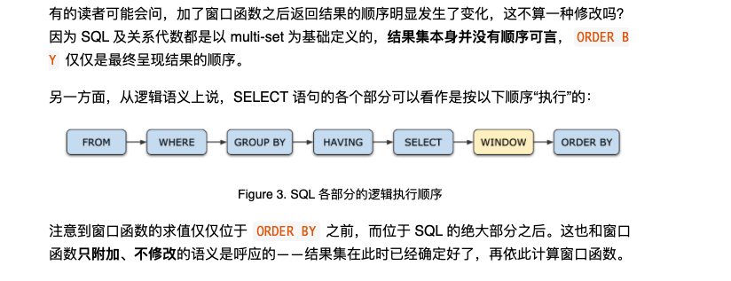
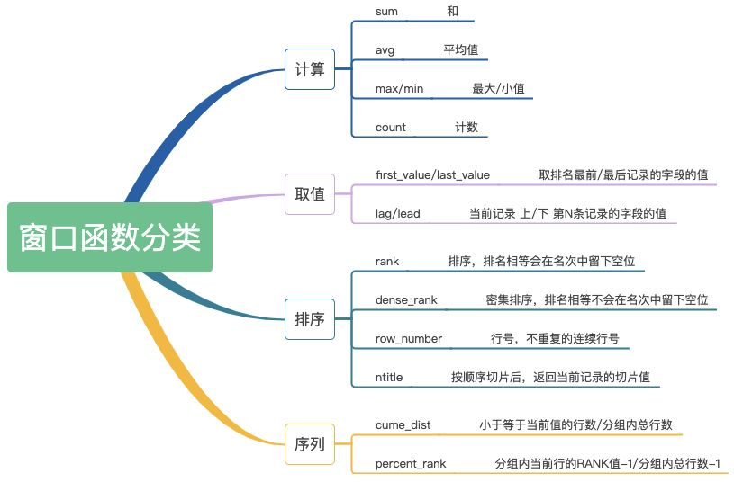
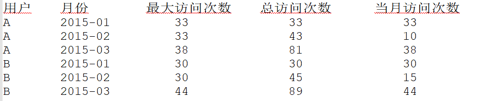
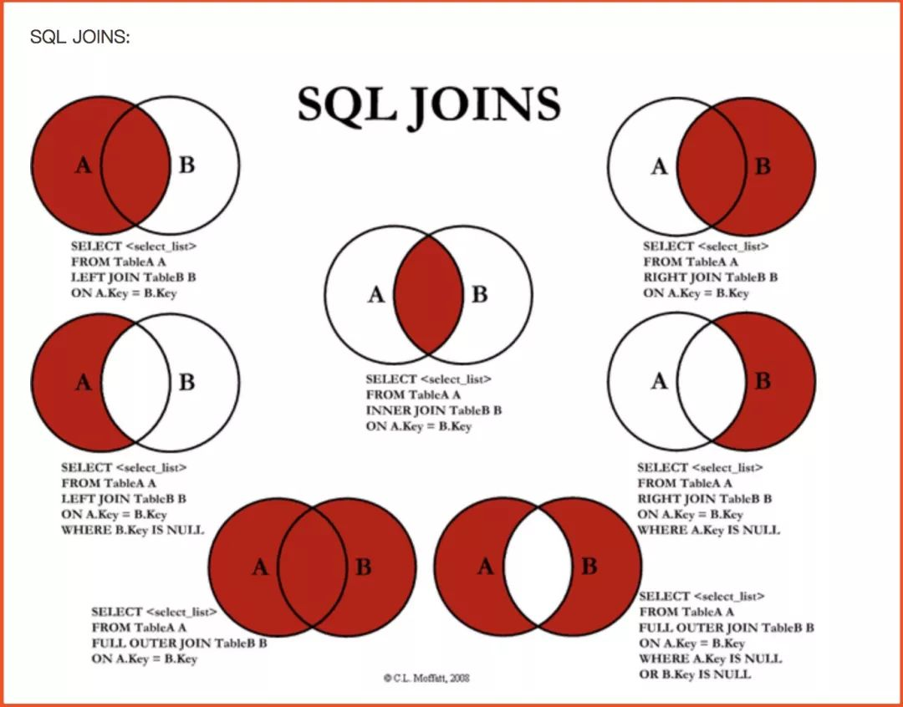

# SQL知识点总结

### SQL执行顺序



## 1、行列转换

### 1.1、行转列

> 根据主键，进行多行合并为一列
>
> **collect_list   collect_set  属于UDAF !!  需要group by** 

```mysql
select day ,room_id , collect_list(user_id) 
from test.test1 
group by day ,room_id;
2019-08-01   6002   ["1","2","3"] 

select user_id,
concat_ws(',',collect_list(order_id)) as order_value 
from col_lie
group by user_id
```

**collect_list 不去重，collect_set 去重。 concat_ws中 column 的数据类型要求是 string**

### 1.2、列转行

> 对某列进行拆分，一列拆多行
>
> lateral view explode   属于UDTF ，有以下两种形式
>
> **一行输入多行输出  explode(array('A','B','C'))  **     或      **一列输入多列输出   lateral view  json_tuple**

```mysql
-- 单个展开tag
SELECT explode(tag) AS myNewCol FROM table;

-- !!!!!!  带上其他字段 ，就需要 select a,yy from xx  lateral view explode() y as  yy   !!!!!!

select id,tag,tag_new
from table
lateral view explode(split(tag, ',')) num as tag_new

-- 一个用户好友表 userid , follow_list (该用户的好友id数组)
--     A [B, C, D]
--     B [A, C]
--     C [D]
--     统计这个表有多少对好友
with tmp_table as (
select user_id1 , user_id_new 
from test_friend 
   lateral view explode ( split(user_id2, ',') ) user_ids  as user_id_new  )
select * from tmp_table a 
left join tmp_table b
on a.user_id1 = b.user_id_new  and a.user_id_new = b.user_id1 
where b.user_id1 is not null 

-- ARRAY 
select explode(array('A','B','C'));
select explode(array('A','B','C')) as col;
select tf.* from (select 0) t lateral view explode(array('A','B','C')) tf;
select tf.* from (select 0) t lateral view explode(array('A','B','C')) tf as col;
A
B
C

-- MAP 
select explode(map('A',10,'B',20,'C',30));
select explode(map('A',10,'B',20,'C',30)) as (key,value);
select tf.* from (select 0) t lateral view explode(map('A',10,'B',20,'C',30)) tf;
select tf.* from (select 0) t lateral view explode(map('A',10,'B',20,'C',30)) tf as key,value;
A	10
B	20
C	30

-- JSON
select a.timestamp, b.*
from log a lateral view json_tuple(a.appevent, 'eventid', 'eventname') b as f1, f2;

-- 用户可以指定可选的OUTER关键字来生成行，即使LATERAL VIEW通常不会生成行。使用NULL值代替。
hive> SELECT * FROM tmp_laterview LATERAL VIEW OUTER explode(array()) C AS a;
OK
[1,2,3]	["a","b","c"]	NULL
```

#### explode  json 

```mysql
from biclient_log.json_client_log a 
lateral view json_tuple(a.event_params, 'adType', 'slotId', 'policyId', 'adid', 'idfa', 'provider', 'country', 'adbox_version', 'priority', 'uuid', 'imei', 'googleId' ) b as adtype, slot_id, policy_id, adid, idfa, provider, country, adbox_version, priority, uuid, imei, google_id   
```

#### explode Map 

```mysql
张三	语文:78,数学:90,英语:82,历史:77,政治:80,物理:88,化学:79,地理:92,生物:86
李四	语文:68,数学:84,英语:79,历史:65,政治:66,物理:78,化学:72,地理:83,生物:75
王五	语文:88,数学:69,英语:86,历史:82,政治:70,物理:68,化学:89,地理:95,生物:93
朱六	语文:73,数学:76,英语:73,历史:76,政治:75,物理:85,化学:86,地理:85,生物:90
钱二	语文:68,数学:91,英语:92,历史:97,政治:83,物理:88,化学:77,地理:72,生物:70
段七	语文:86,数学:80,英语:85,历史:87,政治:88,物理:98,化学:69,地理:87,生物:74

-- 需要找到每个学生最好的课程和成绩，最差的课程和成绩，以及各科的平均分
-- row_numner() 只是加上序号， 需要求四列，所以  max( if ( =1 , , null ) ) group by  判断增加四行  

create table ga_test.test_map(
     name string,
     scores map<String, int>
 ) 
 row format delimited fields terminated by '\t' 
 collection items terminated by ','     
 map keys terminated by ':'   
 lines terminated by '\n' ;

load data local inpath '/var/lib/hadoop-yarn/tmp/tmp.txt' into  table ga_test.test_map ; 

select 
	name ,
	max( if( max = 1 , subject , null ) ) as good_subject ,
	max( if( max = 1 , score , null ) ) as good_score ,
	max( if( min = 1 , subject , null ) ) as bad_subject ,
	max( if( min = 1 , score , null ) ) as bad_score ,
	avg(score) as avg_score
from 
	(select 
		name , 
		subject , 
		score, 
		row_number() over( partition by name  order by score desc ) as max  , 
		row_number() over( partition by name  order by score asc ) as min  
	from 
	    ga_test.test_map  lateral view explode (scores) s  as subject, score  ) as  a 
group by name
-- having bad_score > 0 and good_score > 0

-- 中间判断过程，  会有多行， 需要 group by   查询后形成什么要清楚明白，不能想当然
-- 结合 if 判断 
| name | good_subject | good_score |
+------+--------------+------------+
| 张三 | 地理         | 92         |
| 张三 | NULL         | 0          |
| 张三 | NULL         | 0          |
| 张三 | NULL         | 0          |
| 张三 | NULL         | 0          |
```

### 1.3 REGEXP正则查询

RLIKE 操作符是 REGEXP 的同义词。测试一个值是否匹配正则表达式。

使用 POSIX 正则表达式语法，其中 ^ 和 $ 在正则表达式开始和结束  对应任意单个字母, * 代表 0 个或多个项目的序列, + 对应出现一次或多次项目的序列, ? 产生一次非贪婪的匹配

```mysql
-- 查找 first name 以 'J' 开头, 之后可以跟 0 或更多个字母
select c_first_name, c_last_name from customer where c_first_name regexp 'J.*';

-- 查找 'Macdonald', 其中第一个 'a' 是可选的, 'D' 可以是大写也可以是小写
-- ^...$ 不是必需的，但使整个表达式看起来很清晰
select c_first_name, c_last_name from customer where c_last_name regexp '^Ma?c[Dd]onald$';

-- 查找 'Macdonald' 或 'Mcdonald'
select c_first_name, c_last_name from customer where c_last_name regexp '(Mac|Mc)donald';

-- 查找 last name 以 'S' 开始, 然后是一个或多个的元音,然后是 'r', 然后是其他任意字符
-- 匹配 'Searcy', 'Sorenson', 'Sauer'.
select c_first_name, c_last_name from customer where c_last_name regexp 'S[aeiou]+r.*';

-- 查找 last name 以 2 个或多个元音结束：是 a,e,i,o,u 之一的字符
select c_first_name, c_last_name from customer where c_last_name regexp '.*[aeiou]{2,}$';

-- 你可以使用 [] 块中字母的范围开头，例如查找 last name 以 A, B, C 开头的
select c_first_name, c_last_name from customer where c_last_name regexp '[A-C].*';

-- 假如你不确定大小写，前导或末尾的空格等等，可以先在列上执行字符串函数进行处理
select c_first_name, c_last_name from customer where lower(c_last_name) regexp 'de.*';
```

### 1.4  正则判断手机号

```mysql
判断手机号， 以 1 开头， 11位   

 ====>   ^1(3|4|5|7|8)\d{9}$

表示以1开头，第二位可能是3/4/5/7/8等的任意一个，在加上后面的\d表示数字[0-9]的9位，总共加起来11位结束。
-- 简单格式
select regexp_extract(value, '^1(3|4|5|7|8)\d{9}$' , 0 ) ; 

-- 复杂抽取
select  regexp_extract (  regexp_extract( '+86-05622150839' , '(.*?)(\\d{11})' , 2 ) ,  '^1\\d{10}'  , 0   )  ;   
select  regexp_extract (  regexp_extract( '+86-015622150839' , '(.*?)(\\d{11})' , 2 ) ,  '^1(3|4|5|7|8)\\d{9}'  , 0   )  ;   

-- 复杂替换
select regexp_replace('+08615613526666' , '^\\+86|86|\\+010', '')  ; 

```

### 1.5、having

**语文成绩比数学成绩小的    巧用 having  ！！！！面试题 ， 某科成绩小的  的更优化写法** 

```mysql
-- join方式，  *****   过滤右表 用 on   *****
select distinct a.sid from (select sid, course, score from course where course = 'yuwen') a 
join
(select sid, course, score from course where course = 'shuxue') b
on a.sid = b.sid and  a.score < b.score; 

-- join 方式会过滤掉 没有考一科的情况数据， 导致结果不正确
```

```mysql
-- having 写法         题目考单列值的大小比较， 
-- having  根据成绩相减后判断， 没有为0   巧用数值计算！！！
select
sid
from course
group by sid
having sum(case when coursename='yuwen' then score
					when coursename='shuxue' then 0-score  end) < 0
```

```mysql
-- 找出所有科目成绩都大于某一学科平均成绩的学生
-- 求出所有学科的平均成绩，  每一科成绩 与 所有学科成绩比较为 0 1    统计所有为0的学生

select student from ( 
  select student , course  , if(score > avg_course_score , 1 , 0 ) as flag 
  from ( 
    select student , course , score , avg(score) over(partition by course ) as avg_course_score 
    from  ga_test.test_1 ) a 
  ) b 
group by student having sum( flag ) = 3

```


## 2、开窗函数

> 窗口函数也称为OLAP（Online Analytical Processing）函数，是对一组值进行操作，
>
> **不需要使用Group by子句对数据进行分组，就能在同一行返回原来行的列和使用聚合函数得到的聚合列**。
>
> <窗口函数>() 
> OVER 
> (
>   [PARTITION BY <列清单>]
>   [ORDER BY <排序用清单列>] [ASC/DESC]
>   (ROWS | RANGE) <范围条件>
> )
>
> 标准聚合函数作为窗口函数使用的时候，在指明order by的情况下，如果没有Window子句，则Window子句默认为：RANGE BETWEEN UNBOUNDED PRECEDING AND CURRENT ROW(上边界不限制，下边界到当前行)。
>
> 如果想要全部数据**rows between unbounded preceding and unbounded following**。
>
> http://lxw1234.com/archives/2015/07/367.htm
>
> https://mp.weixin.qq.com/s/Fg222uE_5FDRQ4oEE7lHwQ



### 2.1 row_number() over (partition by ... order by ... )

利用排序， 来进行复杂查询

```mysql
select cloud_id,platform_id,product_id,user_id 
from 
(select cloud_id,platform_id,product_id,user_id,row_number() over (partition by user_id order by event_time desc ) num   
from
bicloud_log.game_log  
where day =  '2018-07-28' and  product_id  = '21' and cloud_id = '2' and event_id = '15446' and state1 = '2') a 
where num  = 1 
group by cloud_id,platform_id,product_id,user_id 
```

row_number() over  是根据分组排序规则给每一用户加了行号，可以从行号中筛选所需值

### 2.2、row_number() 实现复杂 TopN

TopN 的计算与 GroupBy 的计算类似，如果数据存在倾斜，则会有计算热点的现象。比如全局 TopN，那么所有的数据只能汇集到一个节点进行 TopN 的计算，那么计算能力就会受限于单台机器，无法做到水平扩展。解决思路与 GroupBy 是类似的，就是使用嵌套 TopN，或者说两层 TopN。在原先的 TopN 前面，再加一层 TopN，用于分散热点。例如，计算全网排名前十的商铺，会导致单点的数据热点，那么可以先加一层分组 TopN，组的划分规则是根据店铺 ID 哈希取模后分成128组（并发的倍数）。第二层 TopN 与原先的写法一样，没有 PARTITION BY。第一层会计算出每一组的 TopN，而后在第二层中进行合并汇总，得到最终的全网前十。

> 第二层虽然仍是单点，但是大量的计算量由第一层分担了，而第一层是可以水平扩展的。

使用嵌套 TopN 的优化写法如下所示：

```mysql
-- 第一次row_number 求哈希shop_id取模的最大 ， 第二次取所有sales结果的最大
CREATE VIEW tmp_topn AS
SELECT *
FROM (
  SELECT *,
    ROW_NUMBER() OVER (PARTITION BY HASH_CODE(shop_id)%128 ORDER BY sales DESC) AS rownum
  FROM shop_sales)
WHERE rownum <= 10

SELECT *
FROM (
  SELECT shop_id, shop_name, sales,
    ROW_NUMBER() OVER (ORDER BY sales DESC) AS rownum
  FROM tmp_topn)
WHERE rownum <= 10

-- 分区多的情况下 比order 快

CREATE VIEW tmp_topn AS 
select event_id, event_time 
from 
	(select event_id,  event_time , row_number() over (PARTITION by fnv_hash(event_id) % 3280 order by event_time desc )  as rownum
	from ga_view.dwd_event_20249 where day = '2020-08-23'  ) a
where rownum <= 10 	   ; 


select * from 
(select event_id, event_time , row_number() over ( order by event_time desc  ) as rownum
from  tmp_topn) 
where rownum <= 10  ; 
```

### 2.3、dense_rank() 与rank()函数的区别？

1、dense_rank()该函数用于计算连续排名。col2相同的行数据获得的排名相同。
2、 rank() 该函数用于计算排名。col2相同的行数据获得排名顺序下降。

dense_rank 产生的排名是连续的，比如：1，1，2，2，3，4
rank产生的排名是递减的，比如：1，1，3，3，5，6

**巧用  rank()  进行判断连续值出现的次数**

```mysql
select user_id from
( select user_id, day ,   
 dense_rank() over (partition by user_id order by day) as dense_rank
from test.test_login ) x 
group by user_id 
having count(1) > 3 
 
 user_id | day      | dense_rank |
| 1       | 20200201 | 1          |
| 1       | 20200201 | 1          |
| 1       | 20200201 | 1          |
| 1       | 20200202 | 2          |
| 1       | 20200204 | 3          |
| 1       | 20200205 | 4          |
| 1       | 20200207 | 5          |
| 2       | 20200201 | 1          |
| 2       | 20200206 | 2          |
| 2       | 20200206 | 2          |
| 2       | 20200206 | 2          |
| 2       | 20200206 | 2          |
| 2       | 20200209 | 3          |
| 2       | 20200210 | 4          |
| 2       | 20200211 | 5          |
-- rank  dense_rank 根据时间排序后同一值序列号一致， 可以判断这样的序列号出现了多少次， 判断连续次数
```


### 2.4、连续N天登录 -- 连续N天不登录

> https://blog.csdn.net/mhaiy24/article/details/102707873
>
> 连续N登录  ：  lead( day  , 4 , null )  over(partition by user_id order by day )
>
> 后N条!!!!!      day 的后N天day，   datediff 后一定是 N 

```mysql
-- date_sub  和 row_number
select user_id , count(1) 
from
	(select user_id,day, row_number() over(partition by user_id order by day) as num
	from login_log) a
group by user_id , date_sub(day,num)
having count(1) >= 3

-- 连续N天登录，    day 和 rownum 相减 ， 值一样
select  user_id from 
(  select user_id, day ,lead( day  , 4 , null )  over(partition by user_id order by day ) as lead_day 
from test.test_login_N  ) x 
where datediff( lead_day , day) = 4  
 

-- 连续N天不登录，  day 和 后一天day 相减  大于等于 N
-- 注意只有一条登录的情况， lead 的默认值需要有意义， 可以设置为月末，这样相减必定大于N
select distinct  user_id  from
(select user_id, day , lead( day , 1 , '月末' ) over(partition by user_id order by day ) as rownum 
from test.test_login) x 
where  rownum - day >= 3 
 
-- 最大不登录天数    day 和 后一天day 相减 的最大值 
select  user_id   , max( rownum - day )  from 
(select user_id, day , lead( day , 1 , null ) over(partition by user_id order by day ) as rownum 
from test.test_login) x 
group by user_id ;

-- row_number() 解决思路

select
 t2.user_id         as user_id
,count(1)           as times
,min(t2.login_date) as start_date
,max(t2.login_date) as end_date
from
(
    select
     t1.user_id
    ,t1.login_date
    ,date_sub(t1.login_date,rn) as date_diff
    from
    (
        select
         user_id
        ,login_date
        ,row_number() over(partition by user_id order by login_date asc) as rn 
        from
        wedw_dw.t_login_info
    ) t1
) t2
group by 
 t2.user_id
,t2.date_diff
having times >= 3 ;
| user01   | 2018-02-28  | 1 | 2018-02-27  |
| user01   | 2018-03-01  | 2 | 2018-02-27  |
| user01   | 2018-03-02  | 3 | 2018-02-27  |
```

#### 两次访问间隔小于N

```mysql
两次登录时间小于N分钟的次数
lead 开窗函数， 前一条，后一条的结果 
假如要求用户连续两次访问时间间隔小于3分钟的次数
思路很简单：用相邻的后一项时间，减去前一项的时间，如果小于等于180秒（因为是unix_timestamp计算），则计数为1。因此可以用到lead函数。

select c.user_id,
sum(case when c.lead1 - c.pv_time  <=180 then 1 else 0 end)-1 as times
from
(select user_id,pv_time,
lead(pv_time,1,0)over(partition by user_id order by pv_time) as lead1
from pv  )c
group by user_id;
```

#### 连续N次都相同的记录

```mysql
表student中的数据格式如下：
name month degree
s1 201801 A
s1 201802 A
s1 201803 C
s1 201804 A
s1 201805 A
s1 201806 A
s2 201801 A
s2 201802 B
s2 201803 C
s2 201804 A
s2 201805 D
s2 201806 A
s3 201801 C
s3 201802 A
s3 201803 A
s3 201804 A
s3 201805 B
s3 201806 A
-- 现要查询表中连续三个月以上degree均为A的记录

-- 这种情况 lead ( , , ) 不好处理， 需要知道连续的所有状态  
-- 使用 sum 开窗函数， ！！统计前后三个元素值 ！！ 
select
    a1.name,
    a1.month,
    a1.degree
from
(
    select
        name,
        month,
        degree,
        sum(if(degree = 'A', 1, 0)) OVER(PARTITION BY name ORDER BY month ROWS BETWEEN 2 PRECEDING AND CURRENT ROW) AS score1,
        sum(if(degree = 'A', 1, 0)) OVER(PARTITION BY name ORDER BY month ROWS BETWEEN 1 PRECEDING AND 1 following) AS score2,
        sum(if(degree = 'A', 1, 0)) OVER(PARTITION BY name ORDER BY month ROWS BETWEEN  CURRENT ROW AND 2 following) AS score3
    from ga_test.test_001
) as a1
where
    a1.score1 = 3 or
    a1.score2 = 3 or
    a1.score3 = 3
    
| name | month  | degree |
+------+--------+--------+
| s3   | 201802 | A      |
| s3   | 201803 | A      |
| s3   | 201804 | A      |
| s1   | 201804 | A      |
| s1   | 201805 | A      |
| s1   | 201806 | A      |    


-- sum(if(degree = 'A', 1, 0)) OVER(PARTITION BY name ORDER BY month   ROWS BETWEEN  CURRENT ROW AND 2 following) AS score3  只列出满足三个相同的首次为那次
```

### 2.5、sum(x)  count(x) over()   默认第一行到当前行！

**每个用户截止到每月为止的最大单月访问次数和累计到该月的总访问次数**



```mysql
-- 自然解法
insert into table tmp_access 
select uname,umonth,sum(ucount)
 from t_access t group by t.uname,t.umonth;
 
create view tmp_view as 
select a.name anme,a.mon amon,a.num anum,b.name bname,b.mon bmon,b.num bnum from tmp_access a join tmp_access b 
on a.name=b.name;

select anme,amon,anum,max(bnum) as max_access,sum(bnum) as sum_access 
from tmp_view 
where amon>=bmon 
group by anme,amon,anum;
```

**！！！开窗函数简单写法！！！**

```mysql
select *,
count(1) over(partition by uname order by umonth) as current_count,
max(ucount) over(partition by uname order by umonth) as current_max,
sum(ucount) over(partition by uname order by umonth) as current_sum
from
(select product_id as uname, day as umonth, count(1) as ucount 
 	from pay_on_database.cloud_vouch_log 
  where day between '2020-02-01' and '2020-02-03'
  group by uname ,umonth
) as t1; 

-- count 分区后分组   当前列是分区分组后第几列
-- max   分区后分组   统计开窗分列后  第一列到当前列  的最大值
-- sum   分区后分组   统计开窗分列后  第一列到当前列  的总和
| uname | umonth     | ucount | current_count | current_max | current_sum |
| 25    | 2020-02-01 | 1839   | 1             | 1839        | 1839        |
| 25    | 2020-02-02 | 1986   | 2             | 1986        | 3825        |
| 25    | 2020-02-03 | 2005   | 3             | 2005        | 5830        |


-- max 取最高售价
-- 使用窗口函数max
select a.product_type,a.product_name
from
(
  select product_name,product_type,sale_price
  ,max(sale_price) over 
  (
    partition by product_type
  ) as max_sale_price 
  -- 增加一列为聚合后的最高售价
  from product
) a 
where a.sale_price = a.max_sale_price; 
-- 保留与最高售价相同的记录数
```

**每月销售额占比**

```mysql
-- 创建表并插入数据
CREATE TABLE `saleorder`  (
  `order_id` int ,
  `order_time` date ,
  `order_num` int
) 

-- ----------------------------
-- Records of saleorder
-- ----------------------------
INSERT INTO `saleorder` VALUES (1, '2020-04-20', 420);
INSERT INTO `saleorder` VALUES (2, '2020-04-04', 800);
INSERT INTO `saleorder` VALUES (3, '2020-03-28', 500);
INSERT INTO `saleorder` VALUES (4, '2020-03-13', 100);
INSERT INTO `saleorder` VALUES (5, '2020-02-27', 300);
INSERT INTO `saleorder` VALUES (6, '2020-01-07', 450);
INSERT INTO `saleorder` VALUES (7, '2019-04-07', 800);
INSERT INTO `saleorder` VALUES (8, '2019-03-15', 1200);
INSERT INTO `saleorder` VALUES (9, '2019-02-17', 200);
INSERT INTO `saleorder` VALUES (10, '2019-02-07', 600);
INSERT INTO `saleorder` VALUES (11, '2019-01-13', 300);

-- 每月销售占今年比      partition by substr(order_time, 1, 4) 每年 每月分组 

select month, round( month_num / year_num , 2 ) as ratio
from 
	(select order_id , substr(order_time, 1, 7) as month ,  sum(order_num) over(partition by 	substr(order_time, 1, 7) ) as month_num , sum(order_num) over(partition by substr(order_time, 1, 4) 	) as year_num 
from saleorder ) temp

-- 相关公式如下：
同比增长率计算公式           -- 同比的话，如果每个月都齐全，都有数据lag(num,12)就ok.
(当年值-上年值)/上年值x100% 

环比增长率计算公式
(当月值-上月值)/上月值x100% 

-- 对空值进行处理 
SELECT
	now_month,
	now_num,
	last_num,
	nvl ( round(( now_num - last_num ) / last_num , 2 ) , 0 ) 	AS ratio 
FROM
	(
SELECT
	now_month,
	now_num,
	lag ( t1.now_num, 1 ) over ( ORDER BY t1.now_month ) AS last_num 
FROM
	(
SELECT
	substr( order_time, 1, 7 ) AS now_month,
	sum( order_num ) AS now_num 
FROM
	saleorder 
GROUP BY
	substr( order_time, 1, 7 ) 
	) t1 
	) t2;
```

#### 直播最大同时在线人数

```mysql
一张表有如下字段：
1）直播间： live_id
2）用户:userid
3）时间戳:date_stamp
4）登陆类型:entry_type (登入和登出)
 
-- 求直播间在某一天同一时间点的最大在线用户数？

来考虑实时计算中我们怎么处理该问题。是不是我们会实时记录着一个变量online_cnt，当一个用户登录时加1，用户下线时减1？

再假如我让你用python离线处理这个问题你会怎么做。应该先把登录时间和登出时间这两列打散成行，然后进行排序，最后一行行读入，当读到一个登录时间时online_cnt加1，读到登出时间时online_cnt减1。

回到sql，我们来尝试用SQL实现上述逻辑。我们给登录时间加一个数值标记1，登出时间加标记-1。然后对排序后的数据求和该字段，最终得到我们的结果。

select live_id,userid, date_stamp,sum(flag) over (order by date_stamp)
 from
 (select live_id, userid, date_stamp as date_stamp, case when entry_type = 'enter' then 1
 when entry_type = 'out' then -1 else 0 end   flag
  from live_tab lt1
 );
```


#### 开窗函数 partition 与 order 含义

```mysql
 select *,
 count(*) over(partition by uname  ) as current_count,
max(ucount) over( order by umonth) as current_max,
sum(ucount) over( ) as current_sum
from
(select product_id as uname, day as umonth, count(1) as ucount 
 	from pay_on_database.cloud_vouch_log 
  where day between '2020-02-01' and '2020-02-03' and length(product_id) = 2    
    	group by uname ,umonth
) as t1; 

-- 开窗函数就是可以在不group by 的情况下增加一列，这一列可以达到对某一列使用聚合效果
-- 那么 count(*) over(partition by uname  )  ，只是分组， 那么每一列值都是这个分组下的count(1), 每一列是总数
-- 那么 max(ucount) over( order by umonth)  ， umonth排序后，同一个umonth中最大值
-- 那么 sum(ucount) over( )   ，  同sum(ucount)
```

#### 开窗函数统计当前行+前后几行

```mysql
SELECT cookieid,
		createtime,
		pv, 
		-- 默认为从起点到 当前行  默认是
		SUM(pv) OVER(PARTITION BY cookieid ORDER BY createtime) AS pv1, 
		-- 从起点到当前行，结果同pv1 
		SUM(pv) OVER(PARTITION BY cookieid ORDER BY createtime ROWS BETWEEN UNBOUNDED PRECEDING AND CURRENT ROW) AS pv2, 
		-- 分组内所有行 
		SUM(pv) OVER(PARTITION BY cookieid) AS pv3, 
		-- 当前行+往前3行 
		SUM(pv) OVER(PARTITION BY cookieid ORDER BY createtime ROWS BETWEEN 3 PRECEDING AND CURRENT ROW) AS pv4, 
		-- 当前行+往前3行+往后1行 
		SUM(pv) OVER(PARTITION BY cookieid ORDER BY createtime ROWS BETWEEN 3 PRECEDING AND 1 FOLLOWING) AS pv5, 
		-- 当前行+往后所有行 
		SUM(pv) OVER(PARTITION BY cookieid ORDER BY createtime ROWS BETWEEN CURRENT ROW AND UNBOUNDED FOLLOWING) AS pv6 
FROM cookie1 
order by cookieid, createtime;

-- pv1: 分组内从起点到当前行的pv累积，如，11号的pv1=10号的pv+11号的pv, 12号=10号+11号+12号 
-- pv2: 同pv1 
-- pv3: 分组内(cookie1)所有的pv累加 
-- pv4: 分组内当前行+往前3行，11号=10号+11号， 12号=10号+11号+12号， 13号=10号+11号+12号+13 号， 14号=11号+12号+13号+14号 
-- pv5: 分组内当前行+往前3行+往后1行，如，14号=11号+12号+13号+14号+15号=5+7+3+2+4=21 
-- pv6: 分组内当前行+往后所有行，如，13号=13号+14号+15号+16号=3+2+4+4=13，14号=14号+15号+16 号=2+4+4=10

如果不指定ROWS BETWEEN,默认为从起点到当前行; 
如果不指定ORDER BY，则将分组内所有值累加; 
关键是理解ROWS BETWEEN含义,也叫做WINDOW子句： 
		PRECEDING：往前 
		FOLLOWING：往后 
		CURRENT ROW：当前行 
		UNBOUNDED：起点，
		UNBOUNDED PRECEDING 表示从前面的起点， 
		UNBOUNDED FOLLOWING：表示 到后面的终点
```


###  2.6 first_value()    lead  lag

```mysql
-- 使用窗口函数first_value
-- 数据需要去重，因为把row_number() 列统一为第一位值

select distinct year,class,
first_value(student) over (partition by year,class  order by score desc) as student
from class


-- lead() over()
-- LAG(col,n,DEFAULT) 用于统计窗口内往上第n行值
-- LEAD(col,n,DEFAULT) 用于统计窗口内往下第n行值
lead(property,num,default)  第一个参数「property」标识想查询的列，「num」标识相对于当前行的第num行，第三个参数是默认值。
lead是向后相加  default 要与 property 类型一致
SELECT id,lead(id,1,'9') over(order by id) as next_id from test ;
+-----+---------+
| id  | next_id |
+-----+---------+
| 001 | 002     |
| 002 | 003     |
| 003 | 005     |
| 005 | 006     |
| 006 | 9       |
+-----+---------+
```

### 2.7、cube、grouping sets、grouping__id


## 3、留存

####  留存计算高效演变方式

>  留存率指，   第一天注册人数，在第N天中总登录人数  /  第一天注册总人数     为第N天留存率

```mysql
简单来写  in 方式  或者  join 方式
-- user_id 直接in方式
select cloud_id, platform_id, product_id, count(distinct(user_id)) value 
from bicloud_log.login_log 
where event_id in ('11008','11009','11010','11014') and day = '$pre_day' and cloud_id in ($clouds) 
	and user_id in (select user_id from bicloud_log.login_log where day = '$day' and event_id in ('11000','11001','11002','11003')) 
group by cloud_id, platform_id, product_id

-- 中间表 user_id join 方式
select  count(b.userid) / count( a.userid) as num from 
(select distinct userid from user_center  where dt = '${hiveconf:ret6Time}' ) a
left outer join
(select distinct userid from s_login  where dt = '${hiveconf:dtTime}'  ) b 
on a.userid=b.userid 


-- 判断  两天数据  中day大于2 方式    子查询
select cloud_id, platform_id, product_id, count(distinct(user_id)) value from (
	select cloud_id, platform_id, product_id, user_id, count(distinct(day)) ds 
	from bicloud_log.login_log 
	where  day in ('$pre_day', '$day') and cloud_id in ($clouds) and event_id in 	('11000','11001','11002','11003') 
 group by cloud_id, platform_id, product_id, user_id  ) tmp 
where ds > 1 
group by cloud_id,platform_id, product_id

```

### 3.1 今天之前的多日留存 倒推

>  左表是 多天注册用户， 关联今天登录表 ， 求出之前各天的留存
>
>  left  join  左表为基础。  登陆表关联上的为留存用户，关联不上为null  
>
>  count(a.user_id ) 为注册人数       count(b.user_id)为留存人数

```mysql
select
sum(case when datediff('2020-02-03',day) = 1  then lc else 0 end ) as account1retention ,
sum(case when datediff('2020-02-03',day) = 2  then lc else 0 end ) as account2retention 
from 
(select a.day , round(count(b.user_id)*100/count( a.user_id),2) lc  
from
        -- 注册 
        (select day,user_id 
        from ga_view.event_20402_v1  where  day >= '2020-02-01' and day <='2020-02-03' and event_id = 'sdk_s_create_succ'
        group by day,user_id ) a 

left outer join 
        -- 登录
        (select day,user_id 
                from ga_view.event_20402_v1  where  day = '2020-02-03' and event_id = 'sdk_s_login_succ'
                group by day,user_id) b 
on a.user_id=b.user_id 
group by a.day) x 

+-------------------+-------------------+
| account1retention | account2retention |
+-------------------+-------------------+
| 52.95             | 40.79             |
+-------------------+-------------------+
```

### 3.2、一天的多日留存 正推

> 根据条件判断 datediff(b.day,a.day) 的关系来找出join之后临时表中的关系 从而计算留存

```mysql
select day,round(d1f*100/total, 2) d1f, round(d2f*100/total, 2)  d2f
from (
		select a.day, count(distinct a.user_id) total ,  
		count(distinct if(datediff(b.day,a.day) = 1, a.user_id, null))  d1f   	  	     ,count(distinct if(datediff(b.day,a.day) = 2, a.user_id, null))  d2f
from
  		-- 注册
        (select day,user_id 
        from ga_hive.event_20402_v1  where  day = '2020-02-01' and event = 'sdk_s_create_succ'
        group by day,user_id ) a 
left join 
        -- 登录
        (select day,user_id 
        from ga_hive.event_20402_v1  where  day between '2020-02-01' and  '2020-02-03'  and event = 'sdk_s_login_succ'
        group by day,user_id) b 
on a.user_id=b.user_id 
group by a.day

-- 数据为
2020-02-01      30518   15804   12448
	
```

```mysql
-- 多对多天
-- 第一天的用户总数需要去重，因为关联后之后多天出现   count(distinct a.user_id) total  ， 
select a.day, count(distinct a.user_id) total ,  
count(distinct if(datediff(b.day,a.day) = 1, a.user_id, null))  d1f ,count(distinct if(datediff(b.day,a.day) = 2, a.user_id, null))  d2f
from
  			-- 注册
        (select day,user_id 
        from ga_hive.event_20402_v1  where  day between '2020-02-01' and  '2020-02-03' and event = 'sdk_s_create_succ'
        group by day,user_id ) a 

left join 
        -- 登录
        (select day,user_id 
        from ga_hive.event_20402_v1  where  day between '2020-02-01' and  '2020-02-03'  and event = 'sdk_s_login_succ'
        group by day,user_id) b 
on a.user_id=b.user_id 
group by a.day

2020-02-01      30518   15804   12448
2020-02-02      30758   16286   0
2020-02-03      25801   0       0
```

```mysql
-- null 值是右表关联不上的day， 进行datediff时为null
-- 可以 case when 当右表日期关联不上的时候 为初始值  
-- 可以 if(datediff(b.day,a.day) = 1, a.user_id, null)
-- 可以 where datediff(charge_day,reg_day)  is not null

select  reg_day,datediff(charge_day,reg_day) intervals, sum(amount)
from  
	-- 注册
(select distinct user_id, reg_day    
from ga_dwm.base_report_event_hourly_20249_v1  
where day between '2020-03-04' and '2020-03-04'   and event_id = 'regist' ) base  
left join
	-- 登陆
(select distinct user_id, day as charge_day, case when total_amount is null then 0.0 else total_amount end AS amount  
from ga_dwm.base_report_order_daily_20249_v1  
where  day between '2020-03-04' and '2020-03-11'  ) total 
on base.user_id = total.user_id  
group by reg_day,intervals

+------------+-----------+-------------+
| reg_day    | intervals | sum(amount) |
+------------+-----------+-------------+
| 2020-03-04 | 0         | 449.99      |
| 2020-03-04 | 1         | 449.99      |
| 2020-03-04 | 2         | 449.99      |
| 2020-03-04 | 3         | 449.99      |
| 2020-03-04 | 4         | 519.99      |
| 2020-03-04 | 5         | 519.99      |
| 2020-03-04 | 6         | 544.99      |
| 2020-03-04 | 7         | 569.99      |
| 2020-03-04 | NULL      | NULL        |
+------------+-----------+-------------+
```

#### 动手再写一遍

```mysql
-- 总人数要去重 count(distinct a.user_id) as total       count(if = 1 , id, null )
select day , total , remain_1/total , remain_2/total from 
(
select a.day , count(distinct a.user_id) as total ,
  count(  if( datediff(a.day,b.day) = -1 , a.user_id , null )  ) as remain_1
, count( if( datediff(a.day,b.day) = -2 , a.user_id , null )  ) as remain_2
from
        -- 注册 
        (select day,user_id 
        from ga_hive.event_20402_v1  where  day between '2020-02-01' and  '2020-02-03' and event = 'sdk_s_create_succ'
        group by day,user_id ) a 

left outer join 
        -- 登录
        (select day,user_id 
                from ga_hive.event_20402_v1  where  day between '2020-02-01' and  '2020-02-05' and event = 'sdk_s_login_succ'
                group by day,user_id) b 
on a.user_id=b.user_id 
group by a.day)  xx
 
| day        | total | remain_1 / total   | remain_2 / total   |
+------------+-------+--------------------+--------------------+
| 2020-02-03 | 25801 | 0.5377698538816325 | 0.42568117514825   |
| 2020-02-01 | 30518 | 0.5178583131266793 | 0.4078904253227603 |
| 2020-02-02 | 30758 | 0.5294882632160739 | 0.4085766304701216 |


-- DOU  每天老用户    concat(day ,user_id ) not in 注册
select day , total , round(remain_2/total , 3 ), round(remain_3/total , 3 ), round(remain_7/total , 3 ), round(remain_15/total , 3  ) , round(remain_30/total , 3  )  from 
(
select a.day , count(distinct a.user_id) as total ,
  count(  if( datediff(a.day,b.day) = -1 , a.user_id , null )  ) as remain_2
, count( if( datediff(a.day,b.day) = -2 , a.user_id , null )  ) as remain_3
, count( if( datediff(a.day,b.day) = -6 , a.user_id , null )  ) as remain_7
, count( if( datediff(a.day,b.day) = -14 , a.user_id , null )  ) as remain_15
, count( if( datediff(a.day,b.day) = -29 , a.user_id , null )  ) as remain_30
from
        -- 注册 
        (select day,user_id 
        from ga_view.event_20249_v2  where  day between '2020-04-28' and  '2020-06-06' and event_id = 'sdk_s_login_succ'
        and concat(day ,user_id )  not in (select  concat(day ,user_id ) from ga_view.event_20249_v2  where  day between '2020-04-28' and  '2020-06-06' and event_id = 'sdk_s_create_succ' )
        group by day,user_id ) a 

left outer join 
        -- 登录
        (select day,user_id 
                from ga_view.event_20249_v2  where  day between '2020-04-28' and  '2020-06-06' and event_id = 'sdk_s_login_succ'
                group by day,user_id) b 
on a.user_id=b.user_id 
group by a.day)  xx


-- 可以维护一个每天每个用户的留存 map
| 2020-05-26 | 1096199 | lc1 , lc2  , lc3
统计留存就是 day, count(user_id) , sum(liucun_map['lc1'])) , sum(liucun_map['lc2']))  group by day

-- 可以直接count (  datediff() = ? ,   1 , null)
select  day , 
		round(remain_1/total , 2) , 
		round(remain_3/total , 2) , 
		round(remain_7/total , 2) 
from
(select a.day , 
		count( distinct a.user_id) as total , 
		count( if ( datediff (b.day,a.day) = 1  , 1 , null ) ) as remain_1,
		count( if ( datediff (b.day,a.day) = 2  , 1 , null ) ) as remain_3,
		count( if ( datediff (b.day,a.day) = 6  , 1 , null ) ) as remain_7 
from 
(	select  day, user_id
	from  bicloud_log.shareNewUser 
	where day between '2020-10-23' and '2020-10-29' and cloud_id ='59') a 

left join 

(   select distinct day ,  user_id
	from bicloud_log.login_log 
	where day between '2020-10-23' and '2020-11-12' and cloud_id ='59' and product_id = '129' and platform_id = '3'
   ) b
on a.user_id = b.user_id
group by a.day) x 
order by day
```

### 3.3 误区

1. group by  datediff(a.day, b.day) 导致null值存在

   ```mysql
   select datediff(a.day,b.day) , count(b.user_id)*100/count( a.user_id) lc
   from
           -- 注册
           (select day,user_id
           from ga_view.event_20402_v1  where  day >= '2020-02-01' and day <='2020-02-03' and event_id = 'sdk_s_create_succ'
           group by day,user_id ) a
   left outer join
           -- 登录
           (select day,user_id
                   from ga_view.event_20402_v1  where  day = '2020-02-03' and event_id = 'sdk_s_login_succ'
                   group by day,user_id) b
   on a.user_id=b.user_id
   group by  datediff(a.day,b.day) 
   
   +------------------------+-----+
   | datediff(a.day, b.day) | lc  |
   +------------------------+-----+
   | -1                     | 100 |
   | -2                     | 100 |
   | 0                      | 100 |
   | NULL                   | 0   |
   +------------------------+-----+
   
   ```

   **join之后的临时表中，datediff(a.day, b.day) 值为0 -1 -2时，此时 a 表 b 表 为join上的留存数据 两边数据相等，所以相除等于100。 join不上的情况值为null，datediff 值为null，没有数据相除等于0**

   **注意b表join之后的情况           join临时表为null，表示没有数据，datediff(a.day, b.day) 为结果值， 可能含有null情况**

   **深刻理解left join形成逻辑与结果，找到正确姿势查询数据**

### 3.5 当天每小时的用户留存

```mysql
select
    tmp1.day,
    count(distinct tmp1.user_id),
    sum(if(hour <= 0, 1, 0)) as '0',
    sum(if(hour <= 1, 1, 0)) as '1',
    sum(if(hour <= 2, 1, 0)) as '2',
    sum(if(hour <= 3, 1, 0)) as '3',
    sum(if(hour <= 4, 1, 0)) as '4',
    sum(if(hour <= 5, 1, 0)) as '5'
from (
    select 
        day,
        user_id 
    from ga_hive.event_20249_v4  
    where  day = '2020-12-01' 
    and event = 'sdk_s_create_succ'
    group by day, user_id
) tmp1
left join (
    select 
        day,
        user_id,
        cast(min(from_unixtime( cast( (cast(event_time as bigint) + 28800000 ) / 1000  as bigint) ,'HH')) as int) as hour
    from ga_hive.event_20249_v4  
    where  day = '2020-12-02' 
    and event = 'sdk_s_login_succ'
    group by day, user_id
) tmp2
on tmp1.user_id = tmp2.user_id
group by tmp1.day

需要join后右表去重， impala不能多个count distinct , 所有取每个用户的最小登陆时间做为去重， 判断 < 当前小时数
```

### 3.6、多日LTV  !!!   留存 LTV 模版

```mysql
-- 每人每日多日充值总和，   再求 每日多日充值总和  ， 继而求LTV
select a.day , 
		round( 1_ltv / new_nums  , 2 ) as 1_ltv , 
		round( 2_ltv / new_nums  , 2 ) as 2_ltv , 
		round( 3_ltv / new_nums  , 2 ) as 3_ltv , 
		round( 4_ltv / new_nums  , 2 ) as 4_ltv , 
		round( 5_ltv / new_nums  , 2 ) as 5_ltv , 
		round( 6_ltv / new_nums  , 2 ) as 6_ltv , 
		round( 7_ltv / new_nums  , 2 ) as 7_ltv  ,
		round( 14_ltv / new_nums , 2 ) as 14_ltv ,
		round( 21_ltv / new_nums , 2 ) as 21_ltv 
from		
(select day, 
	sum( 1_ltv ) as 1_ltv , 
	sum( 2_ltv ) as 2_ltv, 
	sum( 3_ltv ) as 3_ltv, 
	sum( 4_ltv ) as 4_ltv, 
	sum( 5_ltv ) as 5_ltv, 
	sum( 6_ltv ) as 6_ltv, 
	sum( 7_ltv ) as 7_ltv, 
	sum( 14_ltv ) as 14_ltv, 
	sum( 21_ltv ) as 21_ltv
from
(select a.day , a.user_id,  
	if( datediff(b.day,a.day) <=0 ,  sum(vouch_amount) , 0  )  as 1_ltv , 
	if( datediff(b.day,a.day) <= 1 ,  sum(vouch_amount) , 0  )  as 2_ltv ,  
	if( datediff(b.day,a.day) <= 2 ,  sum(vouch_amount) , 0  )  as 3_ltv ,   
	if( datediff(b.day,a.day) <= 3 ,  sum(vouch_amount) , 0  )  as 4_ltv ,   
	if( datediff(b.day,a.day) <= 4 ,  sum(vouch_amount) , 0  )  as 5_ltv ,   
	if( datediff(b.day,a.day) <= 5 ,  sum(vouch_amount) , 0  )  as 6_ltv ,   
	if( datediff(b.day,a.day) <= 6 ,  sum(vouch_amount) , 0  )  as 7_ltv ,   
	if( datediff(b.day,a.day) <= 13 ,  sum(vouch_amount) , 0  )  as 14_ltv ,   
	if( datediff(b.day,a.day) <= 20 ,  sum(vouch_amount) , 0  )  as 21_ltv 
from
 (
  	select  day, user_id
	from  bicloud_log.shareNewUser 
	where day between '2020-10-23' and '2020-10-29' and cloud_id ='59'
)a 
 inner join
( 
	select day , user_id, sum(cast(vouch_amount as double)) as  vouch_amount 
	from pay_on_database.cloud_vouch_log
    where day between '2020-10-23' and '2020-11-12'   and cloud_id ='59' and product_id ='129' 
    group by day , user_id  )b
on a.user_id = b.user_id
group by a.day , a.user_id , b.day ) a 
group by day ) a 

inner join 

(	select  day, count(distinct user_id) as new_nums
	from  bicloud_log.shareNewUser 
	where day between '2020-10-23' and '2020-10-29' and cloud_id ='59' 
	group by day  ) b
on a.day = b.day 
order by a.day 


模版类似以下   分别为留存  与 LTV  
 a   ^    b    占  a  表比率
 
select a.day, count(distinct a.user_id) total ,  
sum ( if(datediff(b.day,a.day) = 1, a.user_id, null))  d1f ,
sum ( if(datediff(b.day,a.day) <= 2, a.user_id, null))  d2f
from
 		-- 注册
        (select day,user_id 
        from ga_hive.event_20402_v4  where  day between '2020-02-01' and  '2020-02-03' and event = 'sdk_s_create_succ'
        group by day,user_id ) a 

left join 
        -- 登录
        (select day,user_id 
        from ga_hive.event_20402_v4  where  day between '2020-02-01' and  '2020-02-03'  and event = 'sdk_s_login_succ'
        group by day,user_id) b 
on a.user_id=b.user_id 
group by a.day
order by a.day 


--  ！！！！    count(distinct a.user_id) total ,   与  datediff    sum  count

select a.day, 
count(distinct a.user_id) total ,  
sum ( if(datediff(b.day,a.day) <= 1, amount, 0)) / count(distinct a.user_id)  d2f ,
sum ( if(datediff(b.day,a.day) <= 2, amount, 0)) / count(distinct a.user_id)  d3f ,
sum ( if(datediff(b.day,a.day) <= 3, amount, 0)) / count(distinct a.user_id)   d4f 
from
       -- 注册
        (select day,user_id 
        from ga_hive.event_10010_v4  where  day between '2021-02-01' and  '2021-02-04' and event = 'sdk_s_create_succ'
        group by day,user_id ) a 

left join 
        -- 登录
        (select day,user_id ,  sum(cast(sdk_pay_price_cny as double)) as amount 
        from ga_hive.event_10010_v4  where  day between '2021-02-01' and  '2021-02-04'  and event = 'recharge'
        group by day,user_id) b 
on a.user_id=b.user_id 
group by a.day
order by a.day 


```


## 4、join误区 -> left join正确姿势

**left join 解析**https://mp.weixin.qq.com/s/RIo375I52YnI5i3V1yKo7Q

**join  map join bucket join sort merge join**https://www.deeplearn.me/1565.html



**mysql** 对于`left join`的采用类似**嵌套循环**的方式来进行从处理，以下面的语句为例：

```mysql
SELECT * FROM LT LEFT JOIN RT ON P1(LT,RT)) WHERE P2(LT,RT)
```

其中`P1`是`on`过滤条件，缺失则认为是`TRUE`，`P2`是`where`过滤条件，缺失也认为是`TRUE`，该语句的执行逻辑可以描述为：

```mysql
FOR each row lt in LT {// 遍历左表的每一行
  BOOL b = FALSE;
  FOR each row rt in RT such that P1(lt, rt) {// 遍历右表每一行，找到满足join条件的行
    IF P2(lt, rt) {//满足 where 过滤条件
      t:=lt||rt;//合并行，输出该行
    }
    b=TRUE;// lt在RT中有对应的行
  }
  IF (!b) { // 遍历完RT，发现lt在RT中没有有对应的行，则尝试用null补一行
    IF P2(lt,NULL) {// 补上null后满足 where 过滤条件
      t:=lt||NULL; // 输出lt和null补上的行
    }         
  }
}
```

> 1、 on条件是在生成临时表时使用的条件，它不管on中的条件是否为真，都会返回左边表中的记录。
> 2、where条件是在临时表生成好后，再对临时表进行过滤的条件。这时已经没有left join的含义（必须返回左边表的记录）了，条件不为真的就全部过滤掉。
>
> **没有满足的b表条件， 会默认补 null**

**在`left join`语句中，左表过滤必须放where条件中，右表过滤必须放on条件中，这样结果才能不多不少，刚刚好。**

### Hive Join 原理与机制

### Shuffle Join ( map  shuffle  reduce 三个阶段 )


### Map Join


## 5、union all / with x as()  left semi join优化

```mysql
WITH t1 AS (
SELECT user_id
 FROM users_999_v1 limit 10 
), 
t2 AS (
SELECT device_id
FROM users_999_v1 limit 10 
)
SELECT *
FROM t1, users_999_v1
where t1.user_id = users_999_v1.user_id
limit 20;

-- 优化比率计算

with t as (select sum(cast(vouch_amount as double)) as t_amount from pay_on_database.cloud_vouch_log where  day = '2020-03-02'  )

select cloud_id,product_id , cast (vouch_amount / t_amount as double) as ratio from
(select cloud_id,product_id, sum(cast(vouch_amount as double)) as vouch_amount  from pay_on_database.cloud_vouch_log  where  day = '2020-03-02'  group by cloud_id,product_id) a , t

| 8        | 20222      | 3.70933931406518e-05                    |
| 17       | 260        | 0.001353178664729447    
```

with as 也叫做子查询部分，首先定义一个sql片段，该sql片段会被整个sql语句所用到，为了让sql语句的可读性更高些，作为提供数据的部分，也常常用在union等集合操作中。

**with as就类似于一个视图或临时表，可以用来存储一部分的sql语句作为别名，不同的是with as 属于一次性的，而且必须要和其他sql一起使用才可以！其最大的好处就是适当的提高代码可读性，而且如果with子句在后面要多次使用到，这可以大大的简化SQL；更重要的是：一次分析，多次使用，这也是为什么会提供性能的地方，达到了“少读”的目标。**

> ```
> a  left semi join b
> on  a.id = b.id
> ```

1、left semi join 的限制是， JOIN 子句中右边的表只能在 ON 子句中设置过滤条件，在 WHERE 子句、SELECT 子句或其他地方过滤都不行。

2、left semi join 是只传递表的 join key 给 map 阶段，因此left semi join 中最后 select 的结果只许出现左表。

3、因为 left semi join 是 in(keySet) 的关系，遇到右表重复记录，左表会跳过，而 join 则会一直遍历。这就导致右表有重复值得情况下 left semi join 只产生一条，join 会产生多条，也会导致 left semi join 的性能更高。 

## 6. 练习题

```mysql
student course score 找出哪些学生课程比平均课程成绩高？   开窗函数 avg

create table ga_test.test_1 (
student string , 
course string , 
score  int  )

insert into ga_test.test_1 values ( '1' , 'a' ,  90  ) ;
insert into ga_test.test_1 values ( '1' , 'b' ,  80  ) ;
insert into ga_test.test_1 values ( '1' , 'c' ,  89  ) ;
insert into ga_test.test_1 values ( '2' , 'a' ,  90  ) ;
insert into ga_test.test_1 values ( '2' , 'b' ,  90  ) ;
insert into ga_test.test_1 values ( '2' , 'c' ,  90  ) ;	

select student , course from 
(select student  , course , score ,    avg( score )   over(PARTITION by student )  as aa from  ga_test.test_1  ) a 
where score >  aa
```

```mysql
 id department salary manager_id 找出员工薪水比领导薪水高的人员（单表join）

create table ga_test.test_2(
id int ,
department string , 
salary double , 
manager_id  int   ) ; 

insert into ga_test.test_2 values ( 1 , 'a' ,  1200 , null  ) ;
insert into ga_test.test_2 values ( 2 , 'a' ,  900 , 1  ) ;
insert into ga_test.test_2 values ( 3 , 'a' ,  1500 , 1  ) ;
insert into ga_test.test_2 values ( 4 , 'b' ,  1000 , null  ) ;
insert into ga_test.test_2 values ( 5 , 'b' ,  1600 , 4  ) ;
insert into ga_test.test_2 values ( 6 , 'c' ,  1300 , null  ) ;	
insert into ga_test.test_2 values ( 7 , 'd' ,  1400 , 7  ) ;	

-- 简写方式
select a.id
from ga_test.test_2 a, ga_test.test_2 b 
where a.manager_id = b.id  and a.salary > b.salary

-- 简写方式2
select a.id from 
( select id , manager_id , salary  from  ga_test.test_2 ) a 
inner join 
( select id , salary  from  ga_test.test_2 ) b
on a.manager_id = b.id 
where a.salary > b.salary
```

