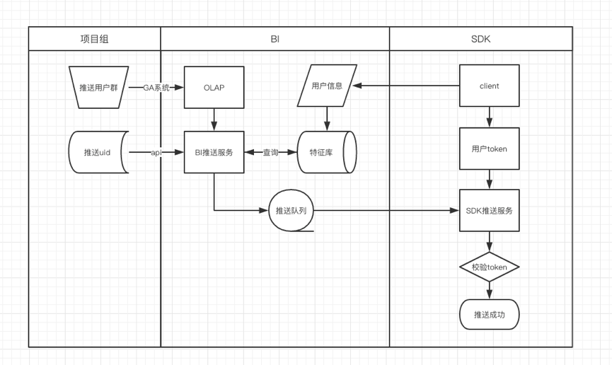
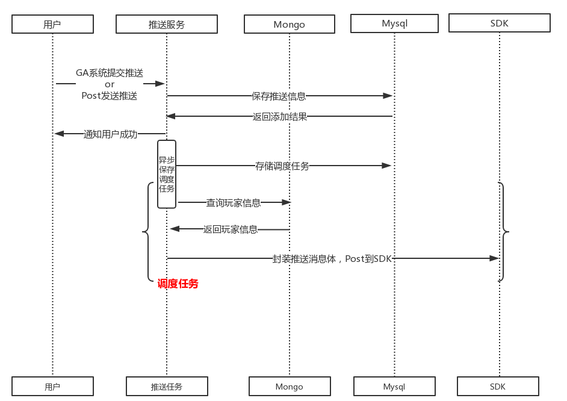

# 推送服务-技术方案文档


## 1、需求描述
为了精细化运营与增长运营，增大游戏的留存与收入，项目组需要对玩家进行消息推送，吸引玩家继续玩游戏。消息推送要求尽可能的贴近玩家的真实情况，比如根据不同语言玩家推送不同内容，不同时区的玩家需要在不同的时间发起推送等。为了支持项目组需求，故此开发推送服务，使之根据玩家特征信息进行不同推送消息的推送，达到项目组的需求。

## 2、需求分析

```
推送消息涉及的模块
```
1. 用户群信息： 可以是GA系统OLAP用户分群筛选出来的，也可以是项目组发送过来的
2. 用户信息： 用户信息保存在BI用户库特征库中，需要连接数据库查询信息
3. 推送调度模块：需要调研一个合适的调度组件满足在不同时间发起推送
4. 推送任务： 真正推送的服务是SDK提供，需要封装推送消息体发送给SDK发起推送
5. 数据信息保存与回显： 选择一个合适的存储组件存储推送文案推送任务

```
整个流程能正常推送完毕需要
```

1. 玩家登陆游戏后SDK收集玩家信息到日志中，SDK记录用户的token, 其中语言位置等信息需要用户授权才能收集。
2. AI组收集前一天用户信息到BI用户库特征库中，持有玩家推送特征信息
3. 项目组筛选出符合条件的用户群，选择推送时间，发起推送任务
4. 推送服务调度推送任务计划，查询玩家信息，发送消息体给SDK

```
绘制整体流程图
```



## 3、开发需求

```
用户群模块
```

1. 改进OLAP服务，使之存储查询任务与查询结果到数据库中
2. 开放一个接口可以使外部服务访问指定的用户群信息
3. 项目组可以传输特定用户群+推送时间到推送服务

```
推送文案模块
```

1. 开发语言列表接口，与SDK使用统一语言表示符
2. 开发推送文案接口，保存推送文案信息，让运营人员添写多种语言文案达到针对不同用户推送不同语言效果
3. 开发推送接口，保存用户群与推送文案信息，设置时间与推送方式进行该用户群的推送
4. 开发测试推送接口，方便项目组使用推送服务

```
调度组件模块
```

1. 寻找开源定时调度组件，把推送任务封装为调度任务执行

```
发送消息到SDK
```

1. 方法为Http请求，方式为Post，Content-Type为 application/json
2. 接口字段

|    字段     |  类型  |          描述           |
| :---------: | :----: | :---------------------: |
|   cloudId   | string |        业务群ID         |
|  productId  | string |         平台ID          |
|   pushId    | string |         推送ID          |
|  platform   | string |        推送平台         |
| environment | string |        推送环境         |
|   olapId    | string |        用户群ID         |
|   docmId    | string |         文案ID          |
|  pushTime   | string |        推送时间         |
|    title    | string |          标题           |
|    body     | string |          文案           |
|  extraData  | string |        额外字段         |
|   userId    | string | 玩家IDs，单次发送1000条 |


```
数据库交互模块
```

1. 与Mysql进行交互数据，使用连接池提高性能
2. 查询Mongo数据库，保证查询到玩家信息

```
安全与报警模块
```

1. 接口接入网关，网关保证接口访问的安全性
2. 开发邮件报警接口，对异常error进行报警，及时知晓推送服务的状态
3. 服务采用微服务，可以在多个节点部署，保证高可用性

##4、设计方案

###4.1、 技术调研

推送任务需要调度组件进行定时推送，那么根据现有开源组件选择最优解

| 特性     | quartz                                     | elastuc-job                                               | xxl-job     |
| -------- | ------------------------------------------ | --------------------------------------------------------- | ----------- |
| 依赖     | mysql                                      | zookeeper+mesos                                           | mysql,maven |
| HA       | 多节点部署，竞争锁保证只有一个节点执行任务 | 通过zookeeper注册与发现，可以动态添加服务器，支持水平扩容 | 集群部署    |
| 文档完善 | 完善                                       | 较复杂                                                    | 简单        |
| 缺点     | 没有管理界面，不支持分布式                 | 系统复杂，学习成本高                                      | 性能不佳    |

分析现在的服务架构，发现任务不需要分布式运行，只需保证任务可靠定时调度，考虑到文档与上手性，发现Quartz即可满足我们需求，故选用此方案。

###4.2、 技术选型

- 项目骨架：因为是接口服务，那么Spring Boot很适合
- 服务划分：OLAP与推送服务需要进行拆分，并且推送服务能访问OLAP服务中的用户群
- 数据存储：选用mysql存储推送信息，数据库连接数支持5000条，数据库存储为500M，保障高性能高存储。
- 安全考虑：接口安全保证是接入网关，统一权限由网关考虑。数据查询权限是Web提交参数传入用户查看数据权限。
- 性能考虑：微服务架构中网关与服务都可以在多个节点起多个服务，这样能够负载均衡的处理用户请求而且单一节点故障不影响全局可用。
- 调度考虑：调研采用的Quartz组件，使用mysql行级竞争锁保证只有一个节点执行任务，避免任务污染

### 4.3、 服务开发

```
用户群模块
```

1. 由于OLAP和推送服务界限明显，故分拆两个服务。把Spring Boot 项目中把两个服务代码拆分开来，各自命名为olap ,push，版本号都为alpha.0.0.1.
2. 保存Olap用户信息到mysql中，存储格式为Blog,保证可以存储足够大的用户信息
3. 开放findjobinfobyid接口，使推送服务可以访问指定用户群信息

```
推送任务模块
```

1. 添加推送任务

推送任务需要三部分，用户ID，推送文案，推送时间。

- 用户ID：请求Olap服务获取用户群信息或者项目组Post发过来的user_id

- 推送文案：GA系统中添加的文案

- 推送时间：GA系统中设置的推送时间与推送方式

服务接受到推送任务数据信息并存储在mysql中。如果推送任务是打开状态，需要根据推送时间和推送方式封装Quartz任务提交到Quartz容器中，真正到了推送时间，执行Quartz任务中的推送逻辑。

2. 执行推送逻辑

到达推送时间，Quartz组件会执行调度任务，开始执行推送逻辑。获取玩家ID查询BI用户库特征库得到语言与推送服信息，根据语言选取该语言的推送文案，封装推送信息（项目组ID，玩家ID，推送文案，标题，推送服ID等）通过Http接口发送给SDK。

```
推送模块时序图
```



3. 删除、修改、查询推送任务

   对mysql中的推送信息进行删除、修改、查询操作。

4. 推送API接口提交推送任务

   根据玩家即时行为项目组有一些吸引留存与收入的推送消息需求，为了支持此任务，推送服务做了如下考虑

   - 做最少的计算操作，服务要高可用
   - 在多个节点部署推送服务，分担单一节点处理压力

   做最少的交互，降低计算时间，增大访问压力，适应API接口高频次访问需求

5. 测试推送接口

​       页面提交信息参数，服务直接封装信息推送给SDK接口，测试项目组是否接入SDK服务成功

6. 推送文案模块

* 增加、删除、修改、查询文案

```
文案格式与前端制定好，样例模版如下
(id=0, cloudId=44, productId=20312, platformId=1, name=111, langs=, content={"content":{"DEF":{"title":333,"body":444,"langName":"默认"}}}, extraData=222, creater=李火星, updateTime=Tue Sep 03 10:13:52 CST 2019, createTime=Tue Sep 03 10:13:52 CST 2019)
```

​	增删改查的推送文案的权限由GA系统中分配

* 文案内容由运营填入多种语言

  推送服务查询玩家不同的语言，选择最适合的文案。

7. 推送SDK模块

采用Spring Boot自带http组件restTemplate，封装消息体即可发送。

```java
--样例代码
HttpHeaders headers = new HttpHeaders();
headers.setContentType(MediaType.APPLICATION_JSON);
String json = JSON.toJSONString(pushMessage);
HttpEntity<String> request = new HttpEntity<>(json, headers); //组装
//发送数据
ResponseEntity<String> response = restTemplate.postForEntity(pushUrl, request, String.class);

```

8. 接入网关模块

网关接口比较简单，只需在服务下增加一行配置，配置如下

```java
eureka:
  client:
    service-url:
      defaultZone: ${EUREKA_URL_LIST:http://192.168.10.186:8761/eureka}
```

### 4.4、mysql建表

```mysql
-- 修改数据库字符集,适配文案由emoji表情
ALTER DATABASE database_name CHARACTER SET = utf8mb4 COLLATE = utf8mb4_unicode_ci;
 
-- 需要维护文案信息表

-- 需要推送人信息表

-- 需要建立Quartz组件信息表

-- 需要维护历史推送任务表，方便查看推送任务状态
```

## 5、稳定性/性能/风险

## 6、类设计/表设计

## 5、服务部署

* 为了保障服务的24*7运行，采用supervisor组件进行维护服务的安全稳定性。supervisor组件之前很多服务项目都在使用，用起来简单可靠。需要编辑supervisor配置文件，配置服务信息。

```shell
--样例配置
[program:push-app]
directory=/home/testcm/project/push               ; 程序的启动目录
command=java -jar push-0.1.0.jar 
autostart = true                                  ; 在 supervisord 启动的时候也自动启动
startsecs = 5                                     ; 启动 5 秒后没有异常退出，就当作已经正常启动了
autorestart = true                                ; 程序异常退出后自动重启
startretries = 3                                  ; 启动失败自动重试次数，默认是 3
user=testcm                                       ; 用哪个用户
redirect_stderr = true                            ; 把 stderr 重定向到 stdout，默认 false
stdout_logfile_maxbytes = 20MB                    ; stdout 日志文件大小，默认 50MB
stdout_logfile_backups = 20                       ; stdout 日志文件备份数
stdout_logfile = /home/testcm/supervisor/logs/push-app.log        ; 日志目录
```

* 服务需要在多个节点运行，那么在多个节点部署supervisor配置文件，并开启服务
* 服务开启/关闭命令

```
start push-app
stop  push-app
```

## 6、未来优化

1. 玩家语言目前打点不统一，入BI特征库需要做额外处理，SDK可以在推送打点更加规范统一
2. BI特征库目前收录间隔是以自然日为单位，可以变为一小时或者实时
3. Quartz组件目前部署为单节点，可以支持目前需求，后续可以部署成分布式
4. 推送时区目前由于玩家信息，暂不支持，SDK可以增加打点然后推送服务支持分时区推送
