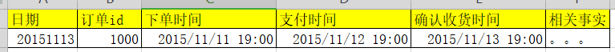
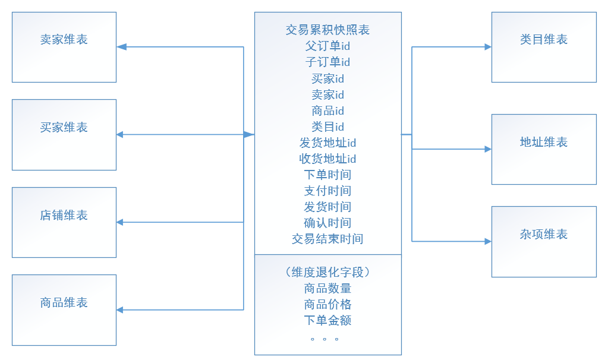
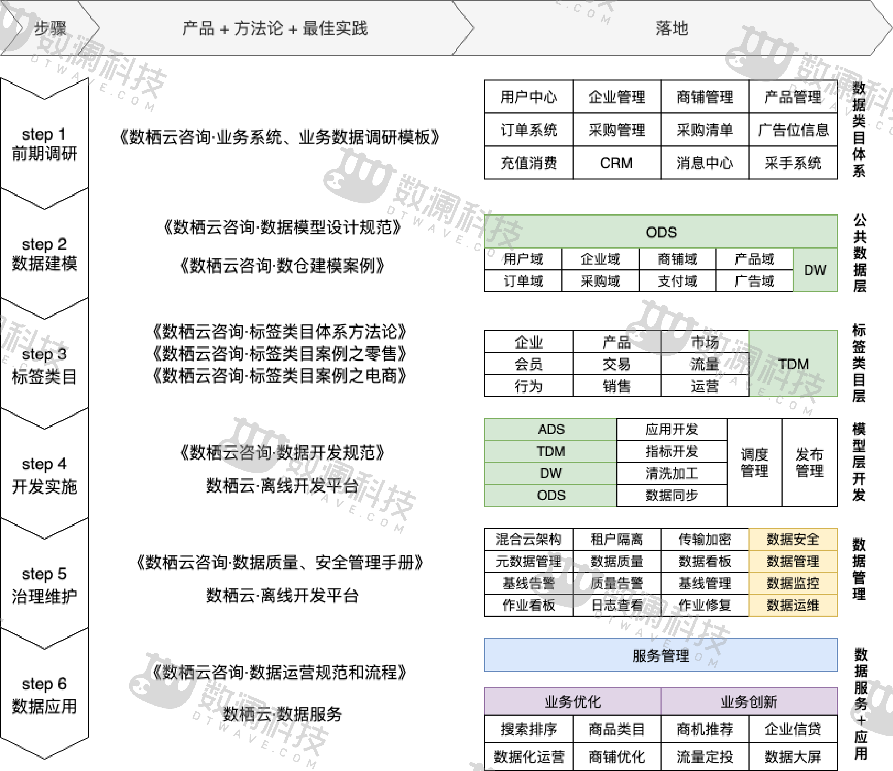
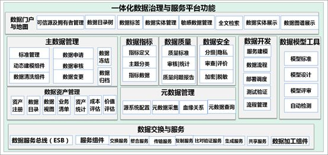
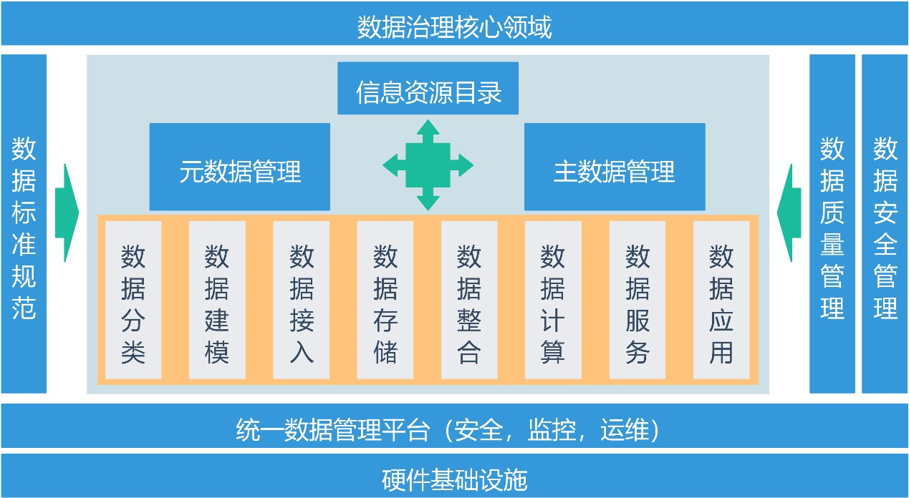
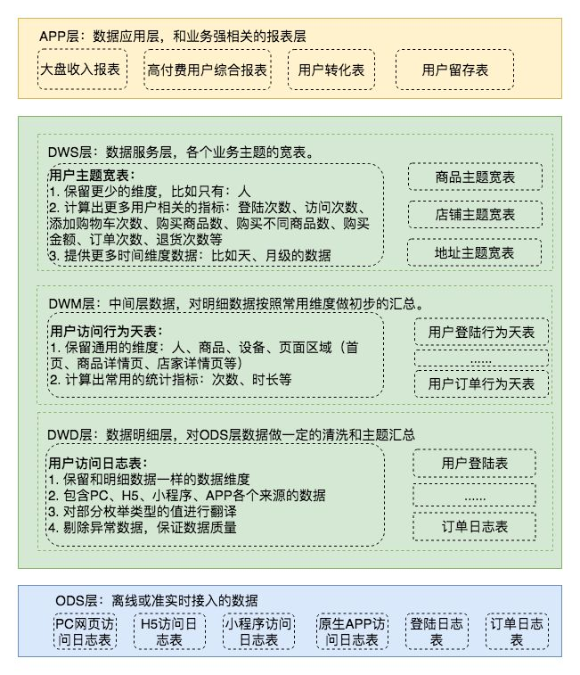
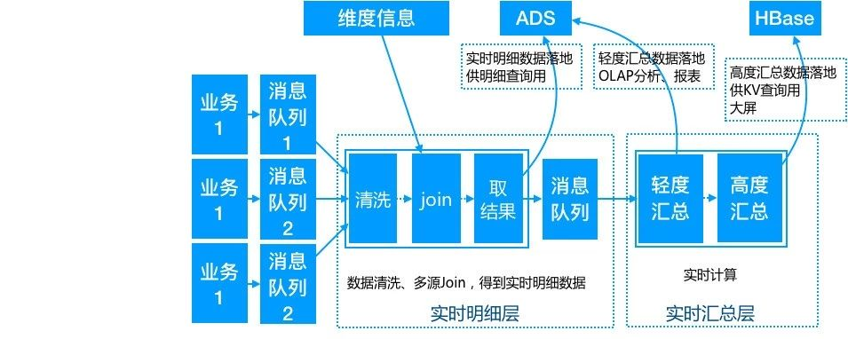
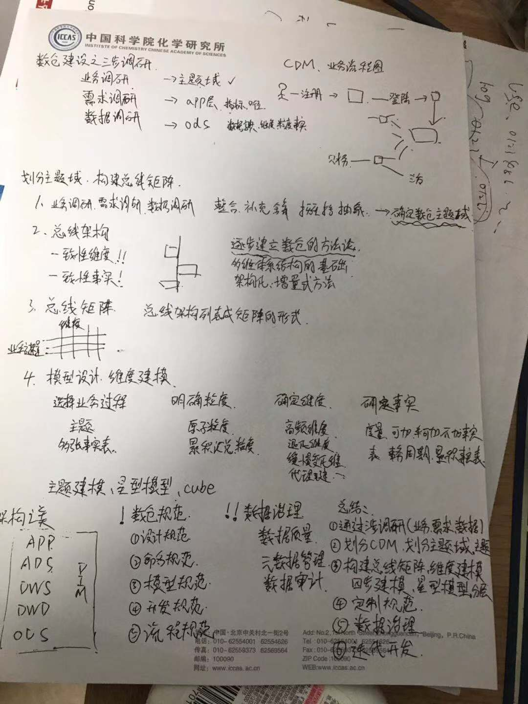
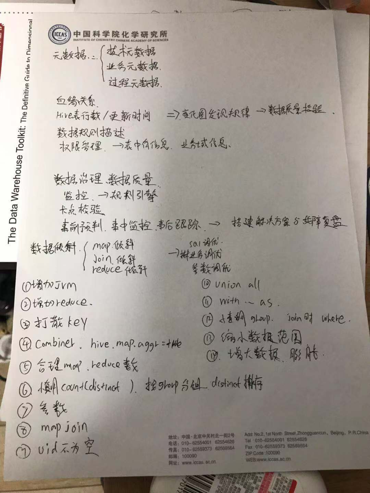
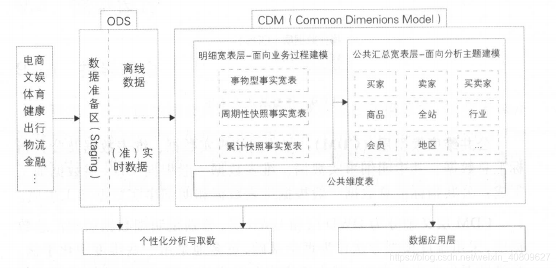

# 数仓总结

>  数据开发的本质是理解业务，设计合适的数仓结构，数据模型
>
>  **问题往往是一环扣一环的，需要有足够的技术深度，将知识由点连接成面，而不是停留在相互孤立的知识点上。**
>
>  **系统化学习，构建   基础知识思维导图   与  系统设计与优化最佳实践。    点的基础 线的扩展 面的概览  全局的思考指南**

## 3NF

> * 完全函数依赖
>
> > 通过 AB 能推出 C，但是 AB 单独得不到 C，那么可以说：C 完全依赖于 AB
> >
> > （学号，课名）推出 分数，但是 单独用学号 推不出 分数，那么可以说：分数 完全依赖于（学号，课名）
>
> * 部分函数依赖
>
> > 通过 AB 能推出 C，通过 单独的A 或者 单独的B 也能推出 C，那么可以说：C 部分依赖于 AB
> >
> > （学号，课名）推出 姓名，而还可以通过 学号 直接推出 姓名，那么可以说：姓名 部分依赖于（学号，课名）
> >
> > 表主键（学号，课名），分数完全依赖于（学号和课名），但是姓名并不完全依赖于（学号和课名）
>
> * 传递函数依赖
>
> > 通过 A 得到 B，通过 B 得到 C，但是通过 C 不能得到 A，那么可以说：C 传递依赖于 A
> >
> > 通过 学号 推出 系名，系名 推出 系主任，但是 系主任 不能推出 学号，那么可以说：系主任 专递依赖于 学号
>
> https://blog.csdn.net/ytp552200ytp/article/details/108146345

* 1NF

> 表中每一列必须是不可拆分的最小单元，每一列原子性

* 2NF

> 在满足1NF后， 不存在非主属性对 key  的部分依赖，即要求表中所有列，必须依赖与主键，不能有任何一列与主键没有关联，也就是每一个表只描述一件事

* 3NF

> 在满足2NF后，不存在非主属性对 key 的传递依赖 。 要求表中每一列与主键直接相关而不是间接相关
>
> 


## 0、纬度建模与星型、雪花模型  与数仓分层意义

|          | 范式建模                     | 纬度建模                         |
| -------- | ---------------------------- | -------------------------------- |
| 角度     | 从全企业的高度设计3NF        | 从分析决策为出发点构建模型       |
| 描述     | 用实体加关系描述企业业务架构 | 事实表 纬度表 星星模型  雪花模型 |
| 范式理论 | 3NF  不允许冗余              | 逆3NF 允许冗余                   |
| 面向     | 面向数据整理和一致性治理     | 面向业务,分析                    |

复合式的数据仓库架构中，操作型或事务型系统的数据源，通过ETL抽取转换和加载到数据仓库的ODS层，然后通过ODS的数据，利用范式建模方法，建设原子数据的数据仓库EDW，然后基于EDW，利用维度建模方法建设数据集市。

### 1、纬度建模理论

>在可理解性和性能最为最高目标驱动下，产生了纬度模型的构造思想
>
>**维度建模是一种将数据结构化的逻辑设计方法，它将客观世界划分为度量（事实）和上下文（维度）。度量是常常是以数值形式出现，事实周围有上下文包围着，这种上下文被直观地分成独立的逻辑块，称之为维度。它与实体-关系建模有很大的区别，实体-关系建模是面向应用，遵循第三范式，以消除数据冗余为目标的设计技术。维度建模是面向分析，为了提高查询性能可以增加数据冗余，反规范化的设计技术**
>
>- 便于理解、管理
>- 提高查询性能
>- 对称性
>- 可扩展性

#### 1.1、基本构成要素

事实表， 纬度表， **维度表和事实表的融合（星型结构）**

##### 1.1.1、事实表

* 事务事实表(Additive Fact)

> 保存的是最原子的数据，也称“原子事实表”

*  周期快照事实表(Semi-Additive Fact)

> 周期快照事实表以具有规律性的、可预见的时间间隔来记录事实，时间间隔如每天、每月、每年等等
>
> 它统计的是间隔周期内的度量统计， **周期快照事实表记录的是重复的可预测到的时间间隔的事实**
>
> 周期快照事实表的粒度是每个时间段一条记录，通常比事务事实表的粒度要粗，是在事务事实表之上建立的聚集表
>
> **周期快照事实表的日期维度通常是记录时间段的终止日，记录的事实是这个时间段内一些聚集事实值。事实表的数据一旦插入即不能更改，其更新方式为增量更新。**

*  累计快照事实表(Non-Additive Fact)

> https://www.jianshu.com/p/453afb5382ea
>
> **周期快照事实表记录的确定的周期的数据**，**而累积快照事实表记录的不确定的周期的数据。累积快照事实表代表的是完全覆盖一个事务或产品的生命周期的时间跨度，它通常具有多个日期字段，用来记录整个生命周期中的关键时间点。 累计快照适用于较短周期，有着明确的开始和结束状态的过程**
>
> **事务事实表中一条交易记录会每天有一条数据来记录整个交易过程；而累积快照事实表只会有一条记录，数据会一致更新直到过程结束。**
>
> 对于不同过程，要设计统一的结束标志，没有的业务时间置空





* 非事实事实表(Factless Fact Table)

  **在事实表中，通常会保存十个左右的维度外键和多个度量事实，度量事实是事实表的关键所在。在非事实型事实表中没有这些度量事实，只有多个维度外键。非事实型事实表通常用来跟踪一些事件或者说明某些活动的范围。 **

  * 第一类非事实型事实表是用来跟踪事件的事实表。例如：学生注册事件，学校需要对学生按学期进行跟踪。维度表包括学期维度、课程维度、系维度、学生维度、注册专业维度和取得学分维度，而事实表是由这些维度的主键组成，事实只有注册数，并且恒为1。这样的事实表可以回答大量关于大学开课注册方面的问题，主要是回答各种情况下的注册数。

  * 第二类非事实型事实表是用来说明某些活动范围的事实表。例如：促销范围事实表。通常销售事实表可以回答如促销商品的销售情况，但是对于那些没有销售出去的促销商品没法回答。这时，通过建立促销范围事实表，将商场需要促销的商品单独建立事实表保存。然后，通过这个促销范围事实表和销售事实表即可得出哪些促销商品没有销售出去。这样的促销范围事实表只是用来说明促销活动的范围，其中没有任何事实度量。

##### 1.1.2、纬度表

* 维度表可以看作是用户来分析数据的窗口，
* 维度表中包含事实数据表中事实记录的特性，有些特性提供描述性信息，有些特性指定如何汇总事实数据表数据，以便为分析者提供有用的信息，
* 维度表包含帮助汇总数据的特性的层次结构。
* } 缓慢变化维(Slowly Changing Dimension)
  } 快速变化维(Rapidly Changing Dimension)
  } 大维(Huge Dimension)和迷你维(Mini-Dimension)
  } 退化维(Degenerate Dimension)

##### 代理键用于维度表和事实表的连接  

> ===> 代理键的优点
>
> 1. 屏蔽业务或数据的影响， 性能优势， 建立不存在的纬度记录
>
> 2. Kimball的缓慢变化维处理策略的核心就是使用代理关键字

#### 1.2、四步走设计纬度模型

选取业务过程，确定粒度，选定纬度，定义事实

#### 1.3、架构化、增量式建设数仓方法论

> http://www.likecs.com/show-12868.html

**数据仓库总线架构，（分解企业数据仓库规划任务，统一解释的标准化维度与事实。） 总线矩阵**

**一致性纬度，**

**一致性事实**

> 　数据仓库建模的争议点：从建立一个集中式的、规划好的架构角度为整个企业建立数据仓库，还是为每个具体的部门建立小型的独立解决方案。当然这两种都不是很有效。前者需要在设计之前将所有数据、所有业务完全掌握清楚，并对数据清洗等了解清楚，这个很难办到，**后者由于是单独的创建集市，导致各集市互不兼容，无法形成企业级的全局的数据仓库。**
>
> 　　如何解决这一难题，**首先需要定义整个企业数仓系统的数据架构，收集业务需求生成企业数据仓库总线矩阵，矩阵每行对应一个业务过程，每列都是一个业务维度。逐个收集业务过程，并使用一致性维度确保系统的综合集成**。这**样每个业务过程的实现都对整个架构进行了增量扩展，迭代地建立成一个集成的数据仓库。**
>
> **基于一致性维度的架构将一组业务过程紧密的联系到一起形成了企业数据仓库。企业数据仓库的总线其实就是共享的一致性维度。**
>
> **另外**：一致性维度需要得到高层的支持，因为要做到统一其实是牵扯很多业务系统的事情，有很多是非技术问题。

##### 总线架构的意义

**数仓规划是数仓建设的蓝图，涵盖从需求分析开始到最终的数仓评估验收整个环境**；数仓规划之所以**重要**，是因为它是描述了**数据流动的概念性框架**，**为元数据管理奠定了基础**，**对数据加工过程的理解、数仓建设的交流分享、数据的使用和问题排查、数仓健康度的评估都提供了极大的帮助**。


### 2、星型、雪花模型

星型模型： **星型架构是一种非正规化的结构，多维数据集的每一个维度都直接与事实表相连接，不存在渐变维度，所以数据有一定的冗余**

雪花模型：  **通过最大限度地减少数据存储量以及联合较小的维表来改善查询性能。**雪花型结构去除了数据冗余。

| 类型 | 星型模型                                      | 雪花模型                                     |
| ---- | --------------------------------------------- | -------------------------------------------- |
| 本质 | 纬度表直接链接事实表                          | 存在纬度表没有直连事实表，而是链接其他纬度表 |
| 缺点 | 数据存在冗余，链接查询性能高，etl可以高度并行 | 数据冗余少，链接查询性能低，etl不能并行化    |
| 适合 | 指标分析                                      | 纬度分析                                     |

#### 支架表

> https://www.jianshu.com/p/a2fe0c3095a0
>
> 当一个属性集合（例如日期、地点）在某个维度或多个维度表中反复出现时，就可以考虑使用支架表。
>
> 虽然我们不推崇雪花模型，但如果**一组属性在维度表中出现不止一次**时，我们也可以采用受限的雪花模型——也就是**支架表**。
>
> 日期支架表是最常用的支架表   时间支架表    地区支架表
>
> 或者更准确的说，是维度建模与范式建模。纯粹的范式建模不适用与OLAP系统，纯粹的星型模型也会遇到无数的苦难。根据实际业务情况（而非底层系统）进行适当的妥协——例如微型维度和支架表——才能使你的模型真正靠谱。

#### 微型纬度

> 当变化频率加快时候，并且维度表包含几百万行的维度表。如果对变化的跟踪采用可靠的SCD2技术对浏览和查询性能具有负面影响。采用不同的维度消除频繁分析或者频繁变化的属性，这一维度技术叫做微型维度。
>    例如：人口统计，不断变化的属性：收入，被转换为带状范围值。微型维度中的属性值通常呈现为相对小范围的离散值，尽管此类限制使用了预定义宽度范围的集合，但是它能够极大的减少微型维度中合并值的数量。

### 3、数仓的意义  与 分层的好处

> 数据仓库是支持管理决策过程.  面向主题的、集成的、相对稳定的、反映历史变化（不同时间）的持久的数据集合，用以支持经营管理中的决策制定过程、数据仓库中的数据面向主题，与传统数据库面向应用相对应。

数据仓库的四个基本特征是 `面向主题`、`集成的`、`相对稳定的`、`记录历史的` 。 数据仓库的价值正是基于这四个特征体现的

* 高效的数据组织与管理

面向主题的数据组织方式，清晰的数据分类与分层机制形成高效、完整的数据体系。 增加数据分析获取统计的效率

* 集成价值

数仓收纳所有类型数据，实现各种不同数据的关联并进行多维分析，为多角度多层次的数据分析与决策提供支持

* 时间价值

数据任务按照时间调度收集入仓，分类分层。从应用角度有利于实现复杂的统计查询，体检数据统计效率

* 历史积累价值

记录历史，方便回朔历史，分析历史，跟踪历史行为，总结历史，预测未来

| 数仓分层的好处-------- **对数据进行分层的一个主要原因就是希望在管理数据的时候，能对数据有一个更加清晰的掌控**，详细来讲，主要有下面几个原因。 |
| ------------------------------------------------------------ |
| 清晰的数据结构                                               |
| 数据血缘追踪                                                 |
| 空间换时间                                                   |
| 减少重复开发                                                 |
| 统一数据口径                                                 |
| 屏蔽业务的影响，快速适应业务的变化                           |
| 复杂的问题简单化                                             |
|                                                              |

### 4、数据仓库质量

#### 如果保证数据质量？

> 数据质量管理是通过计划、实施和控制活动，运用质量管理技术度量、评估、改进和保证数据的恰当使用。
>
> 被动问题治理阶段
>
> 主动问题治理阶段
>
> 预防问题治理阶段

* 数据工作流质量管理
* 数据质量管理
* 数据生命周期管理

## 1、数仓纬度建模四部曲

```mysql
-- 1. 通过对业务需求 以及 可用数据源综合考虑，决定对那种业务过程开展建模工作。

-- 2. 业务过程确定后，需要确定在纬度模型中包含那个级别的细节数据。（原子粒度 -> 汇总粒度）

-- 3. 以上两点确认后，纬度选择就比较直接了。在主纬度框架内（粒度）,考虑其他纬度是否可以被属性化为业务度量   

-- 4. 确认那些事实放到事实表中。 事实必须与粒度吻合。

```

> 数仓管理和发展一些分享 http://blog.itpub.net/29989552/viewspace-2151382/

## 1、数据建模的六大基本原则

```
建模的基本原则
    简单讲建模的一些原则，在建模的考虑中需要加以考虑，避免后续遇到大坑措手不及，而不要简单的为了建模而建模。

1.高内聚&&低耦合

主要从数据业务特性和访问特性两个角度来考虑:

将业务相近或者相关、粒度相同的数据设计为一个逻辑或者物理模型；

将高概率同时访问的数据放一起 ，将低概率同时访问的数据分开存储。

2.核心模型与扩展模型分离

核心模型包括的宇段支持常用的核心业务，扩展模型包括的字段支持个性化或少量应用的需要，不要让扩展模型包括的字段过多的入侵核心模型，破坏核心模型的性能及简洁等

 3.存储成本与计算性能均衡

在很多时候，设计可能清晰，但存储成本很高，或存储成本很小但计算逻辑复杂，性能差，都需要做一个比较，做到均衡，而非执意孤行。

4.公共逻辑下沉及统一

避免重复计算，需将公共逻辑在底层实现并统一口径

5.幂等性

处理逻辑不变，多次执行结果需保持一致。

6.规范性

相同含义字段需在多表中命名一致，表命名需清晰规范，便于查询及使用

=== 有了模型体系架构和建模流程，我们要实打实地设计一个个模型。我们知道表的分类主要是事实表和维表。事实表是维度建模的核心，维度是维度建模的基础和灵魂。设计模型其实就是在设计事实表和维度表。简单介绍下模型设计的基本原则和设计方法。
1.1高内聚低耦合（  !!! 最重要，非功能性需求决定架构）
产出时间
粒度
业务相关性
访问频率
运行方式：并行、串行
资源消耗情况
1.2核心模型与扩展模型分离
核心模型：支持常用的核心业务
扩展模型：支持个性化或少量应用需要
比如：mlog的分享引入，只有在做增长时才需要，需要拆开成立专门的分享引入模型
1.3公共处理逻辑下沉及单一
越是底层公用的处理逻辑越应该在数据调度依赖的底层进行封装与实现，不要让公用的处理逻辑暴露给应用层实现，不要让公共逻辑多处同时存在。
1.4成本与性能平衡
适当的数据冗余可换取查询和刷新性能，不宜过度冗余与数据复制。
1.5数据可回滚
处理逻辑不变，在不同时间多次运行数据结果确定不变。
1.6一致性
具有相同含义的字段在不同表中的命名必须相同，必须使用规范定义中的名称。
1.7命名清晰、可理解
表命名需清晰、一致，表名需易于用户理解和使用。

```

## 1、 数据仓库从搭建到应用的一整套方法论

> https://bbs.dtwave.com/topics/show/174



* 前期调研


* 数据建模


* 标签类目

> - 基础标签：直接对应的业务表字段，如性别、城市等
> - 统计标签：标签定义含有常规的统计逻辑，开发时需要通过简易规则进行加工，如年增长率、月平均收益率等
> - 算法标签：标签定义含有复杂的统计逻辑，开发时需要通过算法模型进行加工，如企业信用分、预测年销量等
>
> 

* 开发实施


* 治理维护

> 贯穿数据采集、应用和价值实现等整个生命周期全过程。
>
> 数据管理就是通过对数据的生命周期的管理，提高数据资产质量，促进数据在“内增值，外增效”两方面的价值表现。
>
> - 数据标准管理
> - 数据模型管理
> - 元数据管理
> - 主数据管理
> - 数据质量管理
> - 数据安全管理


* 数据应用


## 1、数据治理方法论

> https://bbs.dtwave.com/topics/show/167
>
> 狭义上讲，数据治理是指对数据质量的管理、专注在数据本身。**广义上讲，数据治理是对数据的全生命周期进行管理，包含数据采集、清洗、转换等传统数据集成和存储环节的工作、同时还包含数据资产目录、数据标准、质量、安全、数据开发、数据价值、数据服务与应用等，整个数据生命期而开展开的业务、技术和管理活动都属于数据治理范畴。有的专家干脆把广义的数据治理称为数据资产管理。**
>
> **数据治理专注于将数据作为企业数据资产进行应用和管理的一套管理机制，能够消除数据的不一致性，建立规范的数据应用标准，提高数据质量，实现数据内外部共享，并能够将数据作为组织的宝贵资产应用于业务、管理、战略决策中，发挥数据资产价值**
>
> 

数据治理平台主要采用**数据中台**技术和**微服务架构**初步替代传统架构、面向大数据架构下，为数据资源中心与外部数据系统提供数据服务。对内和对外系统提供云服务。

**数据治理管理工具用于落实数据管理体系，实现数据管理自动化，提高数据管理效率，确保数据质量、实现安全数据共享。主要包括`数据门户地图`、`主数据管理`、`数据指标`、`元数据管理`、`数据模型工具`、`数据交换与服务工具`、`数据资产管理`、`数据开发`、`数据质量管理`、`数据安全`**




> https://zhuanlan.zhihu.com/p/43446819
>
> 目前总结的数据治理领域包括但不限于一下内容：**数据标准、元数据、数据模型、数据分布、数据存储、数据交换、数据生命周期管理、数据质量、数据安全以及数据共享服务。**
>
> **同时各领域之间需要有机结合，**
>
> **如数据标准、元数据、数据质量等几个领域相互协同和依赖。通过数据标准的管理，可以提升数据合法性、合规性，进一步提升数据质量，减少数据生产问题；**
>
> **在元数据管理的基础上，可进行数据生命周期管理，有效控制在线数据规模，提高生产数据访问效率，减少系统资源浪费；**
>
> **通过元数据和数据模型管理，将表、文件等数据资源按主题进行分类，可明确当事人、产品、协议等相关数据的主数据源归属、数据分布情况，有效实施数据分布的规划和治理。**



## 2、灵魂30问

### 0、你们的离线/实时数仓是什么样的？ 怎么分层的？

### ---！！！离线数仓架构



### --- ！！！实时数仓架构



> - **第一层 DWD 公共实时明细层**
>
> 实时计算订阅业务数据消息队列，然后通过数据清洗、多数据源  join、流式数据与离线维度信息等的组合，将一些相同粒度的业务系统、维表中的维度属性全部关联到一起，增加数据易用性和复用性，得到最终的实时明细数据。这部分数据有两个分支，一部分直接落地到 ADS，供实时明细查询使用，一部分再发送到消息队列中，供下层计算使用；
>
> - **第二层 DWS 公共实时汇总层**
>
> 以数据域+业务域的理念建设公共汇总层，与离线数仓不同的是，这里汇总层分为轻度汇总层和高度汇总层，并同时产出，轻度汇总层写入  ADS，用于前端产品复杂的 olap 查询场景，满足自助分析和产出报表的需求；高度汇总层写入 Hbase，用于前端比较简单的 kv  查询场景，提升查询性能，比如实时大屏等；

### ===== 架构模式


APP:       高度汇总，应用数据，可以导入应用服务

DWM： 识别分析对象，圈定分析边界，丰富对象属性。

DWD：  识别实体关系，挂靠业务主题，屏蔽业务变化，统一数据标准

ODS :     落地缓冲区，与数据来源保持一致，还原业务


### 1、什么是数据仓库？如何构建数据仓库？

#### -什么是数据仓库？

数据仓库， 拿数据库做对比来解释吧 

在数据库已经大量存在的情况下，为了进一步挖掘数据资源、为了决策需要而产生的 。 

数据库是为捕获数据而设计，数据仓库是为分析数据而设计 
数据库是面向事务的设计，数据仓库是面向主题设计的
数据库一般存储在线交易数据，数据仓库存储的一般是历史数据。

---> 以银行业务为例。数据库是事务系统的数据平台，客户在银行做的每笔交易都会写入数据库，被记录下来，这里，可以简单地理解为用数据库记帐。数据仓库是分析系统的数据平台，它从事务系统获取数据，并做汇总、加工，为决策者提供决策的依据。比如，某银行某分行一个月发生多少交易，该分行当前存款余额是多少。如果存款又多，消费交易又多，那么该地区就有必要设立ATM了。

> 数据仓库概念创始人W.H.Inmon在《建立数据仓库》一书中对数据仓库的定义是：数据仓库是支持管理决策过程.  面向主题的、集成的、相对稳定的、反映历史变化（不同时间）的持久的数据集合，用以支持经营管理中的决策制定过程、数据仓库中的数据面向主题，与传统数据库面向应用相对应。

#### -如何构建数据仓库？

从0-1构建的话，推荐以下步骤

1. 通过业务、需求、数据调研，构建CDM业务流程图
2. 根据流程图，划分主题域，确定主题
3. 构建总线架构与总线矩阵，进行纬度建模（四步走），构建星型模型
4. 设计数仓分层架构，定义数仓规范（命名、模型、开发、流程）
5. 数据治理，保证数据质量，数据安全，数据审计
6. 评估与验收。 开发与迭代开发

**从概念模型（cdm）->逻辑模型（ldm）->物理模型（pdm）建模套路，是一个从抽象到具体的一个不断细化完善的分析，设计和开发的过程 **




#### -数据仓库与数据中台的区别？

> 需要明白数据仓库和数据平台是两个不同的概念，不要把搭建一套 Hadoop + Hive 的平台叫数据仓库，这是数据平台的范畴
>
> **数据仓库不仅仅是指数据接入、数据存储和数据计算，它也要包括数据治理、数据建模和数据挖掘。比如元数据管理、维度建模和 OLAP 分析**
>
> **数据质量管理**

### 2、如何建设数据中台？简单说下对中台理解与思路

华为数据中台有句话叫做——炮火支援单兵作战

> https://mp.weixin.qq.com/s?__biz=Mzg3NjIyNjQwMg==&mid=2247484084&idx=1&sn=976f87c5861bb670f502aada5566e6c2&chksm=cf3430b9f843b9af7dc79ea780b0e6708843939fca05b72c7f14a0e3bef082035029285af4f0&scene=21#wechat_redirect
>
> https://mp.weixin.qq.com/s?__biz=Mzg3NjIyNjQwMg==&mid=2247484399&idx=2&sn=a7cf983c93b25a217fe2674d9552eba8&chksm=cf3431e2f843b8f43d720f10968f2ca92aeb42768e699512ea2b69a04dbb788f82446e8d7325&scene=21#wechat_redirect
>
> https://mp.weixin.qq.com/s?__biz=Mzg3NjIyNjQwMg==&mid=2247484172&idx=2&sn=0df4ec70c9118f6a83c26f9a1b4eb65e&chksm=cf343101f843b81767df3d6d0573349db1943bdf4f1dc098086599d4b3170f97602b43a83c53&scene=21#wechat_redirect
>
> 企业的发展，往往伴随着业务更多元化，也必然会促进更多的业务数据产生，也为企业实现业务数据化和数据业务化带来了更多的可能性，但现实是很多企业依然采用传统理念去建设大数据平台，导致不单单业务系统是一个个烟囱，大数据平台也是一个个垂直的数据中心，所以**如何打通这些数据并将其按照一个统一的标准进行建设，以达到技术降本、应用提效、业务赋能的目标，是众多企业面临的问题**。数据中台就是为解决这些问题而生。
>
> **数据中台的内核包括两方面：一个是应用数据的技术能力，另一个是数据资产的管理。 **
>
> **就是如何构建企业数据中心， 然后把数据资产建好，管好，用好。 这不仅仅需要方法论和管理制度，更需要的一个可视化的数据管理工具，实现复杂的数据资产运维简单化 **

### 3、数据仓库、数据中台、数据湖的理解

* 数据仓库，分而治之，用于BI计算报表
* 数据湖 ，数据格式内容众多，可以进行更多的数据挖掘分析，多用于AI
*  数据中台 一统天下 对象DataAPI（组织架构）

> https://aws.amazon.com/cn/big-data/datalakes-and-analytics/what-is-a-data-lake/

**数据仓库是一个优化的数据库，用于分析来自事务系统和业务线应用程序的关系数据。事先定义数据结构和 Schema 以优化快速 SQL 查询，其中结果通常用于操作报告和分析。数据经过了清理、丰富和转换，因此可以充当用户可信任的“单一信息源”。**

**数据湖有所不同，因为它存储来自业务线应用程序的关系数据，以及来自移动应用程序、IoT 设备和社交媒体的非关系数据。捕获数据时，未定义数据结构或 Schema。这意味着您可以存储所有数据，而不需要精心设计也无需知道将来您可能需要哪些问题的答案。您可以对数据使用不同类型的分析（如 SQL 查询、大数据分析、全文搜索、实时分析和机器学习）来获得见解。**

|     特性      |                        数据仓库                        |                            数据湖                            |
| :-----------: | :----------------------------------------------------: | :----------------------------------------------------------: |
|   **数据**    | **来自事务系统、运营数据库和业务线应用程序的关系数据** | 来自 IoT 设备、网站、移动应用程序、社交媒体和企业应用程序的非关系和关系数据 |
|  **Schema**   |      **设计在数据仓库实施之前（写入型 Schema）**       |                写入在分析时（读取型 Schema）                 |
|  **性价比**   |             更快查询结果会带来较高存储成本             |                 更快查询结果只需较低存储成本                 |
| **数据质量 ** |          **可作为重要事实依据的高度监管数据**          |         任何可以或无法进行监管的数据（例如原始数据）         |
|   **用户**    |                       业务分析师                       |     数据科学家、数据开发人员和业务分析师（使用监管数据）     |
|   **分析**    |              **批处理报告、BI 和可视化**               |              机器学习、预测分析、数据发现和分析              |

> https://yqh.aliyun.com/detail/10240?utm_content=g_1000134764
>
> 数据湖应该是一种不断演进中、可扩展的大数据存储、处理、分析的基础设施；以数据为导向，实现任意来源、任意速度、任意规模、任意类型数据的全量获取、全量存储、多模式处理与全生命周期管理；并通过与各类外部异构数据源的交互集成，支持各类企业级应用。


### 4、传统数仓的程度（建模工具、ETL工具、BI报表工具、调度系统）

 **建模工具**：powerDesiger、Erwin、Visio

**ETL工具**: kettle/informatic（主流的两款） 等等

**BI报表工具**:superset、cboard、redash、帆软BI/QuickBI/PowerBI 等等

**调度系统**：airflow、azkaban、ooize、xxl-job、dolphinscheduler、Zeus、hera、

### 5、传统数仓和大数据数仓的异同？有哪些大的变化？

* 数仓技术选型侧重点，要求不一致
* 数据来源不一样
* 数仓建模、分层不一样
* 数据查看分析不一样

### 6、数仓最重要的是什么？

```mysql
-- 数据的真正价值在于数据驱动决策
-- 确保数据的准确性


-- 如何保证数据的准确性？

元数据的建设与管理是其中重要的一个环节
元数据建设的目标是打通数据接入到加工 ，再到数据消费整个链路，规范元数据体系与模型，提供统一的元数据服务出口，保障元数据产出的稳定性和质量。
首先梳理清楚元仓底层数据，对元数据做分类，如计算元数据、存储元数据、质量元数据等，减少数据重复建设，保障数据的唯一性。
另外， 要丰富表和字段使用说明，方便使用和理解。根据元仓底层数据构建元仓中间层，建设元数据基础宽表，也就是元数据中间层，打通从数据产生到消费整个链路。

https://mp.weixin.qq.com/s?__biz=Mzg3NjIyNjQwMg==&mid=2247484645&idx=1&sn=e1e0052e561fa8aa65064ec667264358&chksm=cf3436e8f843bffeca6b198d94c171d52a69d238b7b60d8399b2d9bc727de96409b027fd50f1&scene=21
```

### 7、实时数仓？采用什么架构？lambda有哪些优缺点？

实时数仓分为  利用框架实时计算数据型    与  利用高性能OLAP引擎实时导入型

[如果你也想做实时数仓…](http://mp.weixin.qq.com/s?__biz=Mzg3NjIyNjQwMg==&mid=2247484067&idx=1&sn=d424b90296f777d5bc6d7f8fd91a2e06&chksm=cf3430aef843b9b85501d7d71db9c0c10b527a07c41c1323c9be5e5cac6a8428cc5ba0dcfc33&scene=21#wechat_redirect)

[基于Lambda架构，MES实时计算平台演进之路](http://mp.weixin.qq.com/s?__biz=Mzg3NjIyNjQwMg==&mid=2247484548&idx=1&sn=8aaaf9715fa5f2a91e7ab1f2df10fbc8&chksm=cf343689f843bf9f43b0af13fa3d0f0733250ac9eed4c1a9bc0a159c051122c70f0b8d5dc75a&scene=21#wechat_redirect)

### 8、如何看待kappa架构？iota架构呢？

[Lambda架构已死，去ETL化的IOTA才是未来](http://mp.weixin.qq.com/s?__biz=Mzg3NjIyNjQwMg==&mid=2247484302&idx=2&sn=411efa8b63bc2cf339d8872f1c6460e1&chksm=cf343183f843b895136e2123b4a3ca4b0c01ae0a4b3d1548af1608230d5fd4e8b5f94a1c5bce&scene=21#wechat_redirect)

### 9、用户画像（静态、动态标签，统计、预测标签，衰退系数、权重

[用户画像](http://mp.weixin.qq.com/s?__biz=Mzg3NjIyNjQwMg==&mid=2247484449&idx=1&sn=eb945a7dfec166cb56280161afa0f4a2&chksm=cf34362cf843bf3af9a3bbe4118efe53df378c5d2de884b8978831d5627573451006781afc93&scene=21#wechat_redirect)

[58用户画像实践](http://mp.weixin.qq.com/s?__biz=Mzg3NjIyNjQwMg==&mid=2247484270&idx=2&sn=4ec93292d9386887524444ae784d6a68&chksm=cf343163f843b8757b30893b97d8b6fc2e06a89f855cac7e86b14814269c0f03ec27f8032a36&scene=21#wechat_redirect)

**静态数据-评估价值**:用户相对稳定的信息，例如，主要包括人口属性、商业属性等方面数据；这类信息，自成标签，如果企业有真实信息则无需过多建模预测，更多的是数据清洗工作，如果某些静态信息不准或缺失则需要建模预测。

**动态数据-循迹**: 用户不断变化的行为信息，例如：浏览凡客首页、浏览休闲鞋单品页、搜索帆布鞋、发表关于鞋品质的微博、赞“双十一大促”的微博消息。等等均可看作互联网用户行为。

**形态**: **标签与权重**: 用户画像的最终形态是通过分析用户行为，最终为每个用户打上标签，以及该标签的权重

**标签**：表征了内容，用户对该内容有兴趣、偏好、需求等等

**权重**：表征了指数，用户的兴趣、偏好指数，也可能表征用户的需求度，可以简单的理解为可信度，概率

**数据建模方法**: 标签=用户标识 + 时间 + 行为类型 + 接触点（网址+内容）的聚合，某用户因为在什么时间、地点、做了什么事，所以会打上**标签

### 10、推荐系统（协同过滤，基于用户、商品，各种距离算法等）

AI上略搞过

* 欧氏距离 其源自于欧式空间中计算两点间的距离公式
* 曼哈顿距离，城市街区距离、棋盘距离

### 11、数仓基础理念

主题域 血缘关系 拉链表 代理键 维度退化 缓慢变化维SCD 事实表类型 增量dwd处理 星型/雪花/星座模型 事实 维度 粒度 原子/派生指标 OLAP  

### 12、数仓如何确定主题域？CDM？

**主题（Subject）是在较高层次上将企业信息系统中的数据进行综合、归类和分析利用的一个抽象概念，每一个主题基本对应一个宏观的分析领域。在逻辑意义上，它是对应企业中某一宏观分析领域所涉及的分析对象。**

例如“销售分析”就是一个分析领域，因此这个数据仓库应用的主题就是“销售分析”。
面向主题的数据组织方式，就是在较高层次上对分析对象数据的一个完整并且一致的描述，能刻画各个分析对象所涉及的企业各项数据，以及数据之间的联系。

**所谓较高层次是相对面向应用的数据组织方式而言的，是指按照主题进行数据组织的方式具有更高的数据抽象级别。与传统数据库面向应用进行数据组织的特点相对应，数据仓库中的数据是面向主题进行组织的。**

> 主题可以说是 区别传统数据库面向应用进行数据组织， 数据仓库是面向主题，较高层次上对企业数据进行综合，归类，分析的一种方式。便于企业数据分析，避免数据孤岛

**主题域是对某个主题进行分析后确定的主题的边界。**分析主题域，确定要装载到数据仓库的主题是信息打包技术的第一步。 **主题域通常是联系较为紧密的数据主题的集合。可以根据业务的关注点，将这些数据主题划分到不同的主题域。主题域的确定必须由最终用户和数据仓库的设计人员共同完成。**

> 主题域是进一步抽象。   规整一类主题， 划分一类业务过程

```mysql
主题域的确定必须由最终用户和数据仓库的设计人员共同完成的， 而在划分主题域时，大家的切入点不同可能会造成一些争论、重构等的现象，考虑的点可能会是下方的某些方面：
--    1、按照业务或业务过程划分：
比如一个靠销售广告位置的门户网站主题域可能会有广告域，客户域等，而广告域可能就会有广告的库存，销售分析、内部投放分析等主题；
--    2、根据需求方划分：
比如需求方为财务部，就可以设定对应的财务主题域，而财务主题域里面可能就会有员工工资分析，投资回报比分析等主题；
 --   3、按照功能或应用划分：
 比如微信中的朋友圈数据域、群聊数据域等，而朋友圈数据域可能就会有用户动态信息主题、广告主题等；
 --   4、按照部门划分：
 比如可能会有运营域、技术域等，运营域中可能会有工资支出分析、活动宣传效果分析等主题；

-- 总而言之，切入的出发点逻辑不一样，就可以存在不同的划分逻辑。在建设过程中可采用迭代方式，不纠结于一次完成所有主题的抽象，可先从明确定义的主题开始，后续逐步归纳总结成自身行业的标准模型。
```

### 13、 数仓如何分层的？及每一层的作用？为什么要这么分层？

[系列 | 漫谈数仓第一篇NO.1 『数仓架构』](http://mp.weixin.qq.com/s?__biz=Mzg3NjIyNjQwMg==&mid=2247483934&idx=1&sn=76b249d26aa2f726ea9c5310d2da9777&chksm=cf343013f843b9056a718ba64b181ee1c6400781ddf747ce38d2c2058b57347bca08275b107c&scene=21#wechat_redirect)

[数仓蓝图：如何优雅地规划数仓体系](http://mp.weixin.qq.com/s?__biz=Mzg3NjIyNjQwMg==&mid=2247484654&idx=1&sn=63e2da8451275d5c0b80471036ad7a71&chksm=cf3436e3f843bff5696ce8418286de97dc15d2a5b620acf1bf68cebff5ff581ca599bb7262be&scene=21#wechat_redirect)

#### 为什么要分层

空间换时间。通过建设多层次的数据模型供用户使用，避免用户直接使用操作型数据，可以更高效的访问数据。  把复杂问题简单化。讲一个复杂的任务分解成多个步骤来完成，每一层只处理单一的步骤，比较简单和容易理解。而且便于维护数据的准确性，当数据出现问题之后，可以不用修复所有的数据，只需要从有问题的步骤开始修复。  便于处理业务的变化。随着业务的变化，只需要调整底层的数据，对应用层对业务的调整零感知.

* 易维护
* 高性能
* 简单化
* 历史性

### 14、SCD的常用处理方式？优劣？

* 覆盖
* 添加新行  -- 拉链表
* 添加新列
* 微型纬度表---范围值

```mysql
历史拉链表，既能满足对历史数据的需求，又能很大程度的节省存储资源；

1. dw_begin_date表示该条记录的生命周期开始时间，dw_end_date表示该条记录的生命周期结束时间；

2. dw_end_date = '9999-12-31'表示该条记录目前处于有效状态；

3. 如果查询当前所有有效的记录，则
select * from order_his where dw_end_date = '9999-12-31'

4. 如果查询2012-06-21的历史快照，则
select * from order_his where dw_begin_date <= '2012-06-21' and end_date >= '2012-06-21'。

-- 拉链表实现
SELECT * FROM
(
  -- 失效值
    SELECT A.user_num,
           A.mobile,
           A.reg_date,
           A.t_start_time,
           CASE
                WHEN A.t_end_time = '9999-12-31' AND B.user_num IS NOT NULL THEN '昨天'
                ELSE A.t_end_time
           END AS t_end_time
    FROM dws.user_his AS A
    LEFT JOIN ods.user_update AS B
    ON A.user_num = B.user_num
UNION ALL
  -- 有效值
    SELECT C.user_num,
           C.mobile,
           C.reg_date,
           '昨天' AS t_start_time,
           '9999-12-31' AS t_end_time
    FROM ods.user_update AS C
) AS T
```

**拉链表性能优化**

1. 使用拉链表的时候可以不加t_end_date，即失效日期，但是加上之后，能优化很多查询
2. 在一些查询引擎中，我们对start_date和end_date做索引，这样能提高不少性能。
3. 保留部分历史数据，比如说我们一张表里面存放全量的拉链表数据，然后再对外暴露一张只提供近3个月数据的拉链表。
4. 可以加上当前行状态标识，能快速定位到当前状态。
5. 在拉链表的设计中可以加一些内容，因为我们每天保存一个状态，如果我们在这个状态里面加一个字段，比如如当天修改次数，那么拉链表的作用就会更大

### 拉链表回滚

> https://www.cnblogs.com/zuifangxiu/articles/6475179.html

```mysql
假设恢复到t天之前的数据，即未融合t天数据之前的拉链表，假设标记的开始日期和结束日期分别为s、t，具体分析如下：

1 当t-1>e时，s数据、e数据在t天之前产生，保留即可
2 当t-1=e时，e数据在t天产生，需修改
3 当s<t<=e时，e数据在t+n天产生，需修改
4 当s>=t时，s数据、e数据在t+n天产生，删除即可

　比如在插入2015-08-23的数据后，回滚2015-08-22的数据，使拉链表与2015-08-21的一致，
1, 　
```

### 深入解析数据仓库中的缓慢变化维

> https://www.jianshu.com/p/d3b8d80d27b3

* SCD1 重写

**与业务数据保持一致，直接update为最新的数据。**

这种方法主要应用于以下两种情况：

1. 数据**必须正确**——例如用户的身份证号，如需要更新则说明之前录入错误。
2. 无需考虑历史变化的维度——例如用户的头像url，这种数据往往并**没有分析的价值**。因此不做保留。

这种处理方式的优缺点：

- 优点：
  - 简化ETL——直接update即可。
  - 节省存储空间——其他存储方法都占用更多空间。
- 缺点：
  - 无法保留历史痕迹——万一有天想分析呢？

* SCD2  增加新行    借助拉链表与代理键

**更新历史数据时间戳，新增新行记录新值。**

这种方法主要用于 **仅需要保存历史数据** 的业务场景

**这样一来，因为事实表存储的是维度表的**代理键**而非自然键，因此在历史数据的查询中会以**历史的维度值**进行计算。同时在维度值更新后的相关数据自然使用的是新的**代理键**。完美的解决了大部分缓慢变化维情况。**

* SCD3 增加列

在大部分的维度模式中，很多的源数据变化将产生**类型1**和**类型2**变化。有时两种技术都不能满足需求——当需要分析所有 **伴随着新值或旧值的变化前后** 记录的事实时，需要采用**类型3**变化。

> 拥有使用 新区域 分析所有事实的能力，无论变化前还是变化后
>
> 拥有使用 旧区域 分析所有事实的能力，无论变化前还是变化后
>
> 这时，就会发生一些问题：先前的技术不适合——无论是类型1还是类型2，都不能同时满足这两个需求；
>
> - 类型1可以满足第一种需求，使用新值写旧值。但显然它无法实现第二个需求；
> - 类型2则更糟，它不能满足任意一个需求——旧的事实和旧的维度相连；而新的维度值和以后的事实相连。毫无疑问，它既不能分析**旧数据**、也不能分析**新数据**。
>
> 保存事实的历史内容 
>
> 需要注意的是，类型3 的改变往往并不是一个仅此一次的过程——它能发生1次就有可能发生2次甚至更多次。类型3 变化只保护变化属性的一个旧版本，一旦发生第二次变化，第一次变化前的值就要被废弃了。如果想要用变化3 来实现更多的版本，那只能增加更多的列来实现（例如dpt_2018,dpt_2019）——这无疑是非常愚蠢的。因此，除非特定需要，应尽量避免使用类型3的变化。

### 假如不用代理键与拉链表，如何处理？

***缓慢变化维度***

MaxCompute不推荐使用代理键，推荐使用自然键作为维度主键，主要原因有两点：

- MaxCompute是分布式计算引擎，生成全局唯一的代理键工作量非常大。当遇到大数据量情况下，这项工作就会更加复杂，且没有必要。
- 使用代理键会增加ETL的复杂性，从而增加ETL任务的开发和维护成本。

在不使用代理键的情况下，`缓慢变化维度`可以通过`快照`方式处理。

**快照方式下数据的计算周期通常为每天一次**。基于该周期，处理维度变化的方式为每天一份全量快照。

例如商品维度，每天保留一份全量商品快照数据。**任意一天的事实表均可以取到当天的商品信息，也可以取到最新的商品信息，通过限定日期，采用自然键进行关联即可**。该方式的优势主要有以下两点：

- 处理缓慢变化维度的方式简单有效，开发和维护成本低。
- 使用方便，易于理解。数据使用方只需要限定日期即可取到当天的快照数据。任意一天的事实快照与任意一天的维度快照通过维度的自然键进行关联即可。

`该方法的弊端主要是存储空间的极大浪费`。例如某维度每天的变化量占总体数据量比例很低，极端情况下，每天无变化，这种情况下存储浪费严重。该方法主要实现了通过牺牲存储获取ETL效率的优化和逻辑上的简化。请避免过度使用该方法，且必须要有对应的`数据生命周期制度，清除无用的历史数据`。

### 15、元数据的理解，元数据管理系统

### 16、如何控制数据质量

如何提升数据质量？？？
http://www.woshipm.com/data-analysis/3945408.html/comment-page-1
http://www.woshipm.com/pmd/3952936.html

1. 数据基础建设
   **数仓设计上，清洗完善，层级分明。ETL与数据血缘清晰。   不同主题域 ， 不同层级的数据分别进行监控** 


2. 数据处理监控
  **监控报警， 稽查任务质量**

  常见的监控方案： 主键监控、表数据量及波动监控、重要字段的非空监控、重要枚举字段的离散值监控、 指标值波动监控、业务规则监控等

3. 业务系统调整响应。管理与制度层面
   **规范化，降低沟通， 提升数据输出质量 与 数据响应速度**

4. 数据审计 数据权限和数据安全 
   * 数据权限：用户授权、用户认证、权限管理、 角色管理，定期授权审查，每个部门/每个人 的权限都“最小权限原则”。
   * 数据安全：数据存储安全（外部表，跳板 机），数据使用安全（权限等）。数据资产 识别、敏感数据发现、脱敏、权限、防火墙、 访问监控、风险发现预警与审计能力。

### 17、!! 如何做数据治理，数据资产管理

> 总体思路、模型设计、数加架构、数据治理四个方面        构建更贴合大数据应用的数据仓库。
>
> 目前总结的数据治理领域包括但不限于一下内容：
>
> 数据标准、元数据、数据模型、
>
> 数据分布、数据存储、数据交换、
>
> 数据生命周期管理、
>
> 数据质量、
>
> 数据安全以及数据共享服务。


### 18、Hive优化



### 19、实时数仓


```mysql
-- DWD 公共实时明细层
		这部分数据有两个分支，一部分直接落地到 ADS（olap引擎），供实时明细查询使用，一部分再发送到消息队列中，供下层计算使用；

-- DWS 公共实时汇总层
		以数据域+业务域的理念建设公共汇总层，与离线数仓不同的是，这里汇总层分为轻度汇总层和高度汇总层，并同时产出，轻度汇总层写入 ADS，用于前端产品复杂的 olap 查询场景，满足自助分析和产出报表的需求；高度汇总层写入 Hbase，用于前端比较简单的 kv 查询场景，提升查询性能，比如实时大屏等；
```

实时数仓的应用场景：

* 实时olap分析
* 实时数据看板
* 实时用户特征              实时计算实体特征，用于精准运营
* 实时业务监控、预警

### 20、Kylin cube  与 减枝优化

> https://blog.bcmeng.com/post/kylin-dimension.html 

* 衍生纬度
* 聚合组     强制纬度、层级纬度、关联纬度
* 优化   Extended Column   与 并行度    rowkey 顺序


### 21 建模步骤

### 优秀案例一：

> https://www.ibm.com/developerworks/cn/data/library/techarticles/dm-0803zhousb/
>
> 业务建模，这部分建模工作，主要包含以下几个部分：
>
> - 划分整个单位的业务，一般按照业务部门的划分，进行各个部分之间业务工作的界定，理清各业务部门之间的关系。
> - 深入了解各个业务部门的内具体业务流程并将其程序化。
> - 提出修改和改进业务部门工作流程的方法并程序化。
> - 数据建模的范围界定，整个数据仓库项目的目标和阶段划分。
>
> 领域概念建模，这部分得建模工作，主要包含以下几个部分：
>
> - 抽取关键业务概念，并将之抽象化。
> - 将业务概念分组，按照业务主线聚合类似的分组概念。
> - 细化分组概念，理清分组概念内的业务流程并抽象化。
> - 理清分组概念之间的关联，形成完整的领域概念模型。
>
> 逻辑建模，这部分的建模工作，主要包含以下几个部分：
>
> - 业务概念实体化，并考虑其具体的属性
> - 事件实体化，并考虑其属性内容
> - 说明实体化，并考虑其属性内容
>
> 物理建模，这部分得建模工作，主要包含以下几个部分：
>
> - 针对特定物理化平台，做出相应的技术调整
> - 针对模型的性能考虑，对特定平台作出相应的调整
> - 针对管理的需要，结合特定的平台，做出相应的调整
> - 生成最后的执行脚本，并完善之。

### 优秀案例二：

> https://mp.weixin.qq.com/s/7RgJ_cuXW9uvRZiR_nZnsg

#### ODS 

ODS层存放您`从业务系统获取的最原始的数据`，是其他上层数据的源数据。业务数据系统中的数据通常为非常细节的数据，经过长时间累积，且访问频率很高，是`面向应用的数据`。

#### DIM

公共维度汇总层（DIM）基于维度建模理念，建立整个企业的一致性维度。

公共维度汇总层（DIM）主要由维度表（维表）构成。维度是逻辑概念，是衡量和观察业务的角度。维表是根据维度及其属性将数据平台上构建的表物理化的表，采用宽表设计的原则。因此，`构建公共维度汇总层（DIM）首先需要定义维度`。

在划分`数据域`、构建`总线矩阵`时，需要结合`对业务过程的分析定义维度`。


完成维度定义后，您就可以对维度进行补充，进而生成维表了。
维表的设计需要注意：

- 建议维表`单表信息`不超过1000万条。
- 维表与其他表进行Join时，建议您`使用Map Join`。
- `避免过于频繁的更新`维表的数据。

在设计维表时，您需要从下列方面进行考虑：

- 维表中数据的稳定性。例如A公司电商会员通常不会出现消亡，但会员数据可能在任何时候更新，此时要考虑创建单个分区存储全量数据。如果存在不会更新的记录，您可能需要`分别创建历史表与日常表`。日常表用于存放当前有效的记录，保持表的数据量不会膨胀；历史表根据消亡时间插入对应分区，使用单个分区存放分区对应时间的消亡记录。
- 是否需要垂直拆分。如果一个维表存在大量属性不被使用，或由于承载过多属性字段导致查询变慢，则需考虑对字段进行拆分，创建多个维表。
- 是否需要水平拆分。如果记录之间有明显的界限，可以考虑拆成多个表或设计成多级分区。
- 核心的维表产出时间通常有严格的要求。

设计维表的主要步骤如下：

- 完成维度的初步定义，并保证维度的一致性。
- 确定主维表（中心事实表，本教程中采用`星型模型`）。此处的主维表通常是数据引入层（ODS）表，直接与业务系统同步。例如，s_auction是与前台商品中心系统同步的商品表，此表即是主维表。
- 确定相关维表。数据仓库是业务源系统的数据整合，不同业务系统或者同一业务系统中的表之间存在关联性。根据对业务的梳理，确定哪些表和主维表存在关联关系，并选择其中的某些表用于生成维度属性。以商品维度为例，根据对业务逻辑的梳理，可以得到商品与类目、卖家、店铺等维度存在关联关系。
- 确定维度属性，主要包括两个阶段。第一个阶段是从主维表中选择维度属性或生成新的维度属性；第二个阶段是从相关维表中选择维度属性或生成新的维度属性。以商品维度为例，从主维表（s_auction）和类目 、卖家、店铺等相关维表中选择维度属性或生成新的维度属性。
  尽可能生成丰富的维度属性。
  尽可能多地给出富有意义的文字性描述。
  区分数值型属性和事实。
  尽量沉淀出通用的维度属性。

***公共维度汇总层（DIM）维表规范***
公共维度汇总层（DIM）维表命名规范：`dim_{业务板块名称/pub}_{维度定义}[_{自定义命名标签}]`，所谓pub是与具体业务板块无关或各个业务板块都可公用的维度，如时间维度。
举例如下：
公共区域维表`dim_pub_area` A公司电商板块的商品全量表`dim_asale_itm`


#### DWD

明细粒度事实层**以业务过程驱动建模**，基于每个具体的业务过程特点，构建最细粒度的明细层事实表。您可以结合企业的数据使用特点，将明细事实表的某些重要维度属性字段做适当冗余，即`宽表化处理`。

**公共汇总粒度事实层（DWS）和明细粒度事实层（DWD）的事实表作为数据仓库维度建模的核心，需紧绕业务过程来设计**。通过获取描述业务过程的度量来描述业务过程，包括引用的维度和与业务过程有关的度量。`度量通常为数值型数据`，作为事实逻辑表的依据。事实逻辑表的描述信息是事实属性，事实属性中的外键字段通过对应维度进行关联。

**事实表中一条记录所表达的业务细节程度被称为粒度**。通常粒度可以通过两种方式来表述：一种是维度属性组合所表示的细节程度，一种是所表示的具体业务含义。

作为度量业务过程的事实，通常为整型或浮点型的十进制数值，有可加性、半可加性和不可加性三种类型：

- 可加性事实是指可以按照与事实表关联的任意维度进行汇总。
- 半可加性事实只能按照特定维度汇总，不能对所有维度汇总。例如库存可以按照地点和商品进行汇总，而按时间维度把一年中每个月的库存累加则毫无意义。
- 完全不可加性，例如比率型事实。对于不可加性的事实，可分解为可加的组件来实现聚集。

**事实表相对维表通常更加细长，行增加速度也更快**。维度属性可以存储到事实表中，这种`存储到事实表中的维度列称为维度退化，可加快查询速度`。与其他存储在维表中的维度一样，**维度退化可以用来进行事实表的过滤查询、实现聚合操作等**。

明细粒度事实层（DWD）通常分为三种：`事务事实表`、`周期快照事实表`和`累积快照事实表`

在一致性度量中已定义好了交易业务过程及其度量。**明细事实表注意针对业务过程进行模型设计**。明细事实表的设计可以分为四个步骤：
`选择业务过程`、`确定粒度`、`选择维度`、`确定事实（度量）`。粒度主要是在维度未展开的情况下记录业务活动的语义描述。在您建设明细事实表时，需要选择基于现有的表进行明细层数据的开发，清楚所建表记录存储的是什么粒度的数据。

***明细粒度事实层（DWD）规范***

通常您需要遵照的命名规范为：`dwd_{业务板块/pub}_{数据域缩写}_{业务过程缩写}[_{自定义表命名标签缩写}] _{单分区增量全量标识}`，pub表示数据包括多个业务板块的数据。单分区增量全量标识通常为：i表示增量，f表示全量。例如：dwd_asale_trd_ordcrt_trip_di（A电商公司航旅机票订单下单事实表，日刷新增量）及dwd_asale_itm_item_df（A电商商品快照事实表，日刷新全量）。

#### DWS (指标系统)

**`明细粒度 ==> 汇总粒度`**

公共汇总粒度事实层`以分析的主题对象作为建模驱动`，基于上层的应用和产品的指标需求构建公共粒度的汇总指标事实表。**公共汇总层的一个表通常会对应一个派生指标**。

### 优秀案例三：

> https://blog.csdn.net/weixin_40809627/article/details/107907745


1、由于业务场景的不同，用户的访问日志被分成了好几张表上报到了我们的ODS层。
2、为了方便大家的使用，我们在DWD层做了一张用户访问行为天表，在这里，我们将PC网页、H5、小程序和原生APP访问日志汇聚到一张表里面，统一字段名，提升数据质量，这样就有了一张可供大家方便使用的明细表了。
3、在DWM 层中，我们会从DWD层中选取业务关注核心维度来做聚合操作，比如只是保留人、商品、设备和页面区域维度，类似的我们这样做了很多个DWM的中间表。
4、然后在DWS层中，我们将一个人在整个网站中的行为数据放到一张表中，这就是我们的宽表了。有了这张表，就可以快速满足大部分的通用型业务需求了。（比如我们说的 用户主题宽表、交易主题宽表、商品主题宽表等）
5、最后在ads(app)层应用层，根据需求从DWS层的一张或者多张表取出数据拼接成一张应用表即可.（不建议从其他层取数据但也会存在从 ods和cdm中同时取的情况）


> * 统一ODS层
> * DW层  ：  清洗，拆分，整合，标准化，备份，隔离    面向业务过程
> * 集市层：  宽表层    多个业务过程融合成一个分析主题    面向分析
> * 应用层：  灵活多变   面向应用


## 22 数据指标管理 - 指标系统

> https://mp.weixin.qq.com/s/TrfXpOoSeQPFRLvjlnrN7w
>
> 我们回到狗狗身上。如果我们只知道狗狗的身高体长，还不足以全面了解这只狗。所以我们还需要更多的信息，比如这只狗是成年狗还是老龄狗？是轻还是重？一顿吃多少？身体状态怎么样？于是就需要更多的指标，比如体重、年龄、食量、健康状况等，逐一描述清楚。
>
> 当指标足够多，我们还会按照一定的逻辑，把这些指标归类起来。那么这些围绕这只狗的所有可以量化的指标的分类、组合，就是指标体系。
>
> 用不是人话来描述，指标体系就是：面向某个具体的领域，把相互独立，却又相关的指标，有机的结合，构成一个整体，其作用是反映该领域数据全貌。

理解了什么是指标体系，那么搭建指标体系的方法就呼之欲出了。

简单来说就是在所有量化某个事物的指标群中，找到核心指标，然后进行各种排列组合。

这个排列组合的套路，就是搭建指标体系的方法论了。你可以用各种方法去搭建指标体系，只要你能说出一定的道理。

* 比如按照事物发展规律去组合、按照事物的组成部分/观察角度去组合、按照做事情的流程去组合、按照达成目标的逻辑去组合，都可以。

* 按照事务发展规律去组合，就是生命周期法了。比如客户生命周期、AARRR，每个生命周期我们应该关注哪些核心指标？罗列出来，就好了。

* 按照事物组成部分/观察角度去组合，就是构成法了。比如国家统计年鉴，就是从经济、人口、产业、医疗等等不同的角度描述整个国家、社会。

* 按照做事的流程去组合，就是业务流程法了。比如销售流程邀约、面谈、推荐、促成、售后，每个流程都要关注什么内容，把量化指标列出来就是了。

* 按照达成目标的逻辑去组合，就是目标先行，OKR、OSM都是构建指标体系的好办法。

我们最终会得到一个指标树，类似于这样：


这是从国家数据中截取的内容。为了大家能更容易理解，我还带上了指标对应的数据。

所以指标体系就是各种指标的有机结合，为了体现指标之间的关系，会用目录树的形式加以组织。

总结

指标是一种统计术语，是用来描述事物量化特征的。指标体系是把所有描述事物量化特征的指标，进行有机组合，对该事物进行完整的描述。

构建指标体系的方法多种多样，需要根据现有的业务目标确定，常用的有按照流程、目标实现、生命周期等方法建立。