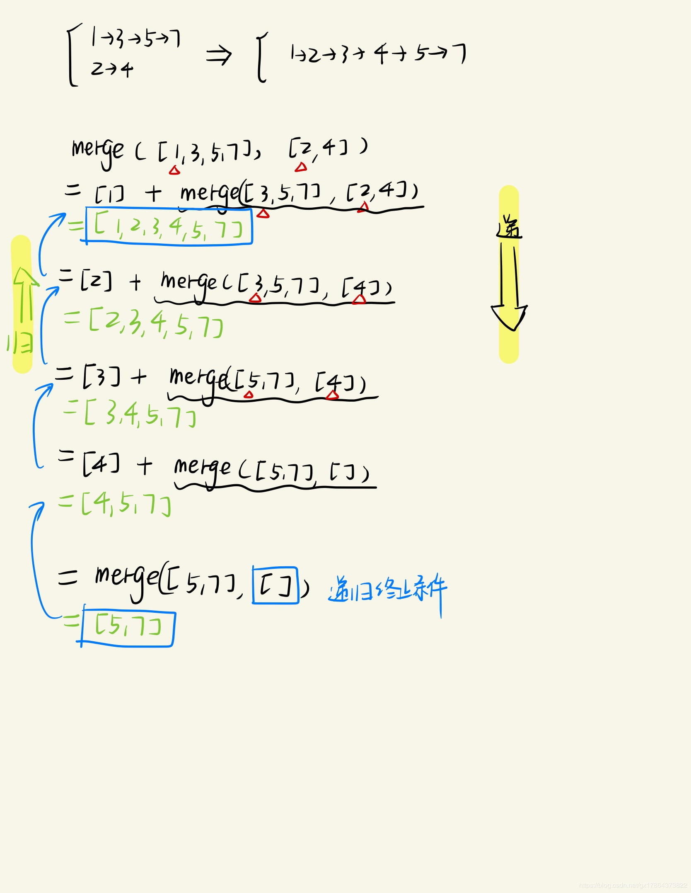

# 算法积累

## 1、排序算法

### 1.1、冒泡排序

> 实现思路为：
>
> 每次比较相邻两个元素筛选出较大值交换位置，那么一次遍历后，最大值位于数组最后一位
>
> 重复以上步骤 ， 由于最后一位已经有序，那么只需遍历比较剩下元素，冒泡出最大值
>
> 直到最后剩一个元素，即数组有序

```python
def bubble_sort(arr):
  for i in range(len(arr)-1):
    for j in range(len(arr)-1-i):
      if(arr[j] <= arr[j+1]):
        arr[j+1], arr[j] = arr[j] , arr[j+1]
	return arr

# 改进版  内层不需要遍历就不用比较了。  最优 O(n)  最坏 O(n2)
def bubble_sort(arr):
  for i in range(len(arr)-1):
    swap = False
    for j in range(len(arr)-1-i):
      swap = True
      if(arr[j] <= arr[j+1]):
        arr[j+1], arr[j] = arr[j] , arr[j+1]
    if not swap: break    
	return arr

# 数组大小是len(arr) n,总会发生n-1趟排序 ， i 从0 到 n -1
# 每次排序都会确定一个最大值放在最后.
# i从0 到 n -1,所以经历 i+1次排序后 i+1 个数是正确排序的， 只需把前 n- (i+1) 进行比较就好
 最优时间复杂度： O(n)
 最坏时间复杂度： O(n^2)
 稳定性：稳定的排序
```

### 1.2、快速排序

> 分而治之，先找到基准值排序一次再递归分治

```python
# 快速排序函数
def quickSort(arr, low, high):
    if low < high:
        pi = partition(arr, low, high)
        quickSort(arr, low, pi - 1)
        quickSort(arr, pi + 1, high)

# 排序基准值        
def partition(arr, low, high):
    i = low - 1
    pivot = arr[high]
    for j in range(low, high):
        if arr[j] < pivot:       #比基准值大排在左边
            i = i + 1
            arr[j], arr[i] = arr[i], arr[j]
    arr[i + 1], arr[high] = arr[high], arr[i + 1]   #基准值所在点

    return i + 1
    
# 更加快速 和 易于理解的部分
def quick_quick_sort(arr):
  if(len(arr) <= 1):
    return arr
  piovt = arr.pop()
  lows,highs = [],[]
  for i in arr:
    if(piovt < i):
      lows.append(i)
    else:
      highs.append(i)
	return quick_quick_sort(lows) + [poivt] + quick_quick_sort(highs)

时间复杂度：
    最坏时间复杂度： O(n^2) 我们假设拿到一个正序，每次拿到的基准数比较之后都没移动，所有的数都参与了比较，那就相当于每个数都跟其他所有数比了一次
    最优时间复杂度： O(n log n) 
        我们粗略理解成每次把数列分成两半的话，一共会分多少次呢？就看长度n除以2 要除x次后n为1，x=log n
        每次分开的数列n个数每个都跟基准数比了一次 所以粗略看成 是 n log n
稳定性： 不稳定
    碰到和基准数相等的问题上就能看出快速排序不稳定
```

### 1.3、归并排序

> 分而治之， 直接截取一半，分治各个部分元素直到一个元素后再两两合并， 最后用相同空间数组归并到一起

```python
def merge_sort(arr):
  if(len(arr) <= 1):
    return arr
  mid = len(arr) // 2
  return merge( merge_sort(arr[:mid]) , merge_sort(arr[mid:]) )

def merge(left,right):
  result = []
  while left and right:
    # 比较 left 与 right 的首位元素 [0] ， 然后再决定向result中添加那个
    # result 添加 left 与 right 的首位元素 ， ！！！并使首位出栈 ！！！
	 	result.append(left.pop(0) if left[0] < right[0] else right.pop(0))
  return result + left +～right

时间复杂度： 最好最坏都是 O( n log n )
稳定性：稳定
缺点：每次拆分数组都要开新的数组， 每次合并数组都要开新数组，空间复杂度很大
```

快速排序为什么时间复杂度高但是计算速度却很快？

快排的最坏时间虽然复杂度高，但是在统计意义上，这种数据出现的概率极小，而堆排序过程里的交换跟快排过程里的交换虽然都是常量时间，但是常量时间差很多。

### 1.4、堆排序


### 1.5、桶排序


## 2、链表经典算法题目



### 1、合并有序链表

```python
# 递归法， 递归终止条件    递归操作结构    返回值
def merge_sort_listNode(head1, head2):
  if not head1 : return head2
  if not head2: return head1
  
  if(head1.val < head2.val):
    head1.next = merge_sort_listNode(head1.next,head2)
    return head1
  else:
    head2.next = merge_sort_listNode(head1,head2.next)
    return head2

```

### 2、合并两个/K个链表

```python
# 递归法 加 归并排序思想
def merge_listNodes(heads):
  if len(heads) <= 1 : 
    # 这里注意返回 heads 列表中元素 head
    return heads.pop()
  mid = len(heads) / 2
  left = merge_listNodes(heads[:mid])
  right = merge_listNodes(heads[mid:])  
  merge(left , right)

def merge(head1, head2):
  if not head1 : return head2
  if not head2: return head1
  
  if(head1.val < head2.val):
    head1.next = merge_sort_listNode(head1.next,head2)
    return head1
  else:
    head2.next = merge_sort_listNode(head1,head2.next)
    return head2  
```

### 3、反转链表

```python
# 递归法  反转 与 断链    
def reverse_listNode(head):
  if not head or not head.next :               # 递归终止条件
    return head
  new_head = reverse_listNode(head.next)       # 递归得到链表
  head.next.next = head        # 反转
  head.next = None             # 断链
  return new_head              # 返回
```

### 4、反转链表中奇偶位 1->2->3->4   ==>  2->1->4->3   注意不能断链！！

```python
# 递归法 反转的核心是不能断链，要操作反转两个元素的前驱节点和后继节点 
# 递归是从后向前移动操作窗口
def reverse_pairs(head):
  if not head or not head.next :
    return head 
  next = head.next
  head.next = reverse_pairs(next.next)        # 头节点的next为递归的首节点 ！
  next.next = head                            # next的next为头节点  ！
  return next
```

### 5、K个一组反转链表

```python
# 反转链表是两两， 现在是K个一组进行反转
def reverseKGroup(head, k):
    cur = head
    for i in k:
        if not cur:
            return head
        cur = cur.next
    #反转前k个元素
    new_head = reverse(head, cur)
    #下一轮的开始的地方就是tail
    head.next = reverseKGroup (cur, k)
    return new_head

def reverse(head, tail):
    pre = tail
    while (head != tail):
        next = head.next
        head.next = pre
        pre = head
        head = next
    return pre
```

### 6、倒序K个一组反转链表

```java
public ListNode reverseKGroupPlus(ListNode head, int k) {
    if (head == null || k <= 1) return head;
    // 计算原始链表长度
    int length = linkedLength(head);
    if (length < k) 
        return head;
  
    // 计算 offset
    int offsetIndex = length % k;
    // 原始链表正好可以由 K 分为 N 组，可直接处理
    if (offsetIndex == 0) {
        return reverseKGroup(head, k);
    }

    // 定义并找到 prev 和 offset      ！！！核心为从全链中找出N个K组，进行K个一组的反转，然后 prev.next指向它！
    ListNode prev = head, offset = head;
    while (offsetIndex > 0) {
        prev = offset;
        offset = offset.next;
        offsetIndex--;
    }
    // 将 offset 结点为起始的子链表进行翻转，再拼接回主链表
    prev.next = reverseKGroup(offset, k);
    return head;
}
```

### 7、链表中倒数第K个结点

```python
# 两个指针来遍历操作
# 使用两个指针，同时都指向头结点，首先第一个指针走k-1步，即第一个结点到达第k个结点；然后两个指针同时往后移动，直到第一个指针到达链表末尾时停止，这时候第二个指针的指向是倒数第k个结点，最后返回第二个指针指向的节点
def FindKthToTail(head, k):
    if not head or k<1:
        return None
    p1 = head
    p2 = head    
    # 首先将p1移动k-1步，到达第k个节点
    for i in range(k-1):
        p1 = p1.next
        if p1 == None:    # 判断k的值是否大于链表长度，如果大于的话，p1会指向None
            return None
    
    # 当p1走到链表最后一个节点的时候，p2位于倒数第k个位置
    while p1.next:
        p1 = p1.next
        p2 = p2.next
    
    return p2
```

### 8、LRU算法实现

```python
 手写一下LRU代码实现
class LRUCache():

    def init(self,capacity):
        self.capacity = capacity
        self.queue = collections.OrderedDict()

    //put要看空间， 默认放头， 查看可用空间  已经在缓存中，先移除老的元素
    def put(self,key,value):
        if key in self.queue:
            self.queue.pop(key)
        elif len(self.queue.items) ==  self.capacity
            self.queue.pop(0)
        self.queue[key] = value

    //查看元素是否存在，      存在，移除，重新放到头
    def get(self,key):
        if key not in self.queue
            return -1
        value = self.queue.pop(key)    
        self.queue[key] = value
        return value

#自己再写一遍
```

### 9、等概率从列表中取数

```python
随机的从大小为n的数组中选取m个整数，要求每个元素被选中的概率相等。

# 分析与解答：首先从有N个元素的数组中随机选出一个元素，
# 然后把这个选中的数字与数组中第一个元素交换，接着从数组后面N-1个数字中选出1个元素与数组中第二个元素交换，
# 以此类推，直到选出m个数字为止，数组前m个数字就是随机选出来的m个数字，且他们被选中的概率相同。

import random

	for (int i = 0; i<m; i++)
	{
		int index = rand() % (n - i) + i;
		swap(arr[i], arr[index]);
	}
 
	for (int i = 0; i<m; i++)
		res[i] = arr[i];

```


## 3、字符串经典题目

### 1、括号匹配

```python
# 栈中存储 括号左边元素， 遇到右边就取出栈头， 查看是否匹配
def match_parentheses(s):
    # 把一个list当做栈使用
    ls = []
    parentheses = "()[]{}"
    for i in range(len(s)):
        si = s[i]
        # 如果不是括号则继续
        if parentheses.find(si) == -1:
            continue
        # 左括号入栈
        if si == '(' or si == '[' or si == '{':
            ls.append(si)
            continue
        if len(ls) == 0:
            return False
        # 出栈比较是否匹配
        p = ls.pop()
        if (p == '(' and si == ')') or (p == '[' and si == ']') or (p == '{' and si == '}'):
            continue
        else:
            return False

    if len(ls) > 0:
        return False
    return True
```

### 2、两字符串相加

```python
# 字符串相加
def addStrings( num1, num2):
    num1, num2 = num1[::-1], num2[::-1]                     # 将输入字符串逆序
    len1, len2 = len(num1), len(num2)                       # 获得字符串长度
    res = ''                                                # 初始化结果变量
    carry = 0                                               # 初始化进位
    for i in range(max(len1, len2)):                        # 开始遍历
        n1 = ord(num1[i]) - ord('0') if i < len1 else 0     # 取第一个数的当前位
        n2 = ord(num2[i]) - ord('0') if i < len2 else 0     # 取第二个数的当前位
        s = n1 + n2 + carry                                 # 当前位的计算结果
        carry = s / 10      # 获得进位，保存到carry中，在下一轮 n1 + n2 + carry   
        r = s % 10                         								  # 获得余数
        res = str(r) + res                                  # 把余数加到当前结果的最高位
    if carry:                                               # 如果算完还有进位
        res = str(carry) + res                              # 加到结果最高位
    return res   
 
```


## 4、二叉树经典题目

### 1、反转二叉树

```python
def invert_tree(self, node):
  if node:
    node.left, node.right = node.right, node.left
    if node.left:
      node.left = self.invert_tree(node.left)
      if node.right:
        node.right = self.invert_tree(node.right)
        return node

def invertTree(root) :
  if not root:
    return root
  root.left, root.right = invertTree(root.right) , invertTree(root.left)
  return root
```

### 2、二叉树后续遍历非递归

```python
# 利用两个栈来实现
def post_order (root):
  s1 , s2 = [] , [] 
  s1.push(root)
  while s1 :
    node = s1.pop()
    if node.lchild:
      s1.push(node.lchild)
    if node.rchild:
      s1.push(node.rchild)
    s2.push(node)  
  while s2:
    print s2.pop().data
```

### 3、二叉树最大路径和

```python
int maxPathSum(TreeNode* root) {
        if(!root)return 0;
        int m=INT_MIN;  //存放最大路径和
        
        helper(root,m); //将m传入，便于更新最大值m
        
        return m;
    }
    
int helper(TreeNode* root,int &m) //计算过当前结点的最大路径和
{
    if(!root)return 0;
    
    int l=helper(root->left,m);   //过当前结点左子结点的最大路径和
    int r=helper(root->right,m);  //过当前结点右子结点的最大路径和
    
    int curSum=max(root->val,max(l+root->val,r+root->val));  //过当前结点的最大路径和

    int curMax=max(curSum,l+r+root->val); //如果将当前结点作为根结点，就要考虑横跨的情况
        
    m=max(m,curMax); //更新最大值
    
    return curSum; //返回过当前结点的最大路径和
  
```

### 4、最大公共祖先

```python
# 分治思想，如果当前节点为p或q，那么就返回该节点，否则在左右子树中继续找，    如果左右子树找到的都不为空，则当前节点就是LCA；否则不为空的那个结果就是所求。

def lowestCommonAncestor(self, root, p, q):
    if root in (None, p, q):
        return root
    
    left = self.lowestCommonAncestor(root.left, p, q)
    right = self.lowestCommonAncestor(root.right, p, q)
    if left and right:
        return root
    return left or right
```

### 5、二叉搜索树 第k小

```python
# 中序遍历函数
def inorderTraversal(root): 
  if root == None:
    return []
  res = []
  res += inorderTraversal(root.left)
  res.append(root.val)
  res += inorderTraversal(root.right)
  return res

return inorderTraversal(root)[k-1]
```


## 2、一致性hash

> 核心原理，为了解决分布式环境下缓存命中问题
>
> 原理解读：https://blog.csdn.net/cb_lcl/article/details/81448570
>
> https://blog.csdn.net/bntX2jSQfEHy7/article/details/79549368
>
> 代码解读： https://blog.csdn.net/kefengwang/article/details/81628977

**如果访问分布式缓存redis, 怎么确定访问的key存储与那台服务器上？如何保证增减机器时缓存雪崩问题？**

**良好的分布式哈希方案应该具有良好的单调性，  容错性   扩展性   均匀性  **

> 那么采用新算法， hash环，key值hash与服务器hash存在一个环（链表）上，环（链表）下一位为key值存在服务器位置，
>
> 这样解决了缓存命中问题， **一致性哈希算法对于节点的增减都只需重定位换空间的一小部分即可，具有较好的容错性和可扩展性**
>
> 但是节点少的情况还是不均匀 。**为了解决这种数据存储不平衡的问题，一致性哈希算法引入了虚拟节点机制 ，即对每个节点计算多个哈希值，每个计算结果位置都放置在对应节点中，这些节点****称为虚拟节点**。  增加虚拟服务器hash位置（由复制因子决定虚拟数量）， 这样相当于散列存放（类似分桶思想）存放均衡。

## 3、 动态规划

### 3.1、最大连续子序列和

> 给定k个整数的序列{N1,N2,…,Nk }，其任意连续子序列可表示为{ Ni, Ni+1, …, Nj }，其中 1 <= i <= j <= k。最大连续子序列是所有连续子序中元素和最大的一个，例如给定序列{ -2, 11, -4, 13, -5, -2 }，其最大连续子序列为{11,-4,13}，最大连续子序列和即为20。

```python
def maxSum(list_of_nums):
  maxsum = 0
  maxtmp = 0
  for i in range(len(list_of_nums)):
    if maxtmp <= 0:
      maxtmp = list_of_nums[i]
    else:
      maxtmp += list_of_nums[i]
 
    if(maxtmp > maxsum):
      maxsum = maxtmp
  return maxsum
if __name__ == '__main__':
  list_of_num = [1,3,-3,4,-6]
  maxsum = maxSum(list_of_num)
  print "maxsum is: ",maxsum
```

### 3.2、最长连续无重复子串

```java
    public static int lengthOfLongestSubstring(String s) {
        int n = s.length(), ans = 0;
        int[] index = new int[128]; // current index of character
        // try to extend the range [i, j]
        for (int j = 0, i = 0; j < n; j++) {
            i = Math.max(index[s.charAt(j)], i);
            ans = Math.max(ans, j - i + 1);
            index[s.charAt(j)] = j + 1;
        }
        return ans;
    }
```


## 3、红黑树


## 4、倒排索引

## 3、CAP理论

### 3.1、Raft协议

> https://www.jianshu.com/p/f80841a2a727
>
>  Paxos的核心逻辑是多个server对一个议案达成一致，选主并不是必备的过程。（当然，可以通过对一个议案达成一致这个方式，来达到选主的目的。通常是优化Paxos性能的一种手段）
>
> 而对于Raft来说，选主是核心逻辑，是一切后续流程的源头，个人理解，也是协议中相对Paxos最大程度被简化的地方，一切都是为了后续流程的可理解性和可构造性。
>
> Raft的选主逻辑很简单，要开始一次选举，一台服务器首先把自己已知的当前Terms加一，然后向其它服务器同时发送投票请求，并且给自己投上一票。其它服务器投票的逻辑也很简单，对每个Terms至多投一票，先到先得，如果有人得票过半，那就当选了，就这么简单。当然，实际上要完美的工作并没那么简单，后面还会再打补丁添加一些限制条件。

Raft算法具备强一致、高可靠、高可用等优点，具体体现在：

- 强一致性：虽然所有节点的数据并非实时一致，但Raft算法保证Leader节点的数据最全，同时所有请求都由Leader处理，所以在客户端角度看是强一致性的。
- 高可靠性：Raft算法保证了Committed的日志不会被修改，State Matchine只应用Committed的日志，所以当客户端收到请求成功即代表数据不再改变。Committed日志在大多数节点上冗余存储，少于一半的磁盘故障数据不会丢失。
- 高可用性：从Raft算法原理可以看出，选举和日志同步都只需要大多数的节点正常互联即可，所以少量节点故障或网络异常不会影响系统的可用性。即使Leader故障，在选举超时到期后，集群自发选举新Leader，无需人工干预，不可用时间极小。但Leader故障时存在重复数据问题，需要业务去重或幂等性保证。
- 高性能：与必须将数据写到所有节点才能返回客户端成功的算法相比，Raft算法只需要大多数节点成功即可，少量节点处理缓慢不会延缓整体系统运行

### 3.2、Paxos

https://blog.51cto.com/12615191/2086264

https://my.oschina.net/u/150175/blog/2992187

https://www.jianshu.com/p/fbda069a282d


